<p align="center">
  
  &nbsp;&nbsp;&nbsp;
  
  &nbsp;&nbsp;&nbsp;
  
</p>

<h1 align="center">32 BIT FINANCE PLATFORM</h1>

<p align="center">
  
  
  
  
  
  
  
  
</p>
<p align="center">
  
  
  
  
  
  
  
  
  
</p>

<p align="center">
  <a href="README.tr.md">Türkçe</a> · <strong>English</strong> · <a href="README.de.md">Deutsch</a>
</p>

<p align="center">
  <strong>Turkey-focused finance portal in three languages</strong> — build your portfolio and follow markets and news on one screen.
  The UI and content support <strong>Turkish</strong>, <strong>English</strong>, and <strong>German</strong>; when you switch language, menus, cards, and messages adapt to your choice.
</p>

<p align="center">
  Track equities, funds, crypto, FX, bonds, and eurobonds with live prices; transaction history, goals, and external portfolio views.
  <strong>Star</strong> important news items, <strong>save</strong> chart drawings and notes in technical analysis and reopen them later.
  Interest and term products, bank rates, RSI and other indicators, alarms, watchlists, and financial literacy — one platform to manage your portfolios.
</p>

## Table of contents

- [Screens](#screens)
- [Financial features](#financial-features)
- [Project structure](#project-structure)
- [Platform overview](#platform-overview)
- [Data configuration](#data-configuration)
- [Adding instruments](#adding-instruments)
- [Quick start (Docker)](#quick-start-docker--recommended)
- [Detailed setup](#detailed-setup)
- [Local development (summary)](#local-development-summary)
- [Documentation](#documentation)
- [License](#license)

## Screens

<table align="center" border="0" cellpadding="8" cellspacing="0" width="100%">
  <tr>
    <td align="center" valign="top" width="50%">
      <strong>Home</strong><br>
      
    </td>
    <td align="center" valign="top" width="50%">
      <strong>Markets</strong><br>
      
    </td>
  </tr>
  <tr>
    <td align="center" valign="top" width="50%">
      <strong>My Portfolio</strong><br>
      
    </td>
    <td align="center" valign="top" width="50%">
      <strong>Interest / Deposits</strong><br>
      
    </td>
  </tr>
  <tr>
    <td align="center" valign="top" width="50%">
      <strong>Analysis</strong><br>
      
    </td>
    <td align="center" valign="top" width="50%">
      <strong>News</strong><br>
      
    </td>
  </tr>
  <tr>
    <td align="center" valign="top" width="50%">
      <strong>Bank rates</strong><br>
      
    </td>
    <td align="center" valign="top" width="50%">
      <strong>Financial literacy</strong><br>
      
    </td>
  </tr>
  <tr>
    <td align="center" valign="top" width="50%">
      <strong>Info cards</strong><br>
      
    </td>
    <td align="center" valign="top" width="50%">
      <strong>Profile</strong><br>
      
    </td>
  </tr>
</table>

## Financial features

<p align="center"><sub>Specific portal capabilities — full page tour above; individual features here</sub></p>

<style>
  .readme-stack img { max-width: 100%; height: auto; }
  @media (max-width: 720px) {
    .readme-stack table table > tbody > tr:not(:has(td[colspan])) { display: block; }
    .readme-stack table table > tbody > tr:not(:has(td[colspan])) > td {
      display: block;
      width: 100% !important;
      max-width: 100%;
      box-sizing: border-box;
    }
    .readme-stack table table > tbody > tr:not(:has(td[colspan])) > td[width] {
      width: 100% !important;
      text-align: center;
      padding-bottom: 10px;
    }
    .readme-stack table table table tr { display: block; }
    .readme-stack table table table td {
      display: block;
      width: 100% !important;
      padding: 2px 0;
    }
  }
</style>

<div class="readme-stack">

<table align="center" border="0" cellpadding="0" cellspacing="0" width="100%">
  <tr>
    <td>
      <table border="0" cellpadding="14" cellspacing="0" width="100%">
        <tr>
          <td width="190" align="center" valign="top">
            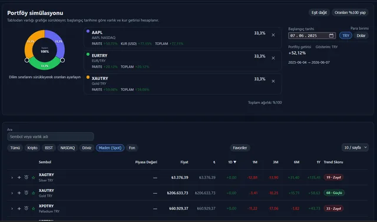
            <br><sub>Portfolio simulation</sub>
          </td>
          <td valign="top">
            <h4>① Portfolio simulation</h4>
            <p>Pick any asset from the markets table and add it to the simulator. With your chosen holdings you can explore <strong>portfolio return from a start date to today</strong>, <strong>per-asset returns</strong>, and how <strong>overall portfolio return</strong> shifts when you change weights.</p>
            <p><strong>Currency:</strong> compare TRY vs USD investment bases — see how FX affects the same allocation. Start date, weight tools (equal split / normalize to 100%), and parity + FX components on one screen.</p>
          </td>
        </tr>
        <tr><td colspan="2" height="20"></td></tr>
        <tr>
          <td width="190" align="center" valign="top">
            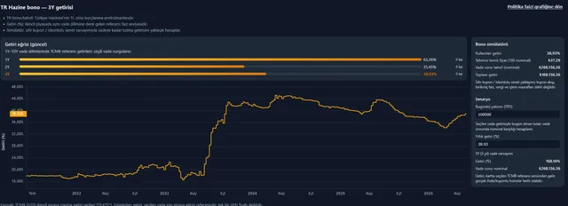
            <br><sub>Interest / Deposits</sub>
          </td>
          <td valign="top">
            <h4>② TR Treasury bills — Yield chart &amp; simulator</h4>
            <p>Track the <strong>1Y / 2Y / 3Y</strong> Turkish Treasury yield curve and the <strong>historical yield series</strong> for your selected maturity, powered by TCMB EVDS secondary-market data. Switching maturity refreshes both the live curve and the time series.</p>
            <p><strong>Bond simulator:</strong> enter today’s investment and annual yield — estimated clean price, proceeds at maturity, and total return update instantly. Model an approximate yield-to-maturity under a discounted-bill assumption; jump to the policy-rate chart in one click.</p>
          </td>
        </tr>
        <tr><td colspan="2" height="20"></td></tr>
        <tr>
          <td width="190" align="center" valign="top">
            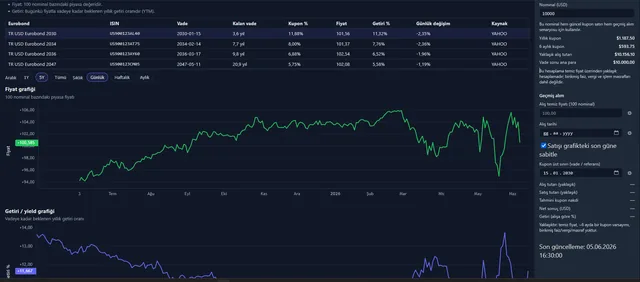
            <br><sub>Interest / Deposits · Eurobond</sub>
          </td>
          <td valign="top">
            <h4>③ TR USD Eurobond — Coupon &amp; yield simulator</h4>
            <p>Per-ISIN eurobond table with <strong>clean price</strong>, <strong>coupon rate</strong>, and <strong>yield to maturity (YTM)</strong>; separate <strong>price</strong> and <strong>yield</strong> history charts for the selected bond (1Y / 5Y / all).</p>
            <p><strong>Cash-flow view:</strong> enter nominal (USD) to see annual and semi-annual coupon amounts, approximate purchase cost, and principal at maturity.</p>
            <p><strong>Historical buy scenario:</strong> pick purchase date and clean price on the chart — closing price and date auto-fill. View estimated <strong>coupon cash</strong>, sale proceeds, net P&amp;L (USD), and return % on purchase; optionally pin the exit to the latest chart date.</p>
          </td>
        </tr>
        <tr><td colspan="2" height="20"></td></tr>
        <tr>
          <td width="190" align="center" valign="top">
            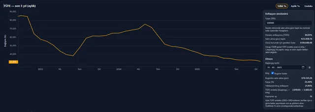
            <br><sub>Interest / Deposits · CPI</sub>
          </td>
          <td valign="top">
            <h4>④ CPI inflation — Purchasing-power simulator</h4>
            <p>Track Turkish headline CPI (TCMB general index, 2003=100) as <strong>annual %</strong>, <strong>monthly %</strong>, or <strong>index level</strong>. Mark the start date on the chart.</p>
            <p><strong>Real erosion:</strong> enter a nominal TRY amount and period — compound inflation (I<sub>end</sub>/I<sub>start</sub>), <strong>purchasing-power loss</strong> (TRY and %), today’s real equivalent, and <strong>annualized inflation</strong> are computed.</p>
            <p><strong>Break-even hurdle:</strong> see the <strong>nominal amount required</strong> at period-end to preserve starting purchasing power — i.e. the minimum return your investment must target in real terms (informational; excludes tax and personal consumption baskets).</p>
          </td>
        </tr>
        <tr><td colspan="2" height="20"></td></tr>
        <tr>
          <td width="190" align="center" valign="top">
            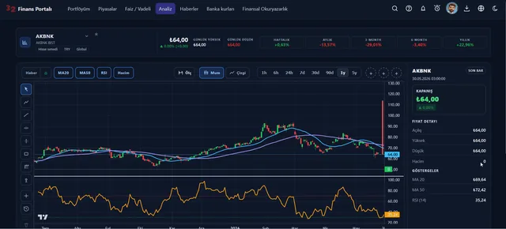
            <br><sub>Analysis · Chart drawings</sub>
          </td>
          <td valign="top">
            <h4>⑤ Technical analysis — Chart drawings &amp; saved setups</h4>
            <p>On the selected instrument’s candle/line chart, draw with a <strong>distinct color per tool</strong>: <strong>trend line</strong>, <strong>ray</strong>, <strong>horizontal support/resistance</strong>, <strong>vertical time marker</strong>, <strong>consolidation box (rectangle)</strong>, <strong>Fibonacci retracement</strong>, and <strong>anchor point</strong>. Use <strong>price-range measure</strong> for bar count and return between two points.</p>
            <p><strong>Overlays:</strong> MA20 / MA50, RSI, volume, and up to three-symbol <strong>comparison overlay</strong> on one time axis.</p>
            <p><strong>Save &amp; learn:</strong> name and store a drawing set; reopen <strong>past drawings</strong> per asset to review prior support/resistance and scenarios. Build technical literacy over time and shape trades from your own annotated history (sign-in required).</p>
          </td>
        </tr>
        <tr><td colspan="2" height="20"></td></tr>
        <tr>
          <td width="190" align="center" valign="top">
            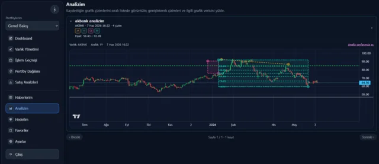
            <br><sub>Portfolio · My Analysis</sub>
          </td>
          <td valign="top">
            <h4>⑥ My Analysis — Saved drawings &amp; live outcome tracking</h4>
            <p>Under <strong>My Analysis</strong> in the portfolio menu, browse every drawing set you saved on the analysis page. Each entry summarizes symbol, date, <strong>drawing count</strong>, tool badges, and <strong>price range</strong>.</p>
            <p>Expand a card to reload drawings on <strong>fresh candle data</strong> and read how Fibonacci levels, support/resistance boxes, and trend lines relate to <strong>today’s price</strong> — tracking whether your setup still holds. Continue editing via <strong>Open in analysis page</strong> (sign-in required).</p>
          </td>
        </tr>
        <tr><td colspan="2" height="20"></td></tr>
        <tr>
          <td width="190" align="center" valign="top">
            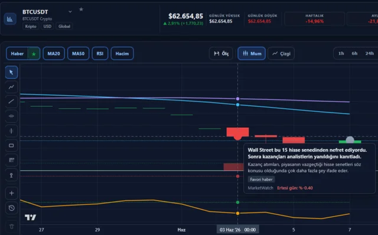
            <br><sub>Analysis · Chart news</sub>
          </td>
          <td valign="top">
            <h4>⑦ Analysis — On-chart news &amp; impact review</h4>
            <p>Enable the <strong>News</strong> layer on the analysis page to plot headlines for the selected asset on the price timeline. Click a marker for title, summary, source, and match reason (asset / category / <strong>favorite</strong>).</p>
            <p><strong>Next-day change:</strong> read the <strong>% price move</strong> from the news-day close to the following session to gauge short-term market reaction. Use the <strong>star filter</strong> to show only favorited headlines and isolate their real impact on the chart.</p>
            <p><strong>Favorites:</strong> starred articles also appear on the <strong>News</strong> page (favorites filter) and under <strong>My News</strong> in the portfolio (sign-in required).</p>
          </td>
        </tr>
        <tr><td colspan="2" height="20"></td></tr>
        <tr>
          <td width="190" align="center" valign="top">
            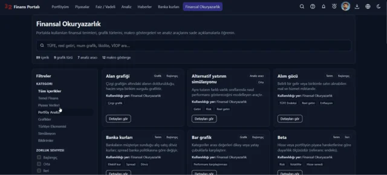
            <br><sub>Info cards · Literacy</sub>
          </td>
          <td valign="top">
            <h4>⑧ Info cards &amp; financial literacy</h4>
            <p>Use the header <strong>? (hint mode)</strong> button to reach info cards admins bound to portal elements: <strong>click a button or term</strong> for a short definition, interpretation hint, and link to the full entry.</p>
            <p><strong>Financial literacy glossary:</strong> terms, chart types, macro indicators, and analysis tools in a filterable catalog — search by difficulty, content type, and portal page.</p>
            <p><strong>Admin &amp; AI:</strong> admins create content by picking on-page elements or adding glossary cards; <strong>AI field completion</strong> and <strong>TR / EN / DE translation</strong> speed publishing — convenience for admins, plain-language learning for users.</p>
          </td>
        </tr>
        <tr><td colspan="2" height="20"></td></tr>
        <tr>
          <td width="190" align="center" valign="top">
            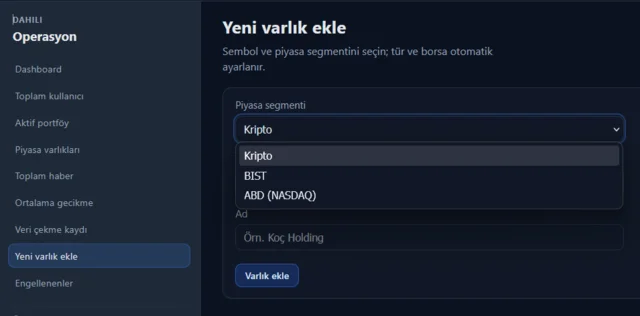
            <br><sub>Admin · Add asset</sub>
          </td>
          <td valign="top">
            <h4>⑨ Admin — Dynamic asset onboarding &amp; data triggers</h4>
            <p>Use <strong>Add new asset</strong> in the admin panel to register a newly listed or custom instrument by choosing a <strong>Crypto / BIST / NASDAQ</strong> segment; <strong>type and exchange</strong> are set automatically from the preset.</p>
            <p>After save you land on the <strong>Data fetch registry</strong>: enable or disable each row, <strong>pull historical data</strong> or <strong>pull live data</strong> on demand — coverage (30 / 365 days) and last error status in one table.</p>
          </td>
        </tr>
        <tr><td colspan="2" height="20"></td></tr>
        <tr>
          <td width="190" align="center" valign="top">
            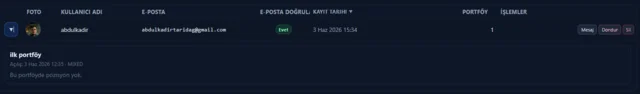
            <br><sub>Admin · User management</sub>
          </td>
          <td valign="top">
            <h4>⑩ Admin — User management &amp; account enforcement</h4>
            <p>In the <strong>Total users</strong> directory, send a per-user <strong>Message</strong> (portal inbox + email), <strong>Freeze</strong> the account, or <strong>delete permanently</strong>. Freeze accepts an optional reason; delete can block the email from re-registering.</p>
            <p><strong>Immediate effect:</strong> frozen or removed accounts are detected while browsing via API responses; the session is cleared and the user is redirected to login with an <strong>informative banner</strong>. Freeze can be reversed; deletion is irreversible.</p>
          </td>
        </tr>
      </table>
    </td>
  </tr>
</table>

</div>

## Project structure

**32 Bit Finance Platform** is a finance portal built on a microservice architecture. Users call a single address (**api-gateway**) from the **React** UI; the gateway authenticates identity with **Keycloak** and routes each request to the right service. Portal business rules such as portfolio, alarms, registration, and MFA live in **finance-api**; market prices, news, technical analysis, and notifications are handled by dedicated services. Services call each other over **HTTP** when needed; flows such as price updates, alarms, and logging proceed asynchronously over **Kafka**. Persistent data is stored in **PostgreSQL**; each service schema is managed separately with **Flyway**.

<h3 align="center">
  <a href="docs/english/architecture.md">PROJECT ARCHITECTURE</a>
</h3>

<p align="center">
  <a href="docs/english/architecture.md">
    
  </a>
</p>

<table align="center" border="0" cellpadding="20" cellspacing="0">
  <tr>
    <td valign="top" width="48%">
      <h4><a href="docs/english/services/api-gateway.md">api-gateway</a></h4>
      <p>The <strong>single entry point</strong> for browser and mobile clients to reach the backend. For every incoming <code>/api/v1/...</code> request it validates the JWT via Keycloak and forwards user identity to downstream services through secure headers. It routes by path to <code>finance-api</code>, <code>market-data-service</code>, <code>news-service</code>, or <code>analytics-service</code>; applies Redis rate limiting and Resilience4j circuit breakers. It aggregates OpenAPI documentation for all services in one Swagger UI for developers and integrators. Full route list: <a href="docs/english/api.md">docs/english/api.md</a>.</p>
    </td>
    <td valign="top" width="48%">
      <h4><a href="docs/english/services/finance-api.md">finance-api</a></h4>
      <p>The portal <strong>core</strong> and Backend-for-Frontend (BFF) layer. User-specific rules such as portfolio, transaction history, goals, price alarms, watchlist, chart drawing saves, and profile live here. Registration, email verification, TOTP-based MFA, trusted devices, admin KPIs, info cards, and news favorites are also centralized in this service. It calls <code>market-data-service</code> over HTTP for market data and consumes live price and FX snapshots from Kafka. Critical domain events are written to Kafka via a transactional outbox; data is stored in PostgreSQL with Flyway migrations.</p>
    </td>
  </tr>
  <tr>
    <td valign="top" width="48%">
      <h4><a href="docs/english/services/market-data-service.md">market-data-service</a></h4>
      <p>The platform <strong>market data engine</strong>. It catalogs BIST, Nasdaq, crypto, funds, FX, bonds, and eurobond instruments; updates live and historical prices via schedulers. It pulls data from sources such as TCMB EVDS, Finnhub, Yahoo, CoinGecko, and Stooq; provides policy rates, bank rates, and basic instrument metadata. On first setup it can run historical price backfill and uses a hybrid JSON cache for frequently read endpoints. It publishes price changes to Kafka topics such as <code>market.price.updated</code> to feed analytics and the portal layer.</p>
    </td>
    <td valign="top" width="48%">
      <h4><a href="docs/english/services/analytics-service.md">analytics-service</a></h4>
      <p>A specialist service that turns the live price stream into <strong>technical analysis</strong>. It consumes price events published by <code>market-data-service</code> over Kafka; computes RSI and similar indicators and produces insight and policy metrics. Results are stored in its own PostgreSQL schema and exposed via HTTP API through the gateway. Heavy indicator work stays out of the portal BFF; the analysis page and related cards read current metrics from here.</p>
    </td>
  </tr>
  <tr>
    <td valign="top" width="48%">
      <h4><a href="docs/english/services/news-service.md">news-service</a></h4>
      <p>The service where financial news is <strong>aggregated and served</strong>. It scans configured RSS sources on a schedule, writes articles to the database, and feeds the portal listing and filtering API. It offers MyMemory translation where needed; accessed via gateway at <code>/api/v1/news/**</code>. The news pipeline scales independently of the portal experience; in Docker it is configured with a strict filesystem layout and a separate database password.</p>
    </td>
    <td valign="top" width="48%">
      <h4><a href="docs/english/services/notification-service.md">notification-service</a></h4>
      <p>The hub for <strong>email notifications</strong> to users. It listens on Kafka for events such as alarm triggers, suspicious login, watchlist changes, and analytics insights. It sends templated email over SMTP by event type, moving instant UI load off the portal. <code>finance-api</code> produces business events; this service delivers them so domain code stays simple even if the notification channel changes.</p>
    </td>
  </tr>
  <tr>
    <td valign="top" width="48%">
      <h4><a href="docs/english/services/log-consumer-service.md">log-consumer-service</a></h4>
      <p>The <strong>central log archive</strong> for all backend services. Applications write JSON logs to the <code>app.logs</code> Kafka topic via Log4j2; this service consumes messages and indexes them in OpenSearch. Operations can filter errors and traces via Grafana, OpenSearch Dashboards, or direct search. Application pods do not need to store logs; the log pipeline is managed platform-wide from one place.</p>
    </td>
    <td valign="top" width="48%">
      <h4><a href="docs/english/services/frontend-web.md">frontend-web</a></h4>
      <p>The <strong>React 19</strong> single-page application users see (Vite + TypeScript). Landing, markets, analysis, news, bank rates, and financial literacy are public; portfolio, interest/deposits, dashboard, and external portfolio views require a session. It handles login and registration with Keycloak and supports TR, EN, and DE. All API calls go through <code>api-gateway</code>; a separate <code>/admin</code> area exists for admin and info card management.</p>
    </td>
  </tr>
</table>

> **Note — market data and schedulers**  
> After the stack is up, `market-data-service` merges historical price backfill with live updates in the background. Completing the catalog and historical series — depending on instrument count and provider response times — can take **about 30 minutes**; the portal fills in gradually, and missing charts or empty lists in the first minutes are normal.  
> Scheduler intervals in the demo configuration (e.g. equities ~1 min, FX/bonds ~5 min) and backfill steps are tuned for external sources with **free-tier quotas** (TCMB EVDS, Yahoo, CoinGecko, Finnhub, etc.); API keys are set in `Docker/.env` (not in the repo). Delays between requests help avoid rate-limit violations. When moving to a paid API plan or higher quota, tighten `scheduler.*.delay-ms`, backfill `sleep-ms`, and related cron expressions via [docs/english/configuration.md](docs/english/configuration.md).  
> To watch progress: `docker compose logs -f market-data-service`

## Platform overview

### Kafka events

| Topic | Producer (e.g.) | Consumer (e.g.) |
|-------|-----------------|-----------------|
| `market.price.updated` | market-data-service | analytics-service, finance-api |
| `market.fx.snapshot.updated` | market-data-service | finance-api |
| `alarm-triggered` | finance-api (outbox) | notification-service |
| `watchlist.item.added` / `removed` | finance-api | notification-service |
| `login-security.alert` | finance-api | notification-service |
| `app.logs` | All services | log-consumer-service |

### Infrastructure components

Shared components brought up with Docker Compose (`Docker/`):

| Component | Host port | Role |
|-----------|-----------|------|
| PostgreSQL | 5432 | `finance` + `keycloak` databases |
| Redis | 6379 | Gateway rate limit, finance-api cache |
| Kafka | 9092 | Event bus |
| Keycloak | 8085 | OIDC / realm import |
| OpenSearch | 9200 | Log search |
| OpenSearch Dashboards | 5601 | Log UI |
| Jaeger | 16686 | Distributed tracing |
| Prometheus | 9090 | Metric scrape |
| Grafana | 3000 | Dashboards |

### Supporting directories

| Directory | Contents |
|-----------|----------|
| `Docker/` | `docker-compose`, Keycloak realm, observability stack |
| `docs/` | Architecture, services, API, setup, observability (`turkce/`, `english/`, `deutsch/`) |
| `photos/` | Profile avatar files (local / volume) |

## Data configuration

<p align="center"><sub>Where to enable or disable live and historical market data in the Docker demo stack</sub></p>

<div class="readme-stack">

<table align="center" border="0" cellpadding="0" cellspacing="0" width="100%">
  <tr>
    <td>
      <table border="0" cellpadding="14" cellspacing="0" width="100%">
        <tr>
          <td width="190" align="center" valign="top">
            <a href="Docker/.env.example" title="Open Docker/.env.example">
              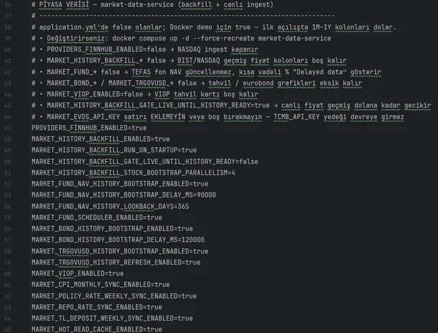
            </a>
            <br><sub><code>Docker/.env.example</code></sub>
          </td>
          <td valign="top">
            <h4>① Docker/.env — Market data toggles</h4>
            <p>In the demo stack, <strong>live ingest</strong> and <strong>historical backfill</strong> pipelines are controlled from one file. Create it with <code>cp .env.example .env</code> and edit this block. Precedence: <code>docker-compose.yml</code> → <code>Docker/.env</code> → <code>application.yml</code>.</p>
            <table border="0" cellpadding="4" cellspacing="0">
              <tr>
                <td width="42%" valign="top"><code>MARKET_HISTORY_BACKFILL_*</code></td>
                <td valign="top">BIST, NASDAQ, and crypto <strong>historical prices</strong>; run on startup</td>
              </tr>
              <tr>
                <td valign="top"><code>PROVIDERS_FINNHUB_ENABLED</code></td>
                <td valign="top">NASDAQ live prices and history (Finnhub)</td>
              </tr>
              <tr>
                <td valign="top"><code>MARKET_FUND_*</code></td>
                <td valign="top">TEFAS fund NAV updates and history bootstrap</td>
              </tr>
              <tr>
                <td valign="top"><code>MARKET_BOND_*</code> · <code>MARKET_TRGOVUSD_*</code></td>
                <td valign="top">TCMB bond yields and TR USD eurobond charts</td>
              </tr>
              <tr>
                <td valign="top"><code>MARKET_VIOP_ENABLED</code></td>
                <td valign="top">VIOP derivatives (Interest / Deposits card)</td>
              </tr>
              <tr>
                <td valign="top"><code>MARKET_*_SYNC_ENABLED</code></td>
                <td valign="top">Policy rate, repo, TL deposit, CPI macro sync</td>
              </tr>
            </table>
            <p><strong>After changes:</strong> <code>docker compose up -d --force-recreate market-data-service</code><br>
            <strong>Monitor:</strong> <code>docker compose logs -f market-data-service</code> · Details: <a href="docs/english/configuration.md">docs/english/configuration.md</a></p>
          </td>
        </tr>
        <tr><td colspan="2" height="20"></td></tr>
        <tr>
          <td width="190" align="center" valign="top">
            <a href="market-data-service/src/main/resources/application.yml" title="Open application.yml">
              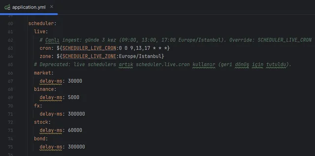
            </a>
            <br><sub><code>market-data-service/.../application.yml</code></sub>
          </td>
          <td valign="top">
            <h4>② application.yml — Live data scheduler</h4>
            <p>Crypto, BIST, NASDAQ, FX, fund, and bond <strong>live price</strong> schedulers share one cron expression. Default: <strong>3 times per day</strong> — 09:00, 13:00, 17:00 (<code>Europe/Istanbul</code>).</p>
            <table border="0" cellpadding="4" cellspacing="0">
              <tr>
                <td width="42%" valign="top"><code>SCHEDULER_LIVE_CRON</code></td>
                <td valign="top">Live ingest schedule (cron); e.g. <code>0 0 9,13,17 * * *</code></td>
              </tr>
              <tr>
                <td valign="top"><code>SCHEDULER_LIVE_ZONE</code></td>
                <td valign="top">Time zone; default <code>Europe/Istanbul</code></td>
              </tr>
              <tr>
                <td valign="top"><code>market.scheduler.enabled</code></td>
                <td valign="top">Crypto live ingest (default: on)</td>
              </tr>
              <tr>
                <td valign="top"><code>market.stock.scheduler.enabled</code></td>
                <td valign="top">BIST + NASDAQ live ingest (default: on)</td>
              </tr>
              <tr>
                <td valign="top"><code>market.fx.scheduler-enabled</code></td>
                <td valign="top">FX rates live ingest (default: on)</td>
              </tr>
              <tr>
                <td valign="top"><code>scheduler.*.delay-ms</code></td>
                <td valign="top">Bootstrap / helper task intervals (fx 5 min, stock 1 min, bond 5 min)</td>
              </tr>
            </table>
            <p><strong>Note:</strong> VIOP and macro rates (policy rate, CPI) use their own crons — see <code>market.viop.cron</code> and <code>market.*.weekly-sync</code> blocks in the same file.</p>
          </td>
        </tr>
        <tr><td colspan="2" height="20"></td></tr>
        <tr>
          <td width="190" align="center" valign="top">
            <a href="market-data-service/src/main/resources/application.yml#L150" title="application.yml — history.backfill block">
              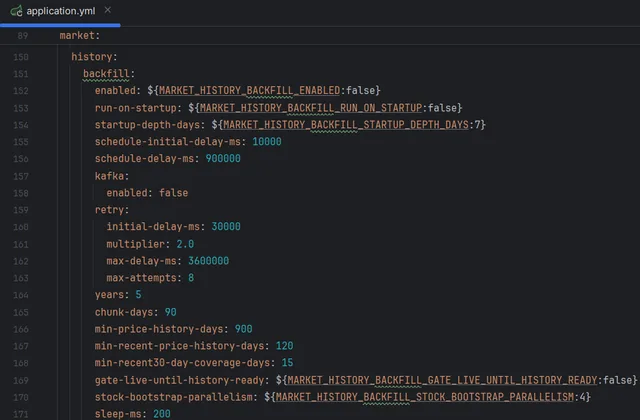
            </a>
            <br><sub><code>market.history.backfill</code></sub>
          </td>
          <td valign="top">
            <h4>③ application.yml — Historical data (backfill)</h4>
            <p>Central orchestrator for <strong>historical price</strong> series (BIST, NASDAQ, crypto, FX). <strong>Off</strong> by default for local dev; <strong>on</strong> in the Docker demo via <code>Docker/.env</code>.</p>
            <table border="0" cellpadding="4" cellspacing="0">
              <tr>
                <td width="42%" valign="top"><code>MARKET_HISTORY_BACKFILL_ENABLED</code></td>
                <td valign="top">Enable or disable historical ingest</td>
              </tr>
              <tr>
                <td valign="top"><code>MARKET_HISTORY_BACKFILL_RUN_ON_STARTUP</code></td>
                <td valign="top">Start immediately when the stack comes up</td>
              </tr>
              <tr>
                <td valign="top"><code>years</code> · <code>chunk-days</code></td>
                <td valign="top">Lookback (5 years) and chunk size (90 days)</td>
              </tr>
              <tr>
                <td valign="top"><code>schedule-delay-ms</code></td>
                <td valign="top">Periodic rerun: every 15 minutes (900000 ms)</td>
              </tr>
              <tr>
                <td valign="top"><code>gate-live-until-history-ready</code></td>
                <td valign="top"><code>true</code> → delays live prices until history is ready</td>
              </tr>
              <tr>
                <td valign="top"><code>kafka.enabled</code></td>
                <td valign="top">Kafka publish during backfill (default: off, writes to DB)</td>
              </tr>
            </table>
            <p><strong>Tip:</strong> For a quick demo, <code>Docker/.env</code> is enough; tune depth and retry in this YAML block. Bond, fund NAV, and eurobond history use separate bootstrap flags (<code>market.bond.history-bootstrap</code>, <code>market.fund.nav-history-bootstrap</code>).</p>
          </td>
        </tr>
        <tr><td colspan="2" height="20"></td></tr>
        <tr>
          <td width="190" align="center" valign="top">
            <a href="Docker/docker-compose.yml#L220" title="docker-compose.yml — market-data-service">
              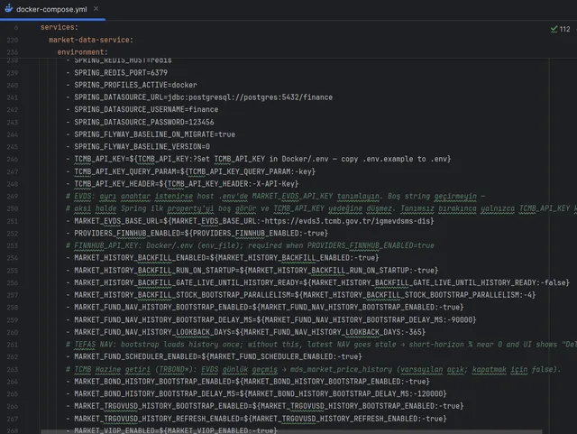
            </a>
            <br><sub><code>Docker/docker-compose.yml</code></sub>
          </td>
          <td valign="top">
            <h4>④ docker-compose.yml — Docker demo overrides</h4>
            <p>Environment variables passed to the <code>market-data-service</code> container; they <strong>merge</strong> <code>Docker/.env</code> values with inline defaults. Many pipelines <strong>off</strong> in <code>application.yml</code> are <strong>on</strong> here for the demo.</p>
            <table border="0" cellpadding="4" cellspacing="0">
              <tr>
                <td width="42%" valign="top"><code>SPRING_PROFILES_ACTIVE=docker</code></td>
                <td valign="top">Loads <code>application-docker.yml</code> (fund scheduler, etc.)</td>
              </tr>
              <tr>
                <td valign="top"><code>TCMB_API_KEY=${...:?}</code></td>
                <td valign="top">Required — EVDS bonds, macro, FX data</td>
              </tr>
              <tr>
                <td valign="top"><code>MARKET_HISTORY_BACKFILL_*:-true</code></td>
                <td valign="top">Historical prices: off locally → on in Docker</td>
              </tr>
              <tr>
                <td valign="top"><code>MARKET_FUND_*:-true</code></td>
                <td valign="top">TEFAS NAV scheduler + history bootstrap</td>
              </tr>
              <tr>
                <td valign="top"><code>MARKET_VIOP_CRON:-0 */2 * * * *</code></td>
                <td valign="top">VIOP: every 2 min in demo (weekdays 19:40 locally)</td>
              </tr>
              <tr>
                <td valign="top"><code>${VAR:-default}</code> syntax</td>
                <td valign="top">Uses the right-hand default when <code>.env</code> is unset</td>
              </tr>
            </table>
            <p><strong>Precedence:</strong> compose line → <code>Docker/.env</code> → <code>application.yml</code>. After changes: <code>docker compose up -d --force-recreate market-data-service</code></p>
          </td>
        </tr>
      </table>
    </td>
  </tr>
</table>

</div>

## Adding instruments

<p align="center"><sub>Tracked instruments are defined in Java registry files — synced to the database on startup</sub></p>

<table align="center" border="0" cellpadding="0" cellspacing="0" width="100%">
  <tr>
    <td>
      <table border="0" cellpadding="14" cellspacing="0" width="100%">
        <tr>
          <td width="190" align="center" valign="top">
            <a href="market-data-service/src/main/java/com/company/marketdataservice/catalog/registry/providers/CryptoRegistry.java" title="CryptoRegistry.java">
              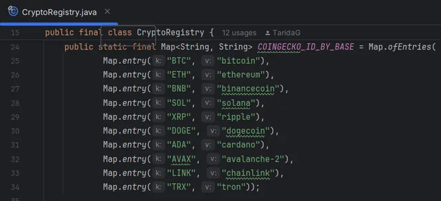
            </a>
            <br><sub><code>.../providers/CryptoRegistry.java</code></sub>
          </td>
          <td valign="top">
            <h4>① Crypto — CryptoRegistry</h4>
            <p>Adds USDT pairs (BTC, ETH, SOL, …) to the platform catalog. Live prices come from a <strong>composite</strong> provider: Yahoo → CoinGecko → Binance.</p>
            <table border="0" cellpadding="4" cellspacing="0">
              <tr>
                <td width="38%" valign="top"><code>SYMBOLS</code></td>
                <td valign="top">Watch list — add e.g. <code>"BTCUSDT"</code></td>
              </tr>
              <tr>
                <td valign="top"><code>COINGECKO_ID_BY_BASE</code></td>
                <td valign="top">Base asset → CoinGecko id (e.g. <code>BTC → bitcoin</code>)</td>
              </tr>
              <tr>
                <td valign="top"><code>IngestProvider.COMPOSITE</code></td>
                <td valign="top">Provider mapping; DB sync is automatic</td>
              </tr>
            </table>
            <p><strong>Steps:</strong> add symbol to <code>SYMBOLS</code> → update <code>COINGECKO_ID_BY_BASE</code> if needed → <code>docker compose up -d --build market-data-service</code></p>
          </td>
        </tr>
        <tr><td colspan="2" height="20"></td></tr>
        <tr>
          <td width="190" align="center" valign="top">
            <a href="market-data-service/src/main/java/com/company/marketdataservice/catalog/registry/providers/BistRegistry.java" title="BistRegistry.java">
              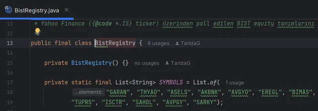
            </a>
            <br><sub><code>.../providers/BistRegistry.java</code></sub>
          </td>
          <td valign="top">
            <h4>② BIST — BistRegistry</h4>
            <p>Adds Borsa Istanbul equities to the catalog. Live and historical prices come from <strong>Yahoo Finance</strong>; ticker format <code>SYMBOL.IS</code> (e.g. <code>GARAN.IS</code>).</p>
            <table border="0" cellpadding="4" cellspacing="0">
              <tr>
                <td width="38%" valign="top"><code>SYMBOLS</code></td>
                <td valign="top">BIST codes — e.g. <code>"GARAN"</code>, <code>"THYAO"</code></td>
              </tr>
              <tr>
                <td valign="top"><code>symbol + ".IS"</code></td>
                <td valign="top">Yahoo provider ticker is built automatically</td>
              </tr>
              <tr>
                <td valign="top"><code>IngestProvider.YAHOO</code></td>
                <td valign="top">Exchange: <code>BIST</code>, currency: <code>TRY</code></td>
              </tr>
            </table>
            <p><strong>Steps:</strong> add code to <code>SYMBOLS</code> → <code>docker compose up -d --build market-data-service</code> → ensure <code>MARKET_HISTORY_BACKFILL_ENABLED=true</code> for history</p>
          </td>
        </tr>
        <tr><td colspan="2" height="20"></td></tr>
        <tr>
          <td width="190" align="center" valign="top">
            <a href="market-data-service/src/main/java/com/company/marketdataservice/catalog/registry/providers/NasdaqRegistry.java" title="NasdaqRegistry.java">
              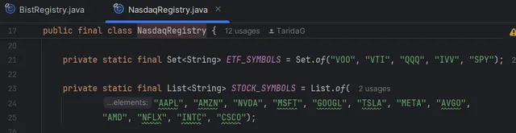
            </a>
            <br><sub><code>.../providers/NasdaqRegistry.java</code></sub>
          </td>
          <td valign="top">
            <h4>③ NASDAQ + ETF — NasdaqRegistry</h4>
            <p>Adds US equities and ETFs to the catalog. When <strong>Finnhub</strong> is enabled, live/history data comes from there; if off or on failure, <strong>Yahoo</strong> is the fallback.</p>
            <table border="0" cellpadding="4" cellspacing="0">
              <tr>
                <td width="38%" valign="top"><code>STOCK_SYMBOLS</code></td>
                <td valign="top">Stocks — <code>AAPL</code>, <code>NVDA</code>, <code>MSFT</code>, …</td>
              </tr>
              <tr>
                <td valign="top"><code>ETF_SYMBOLS</code></td>
                <td valign="top">ETFs — <code>SPY</code>, <code>QQQ</code>, <code>VOO</code>, <code>VTI</code>, <code>IVV</code></td>
              </tr>
              <tr>
                <td valign="top"><code>PROVIDERS_FINNHUB_ENABLED</code></td>
                <td valign="top"><code>Docker/.env</code> — main NASDAQ ingest switch</td>
              </tr>
              <tr>
                <td valign="top"><code>FINNHUB_API_KEY</code></td>
                <td valign="top">Required when Finnhub is on; without it lists/charts stay empty</td>
              </tr>
            </table>
            <p><strong>Steps:</strong> add stock to <code>STOCK_SYMBOLS</code> or ETF to <code>ETF_SYMBOLS</code> → set <code>FINNHUB_API_KEY</code> → rebuild</p>
          </td>
        </tr>
        <tr><td colspan="2" height="20"></td></tr>
        <tr>
          <td width="190" align="center" valign="top">
            <a href="market-data-service/src/main/java/com/company/marketdataservice/catalog/registry/providers/FundRegistry.java" title="FundRegistry.java">
              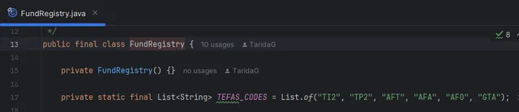
            </a>
            <br><sub><code>.../providers/FundRegistry.java</code></sub>
          </td>
          <td valign="top">
            <h4>④ TEFAS fund — FundRegistry</h4>
            <p>Adds Turkish mutual funds to the catalog. NAV data comes from the <strong>TEFAS API</strong>; platform symbol format is <code>FUND_{code}</code> (e.g. <code>FUND_TI2</code>).</p>
            <table border="0" cellpadding="4" cellspacing="0">
              <tr>
                <td width="38%" valign="top"><code>TEFAS_CODES</code></td>
                <td valign="top">Fund codes — <code>TI2</code>, <code>TP2</code>, <code>AFT</code>, …</td>
              </tr>
              <tr>
                <td valign="top"><code>FUND_{code}</code></td>
                <td valign="top">Canonical catalog symbol is built automatically</td>
              </tr>
              <tr>
                <td valign="top"><code>MARKET_FUND_SCHEDULER_ENABLED</code></td>
                <td valign="top">Live NAV updates (<code>Docker/.env</code>)</td>
              </tr>
              <tr>
                <td valign="top"><code>MARKET_FUND_NAV_*</code></td>
                <td valign="top">Historical NAV bootstrap and gap repair</td>
              </tr>
            </table>
            <p><strong>Steps:</strong> add code to <code>TEFAS_CODES</code> → <code>MARKET_FUND_SCHEDULER_ENABLED=true</code> → rebuild. API URL: <code>application.yml</code> → <code>market.fund.tefas-fon-gnl-blg-url</code></p>
          </td>
        </tr>
        <tr><td colspan="2" height="20"></td></tr>
        <tr>
          <td width="190" align="center" valign="top">
            <a href="market-data-service/src/main/java/com/company/marketdataservice/catalog/registry/providers/BondRegistry.java" title="BondRegistry.java">
              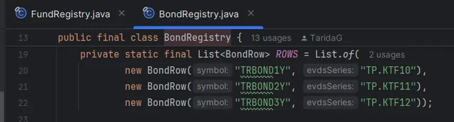
            </a>
            <br><sub><code>.../providers/BondRegistry.java</code></sub>
          </td>
          <td valign="top">
            <h4>⑤ TCMB bond — BondRegistry</h4>
            <p>Adds Turkish Treasury yield curves to the catalog. Data comes from <strong>TCMB EVDS</strong>; each row maps symbol → EVDS series code (e.g. <code>TRBOND1Y → TP.KTF10</code>).</p>
            <table border="0" cellpadding="4" cellspacing="0">
              <tr>
                <td width="38%" valign="top"><code>ROWS</code></td>
                <td valign="top"><code>TRBOND1Y</code>, <code>TRBOND2Y</code>, <code>TRBOND3Y</code> + EVDS codes</td>
              </tr>
              <tr>
                <td valign="top"><code>IngestProvider.TCMB_BOND</code></td>
                <td valign="top">Live yield + history bootstrap</td>
              </tr>
              <tr>
                <td valign="top"><code>TCMB_API_KEY</code></td>
                <td valign="top"><code>Docker/.env</code> — EVDS access required</td>
              </tr>
              <tr>
                <td valign="top"><code>MARKET_BOND_*</code></td>
                <td valign="top">History bootstrap and daily refresh (<code>Docker/.env</code>)</td>
              </tr>
            </table>
            <p><strong>Steps:</strong> add a <code>BondRow</code> for a new maturity → set <code>TCMB_API_KEY</code> → <code>MARKET_BOND_HISTORY_BOOTSTRAP_ENABLED=true</code> → rebuild</p>
          </td>
        </tr>
        <tr><td colspan="2" height="20"></td></tr>
        <tr>
          <td width="190" align="center" valign="top">
            <a href="market-data-service/src/main/java/com/company/marketdataservice/catalog/registry/providers/FxRegistry.java" title="FxRegistry.java">
              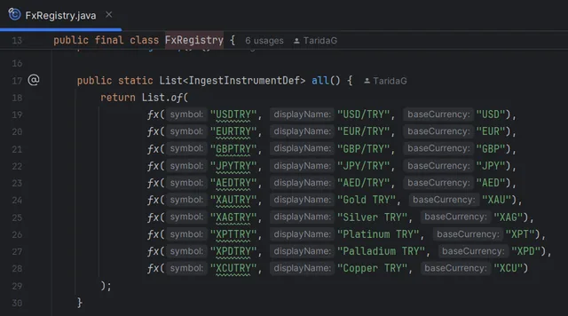
            </a>
            <br><sub><code>.../providers/FxRegistry.java</code></sub>
          </td>
          <td valign="top">
            <h4>⑥ FX + metals — FxRegistry</h4>
            <p>Adds TRY crosses and precious metals to the catalog. Fiat rates: <strong>TCMB XML</strong> + fallback; metals (XAU, XAG, …) derived via Stooq × USDTRY.</p>
            <table border="0" cellpadding="4" cellspacing="0">
              <tr>
                <td width="38%" valign="top"><code>fx(...)</code> rows</td>
                <td valign="top"><code>USDTRY</code>, <code>EURTRY</code> … <code>XAUTRY</code>, <code>XAGTRY</code></td>
              </tr>
              <tr>
                <td valign="top"><code>IngestProvider.TCMB</code></td>
                <td valign="top">Primary source for fiat</td>
              </tr>
              <tr>
                <td valign="top"><code>market.fx.provider-order</code></td>
                <td valign="top"><code>application.yml</code> — TCMB, then ExchangeRate API</td>
              </tr>
              <tr>
                <td valign="top"><code>market.fx.scheduler-enabled</code></td>
                <td valign="top">Live FX updates (default: on)</td>
              </tr>
            </table>
            <p><strong>Steps:</strong> add <code>fx("SYMBOL", "Name", "BASE")</code> → update <code>market.fx.provider-currencies</code> for fiat → rebuild</p>
          </td>
        </tr>
        <tr><td colspan="2" height="20"></td></tr>
        <tr>
          <td width="190" align="center" valign="top">
            <a href="market-data-service/src/main/java/com/company/marketdataservice/catalog/registry/providers/EurobondRegistry.java" title="EurobondRegistry.java">
              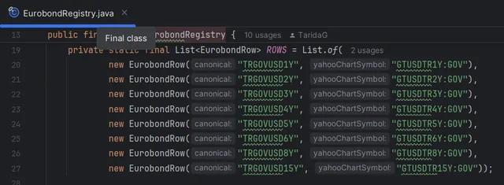
            </a>
            <br><sub><code>.../providers/EurobondRegistry.java</code></sub>
          </td>
          <td valign="top">
            <h4>⑦ TR USD eurobond — EurobondRegistry</h4>
            <p>Adds Turkish Treasury USD benchmark yields to the catalog. Data from <strong>Yahoo Finance</strong> chart tickers (e.g. <code>GTUSDTR5Y:GOV</code>).</p>
            <table border="0" cellpadding="4" cellspacing="0">
              <tr>
                <td width="38%" valign="top"><code>EurobondRow</code></td>
                <td valign="top"><code>TRGOVUSD1Y</code> … <code>TRGOVUSD15Y</code> + Yahoo symbol</td>
              </tr>
              <tr>
                <td valign="top"><code>IngestProvider.YAHOO</code></td>
                <td valign="top">MDS history bootstrap + daily refresh</td>
              </tr>
              <tr>
                <td valign="top"><code>MARKET_TRGOVUSD_*</code></td>
                <td valign="top"><code>Docker/.env</code> — history and refresh toggles</td>
              </tr>
              <tr>
                <td valign="top"><code>finance-api</code></td>
                <td valign="top">Separate module: <code>MARKET_TR_USD_EUROBOND_YAHOO_*</code> (ETF proxy charts)</td>
              </tr>
            </table>
            <p><strong>Steps:</strong> add <code>EurobondRow</code> for a new maturity → verify Yahoo ticker → <code>MARKET_TRGOVUSD_HISTORY_BOOTSTRAP_ENABLED=true</code> → rebuild</p>
          </td>
        </tr>
      </table>
    </td>
  </tr>
</table>

## Quick start (Docker — recommended)

The repository contains **no API keys**. `cp .env.example .env` only creates the file; **you must add keys and (optionally) SMTP inside**. Step-by-step guide: [docs/english/getting-started.md](docs/english/getting-started.md).

**Requirements:** [Docker Desktop](https://www.docker.com/products/docker-desktop/) (Compose v2), roughly **8 GB RAM**.

| Step | What to do |
|------|------------|
| **1** | Clone the repository |
| **2** | Create `Docker/.env` (`cp .env.example .env`) |
| **3** | **Fill in** `Docker/.env`: required `TCMB_API_KEY`, `FINNHUB_API_KEY` |
| **4** | Optional: SMTP (registration / alarm email), OpenAI (admin AI) |
| **5** | From the `Docker` folder: `docker compose up -d --build` |
| **6** | Portal: http://localhost:5173 — demo `admin1` / `123456` (market data may take 10–30 min to populate) |

**1 · Clone**

```bash
git clone https://github.com/TaridaG/Toyota-32Bit-Finance-Platform.git
cd Toyota-32Bit-Finance-Platform/Docker
```

**2 · Create environment file**

```bash
cp .env.example .env
```

Windows (PowerShell): `Copy-Item .env.example .env`

> Copying alone is not enough — edit the file **contents** in Step 3.

**3 · Fill in (required API keys)**

Open `Docker/.env` in a text editor:

```env
TCMB_API_KEY=your-evds-key
FINNHUB_API_KEY=your-finnhub-key
```

- Keys live only in `Docker/.env`; **do not commit this file**.
- `POSTGRES_PASSWORD` and `NEWS_DB_PASSWORD` default to `123456` in the template — fine to leave for local demo.

**4 · Optional (SMTP / AI)**

| Variable | Purpose |
|----------|---------|
| `OPENAI_API_KEY` + `AI_ENABLED=true` | Admin info card AI |
| `SPRING_MAIL_*` / `SMTP_*` | Registration verification and alarm email |
| `MARKET_EVDS_API_KEY` | Separate EVDS key (falls back to `TCMB_API_KEY`; **do not write empty `KEY=` lines**) |

Email example (Gmail **app password**, not your normal login password):

```env
SMTP_USERNAME=you@gmail.com
SMTP_PASSWORD=16-digit-app-password
SPRING_MAIL_USERNAME=you@gmail.com
SPRING_MAIL_PASSWORD=16-digit-app-password
APP_REGISTRATION_VERIFICATION_FROM=you@gmail.com
NOTIFICATION_MAIL_FROM=you@gmail.com
```

All variables: [docs/english/configuration.md](docs/english/configuration.md).

> **First install:** After Step 3, `docker compose up` in Step 5 is enough; `--force-recreate` is not required.  
> **While the stack is running, if `.env` changes:** `docker compose up -d --force-recreate market-data-service` (TCMB/Finnhub), `finance-api` (mail/AI), `notification-service` (SMTP).

**5 · Start the stack**

```bash
docker compose up -d --build
```

### Quick access

<p align="center"><sub>When the stack is running, click the logos — portal, API, identity, observability, and infrastructure (hover for TCP ports)</sub></p>

<p align="center">
  <a href="http://localhost:5173" title="Web UI — http://localhost:5173"></a>&nbsp;
  <a href="http://localhost:8080" title="API Gateway — http://localhost:8080"></a>&nbsp;
  <a href="http://localhost:8080/swagger-ui.html" title="Swagger UI — http://localhost:8080/swagger-ui.html"></a>&nbsp;
  <a href="http://localhost:8085" title="Keycloak OIDC (realm: finance) — http://localhost:8085"></a>&nbsp;
  <a href="http://localhost:8085/admin" title="Keycloak Admin (admin / admin) — http://localhost:8085/admin"></a>
</p>
<p align="center">
  <a href="http://localhost:3000" title="Grafana (admin / admin) — http://localhost:3000"></a>&nbsp;
  <a href="http://localhost:9090" title="Prometheus — http://localhost:9090"></a>&nbsp;
  <a href="http://localhost:16686" title="Jaeger — http://localhost:16686"></a>&nbsp;
  <a href="http://localhost:5601" title="OpenSearch Dashboards — http://localhost:5601"></a>&nbsp;
  <a href="https://localhost:9200" title="OpenSearch REST API (admin / 123456789) — https://localhost:9200"></a>&nbsp;
  <span title="PostgreSQL — localhost:5432"></span>&nbsp;
  <span title="Redis — localhost:6379"></span>&nbsp;
  <span title="Kafka — localhost:9092"></span>
</p>

### Demo users

| User | Password | Role |
|------|----------|------|
| `user1` | `123456` | USER |
| `admin1` | `123456` | ADMIN |

Keycloak admin console: http://localhost:8085/admin — `admin` / `admin`

Market data delay: see the note under [Project structure](#project-structure). Logs: `docker compose logs -f market-data-service`

## Local development (summary)

1. Infrastructure: `cd Docker && docker compose up -d postgres redis kafka keycloak`
2. Backend: `mvn -pl finance-api,market-data-service -am spring-boot:run` (ports: [docs/english/services.md](docs/english/services.md))
3. Frontend: `cd frontend-web && npm install && npm run dev` (no `.env.development` needed with the full Docker stack)

Details: [docs/english/getting-started.md](docs/english/getting-started.md) (Path B / C).

## Documentation

Technical guides live under `docs/english/`. Other languages: [docs/README.md](docs/README.md) · [README.tr.md](README.tr.md) · [README.de.md](README.de.md)

| Document | Contents |
|----------|----------|
| [docs/english/README.md](docs/english/README.md) | English documentation index |
| [docs/english/getting-started.md](docs/english/getting-started.md) | Setup (Docker, hybrid, frontend) |
| [docs/english/architecture.md](docs/english/architecture.md) | Architecture and data flow |
| [docs/english/services.md](docs/english/services.md) | Services and ports |
| [docs/english/api.md](docs/english/api.md) | Gateway routes and OpenAPI |
| [docs/english/configuration.md](docs/english/configuration.md) | `Docker/.env` and environment variables |
| [docs/english/development.md](docs/english/development.md) | Development and testing |
| [docs/english/observability.md](docs/english/observability.md) | Metrics, trace, and logs |

## Disclaimer

This repository is a **demo and learning project**. It does not provide investment, tax, or legal advice. Live market data depends on third-party APIs and their terms of use. Use in production or with real money is at your own risk.

## License

This project is licensed under the [MIT License](LICENSE).
