<p align="center">
  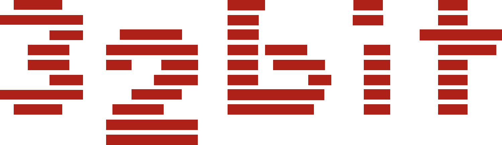
  &nbsp;&nbsp;&nbsp;
  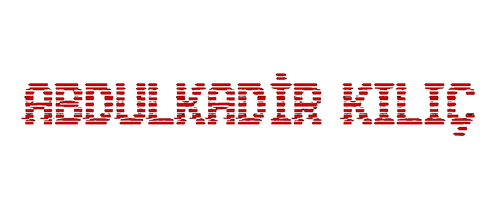
  &nbsp;&nbsp;&nbsp;
  
</p>

<h1 align="center">32 BİT FİNANCE PLATFORM</h1>

<p align="center">
  
  
  
  
  
  
  
  
</p>
<p align="center">
  
  
  
  
  
  
  
  
</p>

<p align="center">
  <strong>Türkiye odaklı, üç dilde finans portalı</strong> — portföyünüzü oluşturun, piyasaları ve haberleri tek ekrandan izleyin.
  Arayüz ve içerik <strong>Türkçe</strong>, <strong>İngilizce</strong> ve <strong>Almanca</strong> destekler; dil değiştirdiğinizde menüler, kartlar ve mesajlar seçtiğiniz dile uyumlanır.
</p>

<p align="center">
  Canlı fiyatlarla hisse, fon, kripto, döviz, tahvil ve eurobond takibi; işlem geçmişi, hedefler ve harici portföy görünümü.
  Haberlerde önemli gelişmeleri <strong>yıldızlayın</strong>, teknik analizde çizim ve notlarınızı <strong>kaydedip</strong> sonra yeniden açın.
  Faiz/vadeli ürünler, banka kurları, RSI ve diğer göstergeler, alarmlar, izleme listesi ve finansal okuryazarlık — portföylerinizi yönetmek için tek platform.
</p>

<h2 align="center">Ekranlar</h2>

<p>
  <a id="ekran-ana-sayfa"></a>
  <a id="ekran-piyasalar"></a>
  <a id="ekran-portfoyum"></a>
  <a id="ekran-faiz-vadeli"></a>
  <a id="ekran-analiz"></a>
  <a id="ekran-haberler"></a>
  <a id="ekran-banka-kurlari"></a>
  <a id="ekran-finansal-okuryazarlik"></a>
  <a id="ekran-bilgi-kartlari"></a>
  <a id="ekran-profil"></a>
</p>

<table align="center" border="0" cellpadding="8" cellspacing="0" width="100%">
  <tr>
    <td align="center" valign="top" width="50%">
      <strong>Ana Sayfa</strong><br>
      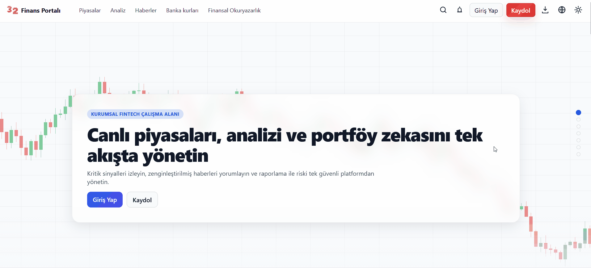
    </td>
    <td align="center" valign="top" width="50%">
      <strong>Piyasalar</strong><br>
      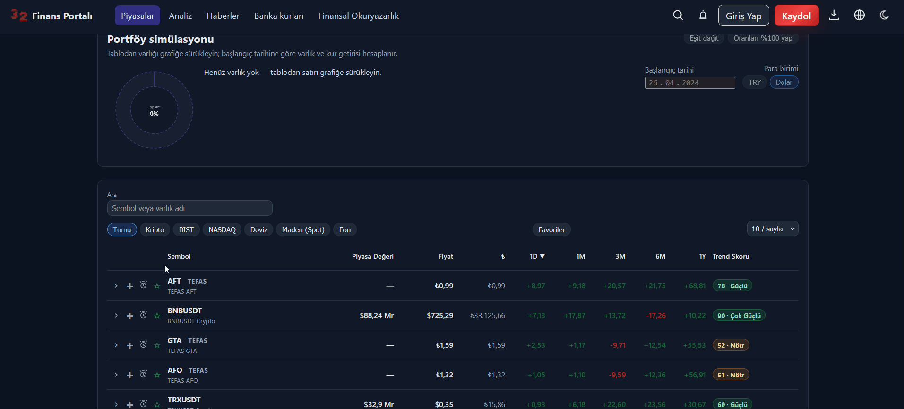
    </td>
  </tr>
  <tr>
    <td align="center" valign="top" width="50%">
      <strong>Portföyüm</strong><br>
      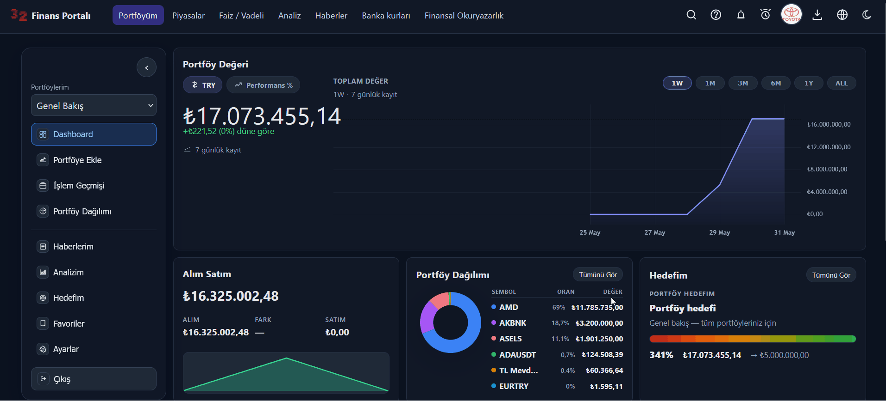
    </td>
    <td align="center" valign="top" width="50%">
      <strong>Faiz / Vadeli</strong><br>
      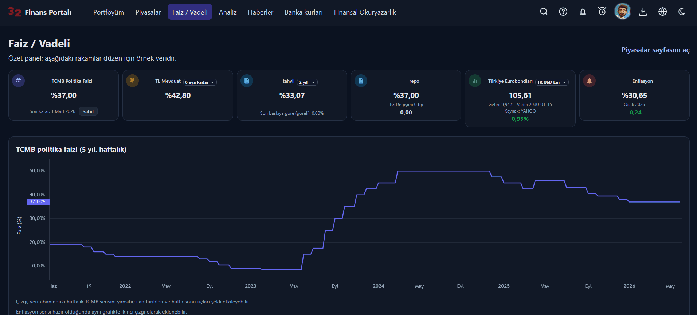
    </td>
  </tr>
  <tr>
    <td align="center" valign="top" width="50%">
      <strong>Analiz</strong><br>
      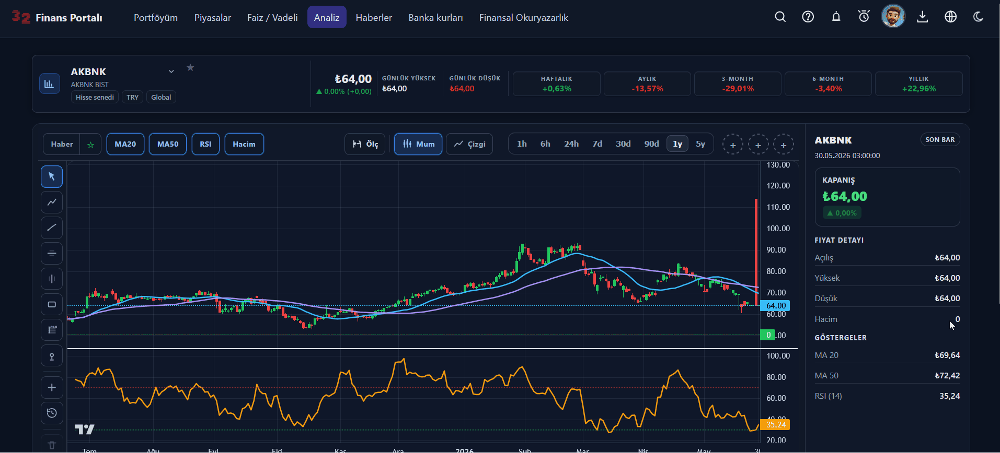
    </td>
    <td align="center" valign="top" width="50%">
      <strong>Haberler</strong><br>
      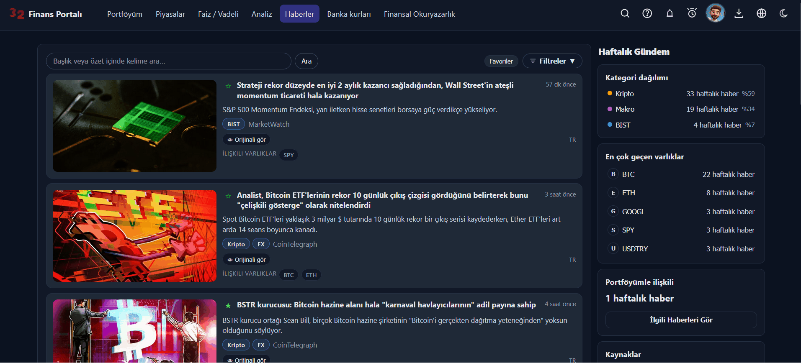
    </td>
  </tr>
  <tr>
    <td align="center" valign="top" width="50%">
      <strong>Banka kurları</strong><br>
      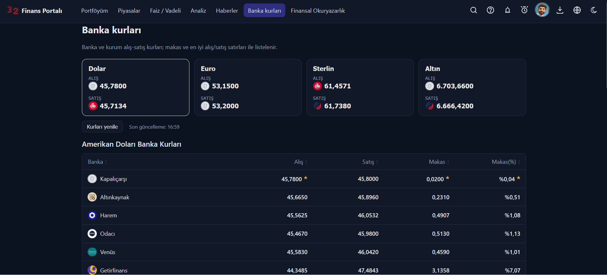
    </td>
    <td align="center" valign="top" width="50%">
      <strong>Finansal Okuryazarlık</strong><br>
      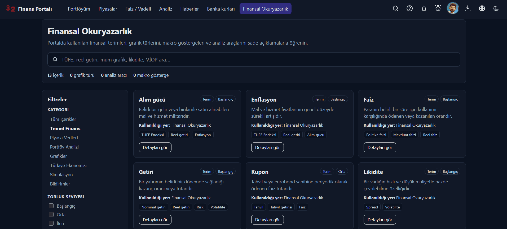
    </td>
  </tr>
  <tr>
    <td align="center" valign="top" width="50%">
      <strong>Bilgi kartları</strong><br>
      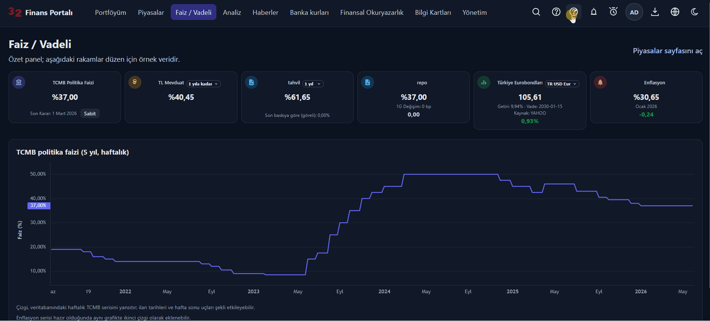
    </td>
    <td align="center" valign="top" width="50%">
      <strong>Profil</strong><br>
      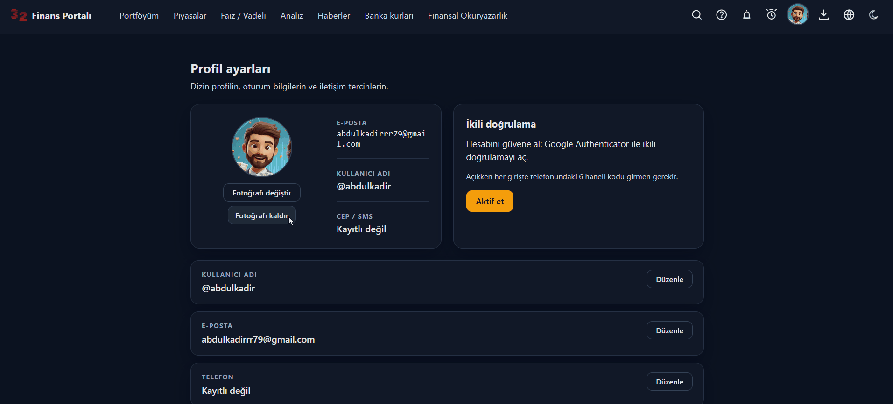
    </td>
  </tr>
</table>

## İçindekiler

- [Ekranlar](#ekranlar)
- [Proje yapısı](#proje-yapısı)
- [Hızlı başlat](docs/turkce/getting-started.md)
- [Hızlı başlangıç (Docker)](#hızlı-başlangıç-docker--önerilen)
- [Yerel geliştirme (özet)](#yerel-geliştirme-özet)
- [Dokümantasyon](#dokümantasyon)
- [Lisans](#lisans)

## Proje yapısı

**32 Bit Finance Platform**, mikroservis mimarisiyle çalışan bir finans portalıdır. Kullanıcı **React** arayüzünden tek adrese (**api-gateway**) istek atar; gateway kimliği **Keycloak** ile doğrular ve isteği ilgili servise yönlendirir. Portföy, alarm, kayıt ve MFA gibi portal iş kuralları **finance-api**’de toplanır; piyasa fiyatları, haber, teknik analiz ve bildirimler kendi servislerinde uzmanlaşmıştır. Servisler birbirini gerektiğinde **HTTP** ile çağırır; fiyat güncellemesi, alarm ve log gibi akışlar **Kafka** üzerinden asenkron ilerler. Kalıcı veriler **PostgreSQL**’de tutulur; her servisin şeması **Flyway** ile ayrı yönetilir.

<h3 align="center">
  <a href="docs/turkce/architecture.md">PROJE MİMARİSİ</a>
</h3>

<p align="center">
  <a href="docs/turkce/architecture.md">
    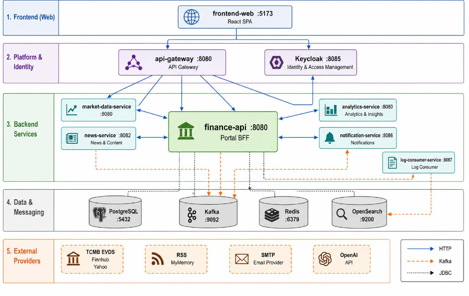
  </a>
</p>

<table align="center" border="0" cellpadding="20" cellspacing="0">
  <tr>
    <td valign="top" width="48%">
      <h4><a href="docs/turkce/services/api-gateway.md">api-gateway</a></h4>
      <p>Tarayıcı ve mobil istemcilerin backend’e ulaştığı <strong>tek kapı</strong>dır. Gelen her <code>/api/v1/...</code> isteğinde JWT’yi Keycloak üzerinden doğrular, kullanıcı kimliğini arka servislere güvenli header’larla iletir. İstek yoluna göre <code>finance-api</code>, <code>market-data-service</code>, <code>news-service</code> veya <code>analytics-service</code>’e yönlendirir; Redis ile hız sınırlama ve Resilience4j ile devre kesici uygular. Geliştirici ve entegrasyon ekipleri için tüm servislerin OpenAPI dokümantasyonunu tek Swagger arayüzünde toplar. Ayrıntılı route listesi: <a href="docs/turkce/api.md">docs/turkce/api.md</a>.</p>
    </td>
    <td valign="top" width="48%">
      <h4><a href="docs/turkce/services/finance-api.md">finance-api</a></h4>
      <p>Portalın <strong>kalbi</strong> ve Backend-for-Frontend (BFF) katmanıdır. Portföy, işlem geçmişi, hedefler, fiyat alarmları, izleme listesi, grafik çizim kayıtları ve profil gibi kullanıcıya özel iş kuralları burada yaşar. Kayıt, e-posta doğrulama, TOTP tabanlı MFA ve güvenilir cihaz yönetimi ile birlikte admin KPI’ları, bilgi kartları ve haber favorileri de bu serviste toplanır. Piyasa verisi için <code>market-data-service</code>’e HTTP ile gider; güncel fiyat ve FX snapshot’larını Kafka’dan dinler. Kritik domain olaylarını transactional outbox ile Kafka’ya yazar; veriler PostgreSQL’de Flyway ile yönetilir.</p>
    </td>
  </tr>
  <tr>
    <td valign="top" width="48%">
      <h4><a href="docs/turkce/services/market-data-service.md">market-data-service</a></h4>
      <p>Platformun <strong>piyasa verisi motoru</strong>dur. BIST, Nasdaq, kripto, fon, döviz, tahvil ve eurobond enstrümanlarını kataloglar; scheduler’larla canlı ve geçmiş fiyatları günceller. TCMB EVDS, Finnhub, Yahoo, CoinGecko ve Stooq gibi kaynaklardan veri çeker; politika faizi, banka kurları ve temel enstrüman bilgilerini sağlar. İlk kurulumda geçmiş fiyat backfill çalıştırabilir; sık okunan uçlar için hibrit JSON önbellek kullanır. Fiyat değişimlerini <code>market.price.updated</code> gibi Kafka topic’lerine yayınlayarak analitik ve portal katmanını besler.</p>
    </td>
    <td valign="top" width="48%">
      <h4><a href="docs/turkce/services/analytics-service.md">analytics-service</a></h4>
      <p>Canlı fiyat akışını <strong>teknik analiz</strong>e dönüştüren uzman servistir. <code>market-data-service</code>’in yayınladığı fiyat olaylarını Kafka üzerinden tüketir; RSI ve benzeri göstergeleri hesaplar, insight ve politika metriklerini üretir. Hesaplanan sonuçları kendi PostgreSQL şemasında saklar ve gateway üzerinden HTTP API ile sunar. Böylece ağır gösterge işleri portal BFF’inden ayrılır; analiz sayfası ve ilgili kartlar güncel metrikleri buradan alır.</p>
    </td>
  </tr>
  <tr>
    <td valign="top" width="48%">
      <h4><a href="docs/turkce/services/news-service.md">news-service</a></h4>
      <p>Finans haberlerinin <strong>toplandığı ve sunulduğu</strong> servistir. Tanımlı RSS kaynaklarını zamanlanmış görevlerle tarar, haberleri veritabanına yazar ve portalın listeleme/filtreleme API’sini besler. Gerekli içeriklerde MyMemory ile çeviri desteği sunar; gateway üzerinden <code>/api/v1/news/**</code> uçlarıyla erişilir. Haber akışı portal deneyiminden bağımsız ölçeklenir; Docker ortamında sıkı dosya sistemi ve ayrı veritabanı parolası ile çalışacak şekilde yapılandırılır.</p>
    </td>
    <td valign="top" width="48%">
      <h4><a href="docs/turkce/services/notification-service.md">notification-service</a></h4>
      <p>Kullanıcıya giden <strong>e-posta bildirimlerinin</strong> merkezidir. Kafka’dan alarm tetiklenmesi, şüpheli giriş, izleme listesi değişikliği ve analitik insight gibi olayları dinler. Olay tipine göre SMTP ile şablonlu e-posta üretir; portalın anlık UI yükünü arka plana taşır. <code>finance-api</code> iş kuralı üretir, bu servis iletir; böylece bildirim kanalı değişse bile domain kodu sade kalır.</p>
    </td>
  </tr>
  <tr>
    <td valign="top" width="48%">
      <h4><a href="docs/turkce/services/log-consumer-service.md">log-consumer-service</a></h4>
      <p>Tüm backend servislerinin <strong>merkezi log arşivleyicisidir</strong>. Uygulamalar Log4j2 ile JSON formatında <code>app.logs</code> Kafka topic’ine yazar; bu servis mesajları tüketip OpenSearch’e indeksler. Operasyon ekibi Grafana, OpenSearch Dashboards veya doğrudan arama ile hata ve iz süzme yapabilir. Uygulama pod’ları log depolamak zorunda kalmaz; log pipeline platform genelinde tek noktadan yönetilir.</p>
    </td>
    <td valign="top" width="48%">
      <h4><a href="docs/turkce/services/frontend-web.md">frontend-web</a></h4>
      <p>Kullanıcının gördüğü <strong>React 19</strong> tabanlı tek sayfa uygulamasıdır (Vite + TypeScript). Landing, piyasalar, analiz, haberler, banka kurları ve finansal okuryazarlık sayfaları herkese açıkken; portföy, faiz/vadeli, dashboard ve harici portföy görünümü oturum gerektirir. Keycloak ile giriş ve kayıt akışını yönetir; TR, EN ve DE dil desteği sunar. Tüm API çağrıları <code>api-gateway</code> üzerinden gider; admin ve bilgi kartları yönetimi için ayrı <code>/admin</code> alanı bulunur.</p>
    </td>
  </tr>
</table>

> **Not — piyasa verisi ve zamanlayıcılar**  
> Stack ayağa kalktıktan sonra `market-data-service`, geçmiş fiyat backfill ile canlı güncellemeleri arka planda birleştirir. Katalog ve geçmiş serilerin tamamlanması — enstrüman sayısına ve sağlayıcı yanıt sürelerine bağlı olarak — **yaklaşık 30 dakika** sürebilir; portal bu süreçte kademeli olarak dolar, ilk dakikalarda eksik grafik veya boş liste görmek normaldir.  
> Demo yapılandırmadaki zamanlayıcı aralıkları (ör. hisse ~1 dk, FX/tahvil ~5 dk) ve backfill adımları, **ücretsiz kota** sunan harici kaynaklara (TCMB EVDS, Yahoo, CoinGecko, Finnhub vb.) göre ayarlanmıştır; API anahtarları `Docker/.env` içinde tanımlanır (repoda yoktur). İstekler arası bekleme süreleri rate limit ihlallerini önler. Ücretli API planına veya daha yüksek kotaya geçildiğinde `scheduler.*.delay-ms`, backfill `sleep-ms` ve ilgili cron ifadeleri [docs/turkce/configuration.md](docs/turkce/configuration.md) üzerinden sıklaştırılabilir.  
> İlerlemeyi izlemek için: `docker compose logs -f market-data-service`

### Hızlı başlat

Sıfırdan kurulum adımları: [Hızlı başlangıç (Docker — önerilen)](#hızlı-başlangıç-docker--önerilen). Ayrıntılı rehber: [docs/turkce/getting-started.md](docs/turkce/getting-started.md).

### Kafka olayları

| Topic | Üreten (ör.) | Tüketen (ör.) |
|-------|----------------|----------------|
| `market.price.updated` | market-data-service | analytics-service, finance-api |
| `market.fx.snapshot.updated` | market-data-service | finance-api |
| `alarm-triggered` | finance-api (outbox) | notification-service |
| `watchlist.item.added` / `removed` | finance-api | notification-service |
| `login-security.alert` | finance-api | notification-service |
| `app.logs` | Tüm servisler | log-consumer-service |

### Altyapı bileşenleri

Docker Compose (`Docker/`) ile gelen paylaşımlı bileşenler:

| Bileşen | Host port | Rol |
|---------|-----------|-----|
| PostgreSQL | 5432 | `finance` + `keycloak` veritabanları |
| Redis | 6379 | Gateway rate limit, finance-api önbellek |
| Kafka | 9092 | Olay bus |
| Keycloak | 8085 | OIDC / realm import |
| OpenSearch | 9200 | Log arama |
| OpenSearch Dashboards | 5601 | Log UI |
| Jaeger | 16686 | Dağıtık iz |
| Prometheus | 9090 | Metrik scrape |
| Grafana | 3000 | Panolar |

### Destekleyici dizinler

| Dizin | İçerik |
|-------|--------|
| `Docker/` | `docker-compose`, Keycloak realm, observability stack |
| `docs/` | Mimari, servisler, API, kurulum, gözlemlenebilirlik (`turkce/`, `english/`, `deutsch/`) |
| `photos/` | Profil avatar dosyaları (yerel / volume) |

## Hızlı başlangıç (Docker — önerilen)

Repoda **API anahtarı yoktur**. Sıfırdan klonlayan herkes aşağıdaki sırayı izlemelidir.

**Gereksinimler:** [Docker Desktop](https://www.docker.com/products/docker-desktop/) (Compose v2), yaklaşık **8 GB RAM**.

| Adım | Ne yapmalısınız |
|------|------------------|
| **1** | Depoyu klonlayın |
| **2** | `Docker/.env` oluşturun (`.env.example` kopyası) |
| **3** | `Docker/.env` dosyasını düzenleyip **kendi** `TCMB_API_KEY` ve `FINNHUB_API_KEY` değerlerinizi yazın |
| **4** | `Docker` klasöründen `docker compose up -d --build` çalıştırın |
| **5** | Portal: http://localhost:5173 — demo giriş `admin1` / `123456` |
| **6** | Piyasa verisi 10–30 dk dolabilir; izlemek: `docker compose logs -f market-data-service` |

**1 · Klon**

```bash
git clone https://github.com/TaridaG/Toyota-32Bit-Finance-Platform.git
cd Toyota-32Bit-Finance-Platform/Docker
```

**2 · Ortam dosyası**

```bash
cp .env.example .env
```

Windows (PowerShell): `Copy-Item .env.example .env`

**3 · API anahtarlarını yazın (zorunlu)**

`Docker/.env` dosyasını bir metin editörüyle açın. Boş placeholder’ları doldurun:

```env
TCMB_API_KEY=evds-anahtariniz
FINNHUB_API_KEY=finnhub-anahtariniz
```

- Anahtarlar yalnızca `Docker/.env` içinde tutulur; **bu dosyayı commit etmeyin**.
- `POSTGRES_PASSWORD` ve `NEWS_DB_PASSWORD` şablonda `123456` — yerel demo için aynı bırakılabilir.

> **İlk kurulum (repo yeni klonlandı):** Adım 3’te anahtarları yazdıktan sonra doğrudan Adım 4’te `docker compose up` yeterlidir — konteynerler zaten yeni `.env` ile oluşur, **öncesinde `--force-recreate` gerekmez**.
>
> **İleride anahtar değişirse** (stack zaten çalışıyorken `.env` düzenlediyseniz): çalışan konteyner eski değeri tutar; kaydettikten sonra ilgili servisi yeniden oluşturun:
>
> ```bash
> cd Docker
> docker compose up -d --force-recreate market-data-service   # TCMB / Finnhub
> docker compose up -d --force-recreate finance-api         # OpenAI / mail
> docker compose up -d --force-recreate notification-service  # SMTP
> ```

**İsteğe bağlı** (`.env` içinde yorumu kaldırıp doldurun):

| Değişken | Ne için? |
|----------|----------|
| `OPENAI_API_KEY` | Admin bilgi kartı AI |
| `SPRING_MAIL_*` / `SMTP_*` | Kayıt doğrulama ve alarm e-postası |
| `MARKET_EVDS_API_KEY` | Ayrı EVDS anahtarı (yoksa `TCMB_API_KEY` kullanılır; **boş `KEY=` satırı yazmayın**) |

Tüm değişkenler: [docs/turkce/configuration.md](docs/turkce/configuration.md).

**4 · Stack’i başlat**

```bash
docker compose up -d --build
```

<p align="center"><strong>2 · Hızlı ulaş</strong><br><sub>Stack ayaktayken logolara tıklayın — portal, API, kimlik, gözlemlenebilirlik ve altyapı (TCP portları için üzerine gelin)</sub></p>

<p align="center">
  <a href="http://localhost:5173" title="Web arayüzü — http://localhost:5173"></a>&nbsp;
  <a href="http://localhost:8080" title="API Gateway — http://localhost:8080"></a>&nbsp;
  <a href="http://localhost:8080/swagger-ui.html" title="Swagger UI — http://localhost:8080/swagger-ui.html"></a>&nbsp;
  <a href="http://localhost:8085" title="Keycloak OIDC (realm: finance) — http://localhost:8085"></a>&nbsp;
  <a href="http://localhost:8085/admin" title="Keycloak Admin (admin / admin) — http://localhost:8085/admin"></a>
</p>
<p align="center">
  <a href="http://localhost:3000" title="Grafana (admin / admin) — http://localhost:3000"></a>&nbsp;
  <a href="http://localhost:9090" title="Prometheus — http://localhost:9090"></a>&nbsp;
  <a href="http://localhost:16686" title="Jaeger — http://localhost:16686"></a>&nbsp;
  <a href="http://localhost:5601" title="OpenSearch Dashboards — http://localhost:5601"></a>&nbsp;
  <a href="https://localhost:9200" title="OpenSearch REST API (admin / 123456789) — https://localhost:9200"></a>&nbsp;
  <span title="PostgreSQL — localhost:5432"></span>&nbsp;
  <span title="Redis — localhost:6379"></span>&nbsp;
  <span title="Kafka — localhost:9092"></span>
</p>

### Demo kullanıcılar

Keycloak realm import: `user1` / `admin1` — şifre: `123456`

Piyasa verisi backfill notu: [Proje yapısı](#proje-yapısı) altındaki zamanlayıcı notu. Log: `docker compose logs -f market-data-service`

## Yerel geliştirme (özet)

1. Altyapı: `cd Docker && docker compose up -d postgres redis kafka keycloak`
2. Backend: `mvn -pl finance-api,market-data-service -am spring-boot:run` (servis başına ayrı terminal; portlar için [docs/turkce/services.md](docs/turkce/services.md))
3. Frontend: `cd frontend-web && cp .env.example .env.development && npm install && npm run dev`

Ayrıntılar: [docs/turkce/getting-started.md](docs/turkce/getting-started.md)

## Dokümantasyon

| Dosya | İçerik |
|-------|--------|
| [docs/README.md](docs/README.md) | Dil seçici (TR / EN / DE) |
| [docs/turkce/README.md](docs/turkce/README.md) | Türkçe dokümantasyon indeksi |
| [docs/turkce/architecture.md](docs/turkce/architecture.md) | Mimari ve veri akışı |
| [docs/turkce/services.md](docs/turkce/services.md) | Servisler, portlar, sorumluluklar |
| [docs/turkce/api.md](docs/turkce/api.md) | Gateway rotaları ve OpenAPI |
| [docs/turkce/getting-started.md](docs/turkce/getting-started.md) | Kurulum adımları |
| [docs/turkce/development.md](docs/turkce/development.md) | Geliştirme, test, profiller |
| [docs/turkce/configuration.md](docs/turkce/configuration.md) | Ortam değişkenleri |
| [docs/turkce/observability.md](docs/turkce/observability.md) | Metrik, trace, log |
| [docs/english/README.md](docs/english/README.md) | English documentation index |
| [docs/deutsch/README.md](docs/deutsch/README.md) | Deutsche Dokumentation |

## Lisans

Bu depo için lisans dosyası tanımlı değilse, dağıtım öncesi ekleyin.
