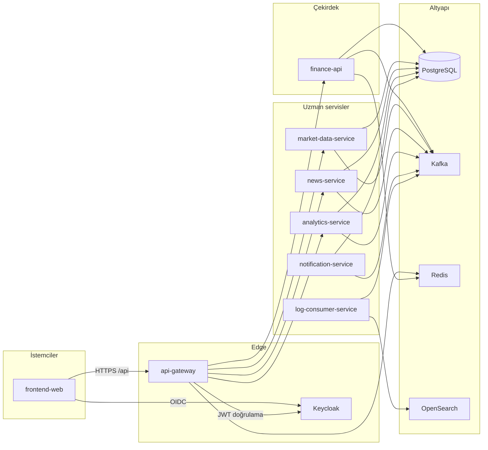

# Mimari

## Genel bakış

Platform, **edge** katmanında tek HTTP girişi (`api-gateway`), **domain** katmanında `finance-api` (portal BFF ve iş kuralları) ve **uzmanlaşmış** mikroservislerden oluşur. Olaylar çoğunlukla **Kafka** üzerinden akar; kalıcı veri **PostgreSQL**’de (servis başına Flyway şeması/tablosu).

## İstek yolu (tipik)

1. Tarayıcı `frontend-web` üzerinden `/api/v1/...` çağırır (Vite dev proxy veya Docker’da gateway’e yönlendirilir).
2. **api-gateway** JWT’yi Keycloak JWKS ile doğrular; kullanıcı bağlamını downstream header’lara aktarır.
3. Path önekine göre hedef servis seçilir (özel route’lar genel `finance-api` route’undan önce gelir — bkz. [api.md](api.md)).
4. `finance-api` gerektiğinde `market-data-service`’e HTTP proxy veya Kafka tüketimi yapar.

## Servis sorumlulukları

| Servis | Rol |
|--------|-----|
| **api-gateway** | TLS sonlandırma (deploy’da), CORS, rate limiting (Redis), circuit breaker, route aggregation |
| **finance-api** | Kullanıcı, portföy, alarm, grafik kayıtları, admin KPI, kayıt/MFA, haber zenginleştirme proxy, piyasa özeti |
| **market-data-service** | Enstrüman kataloğu, canlı/geçmiş fiyat, TCMB EVDS (faiz, tahvil, TL mevduat), sağlayıcı entegrasyonları |
| **news-service** | RSS çekme, saklama, çeviri, ham haber API |
| **analytics-service** | `market.price.updated` tüketimi, RSI vb. göstergeler, insight üretimi |
| **notification-service** | Alarm e-postası, login uyarısı, watchlist olayları |
| **log-consumer-service** | `app.logs` topic → OpenSearch indeksleme |
| **frontend-web** | SPA, Keycloak ile giriş, portal sayfaları |

## Olay güdümlü akış (özet)

| Topic | Üreten (ör.) | Tüketen (ör.) |
|-------|----------------|----------------|
| `market.price.updated` | market-data-service | analytics-service, finance-api |
| `market.fx.snapshot.updated` | market-data-service | finance-api |
| `alarm-triggered` | finance-api (outbox) | notification-service |
| `watchlist.item.added` / `removed` | finance-api | notification-service |
| `login-security.alert` | finance-api | notification-service |
| `app.logs` | Tüm servisler (Log4j2 Kafka append) | log-consumer-service |

`finance-api` kritik domain olaylarını **transactional outbox** ile Kafka’ya yayınlar (`OutboxPublisherScheduler`).

## Veri ve şema

- Tek PostgreSQL instance’ı (`finance` veritabanı); Keycloak için ayrı `keycloak` DB ([`Docker/postgres/init`](../Docker/postgres/init)).
- Flyway tablo adları servise özel (ör. `finance_flyway_schema_history`, `mds_flyway_schema_history`, `analytics_flyway_schema_history`).
- Yerel `market-data-service` **dev** profili varsayılan olarak bellek içi H2 kullanabilir; Docker/production PostgreSQL kullanır.

## Güvenlik

- **Keycloak** realm: `finance`, public client: `finance-gateway` (SPA), confidential: `finance-portal` (direct grant / backend).
- Gateway ve servisler **OAuth2 Resource Server** (JWT).
- Geliştirmede `APP_SECURITY_ALLOW_HEADER_USER_FALLBACK` ile header tabanlı kullanıcı çözümlemesi açılabilir; üretimde kapatılmalıdır.
- Portal MFA (TOTP), güvenilir cihaz çerezi ve kayıt e-posta doğrulaması `finance-api` içindedir.

## Gözlemlenebilirlik

Metrikler: Spring Actuator + Prometheus scrape. Trace: OTLP → Jaeger. Loglar: JSON → Kafka `app.logs` → OpenSearch. Ayrıntı: [observability.md](observability.md).

## Dağıtım notu

Üretim topolojisi bu repoda tanımlı değil; Docker Compose geliştirme/demo ortamı içindir. Gateway `JWT_ISSUER_URI` tarayıcıdan erişilebilir issuer ile uyumlu olmalıdır (`localhost:8085`).
