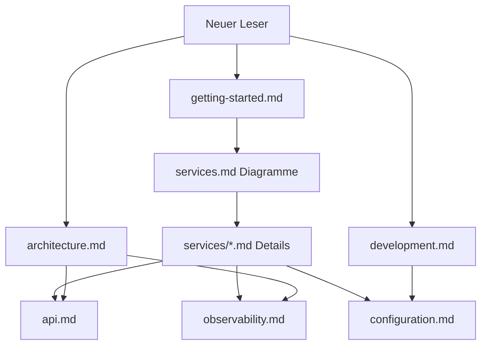

# Dokumentation

Technische Leitfäden für das Finance-Platform-Monorepo. Verwenden Sie diesen Ordner als maßgebliche Quelle für aktuelle Architektur und Konfiguration; `frontend-web/README.md` enthält nur Vite-Vorlagenhinweise.

### Dokumentationskarte

| Lesepfad | Reihenfolge |
|----------|-------------|
| Ersteinrichtung | getting-started → services.md → configuration |
| API-Integration | api.md → services/api-gateway.md |
| Service vertiefen | services/README → relevante Service-MD |
| Betrieb | observability → configuration |

## Leitfäden

| Dokument | Wann lesen? |
|----------|-------------|
| [architecture.md](architecture.md) | Systemkomponenten, Kafka, Sicherheit und Datenfluss verstehen |
| [getting-started.md](getting-started.md) | Ersteinrichtung (Docker oder hybride lokale Umgebung) |
| [services.md](services.md) | Portübersicht und Service-Index |
| [services/README.md](services/README.md) | Detaillierte Leitfäden pro Service (Abläufe, Diagramme) |
| [api.md](api.md) | `/api/v1`-Routing, Swagger, Authentifizierung |
| [development.md](development.md) | Maven, Profile, Tests, Frontend-Proxy |
| [configuration.md](configuration.md) | `Docker/.env` und Service-Umgebungsvariablen |
| [observability.md](observability.md) | Prometheus, Grafana, Jaeger, OpenSearch |

## Schnelllinks

- Root-README (EN · TR · DE): [../../README.md](../../README.md) · [../../README.tr.md](../../README.tr.md) · [../../README.de.md](../../README.de.md)
- Docker Compose: [../Docker/docker-compose.yml](../../Docker/docker-compose.yml)
- Umgebungsvorlage: [../Docker/.env.example](../../Docker/.env.example)
- Keycloak-Realm: [../Docker/keycloak/realm-finance.json](../../Docker/keycloak/realm-finance.json)
- Frontend-Env: [../frontend-web/.env.example](../../frontend-web/.env.example)

## Dokumentation aktualisieren

Bei Änderungen an Architektur oder Ports die betreffende `docs/deutsch/*.md`-Datei im selben PR aktualisieren; türkische und englische Kopien (`docs/turkce/`, `docs/english/`) nach Möglichkeit im selben PR synchron halten. Hat sich die Gateway-Routenreihenfolge geändert, [api.md](api.md) und [architecture.md](architecture.md) gemeinsam prüfen.
