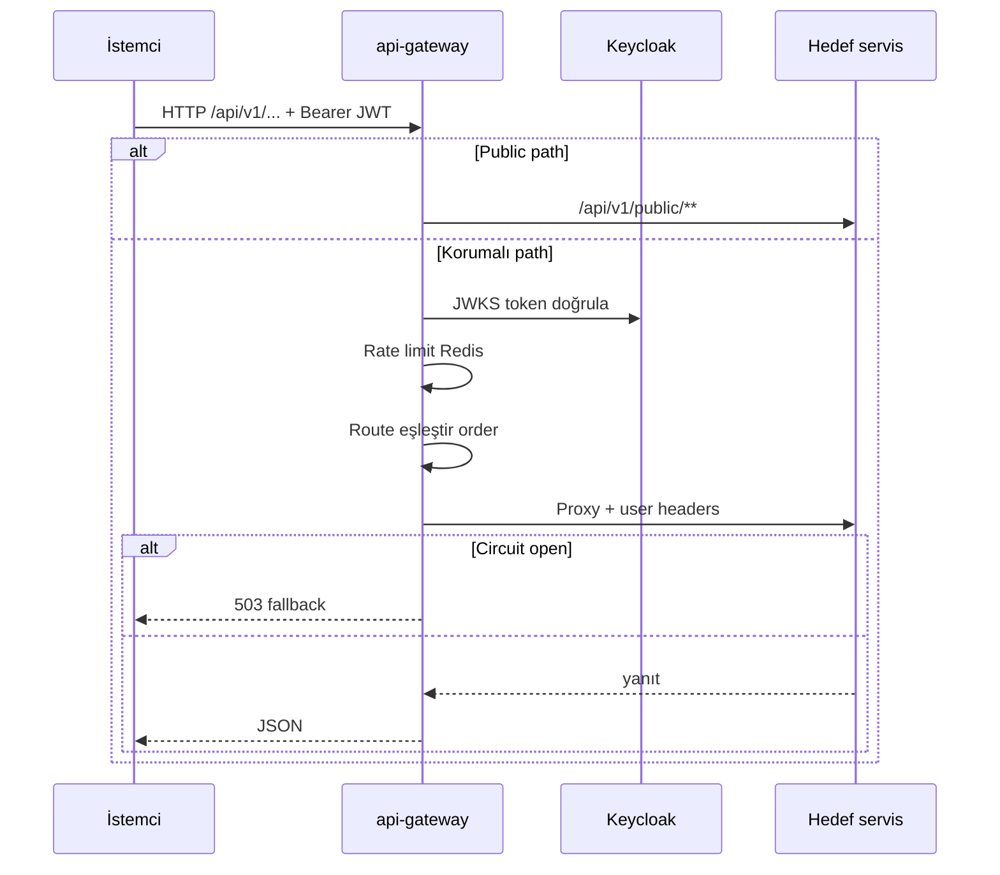
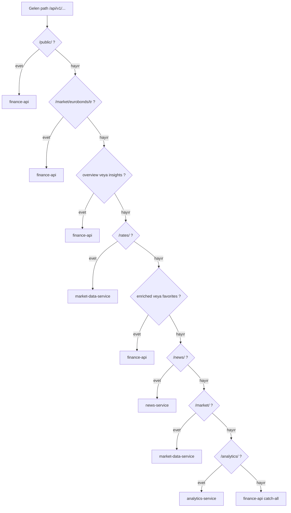
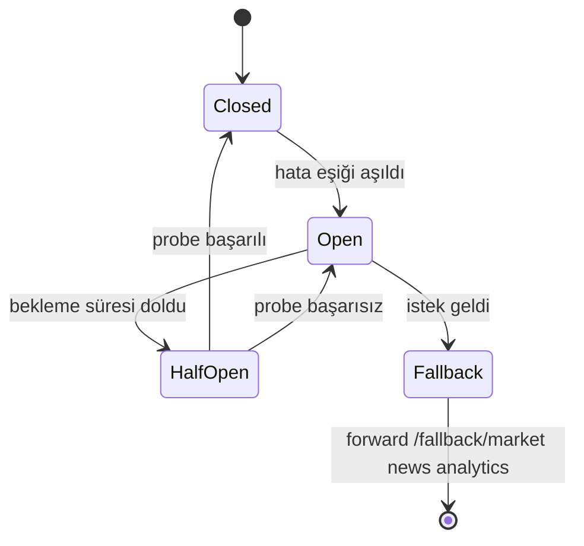
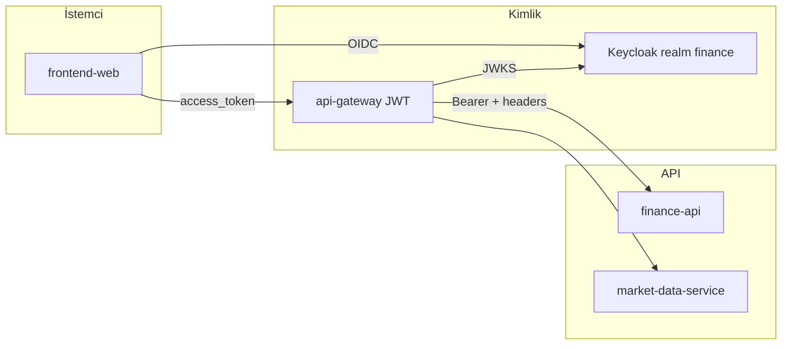
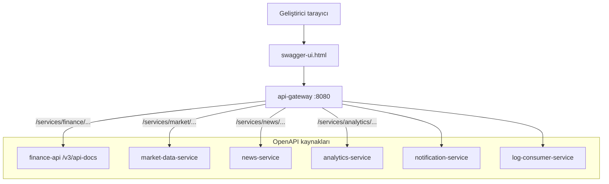
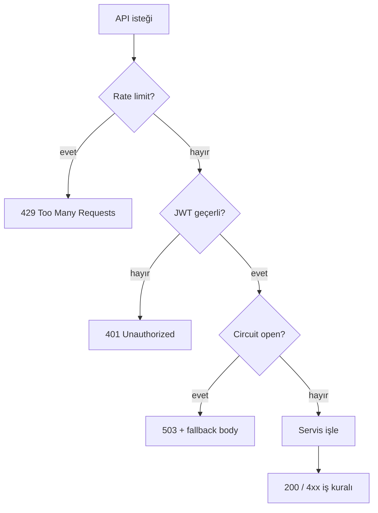

# API

Die externe HTTP-Schnittstelle wird über **api-gateway** unter **`/api/v1/**`** bereitgestellt. Service-Interaktionen: [services.md](services.md). Umgebung: [configuration.md](configuration.md).

---

## Anfrage-Lebenszyklus



---

## Grundregeln

- Externe Schnittstelle: **`/api/v1/**`**
- Identität: `Authorization: Bearer <access_token>` (Keycloak-Realm `finance`)
- Lokaler Docker-Einstiegspunkt: **http://localhost:8080** (api-gateway)
- Öffentliche Endpunkte: `/api/v1/public/**` (Registrierung, Login-Abschluss usw.)

## Gateway-Routing

Routes mit niedrigerem **order**-Wert werden zuerst abgeglichen (`GatewayRoutesConfig`).

### Route-Entscheidungsbaum



### Routing-Tabelle

| Pfadpräfix | Zielservice |
|------------|--------------|
| `/api/v1/public/**` | finance-api |
| `/api/v1/market/overview`, `/api/v1/market/insights` | finance-api |
| `/api/v1/market/eurobonds/tr/**` | finance-api |
| `/api/v1/market/**` | market-data-service |
| `/api/v1/rates/**` | market-data-service |
| `/api/v1/news/enriched/**`, `/api/v1/news/favorites/**` | finance-api |
| `/api/v1/news/**` | news-service |
| `/api/v1/analytics/**` | analytics-service |
| `/api/v1/**`, `/health` | finance-api (Rate Limit + Circuit Breaker) |

Circuit-Breaker-Fallback: `/fallback/market`, `/fallback/news`, `/fallback/analytics`.

### Circuit-Breaker-Ablauf



| Circuit | Fallback path | Downstream |
|---------|---------------|------------|
| `marketCircuitBreaker` | `/fallback/market` | market-data-service |
| `newsCircuitBreaker` | `/fallback/news` | news-service |
| `analyticsCircuitBreaker` | `/fallback/analytics` | analytics-service |
| `financeCircuitBreaker` | — | finance-api (rate limit) |

## Authentifizierungsablauf



Öffentliche Endpunkte (`/api/v1/public/**`) können je nach Route unterschiedliche JWT-Anforderungen am Gateway haben; Registrierungs- und Login-Endpunkte liegen in finance-api.

## Entwicklungs-Proxy (Frontend)

| Modus | Env | Verhalten |
|-----|-----|----------|
| Einzelner Proxy (Docker) | `VITE_DEV_PROXY_GATEWAY=true` | Gesamtes `/api` → Gateway |
| Standard lokal | — | `/api` → finance-api (8080); Markt über BFF |
| Direkt MDS | `VITE_DEV_MARKET_DIRECT_TO_MDS=true` | `/api/v1/market` → 8082 (Debug) |

## OpenAPI / Swagger

### Swagger-Zusammenführung



- UI (über Gateway): http://localhost:8080/swagger-ui.html
- Zusammengeführte Dokumente: `/services/{finance|market|news|analytics|notification|logs}/v3/api-docs`
- Jeder Service nutzt springdoc mit eigener `application-openapi.yml`

Im Gateway-Testprofil können die Routes abweichen (`TestGatewayRoutesConfig`).

## Beispielanfragen

```http
GET /api/v1/market/instruments?assetClass=STOCK
Authorization: Bearer eyJ...
```

```http
GET /api/v1/public/health
```

Öffentliche Registrierungs- und Login-Endpunkte befinden sich unter `PublicRegistrationController` und `PublicAuthenticationController` in finance-api; die vollständige Liste finden Sie in Swagger.

## Fehler und Limits

- Gateway-Redis-Rate-Limiter: pro Benutzer (`userIdKeyResolver`)
- 429 / 503: Rate Limit oder offener Circuit Breaker
- `finance-api` im Dev-Profil `app.expose-internal-errors: true` — in Produktion deaktivieren

## log-consumer und notification HTTP

In der Gateway-Konfiguration sind Base-URIs für `log-consumer` und `notification` definiert; der primäre Portal-Traffic läuft unter `/api/v1` über finance / market / news / analytics. Die REST-Oberfläche dieser Services dient überwiegend internen/diagnostischen Zwecken; OpenAPI-Pfade werden am Gateway unter `/services/notification/...` und `/services/logs/...` bereitgestellt.

## Versionierung

Derzeit ist nur `v1` veröffentlicht. Bei Breaking Changes wird ein neues Präfix (`/api/v2`) und eine Gateway-Route erwartet.

---

## Fehlercodes (Übersicht)



---

## Verwandte Dokumente

| Dokument | Inhalt |
|-------|--------|
| [services/api-gateway.md](services/api-gateway.md) | Gateway-Details |
| [configuration.md](configuration.md) | JWT, CORS env |
| [development.md](development.md) | Vite-Proxy |
