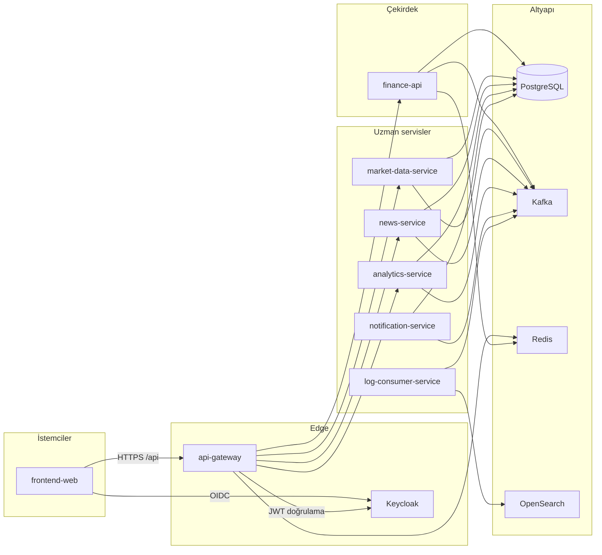
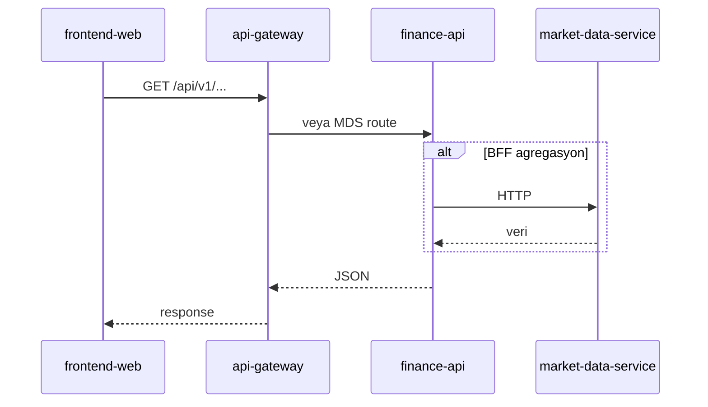
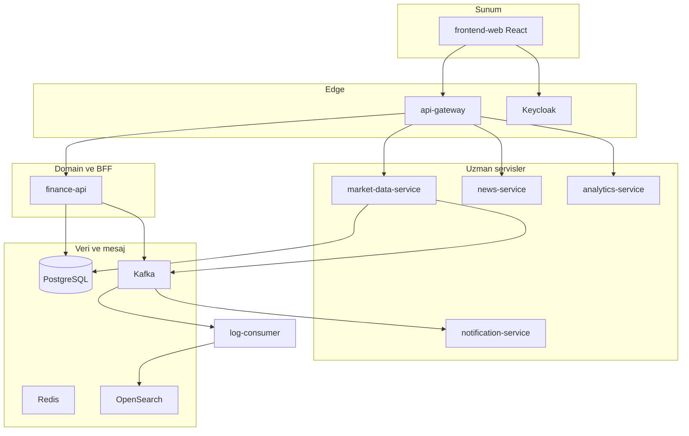
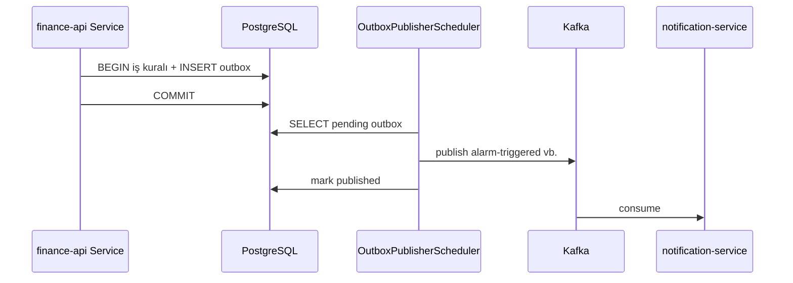
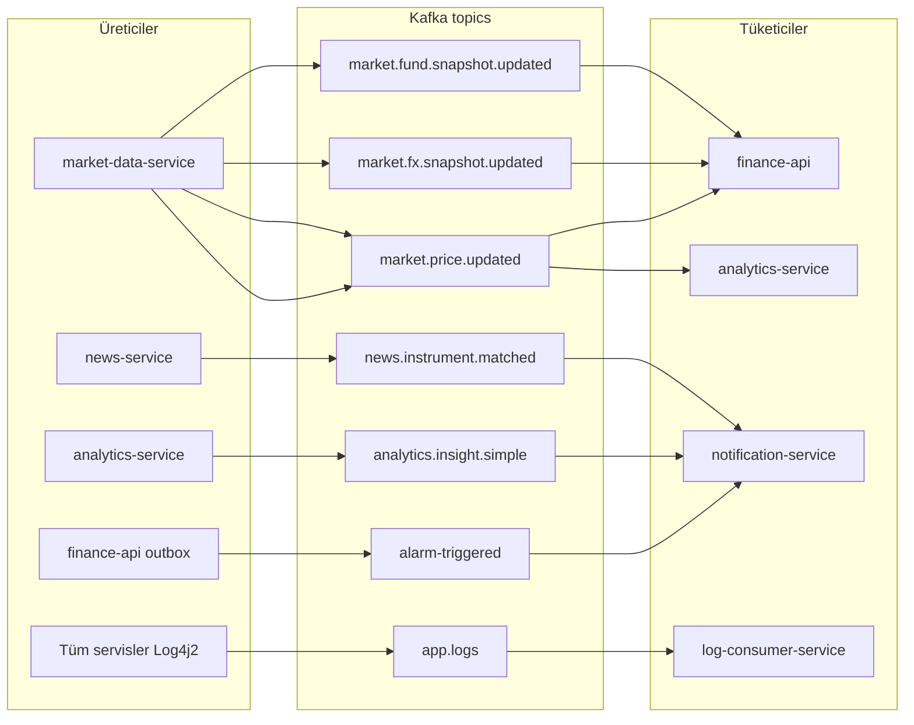
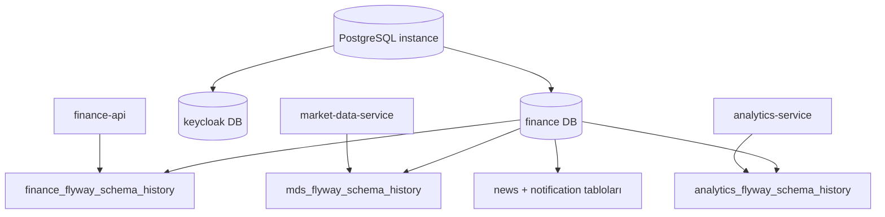
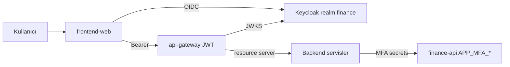

# Architektur

## Überblick

Die Plattform besteht aus einer einzigen HTTP-Einstiegsschicht (**edge**) (`api-gateway`), der **Domain**-Schicht `finance-api` (Portal-BFF und Geschäftsregeln) und **spezialisierten** Microservices. Ereignisse fließen überwiegend über **Kafka**; persistente Daten liegen in **PostgreSQL** (Flyway-Schema/Tabelle pro Service).

## Anfragepfad (typisch)

1. Der Browser ruft über `frontend-web` `/api/v1/...` auf (Vite-Dev-Proxy oder in Docker zum Gateway weitergeleitet).
2. **api-gateway** validiert das JWT mit Keycloak JWKS und leitet den Benutzerkontext an Downstream-Header weiter.
3. Je nach Pfadpräfix wird der Zielservice gewählt (spezielle Routes vor der allgemeinen `finance-api`-Route — siehe [api.md](api.md)).
4. `finance-api` proxyt bei Bedarf per HTTP zu `market-data-service` oder konsumiert Kafka.

## Schichtenarchitektur

Detaillierte Service-Diagramme: [services.md](services.md) · Service-Handbücher: [services/README.md](services/README.md).

## Service-Verantwortlichkeiten

| Service | Rolle | Detailliertes Handbuch |
|--------|-----|----------------|
| **api-gateway** | TLS-Terminierung (im Deployment), CORS, Rate Limiting (Redis), Circuit Breaker, Route-Aggregation | [services/api-gateway.md](services/api-gateway.md) |
| **finance-api** | Benutzer, Portfolio, Alarme, Chart-Speicherungen, Admin-KPI, Registrierung/MFA, News-Anreicherungs-Proxy, Marktübersicht | [services/finance-api.md](services/finance-api.md) |
| **market-data-service** | Instrumentenkatalog, Live-/Historienpreise, TCMB EVDS (Zinsen, Anleihen, TL-Einlagen), Provider-Integrationen | [services/market-data-service.md](services/market-data-service.md) |
| **news-service** | RSS-Abruf, Speicherung, Übersetzung, Roh-News-API | [services/news-service.md](services/news-service.md) |
| **analytics-service** | Konsumiert `market.price.updated`, RSI u. a. Indikatoren, Insight-Erzeugung | [services/analytics-service.md](services/analytics-service.md) |
| **notification-service** | Alarm-E-Mails, Login-Warnung, Watchlist, Insight- und News-Matching | [services/notification-service.md](services/notification-service.md) |
| **log-consumer-service** | `app.logs` Topic → OpenSearch-Indizierung | [services/log-consumer-service.md](services/log-consumer-service.md) |
| **frontend-web** | SPA, Keycloak-Login, Portal-Seiten | [services/frontend-web.md](services/frontend-web.md) |

Alle Service-Handbücher: [services/README.md](services/README.md).

## Ereignisgesteuerte Abläufe (Übersicht)

| Topic | Produzent (Beisp.) | Konsument (Beisp.) |
|-------|----------------|----------------|
| `market.price.updated` | market-data-service | analytics-service, finance-api |
| `market.fx.snapshot.updated` | market-data-service | finance-api, analytics-service |
| `market.fund.snapshot.updated` | market-data-service | finance-api |
| `alarm-triggered` | finance-api (outbox) | notification-service |
| `watchlist.item.added` / `removed` | finance-api (outbox) | notification-service |
| `login-security.alert` | finance-api (outbox) | notification-service |
| `transaction-executed` | finance-api (outbox) | (domain) |
| `analytics.insight.simple` | analytics-service | notification-service |
| `news.instrument.matched` | news-service | notification-service |
| `app.logs` | Alle Spring-Services (Log4j2) | log-consumer-service |

`finance-api` veröffentlicht kritische Domain-Ereignisse per **Transactional Outbox** nach Kafka (`OutboxPublisherScheduler`).

### Transactional-Outbox-Muster

### Kafka-Topic-Karte (visuell)

## Daten und Schema

- Eine PostgreSQL-Instanz (`finance`-Datenbank); separate `keycloak`-DB für Keycloak ([`Docker/postgres/init`](../../Docker/postgres/init)).
- Flyway-Tabellennamen sind servicespezifisch (z. B. `finance_flyway_schema_history`, `mds_flyway_schema_history`, `analytics_flyway_schema_history`).
- Lokales `market-data-service` **dev**-Profil kann standardmäßig In-Memory-H2 nutzen; Docker/Produktion verwendet PostgreSQL.

## Datenpersistenz

## Sicherheit

- **Keycloak**-Realm: `finance`, Public Client: `finance-gateway` (SPA), Confidential: `finance-portal` (Direct Grant / Backend).
- Gateway und Services als **OAuth2 Resource Server** (JWT).
- In der Entwicklung kann headerbasierte Benutzerauflösung mit `APP_SECURITY_ALLOW_HEADER_USER_FALLBACK` aktiviert werden; in Produktion deaktivieren.
- Portal-MFA (TOTP), vertrauenswürdiges Gerät-Cookie und Registrierungs-E-Mail-Verifizierung liegen in `finance-api`.

## Beobachtbarkeit

Metriken: Spring Actuator + Prometheus Scrape. Traces: OTLP → Jaeger. Logs: JSON → Kafka `app.logs` → OpenSearch. Details: [observability.md](observability.md).

## Deployment-Hinweis

Die Produktionstopologie ist in diesem Repository nicht definiert; Docker Compose dient der Entwicklungs-/Demo-Umgebung. Das Gateway benötigt ein `JWT_ISSUER_URI`, das mit dem vom Browser erreichbaren Issuer übereinstimmt (`localhost:8085`).
