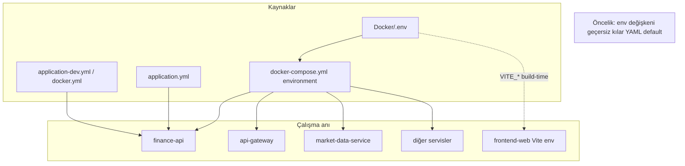
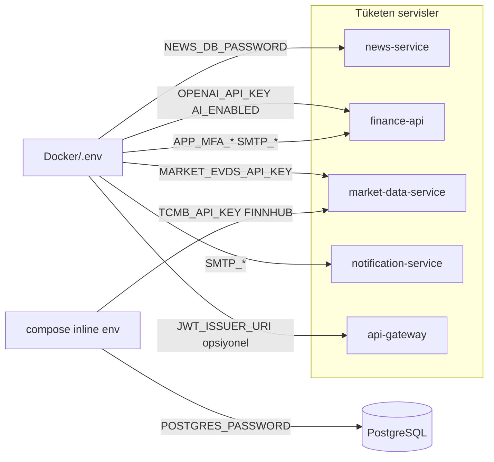
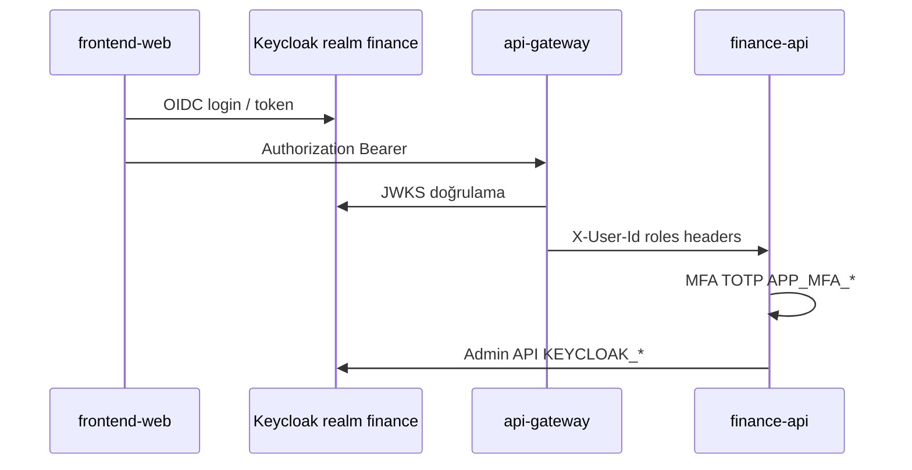
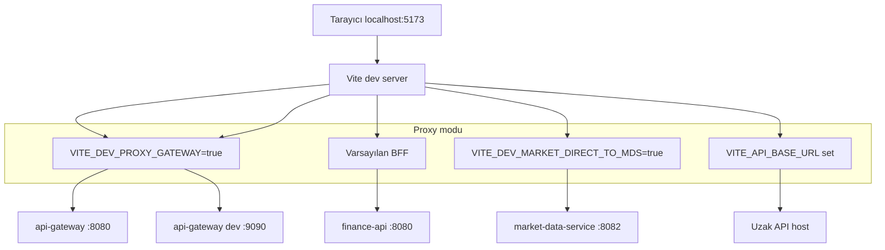
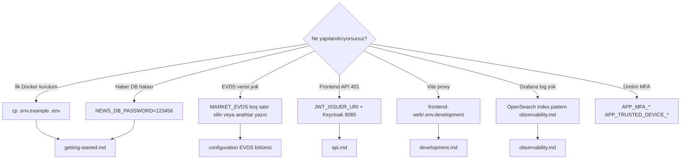

# Konfiguration

Umgebungsvariablen, Spring-`application*.yml`-Dateien und Docker Compose legen gemeinsam das Plattformverhalten fest. Service-Interaktionen: [services.md](services.md). Entwicklungsmodi: [development.md](development.md).

---

## Konfigurationsschichten



| Schicht | Ort | Wann ändern? |
|--------|-------|------------------|
| Compose feste env | `Docker/docker-compose.yml` | Demo-Schlüssel, Profilliste, interne Hostnamen |
| `.env` | `Docker/.env` | Geheimnisse / umgebungsspezifische Werte (SMTP, OpenAI, EVDS) |
| Spring-Profil | `application-{profile}.yml` | dev / docker / kafka / cache-redis |
| Frontend | `frontend-web/.env.development` | Vite-Proxy-Ziel |

---

## `.env` → Service-Verteilung



---

## Docker-Umgebungsdatei

Vorlage: [`Docker/.env.example`](../../Docker/.env.example)

Verwendung:

```bash
cd Docker
cp .env.example .env
```

Compose übergibt per `env_file: .env` an `finance-api` und andere Services.

## Erforderliche / kritische Variablen

| Variable | Service | Beschreibung |
|----------|--------|----------|
| `NEWS_DB_PASSWORD` | news-service | In Compose erforderlich (`?`-Syntax). In der `.env.example`-Kopie ist `123456` voreingestellt; muss mit PostgreSQL `POSTGRES_PASSWORD` übereinstimmen |
| `JWT_ISSUER_URI` | api-gateway | Browser-Issuer: `http://localhost:8085/realms/finance` |
| `KAFKA_BOOTSTRAP_SERVERS` | Alle Kafka-Nutzer | Docker: `kafka:9092`, lokal: `localhost:9092` |

**Demo-Hinweis:** `TCMB_API_KEY` und `FINNHUB_API_KEY` sind derzeit in `docker-compose.yml` definiert; der Stack startet ohne Eintrag in `.env`.

## Marktdaten (TCMB / EVDS)

| Variable | Hinweis |
|----------|-----|
| `TCMB_API_KEY` | Compose-Standard-Demo-Schlüssel; in Produktion eigenen Schlüssel verwenden |
| `MARKET_EVDS_API_KEY` | **Keine leere Zeile schreiben** (`MARKET_EVDS_API_KEY=`) — Spring sieht einen leeren String, Fallback-Schlüssel greift nicht |
| `MARKET_EVDS_BASE_URL` | Standard EVDS3 externe API |
| `PROVIDERS_FINNHUB_ENABLED` / `FINNHUB_API_KEY` | NASDAQ und Finnhub-Historie |
| `MARKET_HISTORY_BACKFILL_*` | Historische Preis-Auffüllung beim ersten Start |

Ausführliche Kommentare: türkische Zeilen in `.env.example`.

## Sicherheit und Identität



| Variable | Beschreibung |
|----------|----------|
| `APP_MFA_ENCRYPTION_SECRET` | TOTP-Secret-Verschlüsselung |
| `APP_TRUSTED_DEVICE_SIGNING_SECRET` | Signatur des vertrauenswürdigen Gerät-Cookies |
| `APP_SECURITY_ALLOW_HEADER_USER_FALLBACK` | Dev: `true`; Prod: `false` |
| `KEYCLOAK_PORTAL_CLIENT_SECRET` | `finance-portal`-Client (`finance-portal-dev-secret` Demo) |

Keycloak-Realm-Import: [`Docker/keycloak/realm-finance.json`](../../Docker/keycloak/realm-finance.json).

## KI (optional)

| Variable | Beschreibung |
|----------|----------|
| `AI_ENABLED` | Admin-Informationskarten-KI |
| `OPENAI_API_KEY` | Nicht ins Repository committen |
| `OPENAI_MODEL_ADMIN_CONTENT` | Standard `gpt-4.1-mini` |

## E-Mail

| Variable | Service |
|----------|--------|
| `SPRING_MAIL_*` | finance-api Registrierungsverifizierung |
| `SMTP_USERNAME`, `SMTP_PASSWORD`, `NOTIFICATION_MAIL_FROM` | notification-service Alarme |

Docker-Demo enthält Gmail-App-Passwort — **nicht in Produktion verwenden**.

## Frontend

### Vite-Proxy-Modi (visuell)



[`frontend-web/.env.example`](../../frontend-web/.env.example):

| Variable | Beschreibung |
|----------|----------|
| `VITE_PROXY_TARGET` | API-Ziel (Gateway oder finance-api) |
| `VITE_DEV_PROXY_GATEWAY` | `true` → gesamtes `/api` an ein Ziel |
| `VITE_DEV_MARKET_DIRECT_TO_MDS` | Debug: Markt direkt an MDS |
| `VITE_API_BASE_URL` | Proxy-Bypass (volle URL) |

## Profil-Avatare

| Variable | Standard |
|----------|------------|
| `PROFILE_AVATAR_STORAGE_ROOT` | Lokal: `../../photos`, Docker: `/photos` Volume |

Struktur: `photos/{userId}/avatar.jpg`.

## OpenSearch

| Variable | Standard (Compose) |
|----------|----------------------|
| `OPENSEARCH_USERNAME` / `PASSWORD` | `admin` / `123456789` |
| `OPENSEARCH_INDEX_PREFIX` | `application-logs` |

Dashboards Ersteinrichtung: Index Pattern `application-logs-*`, Zeitfeld `@timestamp` ([observability.md](observability.md)).

## CORS

Gateway: `GATEWAY_CORS_ALLOWED_ORIGINS` (Standard `http://localhost:5173`).

Beim Hinzufügen eines neuen Frontend-Origins müssen Gateway und Keycloak `redirectUris` / `webOrigins` gemeinsam aktualisiert werden.

---

## Umgebungsvariable → Datei Kurzreferenz



---

## Verwandte Dokumente

| Dokument | Inhalt |
|-------|--------|
| [getting-started.md](getting-started.md) | `.env`-Einrichtungsschritte |
| [development.md](development.md) | Lokale Profil-Overrides |
| [observability.md](observability.md) | OpenSearch, Prometheus env |
| [services.md](services.md) | Service-Port- und Interaktionsdiagramme |
