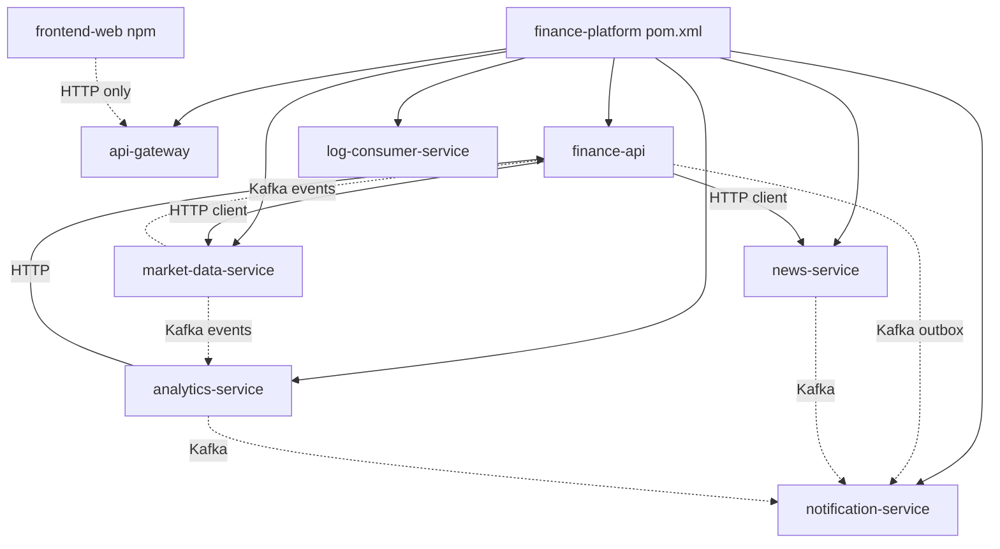
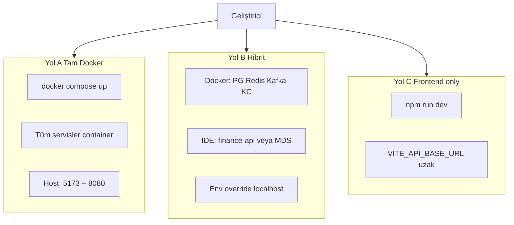
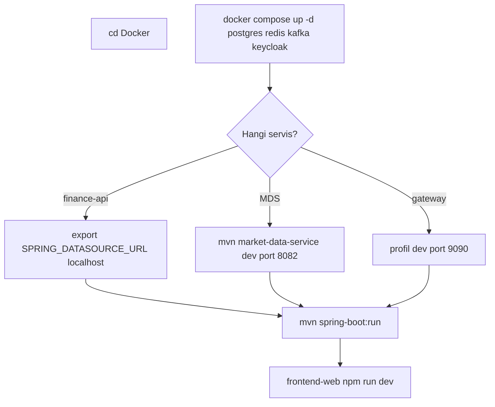
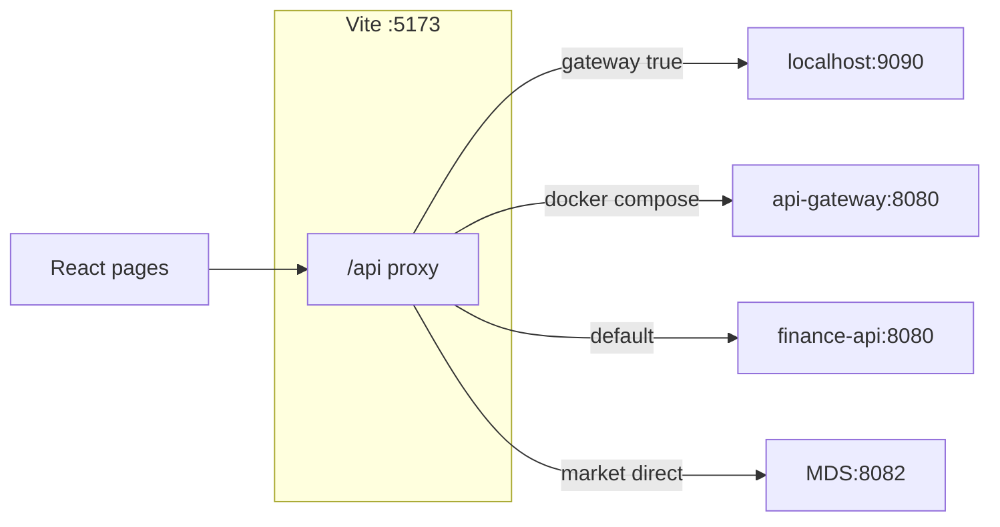
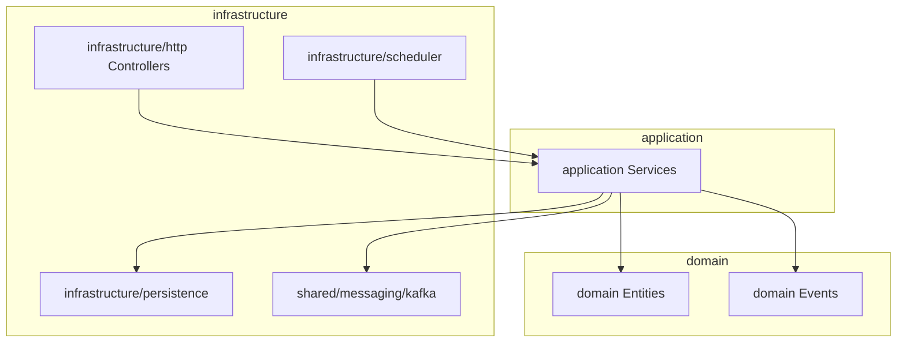
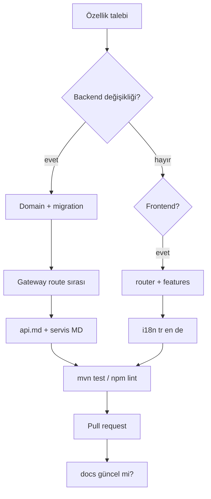

# Entwicklung

Nutzen Sie diesen Leitfaden für den täglichen Entwicklungsablauf, Build-/Test-Befehle und die Code-Organisation. Ersteinrichtung: [getting-started.md](getting-started.md). Architektonischer Kontext: [architecture.md](architecture.md).

---

## Monorepo-Übersicht

Parent POM: `com.company:finance-platform:1.0.0-SNAPSHOT` — Java **21**, Spring Boot **3.2.x**, Spring Cloud Gateway.

| Modul | Rolle |
|-------|-------|
| `finance-api` | Portal BFF — Portfolio, Auth, MFA, Admin, Infokarten, Profil |
| `api-gateway` | Einziger API-Einstieg, JWT, Rate Limit, Swagger-Aggregation |
| `market-data-service` | Marktkatalog, EVDS, Scheduler, Preisveröffentlichung |
| `analytics-service` | Technische Indikatoren, Insight |
| `news-service` | RSS-Ingestion, News-API |
| `notification-service` | Kafka → E-Mail |
| `log-consumer-service` | `app.logs` → OpenSearch |
| `frontend-web` | React 19 + Vite + TypeScript SPA |

Port-Übersicht: [services.md](services.md). Detaillierte Abläufe und Diagramme pro Service: [services/README.md](services/README.md) (Vorlage für neuen Service: [services/_template.md](services/_template.md)).

### Monorepo-Modulabhängigkeiten



---

## Lokale Entwicklungsmodi

| Modus | Wann? | Leitfaden |
|-------|-------|-----------|
| Vollständiges Docker | Stack unverändert ausführen | [getting-started.md — Yol A](getting-started.md#yol-a--tam-stack-docker-compose) |
| Hybrid | Einzelnen Service aus der IDE debuggen | [getting-started.md — Yol B](getting-started.md#yol-b--hibrit-altyapı-docker-uygulama-yerel) |
| Nur Frontend | Remote / Staging-API | [getting-started.md — Yol C](getting-started.md#yol-c--sadece-frontend--uzak-api) |

### Modusvergleich



### Hybrid-Setup-Ablauf



**Hybrid-Tipp:** In `finance-api` ist der JDBC-Host in `application-dev.yml` als `postgres` definiert (Docker-Netzwerk). Beim Start vom Host überschreiben:

```bash
export SPRING_DATASOURCE_URL=jdbc:postgresql://localhost:5432/finance
export JWT_ISSUER_URI=http://localhost:8085/realms/finance
export JWT_JWK_SET_URI=http://localhost:8085/realms/finance/protocol/openid-connect/certs
export KAFKA_BOOTSTRAP_SERVERS=localhost:9092
export CLIENTS_MARKET_DATA_BASE_URL=http://localhost:8082
```

Windows (PowerShell): `$env:SPRING_DATASOURCE_URL="jdbc:postgresql://localhost:5432/finance"` usw.

---

## Maven

Vom Repo-Root:

```bash
# Alle Module — Build + Test
mvn clean verify

# Einzelnes Modul (mit Abhängigkeiten)
mvn -pl finance-api -am test
mvn -pl market-data-service -am package
mvn -pl api-gateway -am package
mvn -pl news-service -am test
mvn -pl analytics-service -am test
mvn -pl notification-service -am test
mvn -pl log-consumer-service -am test
```

Service direkt starten:

```bash
mvn -pl finance-api -am spring-boot:run -Dspring-boot.run.profiles=dev,kafka
mvn -pl market-data-service -am spring-boot:run -Dspring-boot.run.profiles=dev
mvn -pl api-gateway -am spring-boot:run -Dspring-boot.run.profiles=dev
```

Bei IDE-Nutzung Main-Klasse mit denselben Profilen starten; Umgebungsvariablen in der Run Configuration setzen.

---

## Spring-Profile

| Service | Lokal (IDE) | Docker Compose |
|---------|-------------|----------------|
| `finance-api` | `dev`, `kafka` | `docker`, `kafka`, `cache-redis` |
| `api-gateway` | `dev` → Host **9090** | `docker` → **8080** |
| `market-data-service` | `dev` → H2 In-Memory, Port **8082** | `docker` → PostgreSQL |
| `analytics-service` | Standard → PostgreSQL `localhost:5432` | `docker` |
| `news-service` | Standard → Port **8082** | `docker` |
| `notification-service` | Standard → Port **8086** | `docker` |
| `log-consumer-service` | Standard → Port **8087** | `docker` |

**Hinweise**

- `cache-redis`: Redis-basierter Instrument-Preis-Cache in `finance-api`; in Docker aktiv.
- `market-data-service` **dev**-Profil nutzt H2; für echtes EVDS/Finnhub `application-dev.yml` und API-Keys konfigurieren oder `docker`-Profil + PostgreSQL verwenden.
- **`news-service` und `market-data-service` nutzen auf dem Host beide 8082** — nicht gleichzeitig auf derselben Maschine starten. Im Docker-Netzwerk werden sie per Hostname getrennt.
- Lokales **api-gateway dev (9090)** und Docker **Prometheus (9090)** kollidieren; nicht gleichzeitig auf dem Host starten.

Profildateien: `{modül}/src/main/resources/application*.yml`. Umgebungsvariablen überschreiben via `${VAR:default}` — vollständige Liste: [configuration.md](configuration.md).

---

## Frontend-Entwicklung

```bash
cd frontend-web
cp .env.example .env.development   # Windows: Copy-Item .env.example .env.development
npm install
npm run dev
```

| Befehl | Beschreibung |
|--------|--------------|
| `npm run dev` | Vite Dev Server — http://localhost:5173 |
| `npm run build` | `tsc -b` + Production-Bundle |
| `npm run lint` | ESLint |
| `npm run preview` | Vorschau nach dem Build |

### Vite-Proxy-Modi



| Modus | Umgebungsvariable | Verhalten |
|-------|-------------------|-----------|
| Docker (Standard-Compose) | `VITE_PROXY_TARGET=http://api-gateway:8080` | Alle `/api` → Gateway |
| Lokales Gateway | `VITE_DEV_PROXY_GATEWAY=true`, `VITE_PROXY_TARGET=http://localhost:9090` | Alle `/api` → Gateway dev |
| Lokales BFF | (Standard) | `/api` → `finance-api:8080` |
| Direkt MDS (Debug) | `VITE_DEV_MARKET_DIRECT_TO_MDS=true`, `VITE_MARKET_PROXY_TARGET=http://localhost:8082` | `/api/v1/market` → MDS |

Details: [api.md — Geliştirme proxy](api.md#geliştirme-proxy-frontend).

### Verzeichnisstruktur

```
frontend-web/src/
├── app/
│   ├── router/          # React Router, Auth Guard, Route-Definitionen
│   └── store/           # Zustand (z. B. Portfolio-Store)
├── pages/               # Seitenkomponenten (markets, analysis, admin, profil, …)
├── features/            # Domain-Hooks, API-Clients (admin, profile, markets, …)
├── shared/              # Layout, UI, i18n, Theme, gemeinsame Hooks
├── services/            # Legacy / gemeinsame HTTP-Hilfsfunktionen
└── data/                # Feste Portal-Seitendefinitionen
```

- **i18n:** `i18next` — `shared/i18n/locales/{tr,en,de}.json`
- **State:** `zustand` — unter `features/` und `app/store/`
- **Charts:** `lightweight-charts`, Analyse-Seite `pages/analysis/chart/`

**Sitzung erforderlich:** Portfolio, Analyse, News, Festgeld, Profil, Alarme, Dashboard. **Öffentlich:** Landing, Märkte, Bankkurse, Finanzkompetenz. **Admin:** `/admin`, Infokarten-Verwaltung.

---

## Backend-Code-Organisation

### finance-api — Domain-Module

Jeder Bounded Context ist in seinem eigenen Paket geschichtet:

| Paket | Beispiel-Verantwortung |
|-------|------------------------|
| `portfolio` | Portfolio, Transaktionen, Ziele, externes Portfolio |
| `watchlist` | Watchlist |
| `alarm` | Preisalarme |
| `chart` | Chart-Zeichnungsdatensätze |
| `registration` / `auth` / `mfa` | Registrierung, Login, TOTP, vertrauenswürdiges Gerät |
| `profile` | Profil, Avatar |
| `infocards` / `admin` | Infokarten, Admin-KPI |
| `market` | Overview, Eurobond-Proxy |
| `news` | News-Anreicherung / Favoriten |
| `outbox` | Transactional Outbox → Kafka |
| `shared` | Security, Cache, Messaging, Web |

Schicht-Standard:

| Schicht | Ort |
|---------|-----|
| Domain | `{modül}/domain/` |
| Application | `{modül}/application/` |
| HTTP | `{modül}/infrastructure/http/` + `dto/` |
| Persistence | `{modül}/infrastructure/persistence/` |
| Scheduler | `{modül}/infrastructure/scheduler/` |
| Messaging | `shared/messaging/kafka/` |

Neue REST-Endpunkte können die **api-gateway-Routenreihenfolge** beeinflussen; bei Änderungen [api.md](api.md) und `GatewayRoutesConfig` gemeinsam aktualisieren.

### finance-api Schichtdiagramm



### Andere Services

Flachere Paketstruktur; jeder Service hat sein eigenes Flyway-Migrationsset. OpenAPI: `application-openapi.yml` + springdoc.

---

## Flyway-Migration

| Service | Migrationspfad | Flyway-Tabellenname |
|---------|----------------|---------------------|
| finance-api | `finance-api/src/main/resources/db/migration/V*.sql` | `finance_flyway_schema_history` |
| market-data-service | `market-data-service/.../db/migration/` | `mds_flyway_schema_history` |
| analytics-service | `analytics-service/.../db/migration/` | `analytics_flyway_schema_history` |
| news-service | `news-service/.../db/migration/` | (gemäß Service-Konfiguration) |
| notification-service | `notification-service/.../db/migration/` | — |

**Regeln**

- Neuer Migrationsdateiname: `V{sıra}__açıklama.sql` — Sequenznummer muss eindeutig und aufsteigend sein.
- Irreversiblem DDL (DROP COLUMN, destruktives UPDATE) ausweichen; in Production erfordert Flyway repair manuellen Eingriff.
- Seed-Migrationen enthalten Demo-Daten; in Production separat bewerten.

### Flyway-Workflow

```mermaid
flowchart LR
  DEV[Geliştirici]
  SQL[V{n}__aciklama.sql]
  GIT[Git commit]
  RUN[Servis başlat]
  FW[Flyway migrate]
  PG[(PostgreSQL)]

  DEV --> SQL --> GIT --> RUN --> FW --> PG
```

| Service | History-Tabelle |
|---------|-----------------|
| finance-api | `finance_flyway_schema_history` |
| market-data-service | `mds_flyway_schema_history` |
| analytics-service | `analytics_flyway_schema_history` |

---

## Kafka (lokal)

```bash
cd Docker
docker compose up -d kafka
```

```bash
export KAFKA_BOOTSTRAP_SERVERS=localhost:9092
```

Topics werden meist beim ersten Publish erstellt (abhängig von der Umgebungskonfiguration). Plattform-Topics:

| Topic | Producer (Beisp.) | Consumer (Beisp.) |
|-------|-------------------|-------------------|
| `market.price.updated` | market-data-service | analytics-service, finance-api |
| `market.fx.snapshot.updated` | market-data-service | finance-api |
| `alarm-triggered` | finance-api (outbox) | notification-service |
| `watchlist.item.added` / `removed` | finance-api | notification-service |
| `login-security.alert` | finance-api | notification-service |
| `app.logs` | Alle Services (Log4j2) | log-consumer-service |

Outbox-Details: [architecture.md](architecture.md).

---

## Tests

### Backend

```bash
mvn -pl finance-api test
mvn -pl market-data-service test
mvn -pl news-service test
mvn -pl analytics-service test
mvn -pl notification-service test
mvn -pl api-gateway test
```

Pro Modul kann `application-test.yml` H2 oder Testcontainers nutzen; nicht annehmen — jeweilige Test-Ressourcen des Moduls prüfen.

### Frontend

```bash
cd frontend-web
npm run lint
```

Unit-Test-Dateien liegen co-located unter `src` (z. B. `pages/analysis/chart/measure/computeMeasureStats.test.ts`, `pages/bank-rates/lib/*.test.ts`). In `package.json` ist kein separates `npm test`-Script definiert; bis ein Test-Runner hinzukommt: Lint + manuelle Verifikation.

---

## Ablauf für neue Features



## Checkliste für neue Features

Beim Hinzufügen von Backend-Endpunkten:

1. Domain + Application + HTTP-Schicht im Modul-Paket implementieren.
2. Bei Bedarf Flyway-Migration hinzufügen.
3. Gateway-Routenreihenfolge prüfen (`api-gateway/.../GatewayRoutesConfig.java`).
4. [api.md](api.md) und springdoc-Annotationen aktualisieren.
5. Bei Kafka-Event Outbox- oder direktes Producer-Pattern passend zu bestehenden Modulen wählen.

Beim Hinzufügen von Frontend-Seiten:

1. Route in `app/router/index.tsx` (und ggf. Guard) einfügen.
2. API-Aufrufe unter `features/` bündeln; direkte axios-Streuung vermeiden.
3. TR / EN / DE Übersetzungsschlüssel in `shared/i18n/locales/`-Dateien ergänzen.

---

## Nützliche Befehle

```bash
# Log eines einzelnen Services (aus Docker-Verzeichnis)
cd Docker
docker compose logs -f finance-api
docker compose logs -f market-data-service
docker compose logs -f api-gateway

# Container-Status
docker compose ps

# PostgreSQL-Shell
docker exec -it finance-postgres psql -U finance -d finance

# Bestimmten Service neu bauen
docker compose up -d --build finance-api frontend-web
```

Profilfotos: Repo-Root `photos/{userId}/` — per Docker-Volume gemountet; Inhalt nicht committen.

---

## Git und Sicherheit

- Commit-Nachrichten: **was und warum** geändert wurde, kurz in vollständigen Sätzen.
- **Nicht committen:** `.env`, echte API-Keys, `photos/`-Benutzerinhalte, persönliche Credentials.
- Demo-SMTP-/Keycloak-Passwörter in Docker Compose nur für lokale Demo; bei Fork oder geteilter Umgebung rotieren.
- In Production muss `APP_SECURITY_ALLOW_HEADER_USER_FALLBACK` deaktiviert sein ([architecture.md](architecture.md)).

---

## Verwandte Dokumente

| Thema | Dokument |
|-------|----------|
| Ersteinrichtung | [getting-started.md](getting-started.md) |
| API-Routen / Swagger | [api.md](api.md) |
| Umgebungsvariablen | [configuration.md](configuration.md) |
| Metriken, Trace, Logs | [observability.md](observability.md) |
| Service-Ports | [services.md](services.md) |
