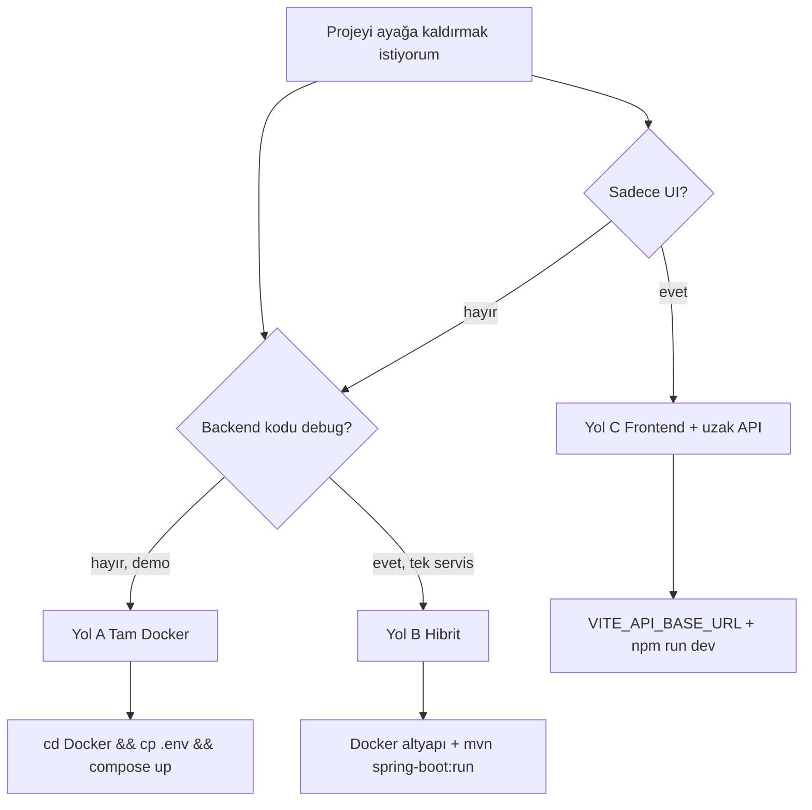
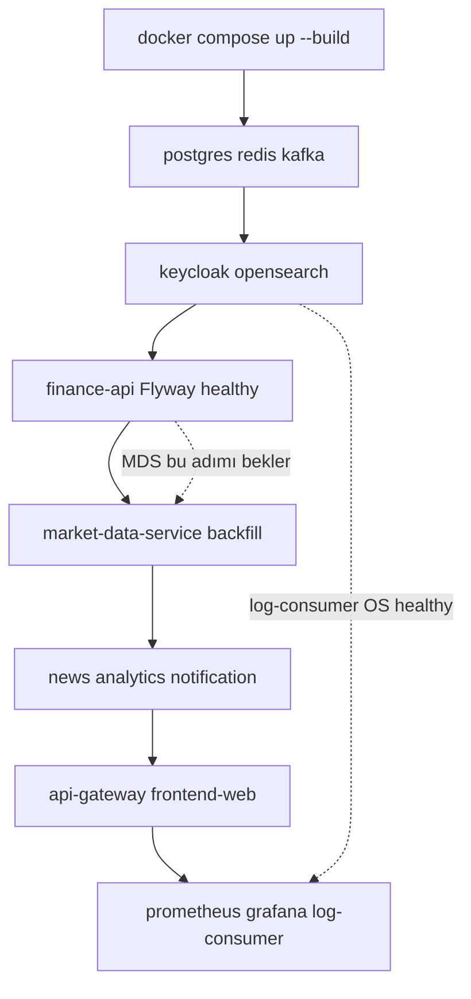
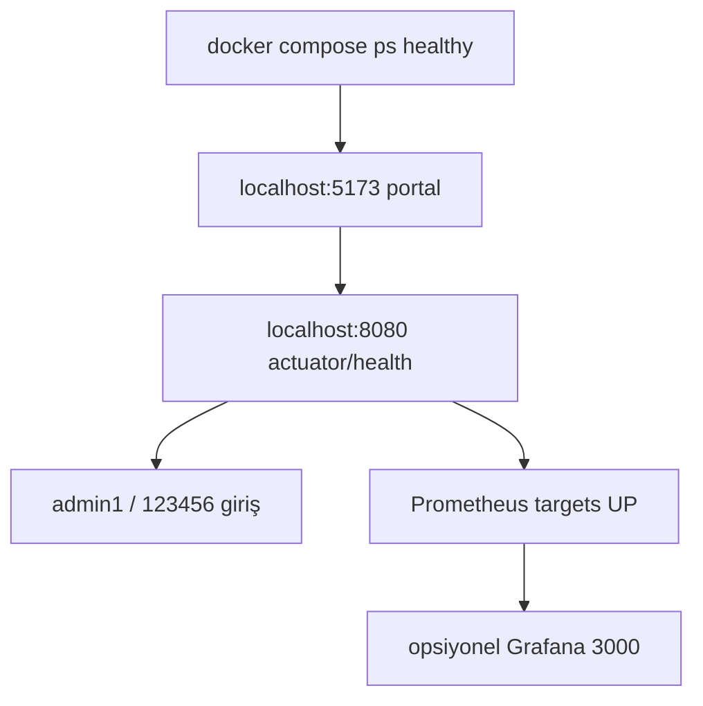

# Erste Schritte

Dieser Leitfaden hilft beim erstmaligen Start der **32 Bit Finance Platform**. Das Monorepo umfasst ein Microservice-Backend (Spring Boot), React SPA, PostgreSQL, Redis, Kafka, Keycloak und einen Observability-Stack.

| Ziel | Empfohlener Weg |
|------|-----------------|
| Demo / neuer Entwickler | [Weg A — Vollständiger Stack (Docker)](#weg-a--vollständiger-stack-docker-compose) |
| Backend-Entwicklung aus der IDE | [Weg B — Hybrid](#weg-b--hybrid-infrastruktur-docker-anwendung-lokal) |
| Nur UI, Remote-API | [Weg C — Frontend + Remote-API](#weg-c--nur-frontend--remote-api) |

Allgemeine Projektübersicht: [../README.md](../../README.md). Architektur und Portdetails: [architecture.md](architecture.md), [services.md](services.md).

### Welcher Einrichtungsweg?



---

## Voraussetzungen

| Tool | Version / Hinweise |
|------|----------------------|
| [Docker Desktop](https://www.docker.com/products/docker-desktop/) | Compose v2; **~8 GB RAM für den vollständigen Stack** |
| JDK | 21 (Hybrid / lokales Backend) |
| Maven | 3.9+ |
| Node.js | 20+ (`frontend-web`) |

Repository klonen:

```bash
git clone https://github.com/TaridaG/Toyota-32Bit-Finance-Platform.git
cd Toyota-32Bit-Finance-Platform
```

---

## Weg A — Vollständiger Stack (Docker Compose)

Startet gesamte Infrastruktur und Anwendungsservices mit einem Befehl. **Empfohlener Weg für neue Entwickler und Demos.**

### 1. Umgebungsdatei

```bash
cd Docker
cp .env.example .env
```

Windows (PowerShell):

```powershell
cd Docker
Copy-Item .env.example .env
```

Nach `cp .env.example .env` **`TCMB_API_KEY` und `FINNHUB_API_KEY` in `Docker/.env` eintragen** (keine echten Schlüssel im Repo). `NEWS_DB_PASSWORD` und `POSTGRES_PASSWORD` stehen in der Vorlage auf `123456` — synchron halten.

API-Schlüssel nur in `Docker/.env` pflegen.

### 2. Stack starten

```bash
docker compose up -d --build
```

### Docker-Startreihenfolge (Überblick)



Der erste Build kann wegen Maven-Kompilierungen einige Minuten dauern. Bei bestehender Installation nur `up --build` verwenden, um die Datenbank zu erhalten; **`docker compose down -v` löscht Volumes.**

### 3. Validierung



| Prüfung | Adresse | Erwartet |
|---------|---------|----------|
| Portal (SPA) | http://localhost:5173 | Landing / Anmeldebildschirm |
| API Gateway | http://localhost:8080 | HTTP 200 oder Weiterleitung |
| Gateway Health | http://localhost:8080/actuator/health | `{"status":"UP"}` |
| Swagger UI | http://localhost:8080/swagger-ui.html | OpenAPI-Oberfläche |
| Keycloak (Realm: `finance`) | http://localhost:8085 | OIDC-Server |
| Container-Status | `docker compose ps` | `finance-postgres`, `finance-api`, `finance-redis` **healthy** |

**Demo-Anmeldung (Portal):**

| Benutzer | Passwort | Rolle |
|----------|----------|-------|
| `user1` | `123456` | USER |
| `admin1` | `123456` | ADMIN (Admin-Panel, Infokarten) |

Keycloak-Admin-Konsole: http://localhost:8085/admin — `admin` / `admin` (Compose-Standard).

### 4. Observability und Infrastruktur

Bei laufendem Stack erreichbare Endpunkte:

| Komponente | Adresse | Anmeldedaten |
|------------|---------|--------------|
| Grafana | http://localhost:3000 | `admin` / `admin` |
| Prometheus | http://localhost:9090 | — |
| Jaeger | http://localhost:16686 | — |
| OpenSearch Dashboards | http://localhost:5601 | `admin` / `123456789` |
| OpenSearch REST | https://localhost:9200 | `admin` / `123456789` |
| PostgreSQL | `localhost:5432` | `finance` / `123456`, DB: `finance` |
| Redis | `localhost:6379` | — |
| Kafka | `localhost:9092` | — |

Für den OpenSearch-Log-Index muss beim Erstsetup ggf. einmal ein Index-Pattern `application-logs-*` angelegt werden — Details: [observability.md](observability.md).

### 5. Laufzeiten beim ersten Start

- **Flyway-Migration:** `finance-api`, `market-data-service`, `analytics-service` und `news-service` wenden beim ersten Start ihre Schemas an; einige Minuten sind normal.
- **Marktdaten-Backfill:** `market-data-service` füllt Katalog und historische Preise im Hintergrund. Die Dauer hängt von der Anzahl der Instrumente ab und kann **etwa 30 Minuten** betragen; leere Listen oder unvollständige Charts in den ersten Minuten sind normal.
- **OpenSearch:** Erster Boot ~1 Minute; `log-consumer-service` schreibt Logs, sobald der Cluster healthy ist.

Fortschritt verfolgen:

```bash
docker compose logs -f market-data-service
docker compose logs -f finance-api
```

Demo-Timer-Intervalle sind auf kostenlose externe API-Kontingente abgestimmt (TCMB EVDS, Yahoo, CoinGecko usw.). Verkürzung: [configuration.md](configuration.md).

### 6. Stoppen

```bash
cd Docker
docker compose down
```

**Ohne** `-v`, wenn Datenbank- und OpenSearch-Volumes **nicht** gelöscht werden sollen:

```bash
# ACHTUNG: Löscht alle persistenten Daten (PostgreSQL, OpenSearch, Kafka)
docker compose down -v
```

---

## Optionale `.env`-Variablen

Nach `cp .env.example .env` **`TCMB_API_KEY` und `FINNHUB_API_KEY` in `Docker/.env` setzen** (keine echten Schlüssel im Repo).

| Variable | Wann? | Hinweis |
|----------|-------|---------|
| `MARKET_EVDS_API_KEY` | Separater Schlüssel für TCMB EVDS | Ohne Angabe wird `TCMB_API_KEY` aus `.env` verwendet. **Keine leere Zeile (`KEY=`) setzen** |
| `OPENAI_API_KEY` | Admin-Infokarten-KI | `AI_ENABLED=true`; ohne Schlüssel ist KI deaktiviert |
| `SMTP_USERNAME` / `SMTP_PASSWORD` | Registrierungs- und Alarmmail | Nur in `.env`; kein Demo-Passwort im Repo |
| `APP_MFA_ENCRYPTION_SECRET` / `APP_TRUSTED_DEVICE_SIGNING_SECRET` | Produktionsumgebung | In der Demo reichen Compose-Standardwerte |

Alle Variablen: [configuration.md](configuration.md).

---

## Weg B — Hybrid (Infrastruktur Docker, Anwendung lokal)

Infrastruktur in Containern, Backend oder Frontend aus IDE / Terminal zum Debuggen.

### 1. Infrastrukturservices

```bash
cd Docker
docker compose up -d postgres redis kafka keycloak opensearch
```

PostgreSQL: `localhost:5432`, Datenbank `finance`, Benutzer / Passwort `finance` / `123456`.

### 2. finance-api

```bash
# vom Repository-Root
mvn -pl finance-api -am spring-boot:run -Dspring-boot.run.profiles=dev,kafka
```

Beispiel-Umgebungsvariablen (bash):

```bash
export JWT_ISSUER_URI=http://localhost:8085/realms/finance
export JWT_JWK_SET_URI=http://localhost:8085/realms/finance/protocol/openid-connect/certs
export KAFKA_BOOTSTRAP_SERVERS=localhost:9092
export CLIENTS_MARKET_DATA_BASE_URL=http://localhost:8082
```

Standard-HTTP-Port: **8080**.

### 3. market-data-service

```bash
mvn -pl market-data-service -am spring-boot:run -Dspring-boot.run.profiles=dev
```

Dev-Profil: Port **8082**, In-Memory-H2. Für echte EVDS-/Finnhub-Daten `application-dev.yml` und Umgebungsschlüssel konfigurieren.

> `news-service` nutzt auf dem Host ebenfalls **8082** — **nicht gleichzeitig mit market-data-service auf demselben Rechner auf 8082 starten.** Im Docker-Netz sind sie per Hostname getrennt.

### 4. api-gateway (lokal)

```bash
mvn -pl api-gateway -am spring-boot:run -Dspring-boot.run.profiles=dev
```

Dev-Profil-Port: **9090** (`application-dev.yml`).

In `frontend-web/.env.development` zum Gateway routen:

```env
VITE_PROXY_TARGET=http://localhost:9090
VITE_DEV_PROXY_GATEWAY=true
```

> Der Prometheus-Host-Port in Docker ist ebenfalls **9090**. Gateway dev und Prometheus nicht gleichzeitig auf dem Host starten, oder Prometheus-Port ändern.

Vollständige Serviceliste und Ports: [services.md](services.md).

### 5. frontend-web

```bash
cd frontend-web
cp .env.example .env.development   # Windows: Copy-Item .env.example .env.development
npm install
npm run dev
```

http://localhost:5173 — Standard-Proxy `finance-api:8080` oder mit obigen Gateway-Env-Variablen.

Weitere Backend-Module (`analytics-service`, `news-service`, `notification-service`) für den vollständigen Ablauf in Docker lassen oder pro Modul in separatem Terminal mit `spring-boot:run` starten.

---

## Weg C — Nur Frontend + Remote-API

`frontend-web/.env.development`:

```env
VITE_API_BASE_URL=https://your-api-host
```

CORS, Keycloak-Redirect-URIs und Gateway-Sicherheitseinstellungen müssen diesen Origin erlauben. Details: [api.md](api.md).

---

## Häufige Probleme

| Symptom | Mögliche Ursache | Lösung |
|---------|------------------|--------|
| 401 bei allen APIs | Abgelaufenes Token oder Issuer-Mismatch | Keycloak `8085`; Gateway `JWT_ISSUER_URI` = `http://localhost:8085/realms/finance` |
| Leere Marktliste / Charts | MDS-Backfill läuft noch | Einige Minuten warten; `docker compose logs -f market-data-service` |
| `news-service` startet ständig neu | `NEWS_DB_PASSWORD` fehlt oder falsch | `NEWS_DB_PASSWORD=123456` in `Docker/.env` (gleich wie PostgreSQL) |
| Keine EVDS-/Leitzinsdaten | Leere Zeile `MARKET_EVDS_API_KEY=` | Zeile entfernen oder gültigen Schlüssel setzen — [configuration.md](configuration.md) |
| OpenSearch-Auth-Fehler | Altes Volume, Passwort-Mismatch | Volume-Lösch-Hinweise in `.env.example` |
| Port-Konflikt (9090) | Lokales Gateway dev + Docker Prometheus | Eines stoppen oder Port ändern |
| Build dauert sehr lange | Erste Maven-Kompilierung | Normal; spätere `up`-Aufrufe nutzen Cache |

---

## Nächste Schritte

| Thema | Dokument |
|-------|----------|
| Entwicklung, Tests, Profile | [development.md](development.md) |
| Gateway-Routen und Swagger | [api.md](api.md) |
| Service-Verantwortlichkeiten | [services.md](services.md) |
| Umgebungsvariablen | [configuration.md](configuration.md) |
| Metriken, Traces, Logs | [observability.md](observability.md) |
