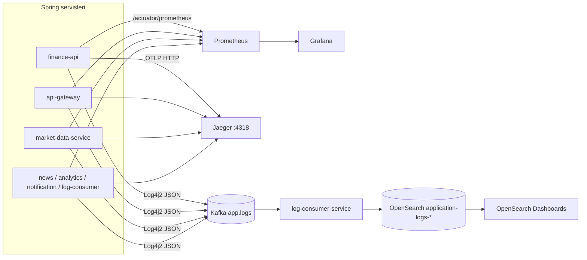
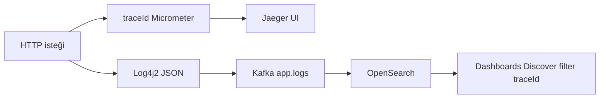
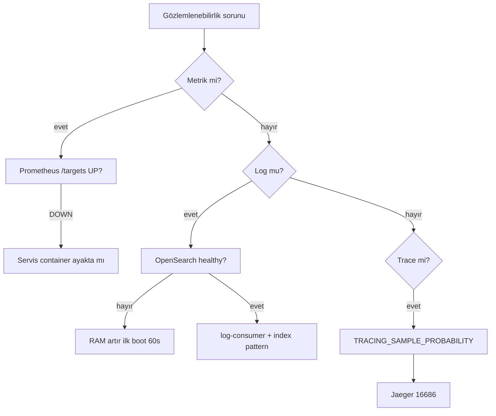

# Beobachtbarkeit

Die **32 Bit Finance Platform** bringt mit dem Docker-Compose-Stack Metriken, verteiltes Tracing und eine zentrale Log-Pipeline mit. Dieser Leitfaden gilt für Entwicklungs- und Demo-Umgebungen; die Produktionstopologie ist im Repo nicht definiert.

| Säule | Tool | Was es liefert |
|-------|------|----------------|
| **Metriken** | Prometheus + Grafana | HTTP-Latenz, Fehlerrate, Service `up`, Log-Pipeline-Metriken |
| **Trace** | Jaeger (OTLP) | Latenz über Requests hinweg, Span-Timeline |
| **Logs** | Kafka → log-consumer → OpenSearch | JSON-Log-Suche, Retention, operative Abfragen |

Architektonischer Kontext: [architecture.md](architecture.md). Umgebungsvariablen: [configuration.md](configuration.md). Ersteinrichtung: [getting-started.md](getting-started.md).

### Drei Säulen (metrics, traces, logs)

```mermaid
flowchart TB
  subgraph apps [Uygulama servisleri]
    SVC[Spring Boot servisleri]
  end

  subgraph metrics [Metrikler]
    ACT[/actuator/prometheus]
    PROM[Prometheus :9090]
    GRAF[Grafana :3000]
  end

  subgraph traces [İzler]
    OTLP[OTLP :4318]
    JAEG[Jaeger :16686]
  end

  subgraph logs [Loglar]
    KFK[app.logs]
    LCS[log-consumer]
    OS[OpenSearch]
    OSD[Dashboards :5601]
  end

  SVC --> ACT --> PROM --> GRAF
  SVC --> OTLP --> JAEG
  SVC --> KFK --> LCS --> OS --> OSD
```

---

## Komponenten und Zugriff

Wenn der Stack läuft (`cd Docker && docker compose up -d`):

| Komponente | URL | Zugangsdaten | Rolle |
|------------|-----|--------------|-------|
| **Grafana** | http://localhost:3000 | `admin` / `admin` | Haupt-Dashboard; Prometheus-Datasource automatisch |
| **Prometheus** | http://localhost:9090 | — | Scrape + PromQL; Health über `/targets` |
| **Jaeger UI** | http://localhost:16686 | — | Trace-Suche und Timeline |
| **Jaeger OTLP (HTTP)** | http://localhost:4318 | — | Span-Aufnahme-Endpunkt (`/v1/traces`) |
| **OpenSearch REST** | https://localhost:9200 | `admin` / `123456789` | Log-Index-API |
| **OpenSearch Dashboards** | http://localhost:5601 | `admin` / `123456789` | Log Discover / Such-UI |

> **Port-Konflikt:** Host **9090** kann sowohl mit Prometheus als auch mit dem lokalen `api-gateway`-**dev**-Profil kollidieren. Im vollständigen Compose liegt das Gateway auf **8080**; in der Hybrid-Entwicklung nicht beides gleichzeitig auf dem Host starten — [development.md](development.md).

In Grafana ist anonymer **Viewer**-Zugriff aktiviert (`GF_AUTH_ANONYMOUS_ENABLED=true`); zum Bearbeiten als `admin` anmelden.

---

## Gesamtfluss



---

## Metriken

### Spring Actuator

Jeder Backend-Service stellt folgende Endpunkte bereit (`management.endpoints.web.exposure.include`):

```http
GET /actuator/health
GET /actuator/prometheus
```

Beispiel über Gateway aus dem Docker-Netzwerk:

```bash
curl -s http://localhost:8080/actuator/health
```

### Prometheus Scrape

Konfiguration: [`Docker/prometheus/prometheus.yml`](../../Docker/prometheus/prometheus.yml)

| Job-Name | Ziel (Docker-Netzwerk) | Metrik-Pfad |
|----------|------------------------|-------------|
| `finance-api` | `finance-api:8080` | `/actuator/prometheus` |
| `api-gateway` | `api-gateway:8080` | `/actuator/prometheus` |
| `market-data-service` | `market-data-service:8080` | `/actuator/prometheus` |
| `analytics-service` | `analytics-service:8080` | `/actuator/prometheus` |
| `news-service` | `news-service:8082` | `/actuator/prometheus` |
| `notification-service` | `notification-service:8086` | `/actuator/prometheus` |
| `log-consumer-service` | `log-consumer-service:8087` | `/actuator/prometheus` |

Globales Scrape-Intervall: **10 Sekunden**.

### Prometheus-Scrape-Topologie

```mermaid
flowchart LR
  PROM[Prometheus :9090]

  PROM --> J1[finance-api:8080]
  PROM --> J2[api-gateway:8080]
  PROM --> J3[market-data-service:8080]
  PROM --> J4[news-service:8082]
  PROM --> J5[notification-service:8086]
  PROM --> J6[log-consumer-service:8087]
  PROM --> J7[analytics-service:8080]

  J1 --> M[/actuator/prometheus]
  J2 --> M
  J3 --> M
  J4 --> M
  J5 --> M
  J6 --> M
  J7 --> M
```

**Verifikation:** http://localhost:9090/targets — alle Jobs sollten **UP** sein.

### Grafana

Provisioning-Verzeichnis: [`Docker/grafana/provisioning`](../../Docker/grafana/provisioning)

| Datei | Inhalt |
|-------|--------|
| `datasources/prometheus.yml` | Prometheus-Datasource (`http://prometheus:9090`) |
| `dashboards/dashboards.yml` | JSON-Dashboard-Provider |
| `dashboards/json/finance-platform-overview.json` | Standard-Home-Dashboard |

Home-Dashboard (**Finance Platform — Overview**) — hervorgehobene Panels:

- HTTP-Anfragerate und durchschnittliche Antwortzeit (Service-Selektor `$job`)
- Plattformweite 5xx-Fehlerrate
- Service-`up`-Status
- Log-Pipeline: verarbeitete Kafka-Log-Events, OpenSearch-Index-Fehler, DLQ-Publish
- Dashboard-Links: Jaeger, OpenSearch Dashboards, Prometheus Targets

Standard-Home-Pfad wird in Compose via `GF_DASHBOARDS_DEFAULT_HOME_DASHBOARD_PATH` gesetzt.

---

## Verteiltes Tracing

Alle Spring-Services nutzen **Micrometer Tracing + OpenTelemetry OTLP**-Exporter.

| Einstellung | Standard | Beschreibung |
|-------------|----------|--------------|
| `management.otlp.tracing.endpoint` | `http://jaeger:4318/v1/traces` | Span-Versandadresse (Container-Netzwerk) |
| `TRACING_SAMPLE_PROBABILITY` | `0.1` | 10 % Sampling; in der Entwicklung auf `1.0` setzbar |

Jaeger all-in-one: UI **16686**, OTLP HTTP **4318** (auf Host gemappt).

**Kafka Observation:** `spring.kafka.listener.observation-enabled=true` — Consumer/Producer-Spans werden der Trace-Kette hinzugefügt.

**Log ↔ Trace-Verknüpfung:** Die Log4j2-JSON-Vorlage schreibt `traceId`- und `correlationId`-MDC-Felder (`log4j2-kafka-template.json`). Nach einem Trace in Jaeger können Sie in OpenSearch mit derselben `traceId` filtern.

---

## Log-Pipeline

### 1. Produktion (Anwendungsservices)

Backend-Services nutzen **Log4j2** (nicht Logback). In jedem Service `log4j2-spring.xml`:

- **Console:** lesbares Pattern (inkl. `traceId`, `correlationId`)
- **Kafka:** Topic `app.logs`, async append, JSON-Template-Layout

Module mit Log4j2-Konfiguration: `finance-api`, `api-gateway`, `market-data-service`, `news-service`, `analytics-service`, `notification-service`, `log-consumer-service`.

Beispiel-JSON-Felder: `@timestamp`, `level`, `message`, `logger_name`, `service`, `traceId`, `correlationId`, `stack_trace`.

Kafka Bootstrap: `KAFKA_BOOTSTRAP_SERVERS` (in Compose `kafka:9092`).

### 2. Konsum (log-consumer-service)

`log-consumer-service`:

1. Hört auf Topic `app.logs` (`LOG_CONSUMER_GROUP_ID=log-consumer-service`)
2. Parst Nachrichten; überträgt `correlationId`-Header ins MDC
3. Indiziert in OpenSearch mit Präfix **`application-logs-*`**
4. Erstellt beim Start Index-Template + **ISM-Retention-Policy** (`OpenSearchLogInfrastructureBootstrap`)

| Umgebungsvariable | Standard | Beschreibung |
|-------------------|----------|--------------|
| `APP_LOGS_TOPIC` | `app.logs` | Kafka-Topic |
| `OPENSEARCH_INDEX_PREFIX` | `application-logs` | Index-Namen-Präfix |
| `OPENSEARCH_LOG_RETENTION_DAYS` | `30` | Automatische Löschdauer via ISM |
| `OPENSEARCH_USERNAME` / `OPENSEARCH_PASSWORD` | in Compose `admin` / `123456789` | OpenSearch Security |

OpenSearch-Daten liegen im persistenten Volume: `docker_opensearch_data` (je nach Projektname `docker_opensearch_data`).

### 3. Suche (OpenSearch Dashboards)

Logs werden nicht in Grafana, sondern über **OpenSearch Dashboards** durchsucht. Erreichbar über den Link im Grafana-Home-Dashboard.

**Ersteinrichtung (einmalig):**

1. http://localhost:5601 — `admin` / `123456789`
2. **Stack Management** → **Index patterns** → **Create index pattern**
3. Pattern: `application-logs-*`
4. Time field: `@timestamp`
5. Mit **Discover** nach Service, Level, `traceId` filtern

> Benutzer `kibanaserver` ist für die Dashboards → OpenSearch-Backend-Verbindung; für Browser-Login `admin` verwenden.

**Beispiel-Discover-Abfragen:**

| Zweck | Filter |
|-------|--------|
| Einzelner Service | `service: "finance-api"` |
| Fehler | `level: "ERROR"` |
| Trace-Verfolgung | `traceId: "abc123..."` |

---

## Operations-API (log-consumer)

Interne Metrik-Zusammenfassung (Container-Netzwerk / Debug):

```http
GET /internal/system-intelligence
```

Beispielantwort: `kafkaLagMax`, `failedEventsTotal`, `skippedEventsTotal`, `dlqPublishedTotal`.

Zugehörige Prometheus-Metriken: `kafka_events_processed_total`, `kafka_events_opensearch_failed_total`, `kafka_events_dlq_published_total` — im Grafana-Overview-Dashboard visualisiert.

---

## Health-Check

```bash
cd Docker

# Container-Status
docker compose ps

# Gateway
curl -s http://localhost:8080/actuator/health

# OpenSearch-Cluster (TLS, Demo-Zertifikat)
curl -ksu admin:123456789 https://localhost:9200/_cluster/health

# Log-Consumer (im Container oder via exec)
docker compose logs -f log-consumer-service
```

Erwarteter Zustand:

| Prüfung | Erwartet |
|---------|----------|
| `finance-postgres`, `finance-redis` | healthy |
| `opensearch` | healthy (erster Start kann 60s+ dauern) |
| Prometheus `/targets` | 7/7 UP |
| Kafka-Topic `app.logs` | Nachrichtenfluss nach Start der Services |
| OpenSearch-Indizes | `application-logs-*` (nach ersten Logs) |

---

## Trace- und Log-Korrelation



Beispiel-Discover-Abfrage: `traceId: "abc123..."` und `service: "finance-api"`.

## Fehlerbehebung

### Entscheidungsbaum



| Symptom | Mögliche Ursache | Lösung |
|---------|------------------|--------|
| OpenSearch **unhealthy** / Restart | Unzureichender RAM | Docker ≥8 GB zuweisen; ersten Start 60–90s abwarten |
| OpenSearch-Auth-Fehler | Altes Volume, Passwort-Mismatch | [`Docker/.env.example`](../../Docker/.env.example) Volume-Lösch-Hinweise; `docker compose stop opensearch opensearch-dashboards log-consumer-service` + `docker volume rm docker_opensearch_data` |
| Kein Log-Index | Kafka / log-consumer / OpenSearch-Reihenfolge | `docker compose logs log-consumer-service`; OpenSearch healthy? prüfen |
| Prometheus Target **DOWN** | Service noch nicht gestartet | Container-Logs; Flyway-Migrationsdauer |
| Grafana leere Panels | Prometheus hat noch keine Daten | Traffic erzeugen; `/targets` UP? prüfen |
| Keine Spans in Jaeger | Niedriges Sampling | Service mit `TRACING_SAMPLE_PROBABILITY=1.0` neu starten |
| DLQ / skipped Log steigt | Defektes JSON, OpenSearch-Schreibfehler | Grafana „Log pipeline“-Panels; log-consumer-Logs |
| Port 9090 belegt | Prometheus vs. Gateway dev | Eines stoppen oder Port ändern |

---

## Konfigurationsdateien

| Datei | Inhalt |
|-------|--------|
| [`Docker/prometheus/prometheus.yml`](../../Docker/prometheus/prometheus.yml) | Scrape-Jobs |
| [`Docker/grafana/provisioning/`](../../Docker/grafana/provisioning/) | Datasource + Dashboard-Provisioning |
| [`Docker/opensearch-config/`](../../Docker/opensearch-config/) | OpenSearch Security, TLS-Demo-Zertifikate |
| [`Docker/docker-compose.yml`](../../Docker/docker-compose.yml) | Observability-Service-Definitionen |
| `{servis}/src/main/resources/log4j2-spring.xml` | Kafka-Log-Append |
| `{servis}/src/main/resources/application.yml` | OTLP, Actuator, Sampling |

---

## Verwandte Dokumente

| Thema | Dokument |
|-------|----------|
| Architektur und Kafka-Topics | [architecture.md](architecture.md) |
| Umgebungsvariablen | [configuration.md](configuration.md) |
| Entwicklung / Port-Konflikte | [development.md](development.md) |
| Service-Ports | [services.md](services.md) |
