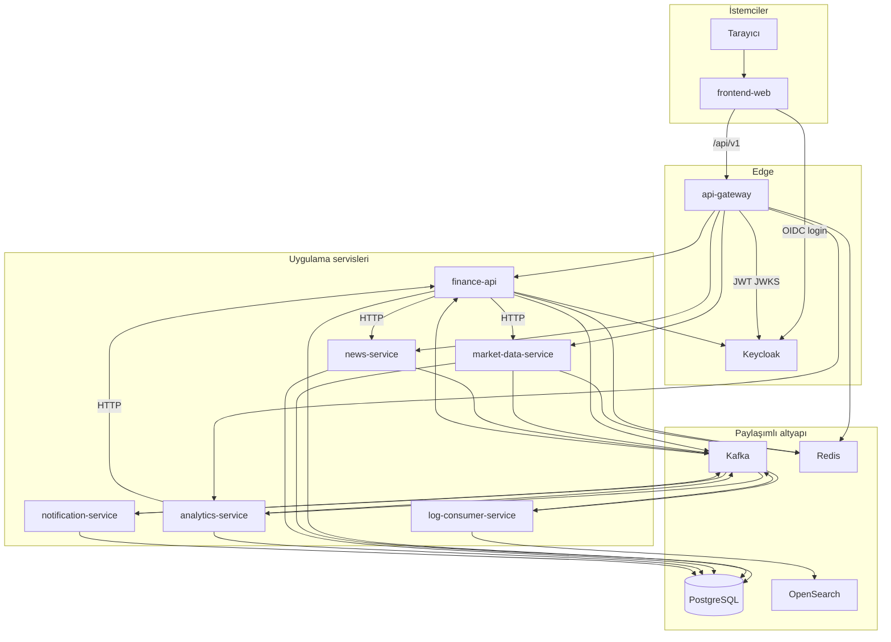
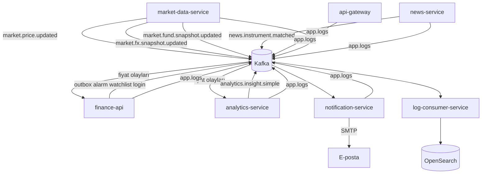
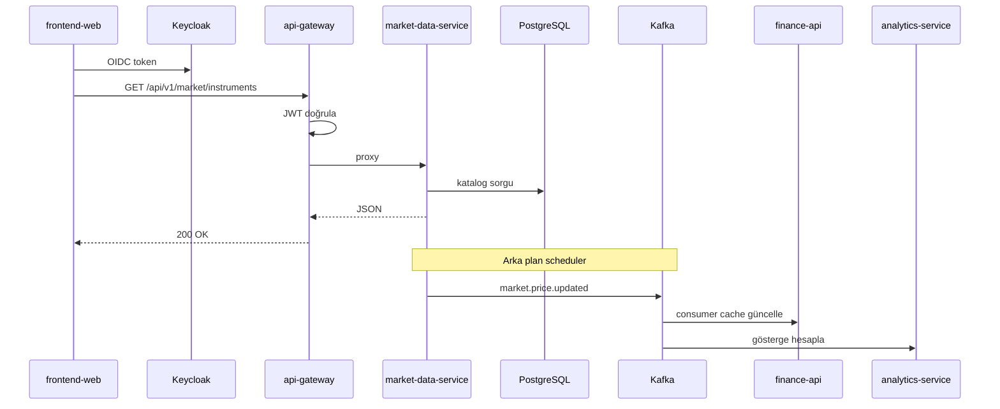
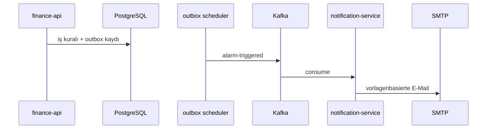
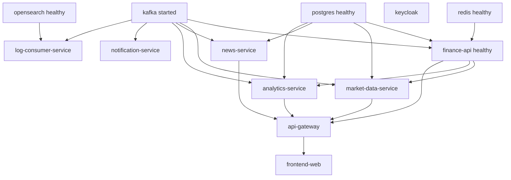

# Services

Das **32 Bit Finance Platform**-Monorepo umfasst sieben Backend-Module und eine React SPA unter dem Maven-Parent `com.company:finance-platform:1.0.0-SNAPSHOT` (`pom.xml`). Browser-Traffic wird über **api-gateway** gemäß der `/api/v1/**`-Konvention an den jeweiligen Service geroutet.

| Kontext | Dokument |
|---------|----------|
| **Detaillierte Service-Leitfäden** | [services/README.md](services/README.md) |
| Gateway-Routen | [api.md](api.md) |
| Architektur und Kafka-Überblick | [architecture.md](architecture.md) |
| Einrichtung | [getting-started.md](getting-started.md) |
| Observability | [observability.md](observability.md) |

---

## Gesamtarchitektur — Service-Interaktionen

Die folgenden Diagramme fassen **synchrone (HTTP)** und **asynchrone (Kafka)** Beziehungen auf der Plattform zusammen. Vollständiger Architekturkontext: [architecture.md](architecture.md).

### Plattformkontext

Der Browser kommuniziert nur mit **frontend-web** (5173) und **api-gateway** (8080); Backend-Services erreichen einander im Docker-Netz `finance-net` per Hostname.



### Synchrones HTTP — Gateway-Routing

`api-gateway` leitet eine Anfrage anhand des Pfadpräfixes an den jeweiligen Service weiter. `finance-api` trägt die meisten Portal-Geschäftsregeln; Markt- und Nachrichtendaten liegen in Spezialservices.

```mermaid
flowchart LR
  FE[frontend-web]
  GW[api-gateway]

  subgraph routes [Gateway hedefleri]
    FA[finance-api]
    MDS[market-data-service]
    NS[news-service]
    AS[analytics-service]
  end

  FE --> GW
  GW -->|"/api/v1/public/**" portföy alarm profil admin| FA
  GW -->|"/api/v1/market/overview insights eurobond"| FA
  GW -->|"/api/v1/market/**" "/api/v1/rates/**"| MDS
  GW -->|"/api/v1/news/enriched favorites"| FA
  GW -->|"/api/v1/news/**"| NS
  GW -->|"/api/v1/analytics/**"| AS
  GW -->|"/api/v1/**" geri kalan| FA

  FA -.->|BFF HTTP| MDS
  FA -.->|BFF HTTP| NS
```

Routenreihenfolge und Circuit Breaker: [api.md](api.md).

### Asynchrones Kafka — Ereignisfluss

Marktaktualisierungen und Benachrichtigungen werden außerhalb der HTTP-Kette über Kafka verteilt. `finance-api` veröffentlicht Domain-Ereignisse per **transactional outbox**.



### Typische Benutzeranfrage (End-to-End)

Beispiel: angemeldeter Benutzer öffnet die Marktliste; teils synchrones HTTP, im Hintergrund läuft weiterhin die MDS-Scheduler-Kafka-Veröffentlichung.



### Benachrichtigungskette (ereignisgesteuert)

Alarm oder Nachrichten-Match löst die E-Mail-Pipeline unabhängig von der Portal-API aus.



### Compose-Startreihenfolge (Abhängigkeiten)

`market-data-service` startet, nachdem `finance-api` healthy ist (Katalog-Sync). `log-consumer-service` schreibt Logs nach OpenSearch healthy.



---

## Anwendungsservices — Übersicht

| Modul | Container | Rolle | Docker-Port | Host-Port |
|-------|-----------|-------|-------------|-----------|
| `api-gateway` | `api-gateway` | Einziger API-Einstieg, JWT, Rate Limit | 8080 | **8080** |
| `finance-api` | `finance-api` | Portal-BFF | 8080 | internal |
| `market-data-service` | `market-data-service` | Marktdaten, EVDS | 8080 | internal |
| `analytics-service` | `analytics-service` | Indikatoren, Insight | 8080 | internal |
| `news-service` | `news-service` | News-API & RSS | 8082 | internal |
| `notification-service` | `notification-service` | E-Mail | 8086 | internal |
| `log-consumer-service` | `log-consumer-service` | Log-Indizierung | 8087 | internal |
| `frontend-web` | `frontend-web` | React SPA | 5173 | **5173** |

Nach außen sind nur **8080** (API) und **5173** (UI) exponiert.

---

## Port-Matrix (lokale Entwicklung)

| Service | Docker | Lokale Entwicklung |
|---------|--------|---------------------|
| api-gateway | 8080 | `dev` → **9090** |
| finance-api | 8080 | 8080 + PostgreSQL |
| market-data-service | 8080 | `dev` → **8082** (H2) |
| analytics-service | 8080 | 8080 + PostgreSQL |
| news-service | 8082 | **8082** |
| notification-service | 8086 | **8086** |
| log-consumer-service | 8087 | **8087** |
| frontend-web | 5173 | **5173** |

**Warnung:** `news-service` und `market-data-service` nutzen auf dem Host beide **8082** — nicht gemeinsam starten. Gateway dev (9090) kollidiert mit Prometheus (9090) — [development.md](development.md).

---

## Infrastruktur (Docker)

| Komponente | Host-Port |
|------------|-----------|
| PostgreSQL | 5432 |
| Redis | 6379 |
| Kafka | 9092 |
| Keycloak | 8085 |
| OpenSearch | 9200 |
| OpenSearch Dashboards | 5601 |
| Jaeger | 16686 |
| Prometheus | 9090 |
| Grafana | 3000 |

---

## Detaillierte Leitfäden

Verantwortlichkeiten, Fähigkeiten, Datenflüsse und Diagramme pro Service:

| Service | Dokumentation |
|---------|---------------|
| api-gateway | [services/api-gateway.md](services/api-gateway.md) |
| finance-api | [services/finance-api.md](services/finance-api.md) |
| market-data-service | [services/market-data-service.md](services/market-data-service.md) |
| analytics-service | [services/analytics-service.md](services/analytics-service.md) |
| news-service | [services/news-service.md](services/news-service.md) |
| notification-service | [services/notification-service.md](services/notification-service.md) |
| log-consumer-service | [services/log-consumer-service.md](services/log-consumer-service.md) |
| frontend-web | [services/frontend-web.md](services/frontend-web.md) |

Vorlage für neue Service-Dokumentation: [services/_template.md](services/_template.md).
