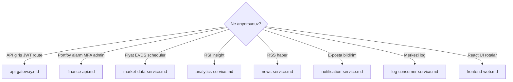

# Service-Leitfäden

Detaillierte Dokumentation für jede Anwendungskomponente: Verantwortlichkeiten, Fähigkeiten, HTTP-/Kafka-Datenflüsse und Mermaid-Diagramme.

Plattformweite Diagramme: [../services.md](../services.md).

### Service-Auswahlhilfe

## Leitfäden

| Service | Dokument | Zusammenfassung |
|---------|----------|-----------------|
| API Gateway | [api-gateway.md](api-gateway.md) | Einziger `/api/v1`-Einstieg, JWT, Rate Limit, Circuit Breaker |
| Finance API | [finance-api.md](finance-api.md) | Portal-BFF — Portfolio, Auth, Admin, Infokarten |
| Market Data | [market-data-service.md](market-data-service.md) | Marktkatalog, EVDS, Scheduler, Preisveröffentlichung |
| Analytics | [analytics-service.md](analytics-service.md) | Technische Indikatoren, Insight |
| News | [news-service.md](news-service.md) | RSS-Ingestion, News-API |
| Notification | [notification-service.md](notification-service.md) | Kafka → E-Mail |
| Log Consumer | [log-consumer-service.md](log-consumer-service.md) | `app.logs` → OpenSearch |
| Frontend | [frontend-web.md](frontend-web.md) | React SPA, Keycloak, i18n |

## Plattformdokumente

| Dokument | Wann? |
|----------|-------|
| [../services.md](../services.md) | Porttabelle und Kurzübersicht |
| [../architecture.md](../architecture.md) | Plattformarchitektur |
| [../api.md](../api.md) | Gateway-Routenliste |
| [../observability.md](../observability.md) | Metriken, Traces, Logs |

## Dokumentation aktualisieren

Bei neuem Service oder geändertem Verhalten:

1. Die betreffende `docs/deutsch/services/<modul>.md` aktualisieren (Vorlage: [_template.md](_template.md)).
2. Bei geänderten Gateway-Routen [api.md](../api.md) und [api-gateway.md](api-gateway.md).
3. Bei neuem Kafka-Topic eine Zeile in der Tabelle in [architecture.md](../architecture.md) ergänzen.
4. Im PR „docs/services updated“ vermerken.
