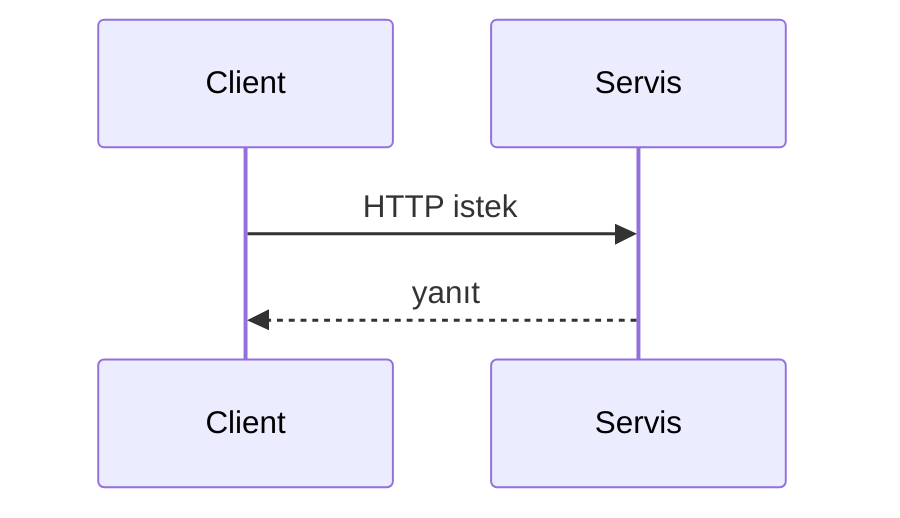
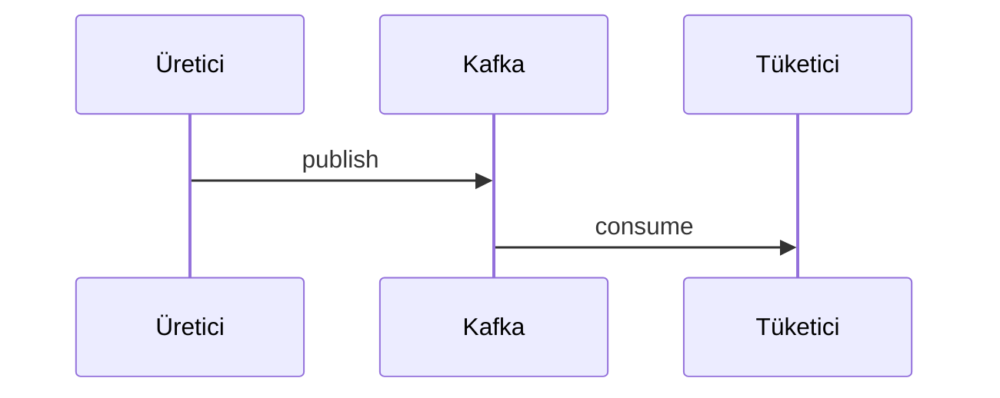

# {Servis adı}

> Vorlage für neue oder aktualisierte Service-Dokumentation. Diese Datei kopieren und als `{modül-adı}.md` speichern.

## Zusammenfassung

{2–3 Sätze: Rolle des Service auf der Plattform und Hauptverantwortung.}

## Verantwortlichkeiten

- {Macht 1}
- {Macht 2}

## Nicht im Scope

- {Macht nicht — welcher Service übernimmt}

## Fähigkeiten

| Perspektive | Fähigkeit |
|-------------|-----------|
| Portal-Benutzer | {…} |
| Admin | {…} |
| Betrieb | {…} |

## Laufzeitumgebung

| Eigenschaft | Wert |
|-------------|------|
| Maven-Modul | `{modül}` |
| Container-Name | `{container}` |
| HTTP-Port (Docker) | {port} |
| HTTP-Port (lokale Entwicklung) | {port} |
| Spring-Profile | `{profiller}` |
| Healthcheck | `{endpoint}` |

## Abhängigkeiten

| Komponente | Verwendung |
|------------|------------|
| PostgreSQL | {evet/hayır — şema} |
| Redis | {…} |
| Kafka | {üret/tüket} |
| Keycloak | {…} |
| HTTP-Peer | {…} |

## Kontextdiagramm

```mermaid
flowchart LR
  SVC[{Servis}]
  %% dış sistemler ve oklar
```

## HTTP-Datenflüsse

### Wichtige Pfadgruppen

| Pfadpräfix | Beschreibung |
|------------|--------------|
| `/api/v1/...` | {…} |

### Typischer Anfrageablauf



## Kafka / Ereignisflüsse

| Topic | Rolle | Beschreibung |
|-------|-------|--------------|
| `{topic}` | Üretir / Tüketir | {…} |



## Scheduler / Hintergrundjobs

| Komponente | Auslöser | Aufgabe |
|------------|----------|---------|
| `{Scheduler}` | {cron / fixedDelay} | {…} |

## Datenmodell

| Element | Wert |
|---------|------|
| Flyway-Migration | `{modül}/src/main/resources/db/migration/` |
| History-Tabelle | `{tablo_adı}` |
| Zentrale Konzepte | {tablo/grup listesi} |

## Paket- / Codestruktur

```
{modül}/src/main/java/...
```

## Konfiguration

| Variable | Beschreibung |
|----------|--------------|
| `{ENV}` | {…} |

Vollständige Liste: [configuration.md](../configuration.md).

## Observability

| Kanal | Detail |
|-------|--------|
| Logs | Kafka `app.logs`, Felder: `service`, `traceId`, `correlationId` |
| Metriken | Prometheus-Job: `{job-name}` |
| Trace | OTLP → Jaeger |

Details: [observability.md](../observability.md).

## Lokale Ausführung

```bash
mvn -pl {modül} -am spring-boot:run -Dspring-boot.run.profiles={profil}
```

Einrichtung: [getting-started.md](../getting-started.md) · Entwicklung: [development.md](../development.md).

## Verwandte Dokumente

| Dokument | Inhalt |
|----------|--------|
| [api.md](../api.md) | Gateway-Routen |
| [architecture.md](../architecture.md) | Plattformübersicht |
| [services.md](../services.md) | Portübersicht |
