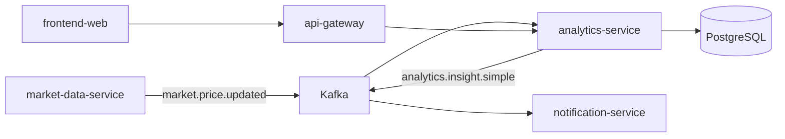
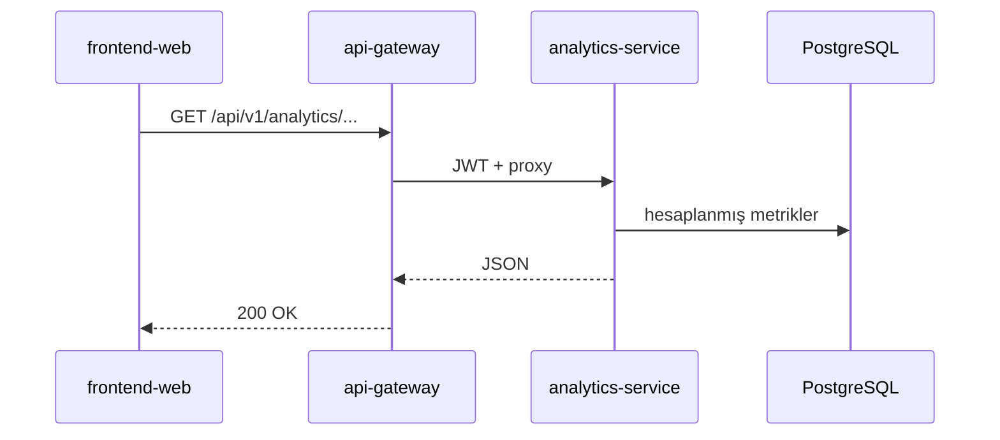
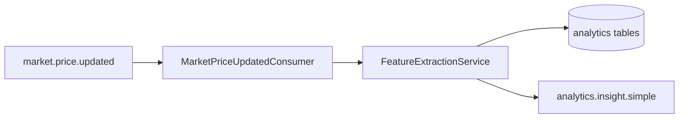
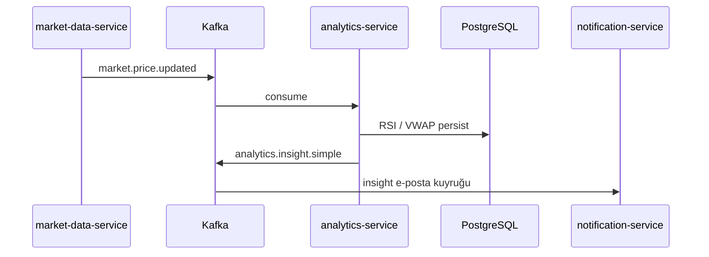

# analytics-service

## Zusammenfassung

**analytics-service** konsumiert von `market-data-service` veröffentlichte Preis-Events und berechnet **technische Analysemetriken** (RSI, VWAP usw.), speichert Ergebnisse in PostgreSQL. Einfache Insight-Events werden auf `analytics.insight.simple` geschrieben; Portal-Endpunkte `/api/v1/analytics/**` laufen über das Gateway.

## Verantwortlichkeiten

- `market.price.updated` und FX-Snapshot-Events aus Kafka konsumieren
- Indikatoren berechnen und persistent speichern (Analytics-Flyway-Schema)
- REST-API: Analyseabfragen (`AnalyticsController`)
- Produktion von `analytics.insight.simple` (Preisbewegung / Insight-Benachrichtigungen)
- HTTP-Integration mit `finance-api` (bei Bedarf)

## Außerhalb des Aufgabenbereichs

- Rohpreisabruf und EVDS — `market-data-service`
- Portal-Portfolio / Alarm-Geschäftslogik — `finance-api`
- E-Mail-Versand — `notification-service` (konsumiert Insight-Topic)
- News-Zuordnung — `news-service`

## Möglichkeiten

| Perspektive | Fähigkeit |
|-------------|-----------|
| Portal | Analyse-Seite Indikatoren, Insight-Karten (über Gateway) |
| Betrieb | Health, Prometheus-Metriken |
| Plattform | Aus Preisstrom abgeleitete Metriken |

## Laufzeit

| Eigenschaft | Wert |
|-------------|------|
| Maven-Modul | `analytics-service` |
| Container-Name | `analytics-service` |
| HTTP-Port | **8080** (Spring Boot Standard) |
| Spring-Profile | `docker` (Compose) |
| Healthcheck | `/actuator/health` |

## Abhängigkeiten

| Komponente | Verwendung |
|------------|------------|
| PostgreSQL | DB `finance`, `analytics_flyway_schema_history` |
| Kafka | Preis konsumieren; Insight produzieren |
| HTTP | `FINANCE_BASE_URL` → finance-api (intern) |
| Keycloak | JWT (Resource Server) |

## Kontextdiagramm



## HTTP-Datenflüsse

### Wichtige Endpunkte

| Pfad (Gateway) | Controller | Beschreibung |
|----------------|------------|--------------|
| `/api/v1/analytics/**` | `AnalyticsController` | Indikator- / Insight-Abfragen |



## Verarbeitungs-Pipeline



## Kafka / Ereignisflüsse

| Topic | Rolle | Beschreibung |
|-------|-------|--------------|
| `market.price.updated` | Konsumiert | `MarketPriceUpdatedConsumer` |
| FX snapshot topic | Konsumiert | `FxSnapshotUpdatedConsumer` |
| `analytics.insight.simple` | Produziert | `FeatureExtractionService` — Benachrichtigungs-Pipeline |



Consumer mit Retry + DLQ (`topic.dlq`) konfiguriert.

## Scheduler / Hintergrundaufgaben

Überwiegend **Kafka-gesteuert**; zusätzliche Batch-Jobs begrenzt auf Migration/Startup. Periodische Berechnung wird durch Preis-Events ausgelöst.

## Datenmodell

| Element | Wert |
|---------|------|
| Flyway | `analytics-service/src/main/resources/db/migration/` |
| History-Tabelle | `analytics_flyway_schema_history` |
| Hauptkonzepte | RSI täglich, VWAP, Insight- / Policy-Metrik-Tabellen |

## Paket- / Codestruktur

```
analytics-service/src/main/java/com/company/analytics/
├── processing/       # Kafka consumer'lar, FeatureExtractionService
├── query/            # AnalyticsController
└── bootstrap/        # config, health
```

## Konfiguration

| Variable | Beschreibung |
|----------|--------------|
| `SPRING_DATASOURCE_URL` | PostgreSQL |
| `KAFKA_BOOTSTRAP_SERVERS` | Kafka |
| `FINANCE_BASE_URL` | finance-api HTTP |
| `TRACING_SAMPLE_PROBABILITY` | Trace-Sampling |

Vollständige Liste: [configuration.md](../configuration.md).

## Beobachtbarkeit

| Kanal | Detail |
|-------|--------|
| Logs | `app.logs` |
| Metriken | Prometheus-Job `analytics-service` |
| Trace | OTLP → Jaeger |

Details: [observability.md](../observability.md).

## Lokale Ausführung

```bash
export KAFKA_BOOTSTRAP_SERVERS=localhost:9092
export SPRING_DATASOURCE_URL=jdbc:postgresql://localhost:5432/finance

mvn -pl analytics-service -am spring-boot:run
```

Einrichtung: [getting-started.md](../getting-started.md).

## Verwandte Dokumente

| Dokument | Inhalt |
|----------|--------|
| [market-data-service.md](market-data-service.md) | Preis-Event-Produzent |
| [notification-service.md](notification-service.md) | Insight-Consumer |
| [api-gateway.md](api-gateway.md) | Analytics-Route |
| [architecture.md](../architecture.md) | Kafka-Übersicht |
