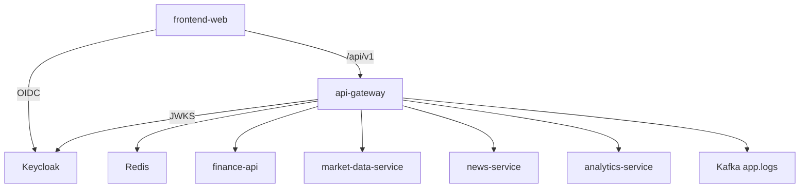
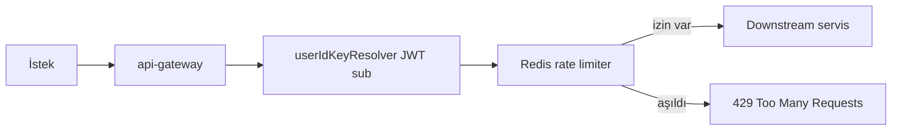
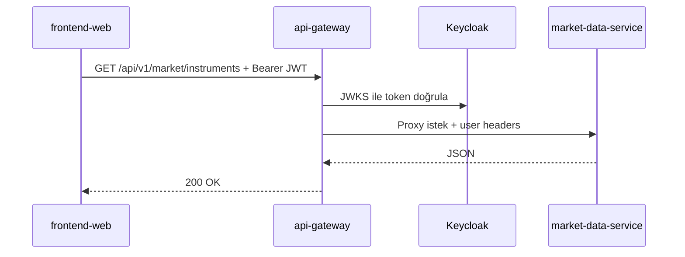
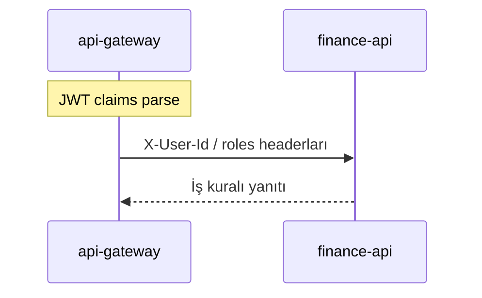

# api-gateway

## Zusammenfassung

**api-gateway** ist der **einzige HTTP-Einstiegspunkt**, über den Browser und externe Clients das Platform-Backend erreichen. Es übernimmt JWT-Validierung (Keycloak JWKS), CORS, Redis-basiertes Rate Limiting, Resilience4j Circuit Breaker und die Weiterleitung an Downstream-Mikroservices nach Pfad. OpenAPI/Swagger-Dokumentation wird in einer Oberfläche zusammengeführt.

## Verantwortlichkeiten

- `/api/v1/**`- und `/health`-Anfragen an den richtigen Downstream-Service weiterleiten
- JWT mit OAuth2 Resource Server validieren; Benutzeridentität in Downstream-Header übertragen
- API-Rate Limiting pro Benutzer (Redis)
- Circuit Breaker und Fallback-Endpunkte für Market, News und Analytics
- Einheitliche Swagger UI (`/swagger-ui.html`) und OpenAPI-Proxy-Routen der Services
- Strukturierte Logs an das Kafka-Topic `app.logs` senden (Log4j2)

## Außerhalb des Aufgabenbereichs

- **Geschäftsregeln** wie Portfolio, Alarme, Marktdaten — `finance-api` und Fachservices
- Benutzerregistrierung / MFA — `finance-api` + Keycloak
- E-Mail-Versand — `notification-service`
- Log-Indizierung — `log-consumer-service`

## Möglichkeiten

| Perspektive | Fähigkeit |
|-------------|-----------|
| Portal / SPA | Alle `/api/v1`-Aufrufe über einen Origin |
| Entwickler | Alle Service-APIs über Swagger erkunden |
| Betrieb | Prometheus `/actuator/prometheus`, Health, Jaeger-Trace |
| Fehlertoleranz | Bei offenem CB: `/fallback/market`, `/fallback/news`, `/fallback/analytics` |

## Laufzeit

| Eigenschaft | Wert |
|-------------|------|
| Maven-Modul | `api-gateway` |
| Container-Name | `api-gateway` |
| HTTP-Port (Docker) | **8080** (Host-Mapping) |
| HTTP-Port (lokal `dev`) | **9090** |
| Spring-Profile | `docker` (Compose), `dev` (IDE) |
| Healthcheck | `/actuator/health` |

## Abhängigkeiten

| Komponente | Verwendung |
|------------|------------|
| PostgreSQL | Nein |
| Redis | Rate-Limiter-State |
| Kafka | Log-Append (`app.logs`) |
| Keycloak | JWT Issuer / JWKS |
| HTTP Downstream | finance-api, market-data-service, news-service, analytics-service (+ notification/log URI definiert, überwiegend intern) |

Downstream-URIs: `gateway.services.*` — [`application.yml`](../../../api-gateway/src/main/resources/application.yml).

## Kontextdiagramm



## HTTP-Datenflüsse

### Rate Limiting



### Routenübersicht (niedrigere Order = zuerst)

| Order | Pfadpräfix | Ziel |
|-------|------------|------|
| -14 | `/api/v1/market/eurobonds/tr/**` | finance-api |
| -13 | `/api/v1/market/overview`, `.../insights` | finance-api |
| -12 | `/api/v1/rates/**` | market-data-service |
| -11 | `/api/v1/news/enriched/**`, `.../favorites/**` | finance-api |
| -10 | `/api/v1/news/**` | news-service |
| -8 | `/api/v1/market/**` | market-data-service |
| -6 | `/api/v1/analytics/**` | analytics-service |
| -3 | `/api/v1/**`, `/health` | finance-api (Rate Limit + CB) |
| -2 | `/api/v1/public/**` | finance-api |

Quelle: [`GatewayRoutesConfig.java`](../../../api-gateway/src/main/java/com/company/gateway/bootstrap/config/GatewayRoutesConfig.java). Vollständige Tabelle: [api.md](../api.md).

### Marktlisten-Anfrage



### JWT und Benutzerkontext



Das Gateway mappt die Claims `sub`, `preferred_username` und `realm_access.roles` per `gateway.user-context.*` auf Header.

## Kafka / Ereignisflüsse

| Topic | Rolle | Beschreibung |
|-------|-------|--------------|
| `app.logs` | Produziert | Log4j2 JSON; Verbrauch durch `log-consumer-service` |

Das Gateway erzeugt keine Geschäfts-Domain-Events.

## Scheduler / Hintergrundaufgaben

Keine — vollständig anfragegesteuert (reaktives Gateway).

## Datenmodell

Verwendet keine persistente Datenbank. Redis dient nur Rate-Limit-Buckets.

## Paket- / Codestruktur

```
api-gateway/src/main/java/com/company/gateway/
├── bootstrap/config/     # GatewayRoutesConfig, security, rate limit
├── fallback/             # Circuit breaker fallback controller'lar
└── ...
```

## Konfiguration

| Variable | Beschreibung |
|----------|--------------|
| `JWT_ISSUER_URI` | Token-Issuer (z. B. `http://localhost:8085/realms/finance`) |
| `FINANCE_BASE_URI` | finance-api Downstream |
| `MARKET_BASE_URI` | market-data-service |
| `NEWS_BASE_URI` | news-service |
| `ANALYTICS_BASE_URI` | analytics-service |
| `SPRING_DATA_REDIS_HOST` | Rate-Limiter-Redis |
| `GATEWAY_CORS_ALLOWED_ORIGINS` | SPA-Origin (Standard `http://localhost:5173`) |
| `TRACING_SAMPLE_PROBABILITY` | Trace-Sampling (Standard 0.1) |

Vollständige Liste: [configuration.md](../configuration.md).

## Beobachtbarkeit

| Kanal | Detail |
|-------|--------|
| Logs | `app.logs`; `correlationId` MDC |
| Metriken | Prometheus-Job `api-gateway` |
| Trace | OTLP → `http://jaeger:4318/v1/traces` |

Details: [observability.md](../observability.md).

## Lokale Ausführung

```bash
mvn -pl api-gateway -am spring-boot:run -Dspring-boot.run.profiles=dev
```

Port **9090**. Lokale Downstream-URIs: [`application-dev.yml`](../../../api-gateway/src/main/resources/application-dev.yml).

Einrichtung: [getting-started.md](../getting-started.md) · Entwicklung: [development.md](../development.md).

## Verwandte Dokumente

| Dokument | Inhalt |
|----------|--------|
| [api.md](../api.md) | Routenliste und Swagger |
| [finance-api.md](finance-api.md) | Standard-Catch-all-Ziel |
| [architecture.md](../architecture.md) | Plattformarchitektur |
| [services.md](../services.md) | Portübersicht |
