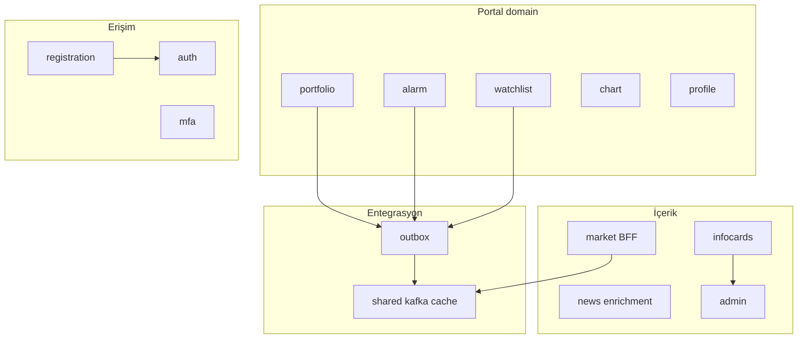
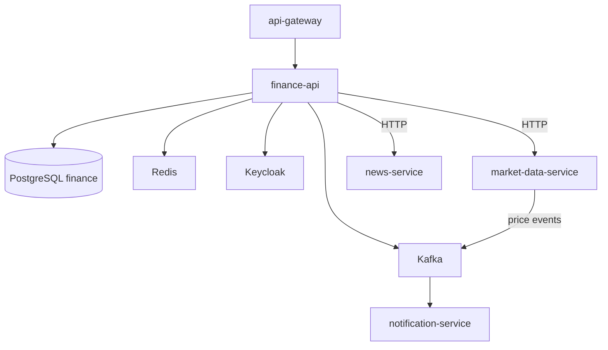
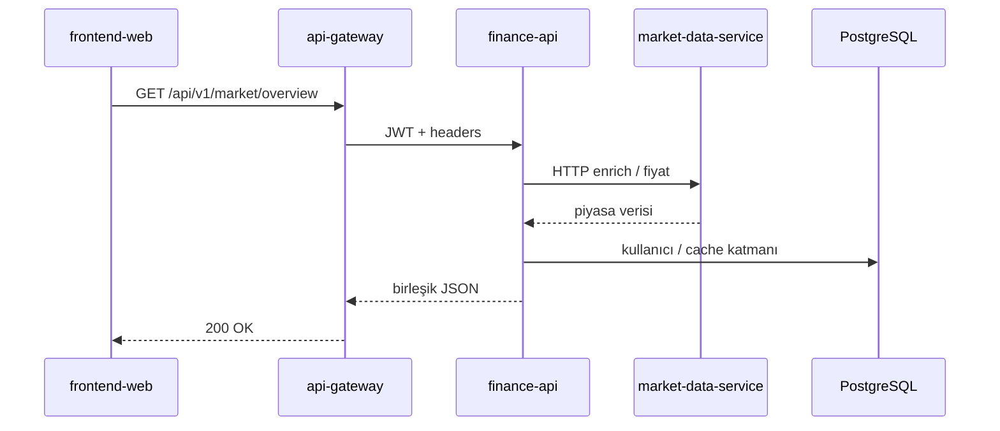
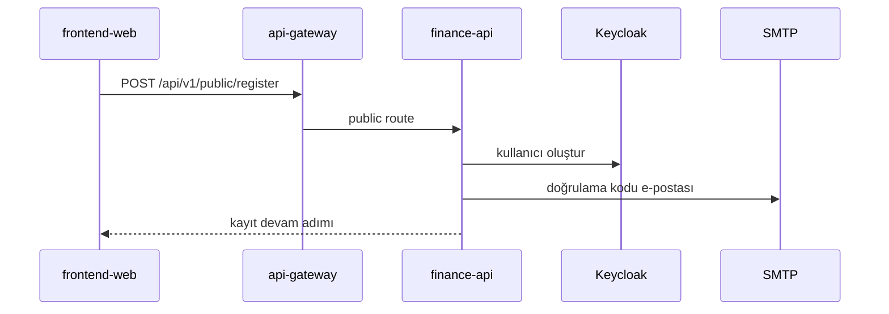
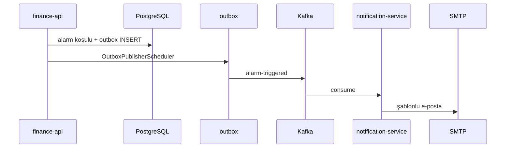

# finance-api

## Zusammenfassung

**finance-api** ist das **Backend-for-Frontend (BFF)** und die zentrale Geschäftslogik des 32 Bit Finance Portals. Benutzerspezifische Daten (Portfolio, Transaktionen, Alarme, Watchlist, Profil), Registrierung/MFA, Admin-KPIs, Infokarten und News-Anreicherung liegen hier. Für Rohmarktdaten verbindet es sich per HTTP oder Kafka mit `market-data-service`; Domain-Events werden per Transactional Outbox nach Kafka geschrieben.

## Verantwortlichkeiten

- Portfolio, Transaktionshistorie, Ziele, externe Portfolio-Ansicht
- Preisalarme und Alarmhistorie
- Watchlist und Chart-Zeichnungsspeicherungen
- Registrierung, E-Mail-Verifizierung, TOTP-MFA, vertrauenswürdige Geräte
- Profil, Avatar, Benachrichtigungseinstellungen
- Admin-Portal-Metriken, Infokarten (CRUD + KI-Inhalt)
- News-Favoriten und angereicherte News-APIs
- Marktübersicht / Insight-BFF (`/api/v1/market/overview`, Eurobond-TR-Proxy)
- Benutzer-/Rollenverwaltung über Keycloak Admin API
- Kafka-Consumer: Live-Preis- / FX- / Fonds-Snapshot-Events
- Kafka-Producer (Outbox): Alarm, Watchlist, Login-Sicherheit, Transaktions-Events

## Außerhalb des Aufgabenbereichs

- Rohmarktkatalog und EVDS-Scheduler — `market-data-service`
- RSS-Ingestion und Roh-News-Liste — `news-service` (BFF-Anreicherung hier)
- RSI / technische Indikatoren — `analytics-service`
- SMTP-E-Mail — `notification-service`
- Zentrale Log-Indizierung — `log-consumer-service`
- JWT-Edge-Validierung — `api-gateway`

## Möglichkeiten

| Perspektive | Fähigkeit |
|-------------|-----------|
| Portal-Benutzer | Portfolio, Alarme, Watchlist, Profil/MFA |
| Admin | KPI-Dashboards, Infokarten, blockierte E-Mails |
| Public (anonym) | Registrierung, Login-Abschluss, public health |
| System | Preis-Cache per Kafka; Benachrichtigungen per Outbox |

## Laufzeit

| Eigenschaft | Wert |
|-------------|------|
| Maven-Modul | `finance-api` |
| Container-Name | `finance-api` |
| HTTP-Port | **8080** (intern; Außenwelt über Gateway) |
| Spring-Profile (Docker) | `docker`, `kafka`, `cache-redis` |
| Spring-Profile (lokal) | `dev`, `kafka` |
| Healthcheck | `/actuator/health` (Startperiode ~120s) |

## Domain-Modul-Interaktion



## Abhängigkeiten

| Komponente | Verwendung |
|------------|------------|
| PostgreSQL | DB `finance`, Flyway `finance_flyway_schema_history` |
| Redis | Profil `cache-redis` — Instrument-Preis-Cache |
| Kafka | Outbox-Publish + Market-Event-Consume |
| Keycloak | Admin API, JWT Resource Server |
| HTTP | `market-data-service`, `news-service` |
| Dateisystem | `photos/{userId}/` Avatar-Speicher |

## Kontextdiagramm



## HTTP-Datenflüsse

### Wichtige Controller-Gruppen

| Bereich | Controller (Beispiel) | Pfadpräfix |
|---------|----------------------|------------|
| Public Auth | `PublicRegistrationController`, `PublicAuthenticationController` | `/api/v1/public/**` |
| Portfolio | `PortfolioController`, `TradeController`, `TransactionHistoryController` | `/api/v1/portfolio/**` |
| Alarm | `AlarmController`, `AlarmHistoryController` | `/api/v1/alarms/**` |
| Watchlist / Chart | `WatchlistController`, `ChartController`, `ChartDrawingSaveController` | `/api/v1/watchlist/**`, chart |
| Markt-BFF | `MarketOverviewController`, `MarketDataProxyController`, `MarketTurkeyEurobondController` | `/api/v1/market/overview`, proxy |
| News | `NewsAggregationController`, `NewsFavoriteController` | `/api/v1/news/enriched/**`, favorites |
| Profil / MFA | `PortalProfileController`, `PortalMfaController`, `PortalTrustedDevicesController` | `/api/v1/profile/**`, mfa |
| Admin | `AdminPortalMetricsController`, `AdminInfoCardsController` | `/api/v1/admin/**` |
| Infokarten (Portal) | `PortalInfoCardsController` | `/api/v1/info-cards/**` |
| KI | `AdminInfoCardAiController` | Admin-KI-Inhalt |

### Marktübersicht (BFF + MDS)



### Registrierung und E-Mail-Verifizierung



## Kafka / Ereignisflüsse

### Produzierte Topics (Transactional Outbox)

Quelle: [`KafkaTopics.java`](../../../finance-api/src/main/java/com/company/finance_api/shared/kafka/KafkaTopics.java). `OutboxPublisherScheduler` veröffentlicht ausstehende Outbox-Zeilen.

| Topic | Auslöser (Beispiel) | Consumer |
|-------|-------------------|----------|
| `alarm-triggered` | Preisalarm-Bedingung | notification-service |
| `watchlist.item.added` | Watchlist-Hinzufügung | notification-service |
| `watchlist.item.removed` | Watchlist-Entfernung | notification-service |
| `login-security.alert` | Verdächtiger Login | notification-service |
| `transaction-executed` | Transaktionsbuchung | (Domain / Benachrichtigung) |
| `internal.user.delete.requested` | Benutzer-Lösch-Saga | internal |

### Konsumierte Topics

Quelle: `shared/messaging/kafka/consumer/`, `MarketDataTopics` (gemeinsame Namen mit MDS).

| Topic | Produzent | Zweck |
|-------|-----------|-------|
| `market.price.updated` | market-data-service | Preis-Cache / Portal-Update |
| `market.fx.snapshot.updated` | market-data-service | FX-Snapshot |
| `market.fund.snapshot.updated` | market-data-service | Fonds-NAV-Snapshot |

### Alarm → E-Mail



## Scheduler / Hintergrundaufgaben

| Komponente | Aufgabe |
|------------|---------|
| `OutboxPublisherScheduler` | Outbox → Kafka |
| `market-price`-Scheduler (dev-Konfiguration) | Lokales Preis-Polling (profilabhängig) |
| Domain-Scheduler | Alarm-Auswertung, Admin-Snapshot usw. (Paket `infrastructure/scheduler`) |

## Datenmodell

| Element | Wert |
|---------|------|
| Flyway | `finance-api/src/main/resources/db/migration/V*.sql` |
| History-Tabelle | `finance_flyway_schema_history` |
| Hauptkonzepte | `users`, Portfolio/Transaktion, `alarms`, `watchlist`, `chart_drawing_saves`, `info_cards`, Admin-Metrik-Tabellen, Registrierungsverifizierung |

Eine PostgreSQL-Instanz mit DB `finance`; Keycloak separate DB `keycloak` — [architecture.md](../architecture.md).

## Paket- / Codestruktur

Domain-driven Packages (`com.company.finance_api`):

| Paket | Verantwortung |
|-------|---------------|
| `portfolio` | Portfolio, Transaktion, Ziel, externes Portfolio, Bewertung |
| `alarm` | Preisalarme |
| `watchlist` | Watchlist |
| `chart` | Chart-Zeichnungsspeicherungen |
| `registration` / `auth` / `mfa` | Registrierung, Login, TOTP |
| `profile` | Profil, Avatar |
| `infocards` / `admin` | Infokarten, KPI |
| `market` | Overview, MDS-Proxy, Eurobond |
| `news` | News-Anreicherung, Favoriten |
| `ai` | OpenAI-Admin-Inhalt |
| `outbox` | Transactional Outbox |
| `shared` | Security, Cache, Messaging, Web |

Schichten: `domain/` → `application/` → `infrastructure/http|persistence|scheduler/`.

## Konfiguration

| Variable | Beschreibung |
|----------|--------------|
| `SPRING_DATASOURCE_URL` | PostgreSQL (lokal: `localhost:5432`) |
| `KAFKA_BOOTSTRAP_SERVERS` | Kafka-Broker |
| `CLIENTS_MARKET_DATA_BASE_URL` | MDS HTTP (lokal: `http://localhost:8082`) |
| `CLIENTS_NEWS_BASE_URL` | news-service HTTP |
| `JWT_ISSUER_URI` / `JWT_JWK_SET_URI` | Keycloak |
| `APP_MFA_ENCRYPTION_SECRET` | TOTP-Verschlüsselung |
| `OPENAI_API_KEY` | Infokarten-KI |
| `PROFILE_AVATAR_STORAGE_ROOT` | Avatar-Verzeichnis (`/photos` Docker) |
| `APP_SECURITY_ALLOW_HEADER_USER_FALLBACK` | Dev-Header-Auth (Prod: false) |

Vollständige Liste: [configuration.md](../configuration.md).

## Beobachtbarkeit

| Kanal | Detail |
|-------|--------|
| Logs | `app.logs`; `traceId`, `correlationId` |
| Metriken | Prometheus-Job `finance-api` |
| Trace | OTLP → Jaeger; Kafka-Listener-Observation |

Details: [observability.md](../observability.md).

## Lokale Ausführung

```bash
export SPRING_DATASOURCE_URL=jdbc:postgresql://localhost:5432/finance
export JWT_ISSUER_URI=http://localhost:8085/realms/finance
export KAFKA_BOOTSTRAP_SERVERS=localhost:9092
export CLIENTS_MARKET_DATA_BASE_URL=http://localhost:8082

mvn -pl finance-api -am spring-boot:run -Dspring-boot.run.profiles=dev,kafka
```

Einrichtung: [getting-started.md](../getting-started.md) · Entwicklung: [development.md](../development.md).

## Verwandte Dokumente

| Dokument | Inhalt |
|----------|--------|
| [api-gateway.md](api-gateway.md) | Einstiegspunkt |
| [market-data-service.md](market-data-service.md) | Marktdatenquelle |
| [notification-service.md](notification-service.md) | Outbox-Consumer |
| [api.md](../api.md) | Gateway-Route |
| [architecture.md](../architecture.md) | Plattform-Kafka-Übersicht |
