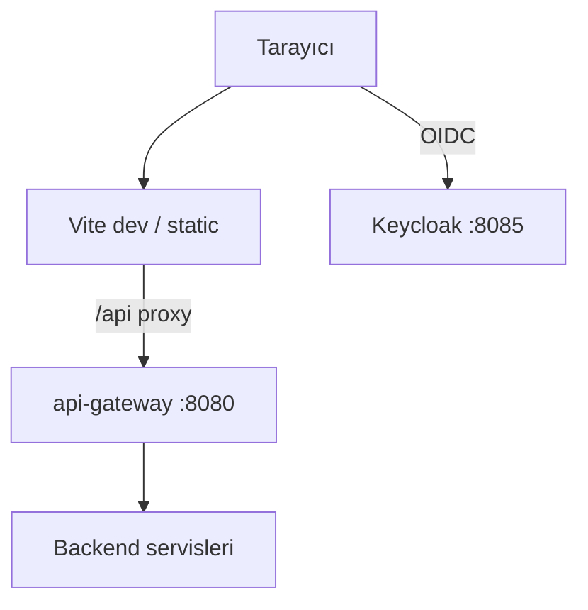
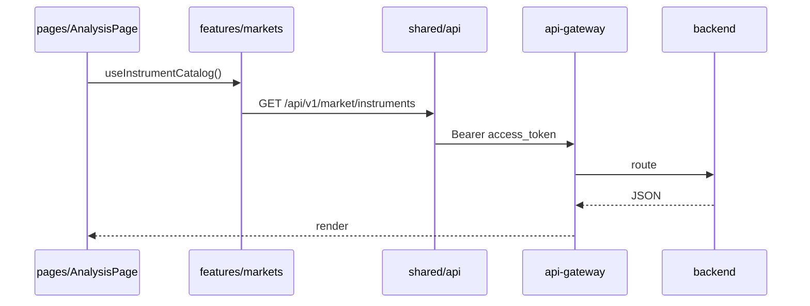
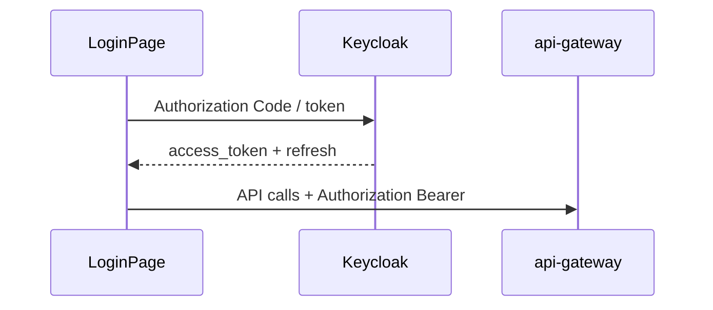
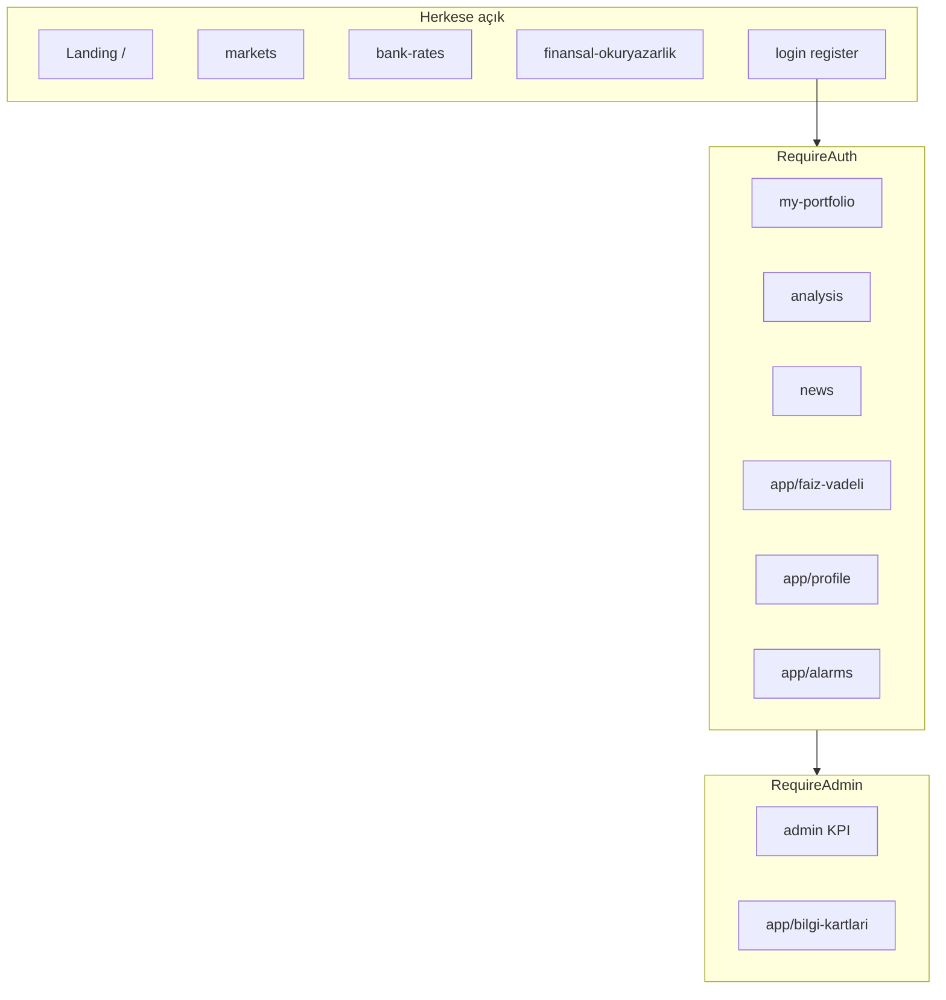

# frontend-web

## Zusammenfassung

**frontend-web** ist die **React-19**-Single-Page-App (Vite 8, TypeScript) des 32 Bit Finance Portals. UI, Keycloak-OIDC-Authentifizierung, Mehrsprache TR/EN/DE und alle Backend-Aufrufe laufen über `api-gateway`. Persistente Geschäftsdaten liegen auf dem Server; im Browser verwaltet Zustand Session/Portfolio-State.

## Verantwortlichkeiten

- Landing, Märkte, Analyse, News, Bankkurse, Finanzbildung
- Authentifizierte Bereiche: Portfolio, Zins/Festgeld, Dashboard, Profil, Alarme, Benachrichtigungen
- Admin-KPI-Dashboards und Infokarten-Verwaltung (ADMIN-Rolle)
- Login / Registrierung / Token-Refresh mit Keycloak
- API-Routing per Vite-Dev-Proxy oder `VITE_API_BASE_URL`
- i18n (`i18next`) und Theme-Einstellungen

## Außerhalb des Aufgabenbereichs

- Geschäftslogik und Datenbank — Backend-Services
- JWT-Signierung — Keycloak
- Marktdatenabruf — `market-data-service`
- E-Mail — `notification-service`

## Möglichkeiten

| Perspektive | Fähigkeit |
|-------------|-----------|
| Besucher | Landing, Märkte, Bankkurse, Finanzbildung (ohne Session) |
| Benutzer (`user1`) | Portfolio, Analyse, News, Alarme, Profil, MFA |
| Admin (`admin1`) | `/admin/**` KPI, `/app/bilgi-kartlari` Verwaltung |
| Entwickler | HMR (`npm run dev`), ESLint, Vite-Proxy-Modi |

## Laufzeit

| Eigenschaft | Wert |
|-------------|------|
| Paket | `frontend-web` |
| Container-Name | `frontend-web` |
| HTTP-Port | **5173** |
| Build | `npm run build` → `tsc` + Vite |
| API (Docker) | `VITE_PROXY_TARGET=http://api-gateway:8080`, `VITE_DEV_PROXY_GATEWAY=true` |

## Abhängigkeiten

| Komponente | Verwendung |
|------------|------------|
| api-gateway | Alle `/api/v1` HTTP |
| Keycloak | OIDC (Realm `finance`, Port 8085) |
| PostgreSQL / Kafka | Nein (direkt) |

## Kontextdiagramm



## HTTP-Datenflüsse

### Vite-Proxy-Modi

| Modus | Umgebung | Verhalten |
|-------|----------|-----------|
| Gateway (Docker) | `VITE_DEV_PROXY_GATEWAY=true` | Alle `/api` → api-gateway |
| BFF (lokal) | Standard | `/api` → finance-api:8080 |
| Remote API | `VITE_API_BASE_URL` | Direkt zum Host |

Details: [api.md](../api.md) · [development.md](../development.md).

### Seite → API



### Login-Ablauf



## Kafka / Ereignisflüsse

Nicht zutreffend — Frontend nutzt weder Kafka noch OpenSearch direkt. Logs und Events laufen über das Backend.

## Scheduler / Hintergrundaufgaben

Periodisches Polling im Browser über Seiten-Hooks (z. B. Markt-Pulse, News-Refresh); keine Server-Scheduler.

## Datenmodell

Nicht zutreffend — UI-State:

| Schicht | Technologie |
|---------|-------------|
| Globaler Store | Zustand (`app/store`, `features/`) |
| Server-State | REST-API-Antworten (Cache in Hooks) |
| Einstellungen | `AppPreferencesContext`, localStorage |

## Routenübersicht

### Zugriffsebenen



Quelle: [`app/router/index.tsx`](../../../frontend-web/src/app/router/index.tsx).

| Route | Guard | Seite |
|-------|-------|-------|
| `/` | PublicOnly | Landing |
| `/login`, `/register` | PublicOnly | Login / Registrierung |
| `/markets` | — | Märkte |
| `/bank-rates` | — | Bankkurse |
| `/finansal-okuryazarlik` | — | Finanzbildung |
| `/my-portfolio`, `/news`, `/analysis` | RequireAuth (seitenweise) | Portfolio, News, Analyse |
| `/app/faiz-vadeli` | RequireAuth | Zins / Festgeld |
| `/app/dashboard` | RequireAuth | Dashboard |
| `/app/portfolio` | RequireAuth | Externes Portfolio |
| `/app/profile` | RequireAuth | Profil |
| `/app/alarms`, `/app/notifications` | RequireAuth | Alarme, Benachrichtigungen |
| `/admin/**` | RequireAdmin | Admin-KPI |
| `/app/bilgi-kartlari` | RequireAdmin | Infokarten |

## Paket- / Codestruktur

```
frontend-web/src/
├── app/router/       # Routendefinitionen, RouteGuards
├── app/store/        # Zustand (Portfolio usw.)
├── pages/            # Seitenkomponenten (Feature-UI)
├── features/         # API-Client, Domain-Hooks
├── shared/           # Layout, i18n, Theme, UI-Primitives
├── services/         # Gemeinsame HTTP-Helfer
└── data/             # Statische Portal-Seitendefinitionen
```

**i18n:** `shared/i18n/locales/{tr,en,de}.json`

**Charts:** `lightweight-charts` — `pages/analysis/chart/`

## Konfiguration

| Variable | Beschreibung |
|----------|--------------|
| `VITE_PROXY_TARGET` | API-Proxy-Ziel |
| `VITE_DEV_PROXY_GATEWAY` | Alle `/api` → Gateway |
| `VITE_API_BASE_URL` | Remote-API (Proxy-Bypass) |
| `VITE_DEV_MARKET_DIRECT_TO_MDS` | Debug: market → MDS |

Vorlage: [`frontend-web/.env.example`](../../../frontend-web/.env.example).

## Beobachtbarkeit

| Kanal | Detail |
|-------|--------|
| Logs | Browser-Konsole; Backend-Trace über Jaeger (API-Anfragen) |
| Metriken | Keine (HTTP-Metriken serverseitig am Gateway) |

Benutzeraktionen sind in Backend-Logs per `correlationId` nachvollziehbar.

Details: [observability.md](../observability.md).

## Lokale Ausführung

```bash
cd frontend-web
cp .env.example .env.development
npm install
npm run dev
```

http://localhost:5173 — Stack: [getting-started.md](../getting-started.md).

```bash
npm run lint
npm run build
```

## Verwandte Dokumente

| Dokument | Inhalt |
|----------|--------|
| [api-gateway.md](api-gateway.md) | API-Einstiegspunkt |
| [finance-api.md](finance-api.md) | BFF-Geschäftslogik |
| [api.md](../api.md) | Proxy-Modi |
| [development.md](../development.md) | Frontend-Struktur |
