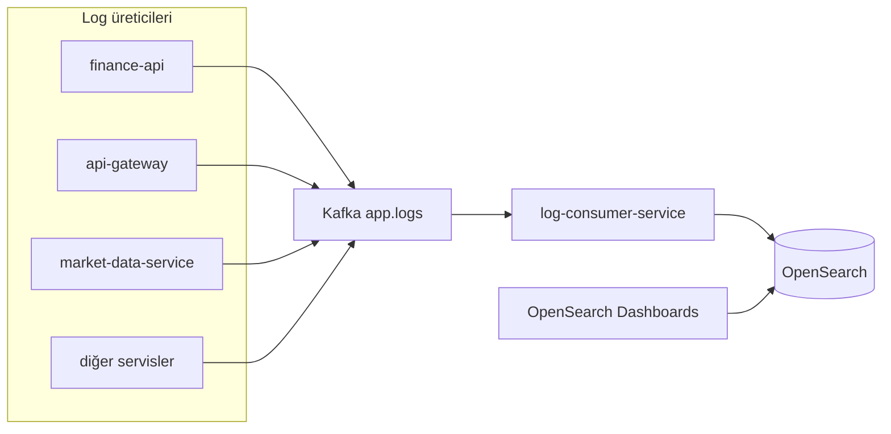
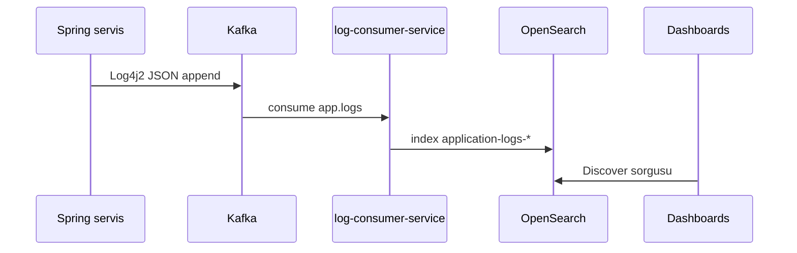

# log-consumer-service

## Zusammenfassung

**log-consumer-service** konsumiert das Kafka-Topic **`app.logs`**, in das alle Spring-Backend-Services per Log4j2 schreiben, und indexiert Ereignisse in OpenSearch unter `application-logs-*`. Es bootstrappt Index-Template und ISM-Retention; für den Betrieb gibt es eine interne Metrik-API.

## Verantwortlichkeiten

- `app.logs` Kafka-Consumer (`AppLogsKafkaConsumer`)
- JSON-Log-Parse; `correlationId` Header → MDC
- OpenSearch-Indizierung und Fehlermetriken
- ISM-Retention (`OPENSEARCH_LOG_RETENTION_DAYS`, Standard 30 Tage)
- Malformed JSON überspringen; DLQ-Publish (`topic.dlq`)
- Interne Zusammenfassung: `GET /internal/system-intelligence`

## Außerhalb des Aufgabenbereichs

- Anwendungs-Logformat — `log4j2-spring.xml` jedes Services
- Log-Such-UI — OpenSearch Dashboards ([observability.md](../observability.md))
- Geschäfts-Domain-API — finance-api usw.
- Metrik-Scrape — Prometheus (separate Pipeline)

## Möglichkeiten

| Perspektive | Fähigkeit |
|-------------|-----------|
| Betrieb | Zentrale Logsuche (Dashboards), Kafka-Lag |
| Entwickler | Fehlersuche mit `traceId` / `service` |
| SRE | Grafana Log-Pipeline, DLQ-Rate |

## Laufzeit

| Eigenschaft | Wert |
|-------------|------|
| Maven-Modul | `log-consumer-service` |
| Container-Name | `log-consumer-service` |
| HTTP-Port | **8087** |
| Compose-Abhängigkeit | `opensearch` **healthy** |

## Abhängigkeiten

| Komponente | Verwendung |
|------------|------------|
| PostgreSQL | Nein |
| Kafka | konsumiert `app.logs` |
| OpenSearch | HTTPS, `admin` / `123456789` (Demo) |
| Keycloak | Nein |

## Kontextdiagramm



## HTTP-Datenflüsse

| Pfad | Beschreibung |
|------|--------------|
| `/actuator/health` | Health |
| `/actuator/prometheus` | Metriken |
| `/internal/system-intelligence` | Kafka-Lag, failed/skipped/DLQ-Übersicht |

Portal-Traffic wird **nicht** an diesen Service geroutet.

## Kafka / Ereignisflüsse

| Topic | Rolle | Beschreibung |
|-------|-------|--------------|
| `app.logs` | Konsumiert | JSON-Logzeilen |
| `{topic}.dlq` | Produziert (Fehler) | Nicht verarbeitbare Nachrichten |

### Log-Pipeline



Log-JSON-Felder (Beispiel): `@timestamp`, `level`, `message`, `service`, `traceId`, `correlationId`, `stack_trace` — [`log4j2-kafka-template.json`](../../../finance-api/src/main/resources/log4j2-kafka-template.json).

## Scheduler / Hintergrundaufgaben

| Komponente | Aufgabe |
|------------|---------|
| `OpenSearchLogInfrastructureBootstrap` | Beim Start Index-Template + ISM-Policy |
| Kafka-Listener | Dauerhaftes Konsumieren |

## Datenmodell

OpenSearch-Indizes (kein relationales Flyway).

| Element | Wert |
|---------|------|
| Index-Präfix | `application-logs` (`OPENSEARCH_INDEX_PREFIX`) |
| ISM-Policy | `application-logs-retention` |
| Volume | `docker_opensearch_data` |

## Paket- / Codestruktur

```
log-consumer-service/src/main/java/com/company/logconsumer/
├── ingestion/kafka/       # AppLogsKafkaConsumer
├── ingestion/opensearch/  # Indexer, bootstrap
├── intelligence/http/     # SystemIntelligenceController
└── bootstrap/config/      # KafkaConsumerConfig
```

## Konfiguration

| Variable | Beschreibung |
|----------|--------------|
| `APP_LOGS_TOPIC` | Standard `app.logs` |
| `LOG_CONSUMER_GROUP_ID` | Consumer-Gruppe |
| `OPENSEARCH_HOST` / `PORT` / `SCHEME` | Cluster-Verbindung |
| `OPENSEARCH_USERNAME` / `PASSWORD` | Security |
| `OPENSEARCH_LOG_RETENTION_DAYS` | ISM-Löschfrist |

Vollständige Liste: [configuration.md](../configuration.md).

## Beobachtbarkeit

| Kanal | Detail |
|-------|--------|
| Metriken | `kafka_events_processed_total`, `kafka_events_opensearch_failed_total`, `kafka_events_dlq_published_total` |
| Prometheus-Job | `log-consumer-service` |
| Grafana | Finance Platform Overview — Log-Pipeline-Panels |

Dashboards Ersteinrichtung: Index-Pattern `application-logs-*` — [observability.md](../observability.md).

## Lokale Ausführung

```bash
cd Docker && docker compose up -d kafka opensearch
export KAFKA_BOOTSTRAP_SERVERS=localhost:9092

mvn -pl log-consumer-service -am spring-boot:run
```

Port **8087**. OpenSearch muss healthy sein.

Einrichtung: [getting-started.md](../getting-started.md).

## Verwandte Dokumente

| Dokument | Inhalt |
|----------|--------|
| [observability.md](../observability.md) | Dashboards, Retention, Troubleshooting |
| [architecture.md](../architecture.md) | Plattform-Logfluss |
| Alle Service-MDs | Als Log-Produzent `app.logs` |
