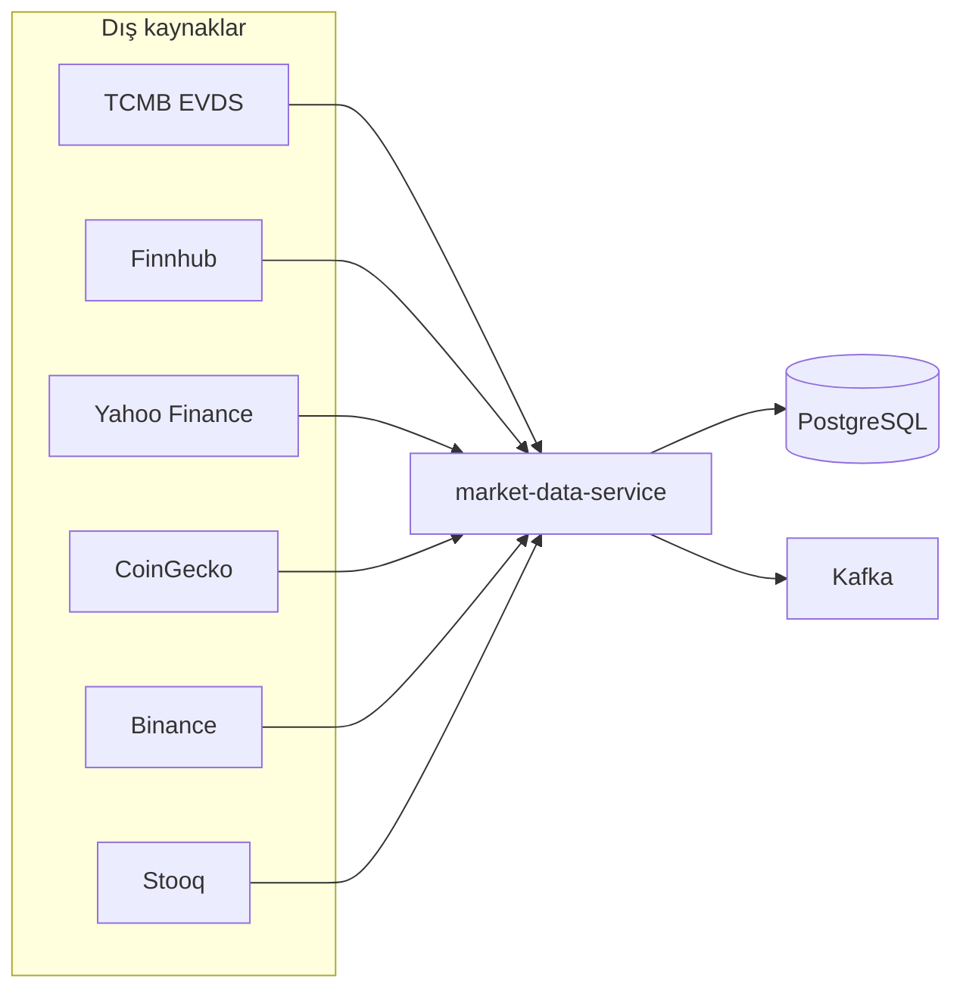
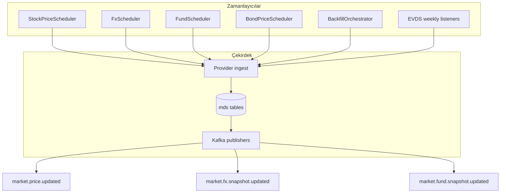
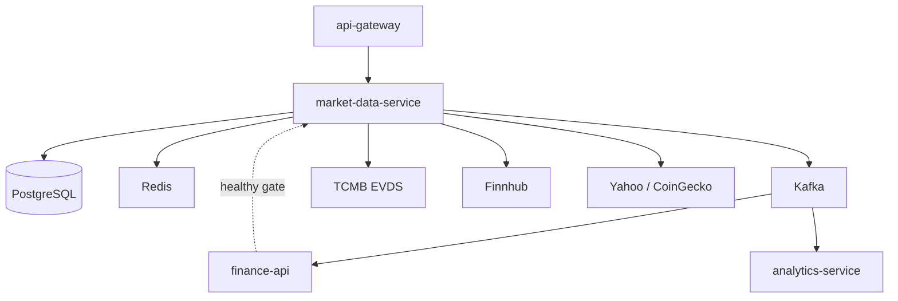
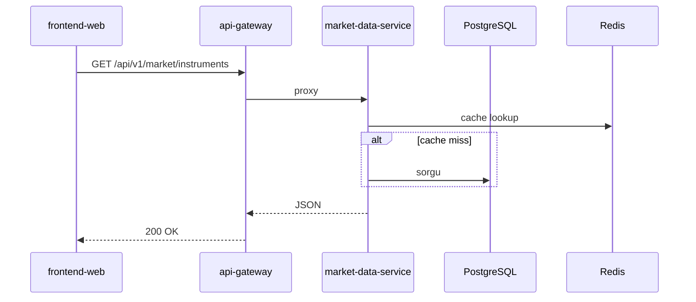
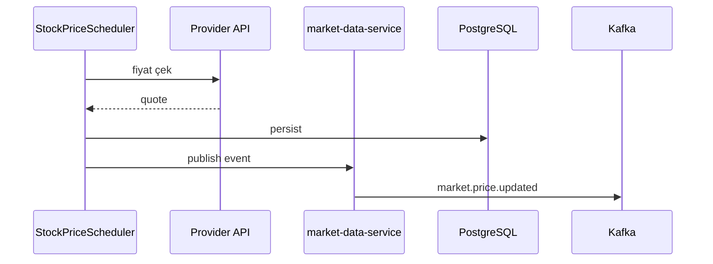

# market-data-service

## Zusammenfassung

**market-data-service (MDS)** ist die **Marktdaten-Engine** der Plattform. Es verwaltet den Instrumentenkatalog; holt Live- und Historienpreise von externen Anbietern (TCMB EVDS, Finnhub, Yahoo, CoinGecko, Binance usw.); aktualisiert sie per Scheduler. Preisänderungen werden über Kafka-Topics veröffentlicht und speisen `finance-api` sowie `analytics-service`.

## Verantwortlichkeiten

- Instrumentenkatalog BIST, Nasdaq, Krypto, Fonds, FX, Anleihen, Eurobond
- Live-Preis-Scheduler (Aktien, FX, Anleihen, Fonds-NAV, Krypto)
- Historien-Backfill und Gap Repair
- TCMB EVDS: Leitzins, Repo, TL-Einlagen, Anleihen-Serien, CPI
- REST-API: `/api/v1/market/**`, `/api/v1/rates/**` (über Gateway)
- Kafka: `market.price.updated`, FX- und Fonds-Snapshot-Topics
- Redis / Hybrid-Cache für häufig gelesene Endpunkte

## Außerhalb des Aufgabenbereichs

- Benutzerportfolio und Transaktionen — `finance-api`
- Portal-JWT / Admin — `api-gateway` + `finance-api`
- RSI / technische Insights — `analytics-service`
- News-RSS — `news-service`
- E-Mail — `notification-service`

## Möglichkeiten

| Perspektive | Fähigkeit |
|-------------|-----------|
| Portal (indirekt) | Marktlisten, Chartdaten, Bankkurse, Zinskarten als Datenquelle |
| API-Consumer | Instrumente listen, Historien-Serien, Raten, Fundamentals |
| Betrieb | Ingestion-Status, Provider-Health, Debug-Endpunkte |
| Plattform | Echtzeit-Preisveröffentlichung per Kafka |

## Laufzeit

| Eigenschaft | Wert |
|-------------|------|
| Maven-Modul | `market-data-service` |
| Container-Name | `market-data-service` |
| HTTP-Port (Docker) | **8080** (intern) |
| HTTP-Port (lokal `dev`) | **8082** |
| Spring-Profile | `dev` (H2), `docker` (PostgreSQL) |
| Compose-Abhängigkeit | Start nach `finance-api` **healthy** |

## Externe Anbieter-Karte



## Scheduler-Pipeline (Übersicht)



## Abhängigkeiten

| Komponente | Verwendung |
|------------|------------|
| PostgreSQL | Docker: DB `finance`; dev: H2 im Speicher |
| Redis | Preis- / Katalog-Cache |
| Kafka | Preis- und Snapshot-Publish |
| HTTP extern | TCMB EVDS, Finnhub, Yahoo, CoinGecko, Binance, Stooq usw. |
| HTTP intern | `finance-api` (Bootstrap / Katalog-Sync) |

## Kontextdiagramm



## HTTP-Datenflüsse

### Controller

| Controller | Pfad (Gateway) | Beschreibung |
|------------|----------------|--------------|
| `MarketDataController` | `/api/v1/market/**` | Instrumente, Spotpreis, Katalog |
| `RatesController` | `/api/v1/rates/**` | Leitzins, Repo, TL-Einlagen |
| `MarketHistoryController` | `/api/v1/market/.../history` | Historien-Serien |
| `MarketFundamentalsController` | fundamentals | Fundamentaldaten |
| `IngestionStatusController` | internal/status | Backfill-Fortschritt |
| `ProviderHealthController` | health | Anbieterstatus |

### Leseanfrage



## Kafka / Ereignisflüsse

Quelle: [`MarketDataTopics.java`](../../../market-data-service/src/main/java/com/company/marketdataservice/shared/kafka/MarketDataTopics.java).

| Topic | Produzent | Consumer (Beispiel) | Inhalt |
|-------|-----------|---------------------|--------|
| `market.price.updated` | MDS | finance-api, analytics-service | Spotpreis-Update |
| `market.fx.snapshot.updated` | MDS | finance-api | FX-Snapshot |
| `market.fund.snapshot.updated` | MDS | finance-api | TEFAS-NAV-Snapshot |

### Scheduler → Kafka



## Scheduler / Hintergrundaufgaben

| Komponente | Auslösung | Aufgabe |
|------------|-----------|---------|
| `StockPriceScheduler` | `scheduler.stock.delay-ms` (~30s Demo) | Aktienpreise |
| `FxScheduler` | `scheduler.fx.delay-ms` (~5 Min.) | Devisen |
| `FundScheduler` | fixed delay | TEFAS NAV |
| `BondPriceScheduler` | `scheduler.bond.delay-ms` | Anleihen |
| `BondHistoryRefreshScheduler` | Cron (Istanbul) | Anleihen-Historie |
| `BackfillOrchestrator` | Startup + scheduled | Historien-Backfill |
| `MetalSpotHistoryBootstrapper` | delayed | Rohstoff-Historie |
| `PolicyRateWeeklyBootstrapListener` | wöchentlicher Cron | EVDS Leitzins |
| `RepoRateBootstrapListener` | wöchentlicher Cron | Repo-Satz |
| `TlDepositWeeklyBootstrapListener` | wöchentlicher Cron | TL-Einlagen |
| `CpiMonthlyBootstrapListener` | monatlicher Cron | VPI |
| `TefasNavHistoryGapRepairScheduler` | täglich | Fonds-NAV-Lücken |
| `TrGovUsdEurobondHistoryRefreshScheduler` | Cron | Eurobond-Historie |
| `SharesOutstandingWeeklyScheduler` | wöchentlich | Aktienanzahl-Validierung |

Beim ersten Stack-Start kann Backfill **~30 Minuten** dauern — [getting-started.md](../getting-started.md).

## Datenmodell

| Element | Wert |
|---------|------|
| Flyway | `market-data-service/src/main/resources/db/migration/` |
| History-Tabelle | `mds_flyway_schema_history` |
| Hauptkonzepte | Instrument-Mappings, `mds_market_price_history`, EVDS-Ratenpunkte, Provider-Mapping |

**Dev-Profil:** H2 im Speicher — keine Produktionsdaten. Docker teilt PostgreSQL-DB `finance`.

## Paket- / Codestruktur

```
market-data-service/src/main/java/com/company/marketdataservice/
├── spot/           # Live-Preis, MarketDataController
├── history/        # Backfill, Historien-Serie
├── rates/          # EVDS-Raten, RatesController
├── fund/           # TEFAS NAV
├── fx/             # FX-Snapshot
├── bond/           # Anleihen
├── eurobond/       # TR USD Eurobond
├── fundamentals/   # Fundamentaldaten
├── shared/kafka/   # MarketDataTopics, Publisher
└── bootstrap/      # Startup, Health
```

## Konfiguration

| Variable | Beschreibung |
|----------|--------------|
| `TCMB_API_KEY` / `MARKET_EVDS_API_KEY` | EVDS (nicht leer `KEY=` schreiben) |
| `FINNHUB_API_KEY` | Nasdaq / Aktien |
| `MARKET_HISTORY_BACKFILL_*` | Backfill-Verhalten |
| `scheduler.*.delay-ms` | Demo-Rate-Limit-konforme Intervalle |
| `SPRING_DATASOURCE_URL` | Docker PostgreSQL |
| `KAFKA_BOOTSTRAP_SERVERS` | Kafka |

Vollständige Liste: [configuration.md](../configuration.md).

## Beobachtbarkeit

| Kanal | Detail |
|-------|--------|
| Logs | `app.logs` |
| Metriken | Prometheus-Job `market-data-service` |
| Trace | OTLP → Jaeger |

Monitoring: `docker compose logs -f market-data-service`

Details: [observability.md](../observability.md).

## Lokale Ausführung

```bash
mvn -pl market-data-service -am spring-boot:run -Dspring-boot.run.profiles=dev
```

Port **8082**. Für echtes EVDS/Finnhub Schlüssel in `application-dev.yml` oder per Env setzen.

Einrichtung: [getting-started.md](../getting-started.md) · Entwicklung: [development.md](../development.md).

## Verwandte Dokumente

| Dokument | Inhalt |
|----------|--------|
| [finance-api.md](finance-api.md) | BFF und Kafka-Consumer |
| [analytics-service.md](analytics-service.md) | Preis-Event-Consumer |
| [api-gateway.md](api-gateway.md) | Route `/api/v1/market/**` |
| [architecture.md](../architecture.md) | Plattformfluss |
