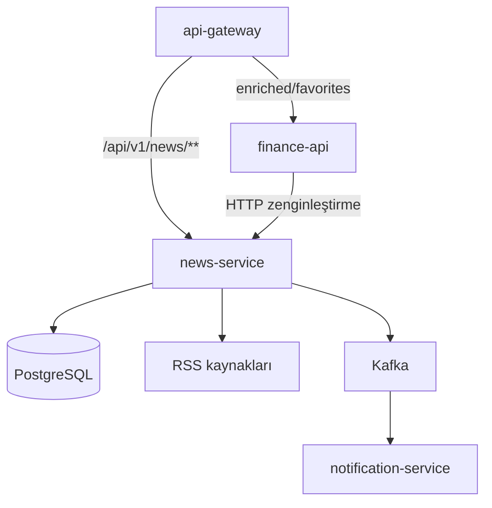
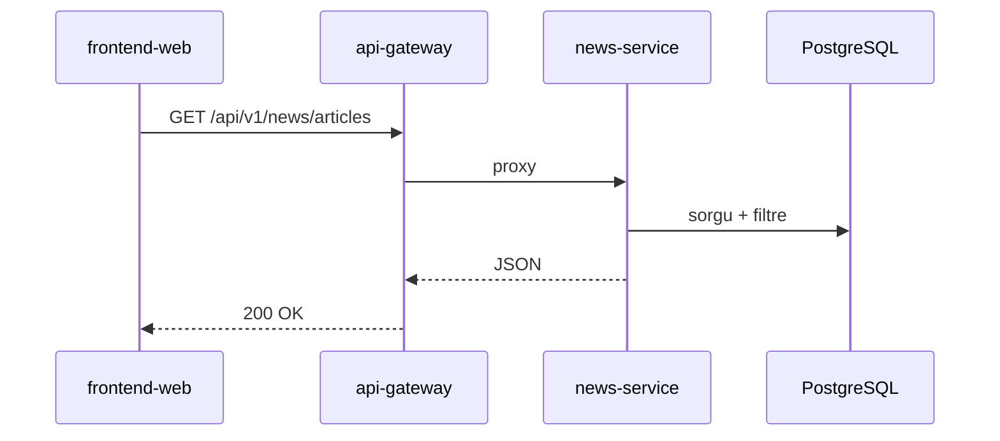
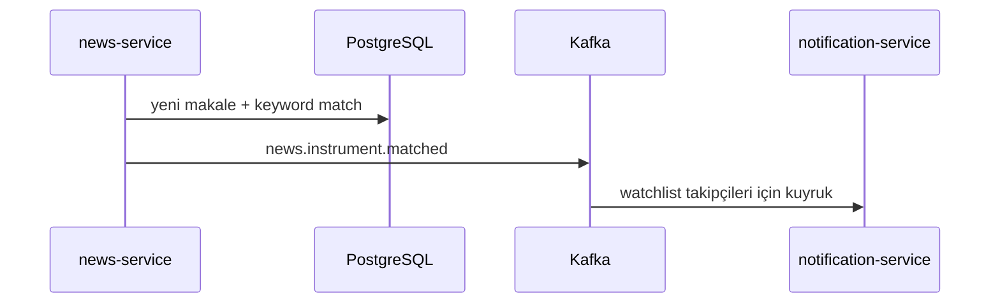
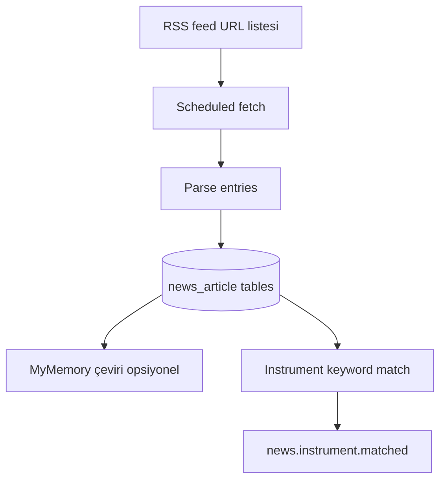

# news-service

## Zusammenfassung

**news-service** verwaltet den **Finanz-News-Feed**: definierte RSS-Quellen werden periodisch abgerufen, Artikel in PostgreSQL gespeichert, optional per MyMemory übersetzt und über eine Roh-News-REST-API bereitgestellt. Nach Instrument-Schlüsselwort-Matching wird `news.instrument.matched` nach Kafka veröffentlicht.

## Verantwortlichkeiten

- RSS-Ingestion (geplante Aufgaben)
- News-Speicherung, Filterung, Listen-API (`NewsController`)
- Mehrsprachige Übersetzung (MyMemory)
- Instrument–News-Matching und Kafka-Event-Produktion
- Admin-News-Metriken (`AdminNewsMetricsController`)

## Außerhalb des Aufgabenbereichs

- News-Favoriten und angereicherte Portal-Ansicht — `finance-api` (`/api/v1/news/enriched/**`)
- Benutzerportfolio — `finance-api`
- E-Mail — `notification-service` (konsumiert `news.instrument.matched`)
- Marktpreise — `market-data-service`

## Möglichkeiten

| Perspektive | Fähigkeit |
|-------------|-----------|
| Portal (indirekt) | News-Liste, Filter, Übersetzung (Gateway → news oder finance BFF) |
| Admin | News-Quellen-KPI |
| Plattform | Benachrichtigung bei News zu Watchlist-Instrumenten |

## Laufzeit

| Eigenschaft | Wert |
|-------------|------|
| Maven-Modul | `news-service` |
| Container-Name | `news-service` |
| HTTP-Port | **8082** |
| Docker-Sicherheit | `read_only` Root-FS, `tmpfs` `/tmp`, `cap_drop: ALL` |
| Pflicht-Env | `NEWS_DB_PASSWORD` (`Docker/.env`) |

## Abhängigkeiten

| Komponente | Verwendung |
|------------|------------|
| PostgreSQL | DB `finance` (`DB_HOST`, `DB_*`) |
| Kafka | produziert `news.instrument.matched`; `app.logs` |
| HTTP extern | RSS-Feed-URLs |
| MyMemory | Übersetzungs-API (optional E-Mail für Kontingent) |

## Kontextdiagramm



## HTTP-Datenflüsse

### Routenaufteilung

| Pfad | Zielservice |
|------|-------------|
| `/api/v1/news/**` (roh) | news-service |
| `/api/v1/news/enriched/**`, `.../favorites/**` | finance-api |

### News-Liste



## Kafka / Ereignisflüsse

| Topic | Rolle | Beschreibung |
|-------|-------|--------------|
| `news.instrument.matched` | Produziert | News ↔ Instrument-Match |
| `app.logs` | Produziert | Log4j2 |

Quelle: [`KafkaTopicNames.java`](../../../news-service/src/main/java/com/company/newsservice/bootstrap/config/kafka/KafkaTopicNames.java).



## RSS-Ingestion-Pipeline



## Scheduler / Hintergrundaufgaben

| Komponente | Aufgabe |
|------------|---------|
| RSS-Ingestion-Scheduler | Feeds periodisch abrufen |
| Übersetzungs- / Bild-Backfill-Jobs | `NEWS_IMAGE_*`, Translation-Konfiguration |

Timeouts: `NEWS_RSS_CONNECT_TIMEOUT_MS`, `NEWS_RSS_READ_TIMEOUT_MS`.

## Datenmodell

| Element | Wert |
|---------|------|
| Flyway | `news-service/src/main/resources/db/migration/` |
| Hauptkonzepte | `news_article`, Übersetzungen, Topic-Tags, related symbols |

## Paket- / Codestruktur

```
news-service/src/main/java/com/company/newsservice/
├── query/            # NewsController
├── ingestion/        # RSS pipeline
├── admin/            # AdminNewsMetricsController
└── bootstrap/        # config, kafka, health
```

## Konfiguration

| Variable | Beschreibung |
|----------|--------------|
| `NEWS_DB_PASSWORD` | PostgreSQL (Compose Pflicht) |
| `NEWS_RSS_*` | Timeout, User-Agent, max entries |
| `NEWS_TRANSLATION_MYMEMORY_EMAIL` | Übersetzungskontingent |
| `news.instrument.keywords` | Symbol ↔ Schlüsselwort-Mapping |

Vollständige Liste: [configuration.md](../configuration.md).

## Beobachtbarkeit

| Kanal | Detail |
|-------|--------|
| Logs | `app.logs` |
| Metriken | Prometheus-Job `news-service` |

Details: [observability.md](../observability.md).

## Lokale Ausführung

```bash
# Postgres + Kafka (Docker) müssen laufen
mvn -pl news-service -am spring-boot:run
```

Port **8082** — nicht parallel mit `market-data-service` dev auf demselben Host-Port starten.

Einrichtung: [getting-started.md](../getting-started.md).

## Verwandte Dokumente

| Dokument | Inhalt |
|----------|--------|
| [finance-api.md](finance-api.md) | Enriched / Favorites BFF |
| [notification-service.md](notification-service.md) | Matched-News-Consumer |
| [api.md](../api.md) | Gateway-News-Route |
