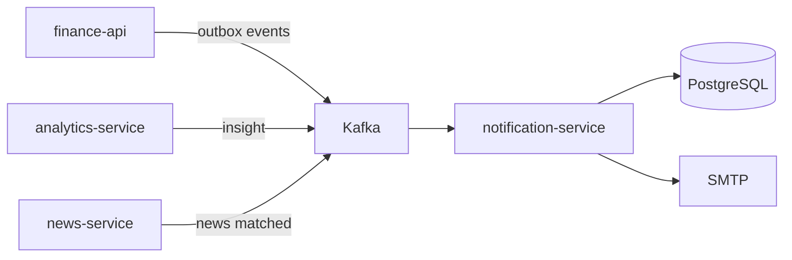
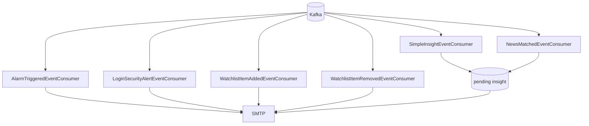
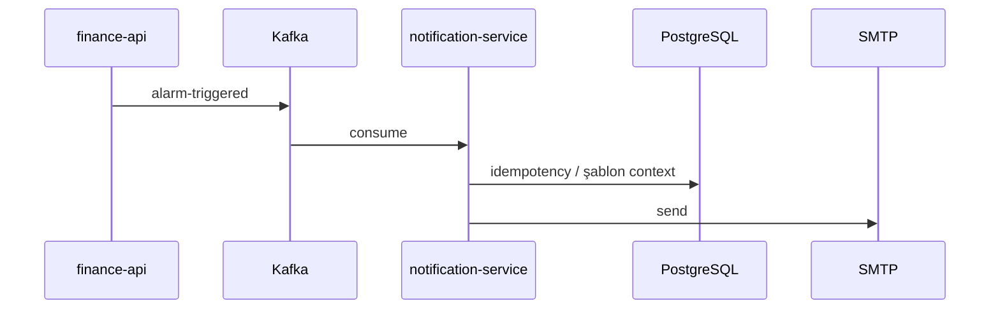

# notification-service

## Zusammenfassung

**notification-service** ist der **asynchrone Benachrichtigungskanal** der Plattform. Es hört auf Kafka-Domain-Events und versendet templated E-Mails per SMTP. Für Portal-Traffic gibt es keine zentrale API-Oberfläche; Abläufe sind ereignisgesteuert.

## Verantwortlichkeiten

- E-Mail bei ausgelöstem Alarm (`alarm-triggered`)
- Login-Sicherheitswarnung (`login-security.alert`)
- Watchlist hinzugefügt/entfernt
- Analytics Simple Insight (`analytics.insight.simple`)
- News–Instrument-Match (`news.instrument.matched`) — Watchlist-Follower
- Kafka-Retry und DLQ (`{topic}.dlq`)
- Pending-Insight- / Dedup-Tabellen (PostgreSQL)

## Außerhalb des Aufgabenbereichs

- Alarmbedingungs-Auswertung — `finance-api`
- Preisdaten — `market-data-service`
- News-Ingestion — `news-service`
- JWT / Gateway — `api-gateway`

## Möglichkeiten

| Perspektive | Fähigkeit |
|-------------|-----------|
| Portal-Benutzer | Alarm-, Watchlist-, Sicherheits- und Insight-E-Mails |
| Betrieb | SMTP-Konfiguration, Consumer-Lag, Health |
| Entwickler | Kafka-Event-Verträge testen |

## Laufzeit

| Eigenschaft | Wert |
|-------------|------|
| Maven-Modul | `notification-service` |
| Container-Name | `notification-service` |
| HTTP-Port | **8086** |
| Spring-Profile | `docker` |
| Mail-Health | `MANAGEMENT_HEALTH_MAIL_ENABLED=false` (Docker) |

## Abhängigkeiten

| Komponente | Verwendung |
|------------|------------|
| PostgreSQL | Pending Insight, Dedup-State |
| Kafka | Alle eingehenden Topics |
| SMTP | Gmail oder eigene `SMTP_*` |
| Keycloak | Nein (direkt) |

## Kontextdiagramm



## HTTP-Datenflüsse

Keine synchrone Portal-API. Im Gateway ist `notification-base-uri` definiert; OpenAPI-Diagnosepfade unter `/services/notification/...` — [api.md](../api.md).

Internes/diagnostisches HTTP minimal; Hauptoberfläche sind Kafka-Consumer.

## Kafka / Ereignisflüsse

### Alle Consumer (Übersicht)



Quelle: [`KafkaTopicNames.java`](../../../notification-service/src/main/java/com/company/notification/bootstrap/config/kafka/KafkaTopicNames.java).

| Topic | Produzent | Consumer-Klasse |
|-------|-----------|-----------------|
| `alarm-triggered` | finance-api | `AlarmTriggeredEventConsumer` |
| `login-security.alert` | finance-api | `LoginSecurityAlertEventConsumer` |
| `watchlist.item.added` | finance-api | `WatchlistItemAddedEventConsumer` |
| `watchlist.item.removed` | finance-api | `WatchlistItemRemovedEventConsumer` |
| `analytics.insight.simple` | analytics-service | `SimpleInsightEventConsumer` |
| `news.instrument.matched` | news-service | `NewsMatchedEventConsumer` |

### Alarm-E-Mail



### DLQ

Bei Verarbeitungsfehlern Weiterleitung nach `{originalTopic}.dlq` (`KafkaConsumerConfig`).

## Scheduler / Hintergrundaufgaben

Vollständig event-driven; keine periodischen Jobs (Pending-Insight-Flush wird im Consumer ausgelöst).

## Datenmodell

| Element | Wert |
|---------|------|
| Flyway | `notification-service/src/main/resources/db/migration/` |
| Hauptkonzepte | `pending_insight_events`, Delivery-Dedup, Alarm-Template-State |

## Paket- / Codestruktur

```
notification-service/src/main/java/com/company/notification/
├── alarm/            # AlarmTriggeredEventConsumer
├── watchlist/        # Watchlist consumers
├── security/         # LoginSecurityAlertEventConsumer
├── insight/          # Insight + NewsMatched consumers
└── bootstrap/config/kafka/
```

## Konfiguration

| Variable | Beschreibung |
|----------|--------------|
| `SMTP_USERNAME` / `SMTP_PASSWORD` | Absenderkonto |
| `NOTIFICATION_MAIL_FROM` | From-Adresse |
| `APP_PORTAL_PUBLIC_URL` | E-Mail-Links (`http://localhost:5173`) |
| `KAFKA_BOOTSTRAP_SERVERS` | Kafka |
| `SPRING_DATASOURCE_URL` | PostgreSQL |

Vollständige Liste: [configuration.md](../configuration.md).

## Beobachtbarkeit

| Kanal | Detail |
|-------|--------|
| Logs | `app.logs` |
| Metriken | Prometheus-Job `notification-service` |
| Grafana | Log-Pipeline-Panels (indirekt) |

Details: [observability.md](../observability.md).

## Lokale Ausführung

```bash
export KAFKA_BOOTSTRAP_SERVERS=localhost:9092
mvn -pl notification-service -am spring-boot:run
```

Port **8086**. SMTP über `SMTP_*` in `Docker/.env`.

Einrichtung: [getting-started.md](../getting-started.md).

## Verwandte Dokumente

| Dokument | Inhalt |
|----------|--------|
| [finance-api.md](finance-api.md) | Outbox-Produzent |
| [analytics-service.md](analytics-service.md) | Insight-Produzent |
| [news-service.md](news-service.md) | News-Matched-Produzent |
| [architecture.md](../architecture.md) | Kafka-Übersicht |
