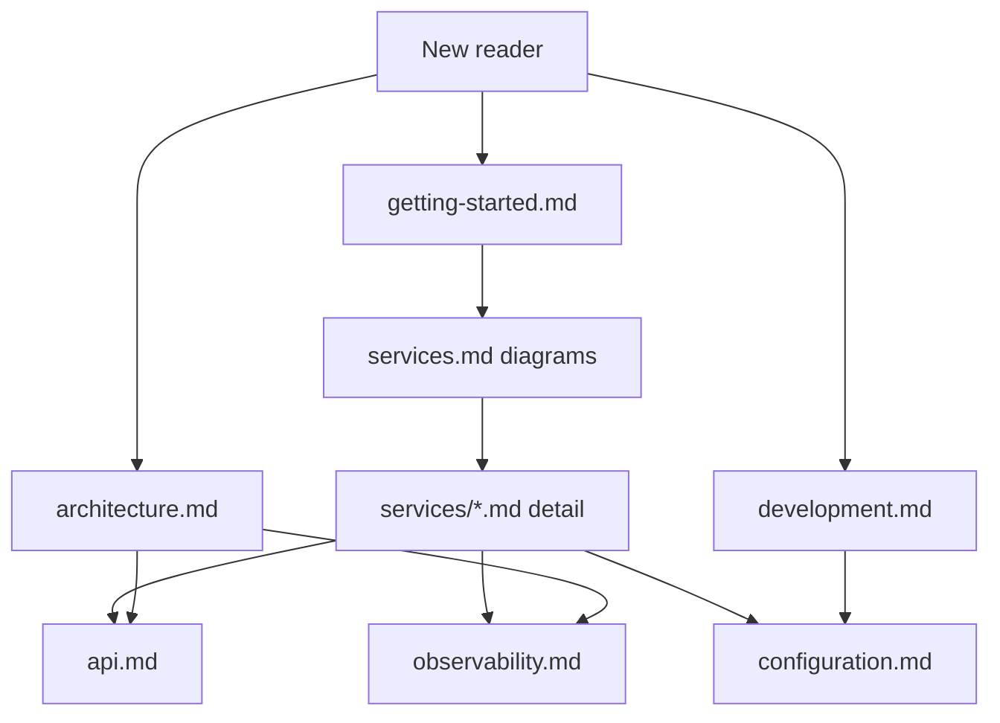

# Documentation

Technical guides for the Finance Platform monorepo. Use this folder as the authoritative source for current architecture and configuration; `frontend-web/README.md` contains only Vite template notes.

### Documentation map

| Reading path | Order |
|--------------|-------|
| First-time setup | getting-started → services.md → configuration |
| API integration | api.md → services/api-gateway.md |
| Service deep dive | services/README → relevant service MD |
| Operations | observability → configuration |

## Guides

| Document | When to read |
|----------|--------------|
| [architecture.md](architecture.md) | Understanding system components, Kafka, security, and data flow |
| [getting-started.md](getting-started.md) | First-time setup (Docker or hybrid local) |
| [services.md](services.md) | Port summary and service index |
| [services/README.md](services/README.md) | Per-service detailed guides (flows, diagrams) |
| [api.md](api.md) | `/api/v1` routing, Swagger, authentication |
| [development.md](development.md) | Maven, profiles, tests, frontend proxy |
| [configuration.md](configuration.md) | `Docker/.env` and service environment variables |
| [observability.md](observability.md) | Prometheus, Grafana, Jaeger, OpenSearch |

## Quick links

- Root README (EN · TR · DE): [../../README.md](../../README.md) · [../../README.tr.md](../../README.tr.md) · [../../README.de.md](../../README.de.md)
- Docker Compose: [../Docker/docker-compose.yml](../../Docker/docker-compose.yml)
- Environment template: [../Docker/.env.example](../../Docker/.env.example)
- Keycloak realm: [../Docker/keycloak/realm-finance.json](../../Docker/keycloak/realm-finance.json)
- Frontend env: [../frontend-web/.env.example](../../frontend-web/.env.example)

## Updating documentation

When you change architecture or ports, update the relevant `docs/english/*.md` file in the same PR; keep Turkish and German copies (`docs/turkce/`, `docs/deutsch/`) in sync in the same PR when possible. If gateway route order changed, review [api.md](api.md) and [architecture.md](architecture.md) together.
