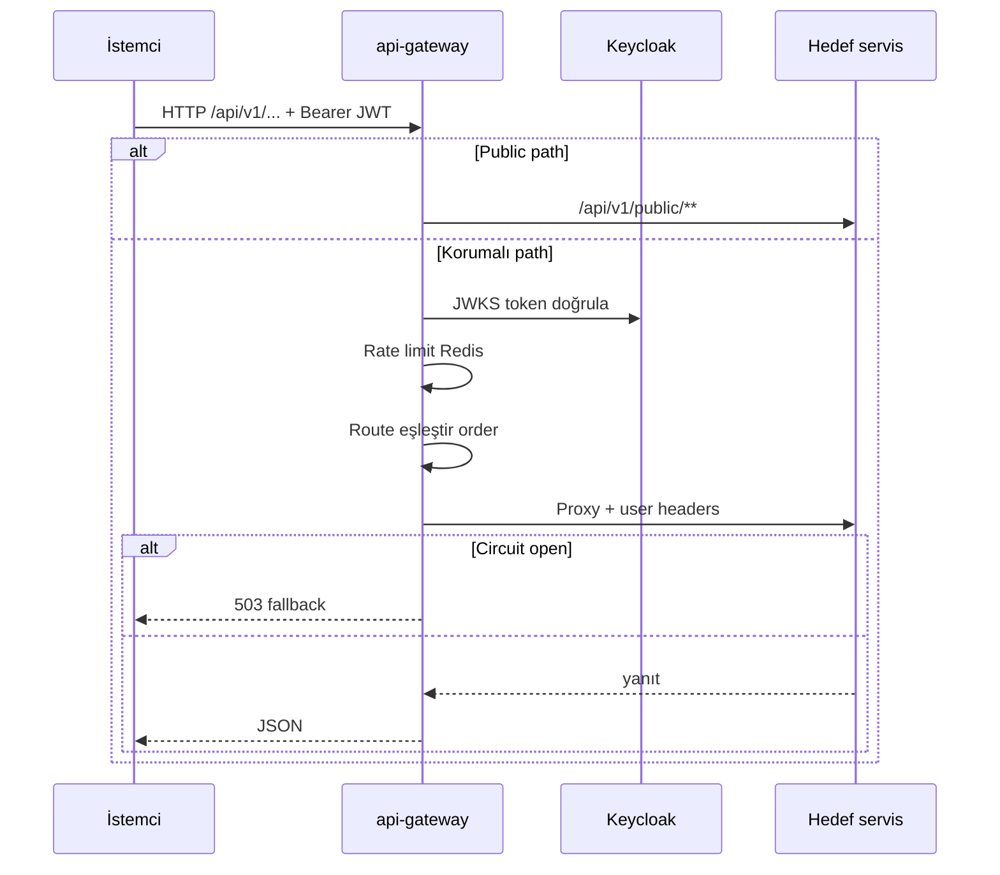
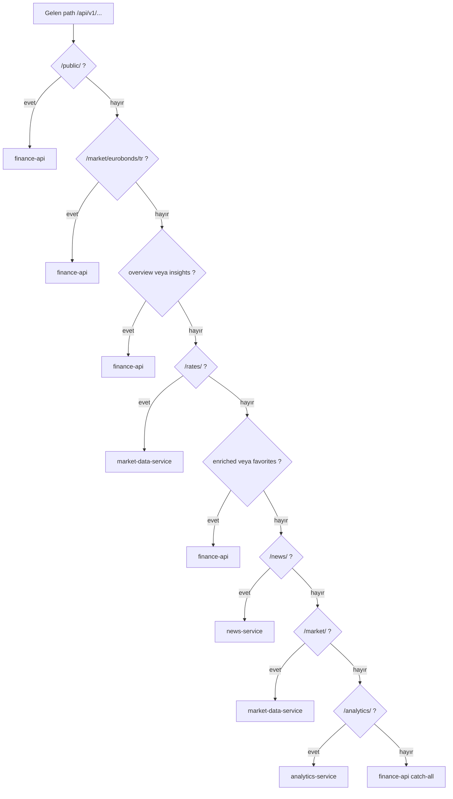
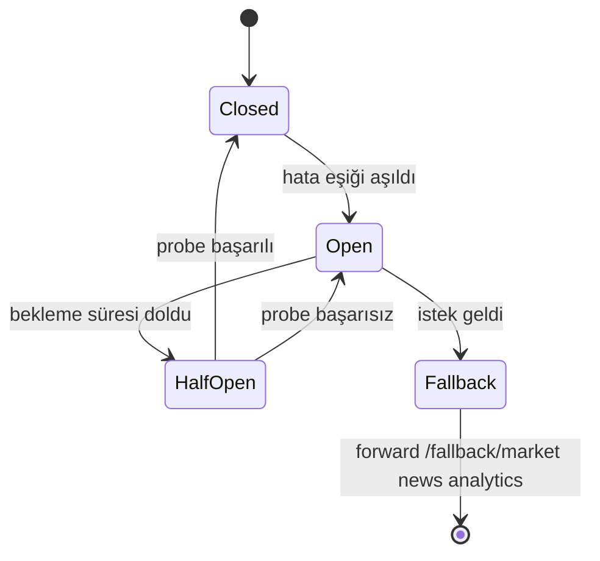
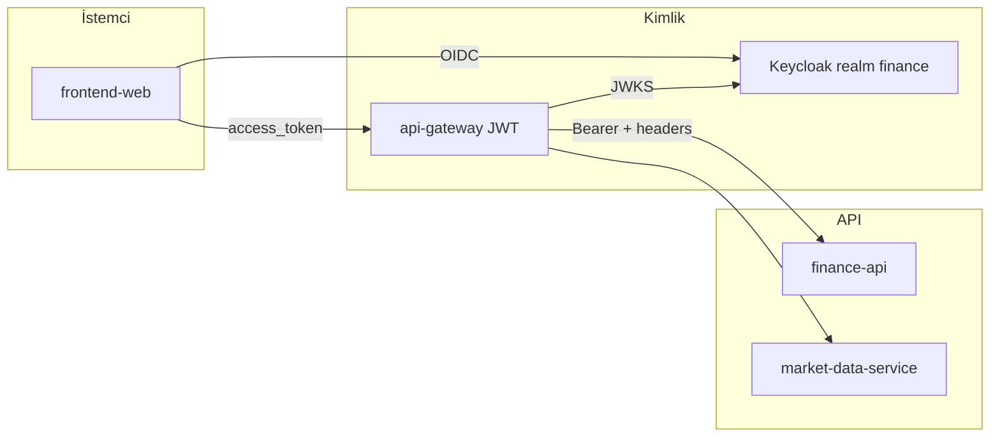
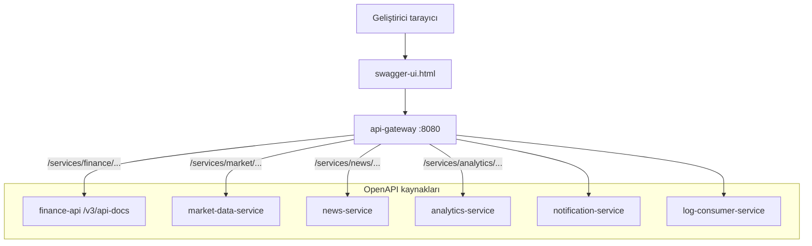
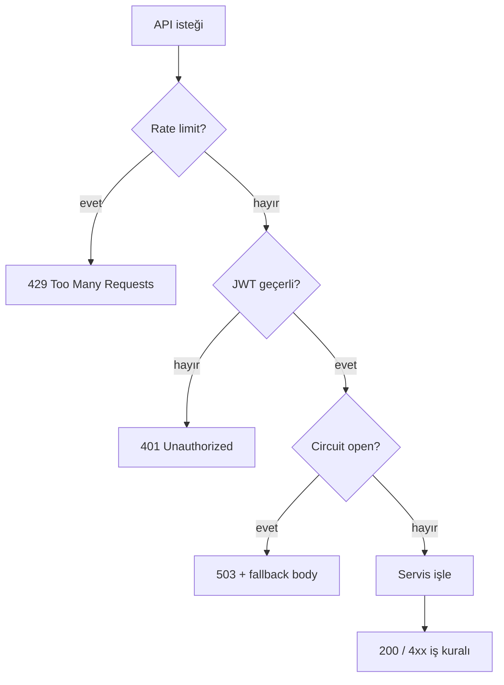

# API

The external HTTP contract is served through **api-gateway** at **`/api/v1/**`**. Service interactions: [services.md](services.md). Environment: [configuration.md](configuration.md).

---

## Request lifecycle



---

## Core rules

- External contract: **`/api/v1/**`**
- Identity: `Authorization: Bearer <access_token>` (Keycloak realm `finance`)
- Local Docker entry point: **http://localhost:8080** (api-gateway)
- Public endpoints: `/api/v1/public/**` (registration, login completion, etc.)

## Gateway routing

Routes with a lower **order** value match first (`GatewayRoutesConfig`).

### Route decision tree



### Route table

| Path prefix | Target service |
|------------|----------------|
| `/api/v1/public/**` | finance-api |
| `/api/v1/market/overview`, `/api/v1/market/insights` | finance-api |
| `/api/v1/market/eurobonds/tr/**` | finance-api |
| `/api/v1/market/**` | market-data-service |
| `/api/v1/rates/**` | market-data-service |
| `/api/v1/news/enriched/**`, `/api/v1/news/favorites/**` | finance-api |
| `/api/v1/news/**` | news-service |
| `/api/v1/analytics/**` | analytics-service |
| `/api/v1/**`, `/health` | finance-api (rate limit + circuit breaker) |

Circuit breaker fallback: `/fallback/market`, `/fallback/news`, `/fallback/analytics`.

### Circuit breaker flow



| Circuit | Fallback path | Downstream |
|---------|---------------|------------|
| `marketCircuitBreaker` | `/fallback/market` | market-data-service |
| `newsCircuitBreaker` | `/fallback/news` | news-service |
| `analyticsCircuitBreaker` | `/fallback/analytics` | analytics-service |
| `financeCircuitBreaker` | — | finance-api (rate limit) |

## Authentication flow



Public endpoints (`/api/v1/public/**`) may not require JWT at the gateway depending on the route; registration/login endpoints live in finance-api.

## Development proxy (frontend)

| Mode | Env | Behavior |
|-----|-----|----------|
| Single proxy (Docker) | `VITE_DEV_PROXY_GATEWAY=true` | All `/api` → gateway |
| Default local | — | `/api` → finance-api (8080); market via BFF |
| Direct MDS | `VITE_DEV_MARKET_DIRECT_TO_MDS=true` | `/api/v1/market` → 8082 (debug) |

## OpenAPI / Swagger

### Swagger aggregation



- UI (via gateway): http://localhost:8080/swagger-ui.html
- Aggregated documents: `/services/{finance|market|news|analytics|notification|logs}/v3/api-docs`
- Each service uses springdoc with its own `application-openapi.yml`

Routes may differ in the gateway test profile (`TestGatewayRoutesConfig`).

## Example requests

```http
GET /api/v1/market/instruments?assetClass=STOCK
Authorization: Bearer eyJ...
```

```http
GET /api/v1/public/health
```

Public registration/login endpoints are under `finance-api` `PublicRegistrationController`, `PublicAuthenticationController`; use Swagger for the full list.

## Errors and limits

- Gateway Redis rate limiter: per user (`userIdKeyResolver`)
- 429 / 503: rate limit or circuit breaker open
- `finance-api` dev profile `app.expose-internal-errors: true` — disable in production

## log-consumer and notification HTTP

The gateway configuration defines base URIs for `log-consumer` and `notification`; primary portal traffic goes through finance / market / news / analytics under `/api/v1`. REST surfaces for these services are mostly internal/diagnostic; OpenAPI paths are exposed at the gateway via `/services/notification/...` and `/services/logs/...`.

## Versioning

Only `v1` is published today. Breaking changes are expected to add a new prefix (`/api/v2`) and gateway routes.

---

## Error codes (summary)



---

## Related documents

| Document | Content |
|-------|--------|
| [services/api-gateway.md](services/api-gateway.md) | Gateway details |
| [configuration.md](configuration.md) | JWT, CORS env |
| [development.md](development.md) | Vite proxy |
