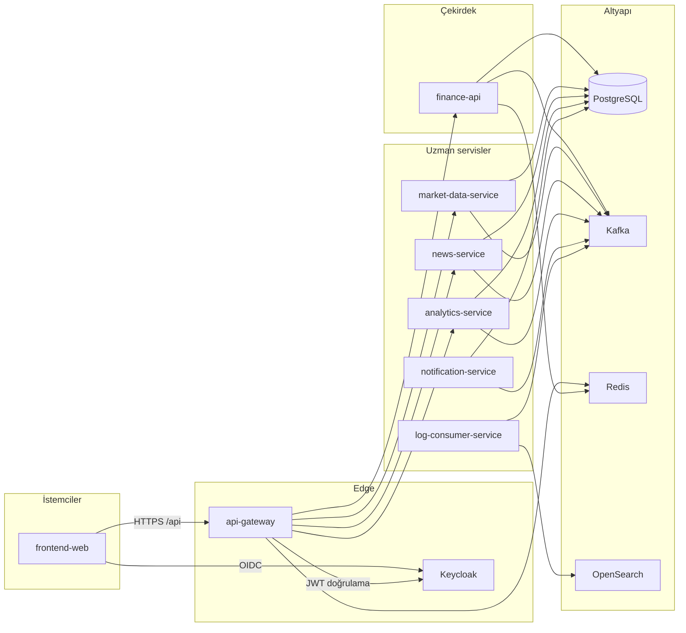
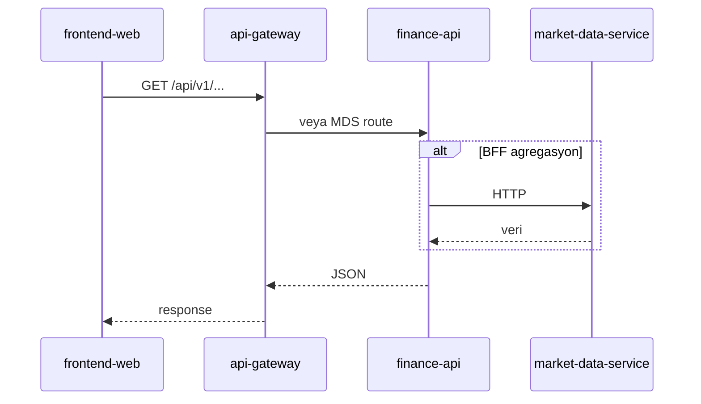
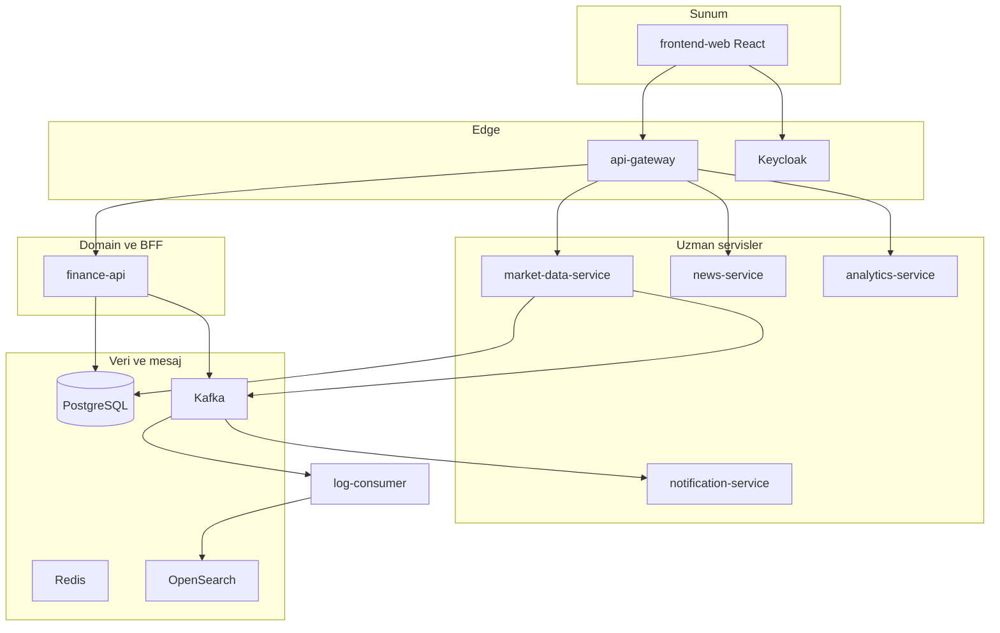
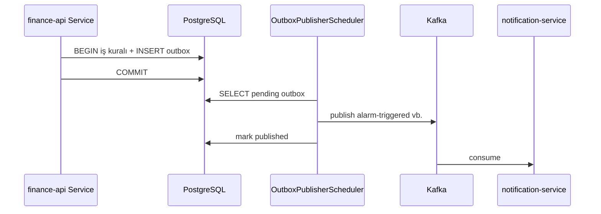
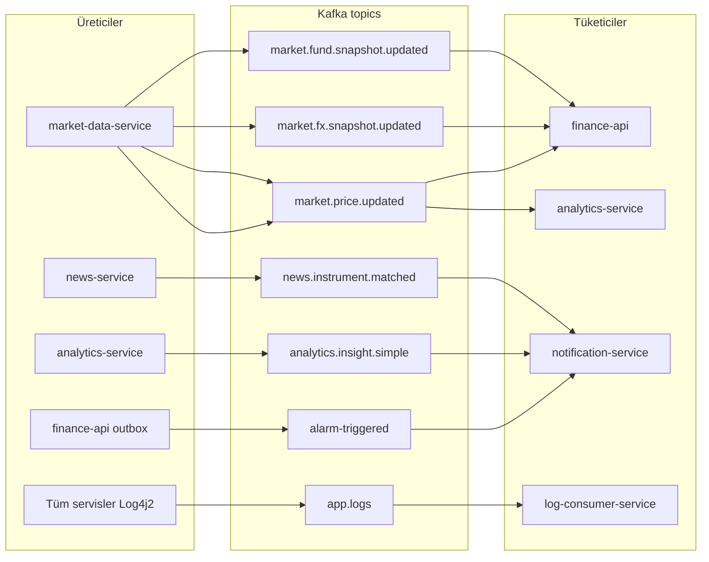
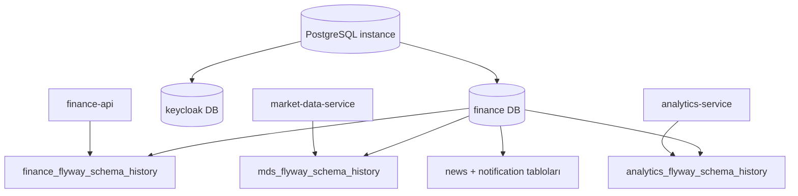
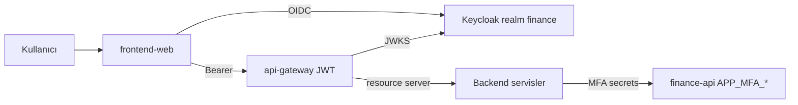

# Architecture

## Overview

The platform consists of a single HTTP entry point at the **edge** layer (`api-gateway`), **domain** layer `finance-api` (portal BFF and business rules), and **specialized** microservices. Events flow mostly over **Kafka**; persistent data lives in **PostgreSQL** (Flyway schema/table per service).

## Request path (typical)

1. The browser calls `/api/v1/...` through `frontend-web` (routed to the gateway via Vite dev proxy or in Docker).
2. **api-gateway** validates the JWT with Keycloak JWKS; forwards user context to downstream headers.
3. The target service is selected by path prefix (specific routes come before the general `finance-api` route — see [api.md](api.md)).
4. When needed, `finance-api` HTTP-proxies to `market-data-service` or consumes from Kafka.

## Layered architecture

Detailed service diagrams: [services.md](services.md) · Service guides: [services/README.md](services/README.md).

## Service responsibilities

| Service | Role | Detailed guide |
|--------|-----|----------------|
| **api-gateway** | TLS termination (in deploy), CORS, rate limiting (Redis), circuit breaker, route aggregation | [services/api-gateway.md](services/api-gateway.md) |
| **finance-api** | User, portfolio, alerts, chart records, admin KPI, registration/MFA, news enrichment proxy, market overview | [services/finance-api.md](services/finance-api.md) |
| **market-data-service** | Instrument catalog, live/historical prices, TCMB EVDS (rates, bonds, TL deposits), provider integrations | [services/market-data-service.md](services/market-data-service.md) |
| **news-service** | RSS fetch, storage, translation, raw news API | [services/news-service.md](services/news-service.md) |
| **analytics-service** | Consumes `market.price.updated`, RSI and other indicators, insight generation | [services/analytics-service.md](services/analytics-service.md) |
| **notification-service** | Alert email, login warnings, watchlist, insight and news matching | [services/notification-service.md](services/notification-service.md) |
| **log-consumer-service** | `app.logs` topic → OpenSearch indexing | [services/log-consumer-service.md](services/log-consumer-service.md) |
| **frontend-web** | SPA, Keycloak login, portal pages | [services/frontend-web.md](services/frontend-web.md) |

All service guides: [services/README.md](services/README.md).

## Event-driven flow (summary)

| Topic | Producer (example) | Consumer (example) |
|-------|----------------|----------------|
| `market.price.updated` | market-data-service | analytics-service, finance-api |
| `market.fx.snapshot.updated` | market-data-service | finance-api, analytics-service |
| `market.fund.snapshot.updated` | market-data-service | finance-api |
| `alarm-triggered` | finance-api (outbox) | notification-service |
| `watchlist.item.added` / `removed` | finance-api (outbox) | notification-service |
| `login-security.alert` | finance-api (outbox) | notification-service |
| `transaction-executed` | finance-api (outbox) | (domain) |
| `analytics.insight.simple` | analytics-service | notification-service |
| `news.instrument.matched` | news-service | notification-service |
| `app.logs` | All Spring services (Log4j2) | log-consumer-service |

`finance-api` publishes critical domain events to Kafka via **transactional outbox** (`OutboxPublisherScheduler`).

### Transactional outbox pattern

### Kafka topic map (visual)

## Data and schema

- Single PostgreSQL instance (`finance` database); separate `keycloak` DB for Keycloak ([`Docker/postgres/init`](../../Docker/postgres/init)).
- Flyway table names are service-specific (e.g. `finance_flyway_schema_history`, `mds_flyway_schema_history`, `analytics_flyway_schema_history`).
- Local `market-data-service` **dev** profile may default to in-memory H2; Docker/production uses PostgreSQL.

## Data persistence

## Security

- **Keycloak** realm: `finance`, public client: `finance-gateway` (SPA), confidential: `finance-portal` (direct grant / backend).
- Gateway and services use **OAuth2 Resource Server** (JWT).
- In development, header-based user resolution can be enabled with `APP_SECURITY_ALLOW_HEADER_USER_FALLBACK`; it should be disabled in production.
- Portal MFA (TOTP), trusted device cookie, and registration email verification live in `finance-api`.

## Observability

Metrics: Spring Actuator + Prometheus scrape. Traces: OTLP → Jaeger. Logs: JSON → Kafka `app.logs` → OpenSearch. Details: [observability.md](observability.md).

## Deployment note

Production topology is not defined in this repo; Docker Compose is for development/demo. Gateway `JWT_ISSUER_URI` must match an issuer reachable from the browser (`localhost:8085`).
