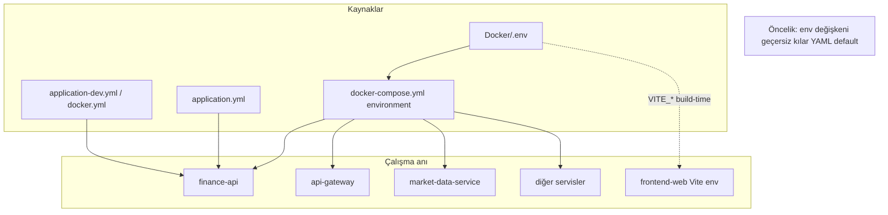
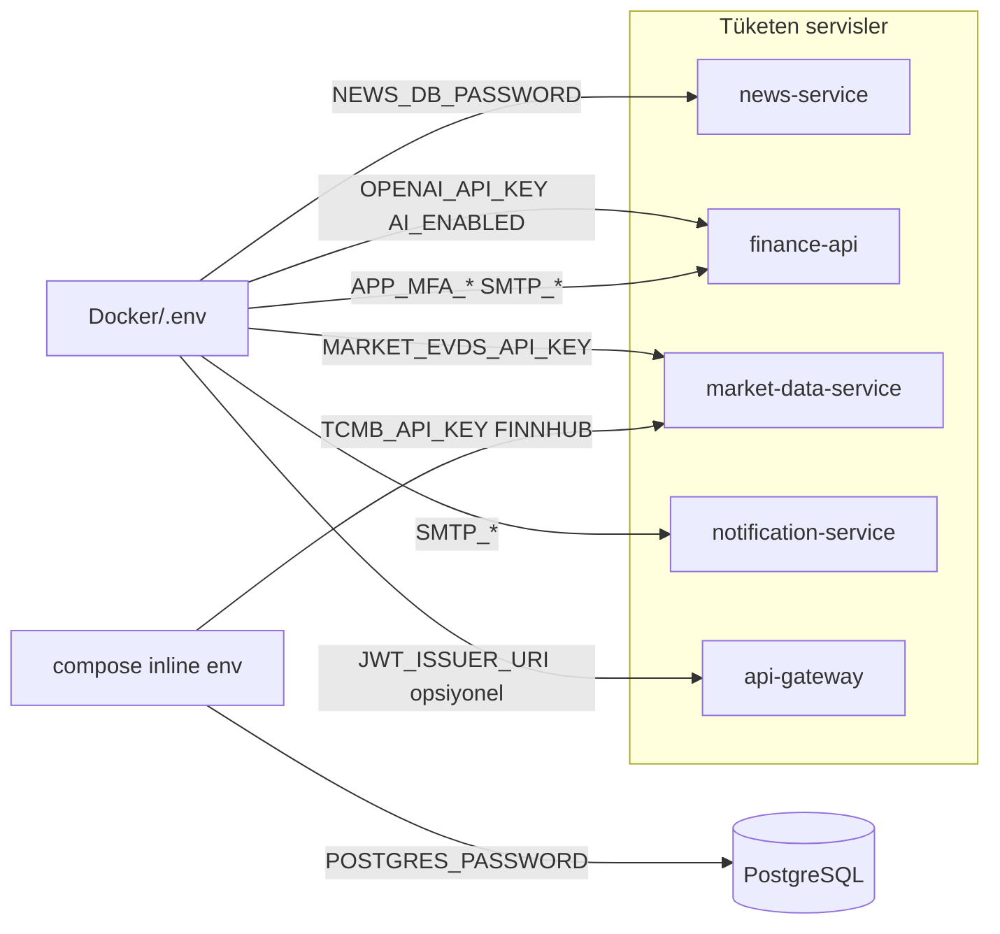
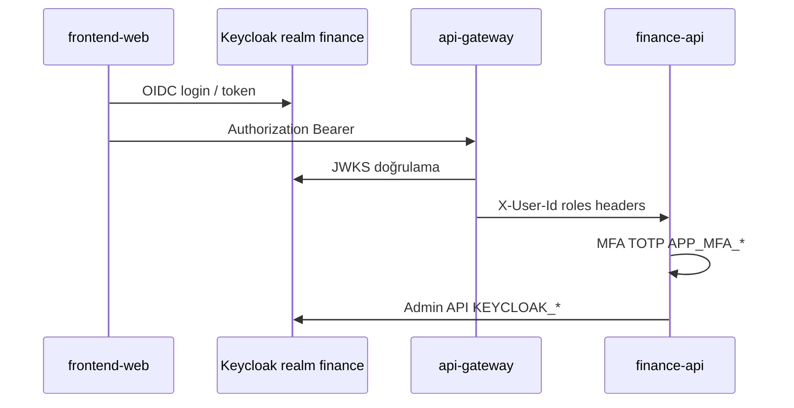
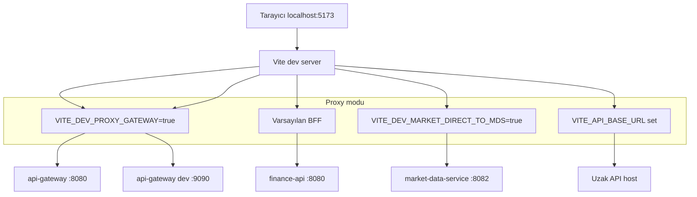
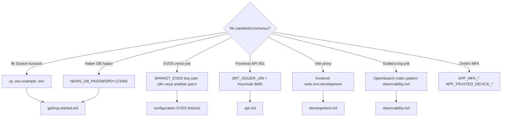

# Configuration

Environment variables, Spring `application*.yml` files, and Docker Compose together define platform behavior. Service interactions: [services.md](services.md). Development modes: [development.md](development.md).

---

## Configuration layers



| Layer | Location | When to change? |
|--------|-------|------------------|
| Compose fixed env | `Docker/docker-compose.yml` | Demo keys, profile list, internal hostname |
| `.env` | `Docker/.env` | Secrets / environment-specific values (SMTP, OpenAI, EVDS) |
| Spring profile | `application-{profile}.yml` | dev / docker / kafka / cache-redis |
| Frontend | `frontend-web/.env.development` | Vite proxy target |

---

## `.env` → service distribution



---

## Docker environment file

Template: [`Docker/.env.example`](../../Docker/.env.example)

Usage:

```bash
cd Docker
cp .env.example .env
```

Compose passes values to `finance-api` and other services via `env_file: .env`.

## Required / critical variables

| Variable | Service | Description |
|----------|--------|----------|
| `NEWS_DB_PASSWORD` | news-service | Required in Compose (`?` syntax). Copy of `.env.example` ships with `123456`; must match PostgreSQL `POSTGRES_PASSWORD` |
| `JWT_ISSUER_URI` | api-gateway | Browser issuer: `http://localhost:8085/realms/finance` |
| `KAFKA_BOOTSTRAP_SERVERS` | All Kafka users | Docker: `kafka:9092`, local: `localhost:9092` |

**Secrets:** `TCMB_API_KEY` and `FINNHUB_API_KEY` belong only in `Docker/.env` (`.env.example` has placeholders). Fill `.env` before `docker compose up`; no real keys in the repo.

## Market data (TCMB / EVDS)

| Variable | Note |
|----------|-----|
| `TCMB_API_KEY` | Required — `Docker/.env` only (EVDS / bonds / rates) |
| `MARKET_EVDS_API_KEY` | **Do not write an empty line** (`MARKET_EVDS_API_KEY=`) — Spring sees an empty string and the fallback key does not activate |
| `MARKET_EVDS_BASE_URL` | Default EVDS3 public API |
| `PROVIDERS_FINNHUB_ENABLED` / `FINNHUB_API_KEY` | NASDAQ and Finnhub history |
| `MARKET_HISTORY_BACKFILL_*` | Historical price backfill on first startup |

Detailed comments: Turkish lines inside `.env.example`.

## Security and identity



| Variable | Description |
|----------|----------|
| `APP_MFA_ENCRYPTION_SECRET` | TOTP secret encryption |
| `APP_TRUSTED_DEVICE_SIGNING_SECRET` | Trusted device cookie signature |
| `APP_SECURITY_ALLOW_HEADER_USER_FALLBACK` | Dev: `true`; prod: `false` |
| `KEYCLOAK_PORTAL_CLIENT_SECRET` | `finance-portal` client (`finance-portal-dev-secret` demo) |

Keycloak realm import: [`Docker/keycloak/realm-finance.json`](../../Docker/keycloak/realm-finance.json).

## AI (optional)

| Variable | Description |
|----------|----------|
| `AI_ENABLED` | Admin info card AI |
| `OPENAI_API_KEY` | Do not commit to the repo |
| `OPENAI_MODEL_ADMIN_CONTENT` | Default `gpt-4.1-mini` |

## Email

| Variable | Service |
|----------|--------|
| `SPRING_MAIL_*` | finance-api registration verification |
| `SMTP_USERNAME`, `SMTP_PASSWORD`, `NOTIFICATION_MAIL_FROM` | notification-service alerts |

SMTP / Gmail app password is set only in `Docker/.env` — **never commit to the repo**.

## Frontend

### Vite proxy modes (visual)



[`frontend-web/.env.example`](../../frontend-web/.env.example):

| Variable | Description |
|----------|----------|
| `VITE_PROXY_TARGET` | API target (gateway or finance-api) |
| `VITE_DEV_PROXY_GATEWAY` | `true` → all `/api` to single target |
| `VITE_DEV_MARKET_DIRECT_TO_MDS` | Debug: market direct to MDS |
| `VITE_API_BASE_URL` | Proxy bypass (full URL) |

## Profile avatars

| Variable | Default |
|----------|------------|
| `PROFILE_AVATAR_STORAGE_ROOT` | Local: `../../photos`, Docker: `/photos` volume |

Structure: `photos/{userId}/avatar.jpg`.

## OpenSearch

| Variable | Default (Compose) |
|----------|----------------------|
| `OPENSEARCH_USERNAME` / `PASSWORD` | `admin` / `123456789` |
| `OPENSEARCH_INDEX_PREFIX` | `application-logs` |

Dashboards first setup: index pattern `application-logs-*`, time field `@timestamp` ([observability.md](observability.md)).

## CORS

Gateway: `GATEWAY_CORS_ALLOWED_ORIGINS` (default `http://localhost:5173`).

When adding a new frontend origin, update gateway + Keycloak `redirectUris` / `webOrigins` together.

---

## Environment variable → file quick reference



---

## Related documents

| Document | Content |
|-------|--------|
| [getting-started.md](getting-started.md) | `.env` setup steps |
| [development.md](development.md) | Local profile override |
| [observability.md](observability.md) | OpenSearch, Prometheus env |
| [services.md](services.md) | Service port and interaction diagrams |
