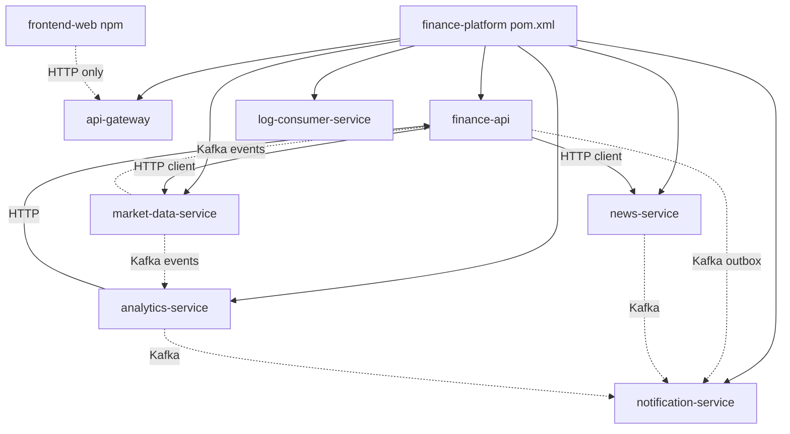
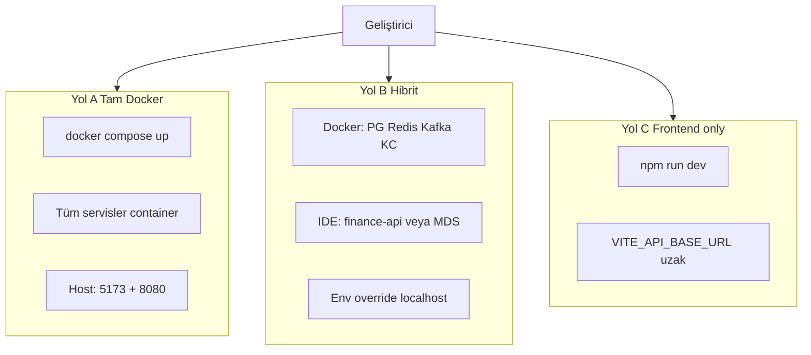
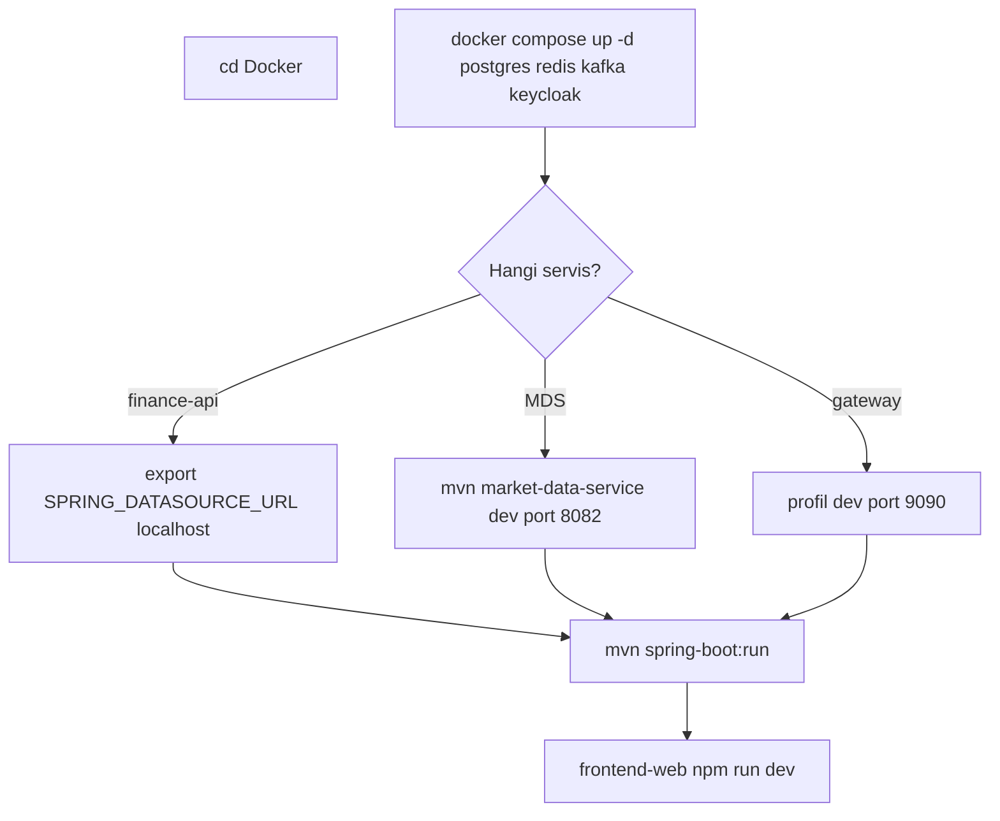
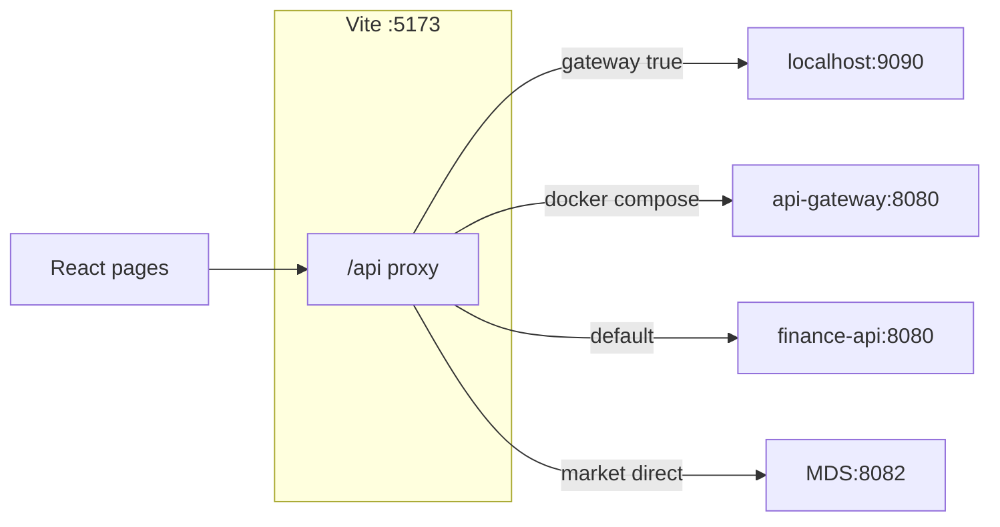
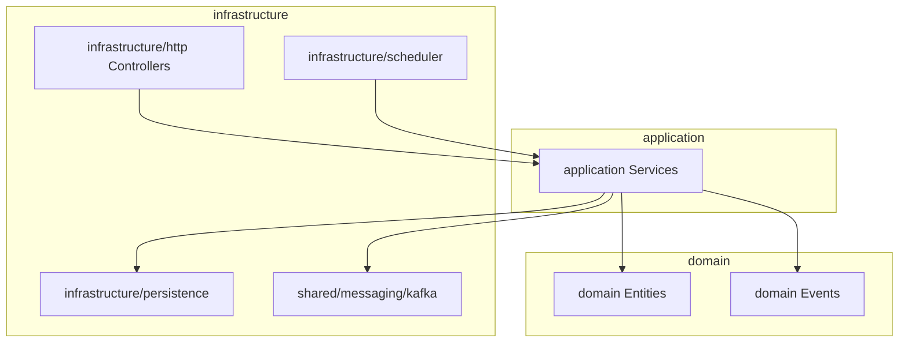
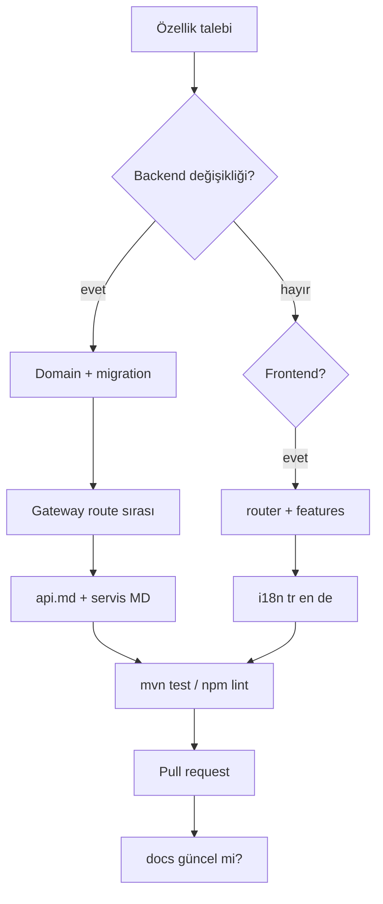

# Development

Use this guide for day-to-day development workflow, build/test commands, and code organization. Initial setup: [getting-started.md](getting-started.md). Architectural context: [architecture.md](architecture.md).

---

## Monorepo overview

Parent POM: `com.company:finance-platform:1.0.0-SNAPSHOT` — Java **21**, Spring Boot **3.2.x**, Spring Cloud Gateway.

| Module | Role |
|--------|------|
| `finance-api` | Portal BFF — portfolio, auth, MFA, admin, info cards, profile |
| `api-gateway` | Single API entry point, JWT, rate limit, Swagger aggregation |
| `market-data-service` | Market catalog, EVDS, scheduler, price publishing |
| `analytics-service` | Technical indicators, insight |
| `news-service` | RSS ingestion, news API |
| `notification-service` | Kafka → email |
| `log-consumer-service` | `app.logs` → OpenSearch |
| `frontend-web` | React 19 + Vite + TypeScript SPA |

Port summary: [services.md](services.md). Per-service detailed flows and diagrams: [services/README.md](services/README.md) (template for a new service: [services/_template.md](services/_template.md)).

### Monorepo module dependencies



---

## Local development modes

| Mode | When? | Guide |
|------|-------|-------|
| Full Docker | Run the stack as-is | [getting-started.md — Yol A](getting-started.md#yol-a--tam-stack-docker-compose) |
| Hybrid | Debug a single service from the IDE | [getting-started.md — Yol B](getting-started.md#yol-b--hibrit-altyapı-docker-uygulama-yerel) |
| Frontend only | Remote / staging API | [getting-started.md — Yol C](getting-started.md#yol-c--sadece-frontend--uzak-api) |

### Mode comparison



### Hybrid setup flow



**Hybrid tip:** In `finance-api`, `application-dev.yml` defines the JDBC host as `postgres` (Docker network). Override when running from the host machine:

```bash
export SPRING_DATASOURCE_URL=jdbc:postgresql://localhost:5432/finance
export JWT_ISSUER_URI=http://localhost:8085/realms/finance
export JWT_JWK_SET_URI=http://localhost:8085/realms/finance/protocol/openid-connect/certs
export KAFKA_BOOTSTRAP_SERVERS=localhost:9092
export CLIENTS_MARKET_DATA_BASE_URL=http://localhost:8082
```

Windows (PowerShell): `$env:SPRING_DATASOURCE_URL="jdbc:postgresql://localhost:5432/finance"` etc.

---

## Maven

From the repo root:

```bash
# Tüm modüller — derleme + test
mvn clean verify

# Tek modül (bağımlılıklarla)
mvn -pl finance-api -am test
mvn -pl market-data-service -am package
mvn -pl api-gateway -am package
mvn -pl news-service -am test
mvn -pl analytics-service -am test
mvn -pl notification-service -am test
mvn -pl log-consumer-service -am test
```

Run a service directly:

```bash
mvn -pl finance-api -am spring-boot:run -Dspring-boot.run.profiles=dev,kafka
mvn -pl market-data-service -am spring-boot:run -Dspring-boot.run.profiles=dev
mvn -pl api-gateway -am spring-boot:run -Dspring-boot.run.profiles=dev
```

If you use an IDE, start the main class with the same profiles; add environment variables to the Run Configuration.

---

## Spring profiles

| Service | Local (IDE) | Docker Compose |
|---------|-------------|----------------|
| `finance-api` | `dev`, `kafka` | `docker`, `kafka`, `cache-redis` |
| `api-gateway` | `dev` → host **9090** | `docker` → **8080** |
| `market-data-service` | `dev` → H2 in-memory, port **8082** | `docker` → PostgreSQL |
| `analytics-service` | default → PostgreSQL `localhost:5432` | `docker` |
| `news-service` | default → port **8082** | `docker` |
| `notification-service` | default → port **8086** | `docker` |
| `log-consumer-service` | default → port **8087** | `docker` |

**Notes**

- `cache-redis`: Redis-based instrument price cache in `finance-api`; active in Docker.
- `market-data-service` **dev** profile uses H2; configure `application-dev.yml` and API keys for real EVDS/Finnhub, or use the `docker` profile + PostgreSQL.
- **`news-service` and `market-data-service` both use 8082 on the host** — do not run them together on the same machine. In the Docker network they are separated by hostname.
- Local **api-gateway dev (9090)** conflicts with Docker **Prometheus (9090)** port; do not run both on the host at the same time.

Profile files: `{modül}/src/main/resources/application*.yml`. Environment variables override via `${VAR:default}` — full list: [configuration.md](configuration.md).

---

## Frontend development

```bash
cd frontend-web
cp .env.example .env.development   # Windows: Copy-Item .env.example .env.development
npm install
npm run dev
```

| Command | Description |
|---------|-------------|
| `npm run dev` | Vite dev server — http://localhost:5173 |
| `npm run build` | `tsc -b` + production bundle |
| `npm run lint` | ESLint |
| `npm run preview` | Preview after build |

### Vite proxy modes



| Mode | Environment variable | Behavior |
|------|---------------------|----------|
| Docker (default compose) | `VITE_PROXY_TARGET=http://api-gateway:8080` | All `/api` → gateway |
| Local gateway | `VITE_DEV_PROXY_GATEWAY=true`, `VITE_PROXY_TARGET=http://localhost:9090` | All `/api` → gateway dev |
| Local BFF | (default) | `/api` → `finance-api:8080` |
| Direct MDS (debug) | `VITE_DEV_MARKET_DIRECT_TO_MDS=true`, `VITE_MARKET_PROXY_TARGET=http://localhost:8082` | `/api/v1/market` → MDS |

Details: [api.md — Geliştirme proxy](api.md#geliştirme-proxy-frontend).

### Directory structure

```
frontend-web/src/
├── app/
│   ├── router/          # React Router, auth guard, route tanımları
│   └── store/           # Zustand (ör. portföy store)
├── pages/               # Sayfa bileşenleri (markets, analysis, admin, profil, …)
├── features/            # Domain hook’lar, API client’lar (admin, profile, markets, …)
├── shared/              # Layout, UI, i18n, theme, ortak hook’lar
├── services/            # Legacy / paylaşılan HTTP yardımcıları
└── data/                # Sabit portal sayfa tanımları
```

- **i18n:** `i18next` — `shared/i18n/locales/{tr,en,de}.json`
- **State:** `zustand` — under `features/` and `app/store/`
- **Charts:** `lightweight-charts`, analysis page `pages/analysis/chart/`

**Pages requiring a session:** portfolio, analysis, news, interest-term, profile, alarms, dashboard. **Public:** landing, markets, bank rates, financial literacy. **Admin:** `/admin`, info card management.

---

## Backend code organization

### finance-api — domain modules

Each bounded context is layered in its own package:

| Package | Example responsibility |
|---------|------------------------|
| `portfolio` | Portfolio, transactions, goals, external portfolio |
| `watchlist` | Watchlist |
| `alarm` | Price alarms |
| `chart` | Chart drawing records |
| `registration` / `auth` / `mfa` | Registration, login, TOTP, trusted device |
| `profile` | Profile, avatar |
| `infocards` / `admin` | Info cards, admin KPI |
| `market` | Overview, eurobond proxy |
| `news` | News enrichment / favorites |
| `outbox` | Transactional outbox → Kafka |
| `shared` | Security, cache, messaging, web |

Layer standard:

| Layer | Location |
|-------|----------|
| Domain | `{modül}/domain/` |
| Application | `{modül}/application/` |
| HTTP | `{modül}/infrastructure/http/` + `dto/` |
| Persistence | `{modül}/infrastructure/persistence/` |
| Scheduler | `{modül}/infrastructure/scheduler/` |
| Messaging | `shared/messaging/kafka/` |

New REST endpoints may affect **api-gateway route order**; update [api.md](api.md) and `GatewayRoutesConfig` together when changing routes.

### finance-api layer diagram



### Other services

Flatter package structure; each service has its own Flyway migration set. OpenAPI: `application-openapi.yml` + springdoc.

---

## Flyway migration

| Service | Migration path | Flyway table name |
|---------|----------------|-------------------|
| finance-api | `finance-api/src/main/resources/db/migration/V*.sql` | `finance_flyway_schema_history` |
| market-data-service | `market-data-service/.../db/migration/` | `mds_flyway_schema_history` |
| analytics-service | `analytics-service/.../db/migration/` | `analytics_flyway_schema_history` |
| news-service | `news-service/.../db/migration/` | (per service configuration) |
| notification-service | `notification-service/.../db/migration/` | — |

**Rules**

- New migration file name: `V{sıra}__açıklama.sql` — sequence number must be unique and increasing.
- Avoid irreversible DDL (DROP COLUMN, destructive UPDATE); production Flyway repair requires manual intervention.
- Seed migrations contain demo data; evaluate separately for production.

### Flyway workflow

```mermaid
flowchart LR
  DEV[Geliştirici]
  SQL[V{n}__aciklama.sql]
  GIT[Git commit]
  RUN[Servis başlat]
  FW[Flyway migrate]
  PG[(PostgreSQL)]

  DEV --> SQL --> GIT --> RUN --> FW --> PG
```

| Service | History table |
|---------|---------------|
| finance-api | `finance_flyway_schema_history` |
| market-data-service | `mds_flyway_schema_history` |
| analytics-service | `analytics_flyway_schema_history` |

---

## Kafka (local)

```bash
cd Docker
docker compose up -d kafka
```

```bash
export KAFKA_BOOTSTRAP_SERVERS=localhost:9092
```

Topics are mostly created on first publish (depends on environment settings). Platform topics:

| Topic | Producer (e.g.) | Consumer (e.g.) |
|-------|-----------------|-----------------|
| `market.price.updated` | market-data-service | analytics-service, finance-api |
| `market.fx.snapshot.updated` | market-data-service | finance-api |
| `alarm-triggered` | finance-api (outbox) | notification-service |
| `watchlist.item.added` / `removed` | finance-api | notification-service |
| `login-security.alert` | finance-api | notification-service |
| `app.logs` | All services (Log4j2) | log-consumer-service |

Outbox details: [architecture.md](architecture.md).

---

## Testing

### Backend

```bash
mvn -pl finance-api test
mvn -pl market-data-service test
mvn -pl news-service test
mvn -pl analytics-service test
mvn -pl notification-service test
mvn -pl api-gateway test
```

Each module may use H2 or Testcontainers in `application-test.yml`; do not assume — check the relevant module's test resources.

### Frontend

```bash
cd frontend-web
npm run lint
```

Unit test files are co-located under `src` (e.g. `pages/analysis/chart/measure/computeMeasureStats.test.ts`, `pages/bank-rates/lib/*.test.ts`). There is no separate `npm test` script in `package.json`; use lint + manual verification until a test runner is added.

---

## New feature development flow



## New feature checklist

When adding backend endpoints:

1. Implement domain + application + HTTP layers in the module package.
2. Add a Flyway migration if needed.
3. Check gateway route order (`api-gateway/.../GatewayRoutesConfig.java`).
4. Update [api.md](api.md) and springdoc annotations.
5. If a Kafka event is required, choose outbox or direct producer pattern consistent with existing modules.

When adding frontend pages:

1. Add the route in `app/router/index.tsx` (and guard if needed).
2. Colocate API calls under `features/`; avoid scattered direct axios usage.
3. Add TR / EN / DE translation keys to `shared/i18n/locales/` files.

---

## Useful commands

```bash
# Tek servis log (Docker dizininden)
cd Docker
docker compose logs -f finance-api
docker compose logs -f market-data-service
docker compose logs -f api-gateway

# Container durumu
docker compose ps

# PostgreSQL shell
docker exec -it finance-postgres psql -U finance -d finance

# Belirli servisi yeniden build
docker compose up -d --build finance-api frontend-web
```

Profile photos: `photos/{userId}/` at repo root — mounted via Docker volume; content must not be committed.

---

## Git and security

- Commit messages: write short, complete sentences describing **what** you changed and **why**.
- **Do not commit:** `.env`, real API keys, `photos/` user content, personal credentials.
- Demo SMTP / Keycloak passwords in Docker Compose are for local demo only; rotate in forks or shared environments.
- In production, `APP_SECURITY_ALLOW_HEADER_USER_FALLBACK` must be off ([architecture.md](architecture.md)).

---

## Related documents

| Topic | Document |
|-------|----------|
| Initial setup | [getting-started.md](getting-started.md) |
| API routes / Swagger | [api.md](api.md) |
| Environment variables | [configuration.md](configuration.md) |
| Metrics, trace, logs | [observability.md](observability.md) |
| Service ports | [services.md](services.md) |
