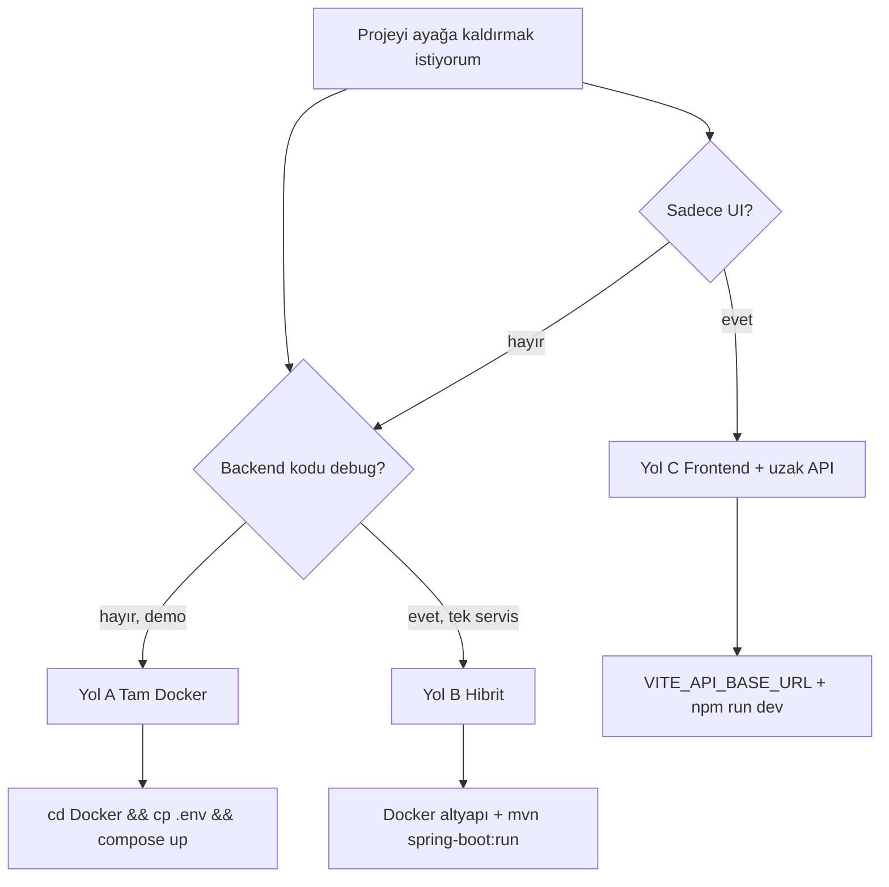
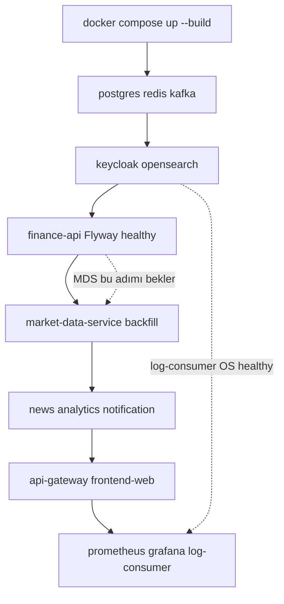
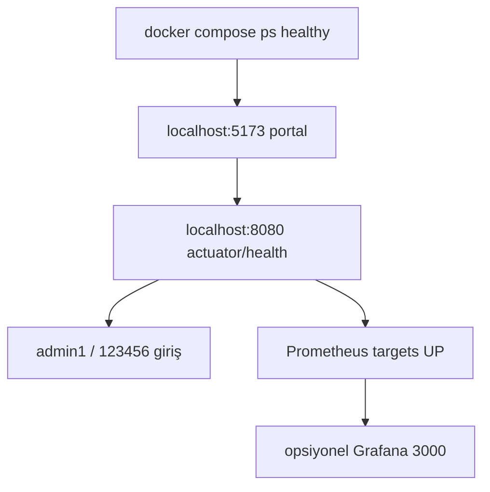

# Getting Started

Use this guide to bring up **32 Bit Finance Platform** for the first time. The monorepo includes a microservice backend (Spring Boot), React SPA, PostgreSQL, Redis, Kafka, Keycloak, and an observability stack.

| Goal | Recommended path |
|------|------------------|
| Demo / new developer | [Path A — Full stack (Docker)](#path-a--full-stack-docker-compose) |
| Backend development from IDE | [Path B — Hybrid](#path-b--hybrid-infrastructure-docker-app-local) |
| UI only, remote API | [Path C — Frontend + remote API](#path-c--frontend-only--remote-api) |

General project overview: [../README.md](../../README.md). Architecture and port details: [architecture.md](architecture.md), [services.md](services.md).

### Which setup path?



---

## Prerequisites

| Tool | Version / notes |
|------|-----------------|
| [Docker Desktop](https://www.docker.com/products/docker-desktop/) | Compose v2; **~8 GB RAM for full stack** |
| JDK | 21 (hybrid / local backend) |
| Maven | 3.9+ |
| Node.js | 20+ (`frontend-web`) |

Clone the repository:

```bash
git clone https://github.com/TaridaG/Toyota-32Bit-Finance-Platform.git
cd Toyota-32Bit-Finance-Platform
```

---

## Path A — Full stack (Docker Compose)

Starts all infrastructure and application services with a single command. **Recommended path for new developers and demos.**

### 1. Environment file

```bash
cd Docker
cp .env.example .env
```

Windows (PowerShell):

```powershell
cd Docker
Copy-Item .env.example .env
```

When `.env.example` is copied, `NEWS_DB_PASSWORD=123456` is ready out of the box (must match the PostgreSQL password). For a demo, **you do not need to set any other variables.**

If you change the password, update it together with `POSTGRES_PASSWORD` in `docker-compose.yml`.

### 2. Start the stack

```bash
docker compose up -d --build
```

### Docker startup order (summary)



The first build may take several minutes due to Maven compilations. On an existing setup, use only `up --build` to preserve the database; **`docker compose down -v` deletes volumes.**

### 3. Verification



| Check | Address | Expected |
|-------|---------|----------|
| Portal (SPA) | http://localhost:5173 | Landing / login screen |
| API Gateway | http://localhost:8080 | HTTP 200 or redirect |
| Gateway health | http://localhost:8080/actuator/health | `{"status":"UP"}` |
| Swagger UI | http://localhost:8080/swagger-ui.html | OpenAPI UI |
| Keycloak (realm: `finance`) | http://localhost:8085 | OIDC server |
| Container status | `docker compose ps` | `finance-postgres`, `finance-api`, `finance-redis` **healthy** |

**Demo login (portal):**

| User | Password | Role |
|------|----------|------|
| `user1` | `123456` | USER |
| `admin1` | `123456` | ADMIN (admin panel, info cards) |

Keycloak admin console: http://localhost:8085/admin — `admin` / `admin` (compose default).

### 4. Observability and infrastructure

Endpoints accessible while the stack is running:

| Component | Address | Credentials |
|-----------|---------|-------------|
| Grafana | http://localhost:3000 | `admin` / `admin` |
| Prometheus | http://localhost:9090 | — |
| Jaeger | http://localhost:16686 | — |
| OpenSearch Dashboards | http://localhost:5601 | `admin` / `123456789` |
| OpenSearch REST | https://localhost:9200 | `admin` / `123456789` |
| PostgreSQL | `localhost:5432` | `finance` / `123456`, DB: `finance` |
| Redis | `localhost:6379` | — |
| Kafka | `localhost:9092` | — |

For the OpenSearch log index, you may need to create an `application-logs-*` index pattern once on first setup — details: [observability.md](observability.md).

### 5. First-run timings

- **Flyway migration:** `finance-api`, `market-data-service`, `analytics-service`, and `news-service` apply their schemas on first startup; a few minutes is normal.
- **Market data backfill:** `market-data-service` fills the catalog and historical prices in the background. Completion may take **approximately 30 minutes** depending on instrument count; seeing empty lists or incomplete charts in the first minutes is normal.
- **OpenSearch:** First boot ~1 minute; `log-consumer-service` writes logs after the cluster is healthy.

To monitor progress:

```bash
docker compose logs -f market-data-service
docker compose logs -f finance-api
```

Demo scheduler intervals are tuned for free external API quotas (TCMB EVDS, Yahoo, CoinGecko, etc.). To tighten intervals: [configuration.md](configuration.md).

### 6. Shutdown

```bash
cd Docker
docker compose down
```

Do **not** use the `-v` flag if you do not want to delete database and OpenSearch volumes:

```bash
# WARNING: Deletes all persistent data (PostgreSQL, OpenSearch, Kafka)
docker compose down -v
```

---

## Optional `.env` variables

For a demo, `TCMB_API_KEY` and `FINNHUB_API_KEY` values are defined in `docker-compose.yml`; you do not need to write them to `.env`.

| Variable | When? | Notes |
|----------|-------|-------|
| `MARKET_EVDS_API_KEY` | Separate key for TCMB EVDS | If unset, compose uses `TCMB_API_KEY`. **Do not write an empty line (`KEY=`)** |
| `OPENAI_API_KEY` | Admin info card AI | `AI_ENABLED=true`; AI stays disabled without a key |
| `SMTP_USERNAME` / `SMTP_PASSWORD` | Alarm and registration email from your own mailbox | If unset, compose uses demo SMTP |
| `APP_MFA_ENCRYPTION_SECRET` / `APP_TRUSTED_DEVICE_SIGNING_SECRET` | Production environment | Compose defaults are sufficient for demo |

All variables: [configuration.md](configuration.md).

---

## Path B — Hybrid (infrastructure Docker, app local)

Run infrastructure in containers and debug backend or frontend from IDE / terminal.

### 1. Infrastructure services

```bash
cd Docker
docker compose up -d postgres redis kafka keycloak opensearch
```

PostgreSQL: `localhost:5432`, database `finance`, user / password `finance` / `123456`.

### 2. finance-api

```bash
# from repo root
mvn -pl finance-api -am spring-boot:run -Dspring-boot.run.profiles=dev,kafka
```

Example environment variables (bash):

```bash
export JWT_ISSUER_URI=http://localhost:8085/realms/finance
export JWT_JWK_SET_URI=http://localhost:8085/realms/finance/protocol/openid-connect/certs
export KAFKA_BOOTSTRAP_SERVERS=localhost:9092
export CLIENTS_MARKET_DATA_BASE_URL=http://localhost:8082
```

Default HTTP port: **8080**.

### 3. market-data-service

```bash
mvn -pl market-data-service -am spring-boot:run -Dspring-boot.run.profiles=dev
```

Dev profile: port **8082**, in-memory H2. Configure `application-dev.yml` and environment keys for real EVDS / Finnhub data.

> `news-service` also uses **8082** on the host; **do not run it on 8082 at the same time as market-data-service on the same machine.** They are separated by hostname on the Docker network.

### 4. api-gateway (local)

```bash
mvn -pl api-gateway -am spring-boot:run -Dspring-boot.run.profiles=dev
```

Dev profile port: **9090** (`application-dev.yml`).

To point the frontend at the gateway, set `frontend-web/.env.development`:

```env
VITE_PROXY_TARGET=http://localhost:9090
VITE_DEV_PROXY_GATEWAY=true
```

> Docker Prometheus host port is also **9090**. Do not run gateway dev and Prometheus on the host at the same time, or change the Prometheus port.

Full service list and ports: [services.md](services.md).

### 5. frontend-web

```bash
cd frontend-web
cp .env.example .env.development   # Windows: Copy-Item .env.example .env.development
npm install
npm run dev
```

http://localhost:5173 — default proxy targets `finance-api:8080` or the gateway env above.

You can leave other backend modules (`analytics-service`, `news-service`, `notification-service`) in Docker for the full flow, or run `spring-boot:run` per module in separate terminals.

---

## Path C — Frontend only + remote API

`frontend-web/.env.development`:

```env
VITE_API_BASE_URL=https://your-api-host
```

CORS, Keycloak redirect URIs, and gateway security settings must allow this origin. Details: [api.md](api.md).

---

## Common issues

| Symptom | Likely cause | Fix |
|---------|--------------|-----|
| 401 on all APIs | Expired token or issuer mismatch | Keycloak `8085`; gateway `JWT_ISSUER_URI` = `http://localhost:8085/realms/finance` |
| Empty market list / charts | MDS backfill in progress | Wait a few minutes; `docker compose logs -f market-data-service` |
| `news-service` keeps restarting | Missing or wrong `NEWS_DB_PASSWORD` | `NEWS_DB_PASSWORD=123456` in `Docker/.env` (same as PostgreSQL) |
| No EVDS / policy rate data | Empty `MARKET_EVDS_API_KEY=` line | Remove the line or set a valid key — [configuration.md](configuration.md) |
| OpenSearch auth error | Old volume, password mismatch | See volume deletion notes in `.env.example` |
| Port conflict (9090) | Local gateway dev + Docker Prometheus | Stop one or change the port |
| Build takes very long | First Maven build | Normal; subsequent `up` calls use cache |

---

## Next steps

| Topic | Document |
|-------|----------|
| Development, tests, profiles | [development.md](development.md) |
| Gateway routes and Swagger | [api.md](api.md) |
| Service responsibilities | [services.md](services.md) |
| Environment variables | [configuration.md](configuration.md) |
| Metrics, traces, logs | [observability.md](observability.md) |
