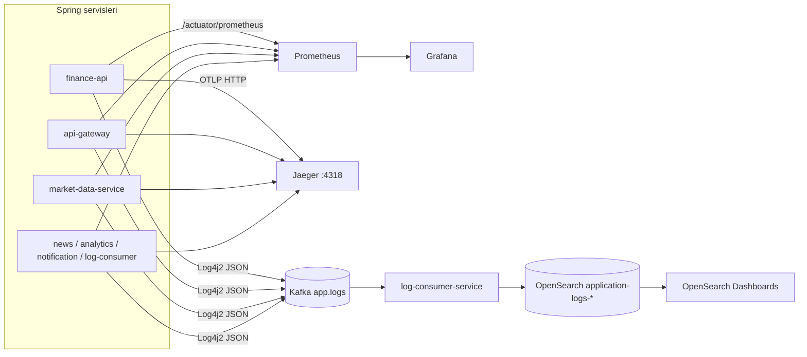
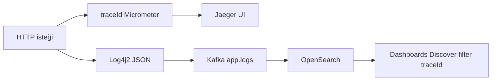
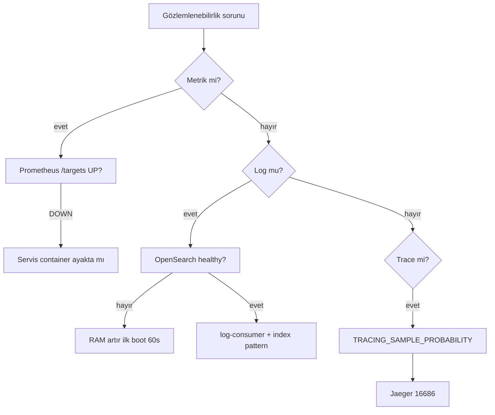

# Observability

The **32 Bit Finance Platform** Docker Compose stack includes metrics, distributed tracing, and a centralized log pipeline. This guide is for development and demo environments; production topology is not defined in the repo.

| Pillar | Tool | What it provides |
|--------|------|------------------|
| **Metrics** | Prometheus + Grafana | HTTP latency, error rate, service `up`, log pipeline metrics |
| **Trace** | Jaeger (OTLP) | Cross-request latency, span timeline |
| **Logs** | Kafka → log-consumer → OpenSearch | JSON log search, retention, operational queries |

Architectural context: [architecture.md](architecture.md). Environment variables: [configuration.md](configuration.md). Initial setup: [getting-started.md](getting-started.md).

### Three pillars (metrics, traces, logs)

```mermaid
flowchart TB
  subgraph apps [Uygulama servisleri]
    SVC[Spring Boot servisleri]
  end

  subgraph metrics [Metrikler]
    ACT[/actuator/prometheus]
    PROM[Prometheus :9090]
    GRAF[Grafana :3000]
  end

  subgraph traces [İzler]
    OTLP[OTLP :4318]
    JAEG[Jaeger :16686]
  end

  subgraph logs [Loglar]
    KFK[app.logs]
    LCS[log-consumer]
    OS[OpenSearch]
    OSD[Dashboards :5601]
  end

  SVC --> ACT --> PROM --> GRAF
  SVC --> OTLP --> JAEG
  SVC --> KFK --> LCS --> OS --> OSD
```

---

## Components and access

When the stack is running (`cd Docker && docker compose up -d`):

| Component | URL | Credentials | Role |
|-----------|-----|-------------|------|
| **Grafana** | http://localhost:3000 | `admin` / `admin` | Main dashboard; Prometheus datasource auto-provisioned |
| **Prometheus** | http://localhost:9090 | — | Scrape + PromQL; health via `/targets` |
| **Jaeger UI** | http://localhost:16686 | — | Trace search and timeline |
| **Jaeger OTLP (HTTP)** | http://localhost:4318 | — | Span ingestion endpoint (`/v1/traces`) |
| **OpenSearch REST** | https://localhost:9200 | `admin` / `123456789` | Log index API |
| **OpenSearch Dashboards** | http://localhost:5601 | `admin` / `123456789` | Log Discover / search UI |

> **Port conflict:** Host **9090** can conflict with both Prometheus and the local `api-gateway` **dev** profile. In full Compose the gateway is on **8080**; in hybrid development do not run both on the host at the same time — [development.md](development.md).

Anonymous **Viewer** access is enabled in Grafana (`GF_AUTH_ANONYMOUS_ENABLED=true`); sign in as `admin` to edit.

---

## Overall flow



---

## Metrics

### Spring Actuator

Each backend service exposes these endpoints (`management.endpoints.web.exposure.include`):

```http
GET /actuator/health
GET /actuator/prometheus
```

Example via gateway on the Docker network:

```bash
curl -s http://localhost:8080/actuator/health
```

### Prometheus scrape

Configuration: [`Docker/prometheus/prometheus.yml`](../../Docker/prometheus/prometheus.yml)

| Job name | Target (Docker network) | Metrics path |
|----------|-------------------------|--------------|
| `finance-api` | `finance-api:8080` | `/actuator/prometheus` |
| `api-gateway` | `api-gateway:8080` | `/actuator/prometheus` |
| `market-data-service` | `market-data-service:8080` | `/actuator/prometheus` |
| `analytics-service` | `analytics-service:8080` | `/actuator/prometheus` |
| `news-service` | `news-service:8082` | `/actuator/prometheus` |
| `notification-service` | `notification-service:8086` | `/actuator/prometheus` |
| `log-consumer-service` | `log-consumer-service:8087` | `/actuator/prometheus` |

Global scrape interval: **10 seconds**.

### Prometheus scrape topology

```mermaid
flowchart LR
  PROM[Prometheus :9090]

  PROM --> J1[finance-api:8080]
  PROM --> J2[api-gateway:8080]
  PROM --> J3[market-data-service:8080]
  PROM --> J4[news-service:8082]
  PROM --> J5[notification-service:8086]
  PROM --> J6[log-consumer-service:8087]
  PROM --> J7[analytics-service:8080]

  J1 --> M[/actuator/prometheus]
  J2 --> M
  J3 --> M
  J4 --> M
  J5 --> M
  J6 --> M
  J7 --> M
```

**Verification:** http://localhost:9090/targets — all jobs should be **UP**.

### Grafana

Provisioning directory: [`Docker/grafana/provisioning`](../../Docker/grafana/provisioning)

| File | Content |
|------|---------|
| `datasources/prometheus.yml` | Prometheus datasource (`http://prometheus:9090`) |
| `dashboards/dashboards.yml` | JSON dashboard provider |
| `dashboards/json/finance-platform-overview.json` | Default home dashboard |

Home dashboard (**Finance Platform — Overview**) highlights:

- HTTP request rate and average response time (service selector `$job`)
- Platform-wide 5xx error rate
- Service `up` status
- Log pipeline: processed Kafka log events, OpenSearch index errors, DLQ publishing
- Dashboard links: Jaeger, OpenSearch Dashboards, Prometheus Targets

Default home path is set in compose via `GF_DASHBOARDS_DEFAULT_HOME_DASHBOARD_PATH`.

---

## Distributed tracing

All Spring services use **Micrometer Tracing + OpenTelemetry OTLP** exporter.

| Setting | Default | Description |
|---------|---------|-------------|
| `management.otlp.tracing.endpoint` | `http://jaeger:4318/v1/traces` | Span send address (container network) |
| `TRACING_SAMPLE_PROBABILITY` | `0.1` | 10% sampling; set to `1.0` in development |

Jaeger all-in-one: UI **16686**, OTLP HTTP **4318** (mapped to host).

**Kafka observation:** `spring.kafka.listener.observation-enabled=true` — consumer/producer spans are added to the trace chain.

**Log ↔ trace correlation:** The Log4j2 JSON template writes `traceId` and `correlationId` MDC fields (`log4j2-kafka-template.json`). After finding a trace in Jaeger, you can filter by the same `traceId` in OpenSearch.

---

## Log pipeline

### 1. Production (application services)

Backend services use **Log4j2** (not Logback). Each service has `log4j2-spring.xml`:

- **Console:** readable pattern (includes `traceId`, `correlationId`)
- **Kafka:** topic `app.logs`, async append, JSON template layout

Modules with Log4j2 configuration: `finance-api`, `api-gateway`, `market-data-service`, `news-service`, `analytics-service`, `notification-service`, `log-consumer-service`.

Example JSON fields: `@timestamp`, `level`, `message`, `logger_name`, `service`, `traceId`, `correlationId`, `stack_trace`.

Kafka bootstrap: `KAFKA_BOOTSTRAP_SERVERS` (`kafka:9092` in compose).

### 2. Consumption (log-consumer-service)

`log-consumer-service`:

1. Listens to the `app.logs` topic (`LOG_CONSUMER_GROUP_ID=log-consumer-service`)
2. Parses messages; carries `correlationId` header into MDC
3. Indexes into OpenSearch with the **`application-logs-*`** prefix
4. Creates index template + **ISM retention policy** on startup (`OpenSearchLogInfrastructureBootstrap`)

| Environment variable | Default | Description |
|---------------------|---------|-------------|
| `APP_LOGS_TOPIC` | `app.logs` | Kafka topic |
| `OPENSEARCH_INDEX_PREFIX` | `application-logs` | Index name prefix |
| `OPENSEARCH_LOG_RETENTION_DAYS` | `30` | Automatic deletion period via ISM |
| `OPENSEARCH_USERNAME` / `OPENSEARCH_PASSWORD` | `admin` / `123456789` in compose | OpenSearch Security |

OpenSearch data is persisted in a volume: `docker_opensearch_data` (named `docker_opensearch_data` depending on project name).

### 3. Search (OpenSearch Dashboards)

Logs are not searched in Grafana; use **OpenSearch Dashboards**. You can navigate from the Grafana home dashboard link.

**Initial setup (once):**

1. http://localhost:5601 — `admin` / `123456789`
2. **Stack Management** → **Index patterns** → **Create index pattern**
3. Pattern: `application-logs-*`
4. Time field: `@timestamp`
5. Filter by service, level, `traceId` in **Discover**

> The `kibanaserver` user is for Dashboards → OpenSearch backend connection; use `admin` for browser login.

**Example Discover queries:**

| Purpose | Filter |
|---------|--------|
| Single service | `service: "finance-api"` |
| Errors | `level: "ERROR"` |
| Trace follow-up | `traceId: "abc123..."` |

---

## Operations API (log-consumer)

Internal metrics summary (container network / debug):

```http
GET /internal/system-intelligence
```

Example response fields: `kafkaLagMax`, `failedEventsTotal`, `skippedEventsTotal`, `dlqPublishedTotal`.

Related Prometheus metrics: `kafka_events_processed_total`, `kafka_events_opensearch_failed_total`, `kafka_events_dlq_published_total` — visualized on the Grafana overview dashboard.

---

## Health checks

```bash
cd Docker

# Container durumu
docker compose ps

# Gateway
curl -s http://localhost:8080/actuator/health

# OpenSearch cluster (TLS, demo cert)
curl -ksu admin:123456789 https://localhost:9200/_cluster/health

# Log consumer (container içinden veya exec)
docker compose logs -f log-consumer-service
```

Expected state:

| Check | Expected |
|-------|----------|
| `finance-postgres`, `finance-redis` | healthy |
| `opensearch` | healthy (first boot may take 60s+) |
| Prometheus `/targets` | 7/7 UP |
| Kafka topic `app.logs` | Message flow after services are up |
| OpenSearch indexes | `application-logs-*` (after first logs) |

---

## Trace and log correlation



Example Discover query: `traceId: "abc123..."` and `service: "finance-api"`.

## Troubleshooting

### Decision tree



| Symptom | Likely cause | Fix |
|---------|--------------|-----|
| OpenSearch **unhealthy** / restart | Insufficient RAM | Allocate ≥8 GB to Docker; wait 60–90s on first boot |
| OpenSearch auth error | Old volume, password mismatch | [`Docker/.env.example`](../../Docker/.env.example) volume deletion notes; `docker compose stop opensearch opensearch-dashboards log-consumer-service` + `docker volume rm docker_opensearch_data` |
| No log index | Kafka / log-consumer / OpenSearch ordering | `docker compose logs log-consumer-service`; check OpenSearch healthy |
| Prometheus target **DOWN** | Service not yet started | Relevant container logs; Flyway migration duration |
| Grafana empty panels | Prometheus has not collected data yet | Generate traffic; check `/targets` UP |
| No spans in Jaeger | Low sampling | Restart service with `TRACING_SAMPLE_PROBABILITY=1.0` |
| DLQ / skipped log increase | Bad JSON, OpenSearch write error | Grafana "Log pipeline" panels; log-consumer logs |
| Port 9090 busy | Prometheus vs gateway dev | Stop one or change port |

---

## Configuration files

| File | Content |
|------|---------|
| [`Docker/prometheus/prometheus.yml`](../../Docker/prometheus/prometheus.yml) | Scrape jobs |
| [`Docker/grafana/provisioning/`](../../Docker/grafana/provisioning/) | Datasource + dashboard provisioning |
| [`Docker/opensearch-config/`](../../Docker/opensearch-config/) | OpenSearch Security, TLS demo certificates |
| [`Docker/docker-compose.yml`](../../Docker/docker-compose.yml) | Observability service definitions |
| `{servis}/src/main/resources/log4j2-spring.xml` | Kafka log append |
| `{servis}/src/main/resources/application.yml` | OTLP, actuator, sampling |

---

## Related documents

| Topic | Document |
|-------|----------|
| Architecture and Kafka topics | [architecture.md](architecture.md) |
| Environment variables | [configuration.md](configuration.md) |
| Development / port conflicts | [development.md](development.md) |
| Service ports | [services.md](services.md) |
