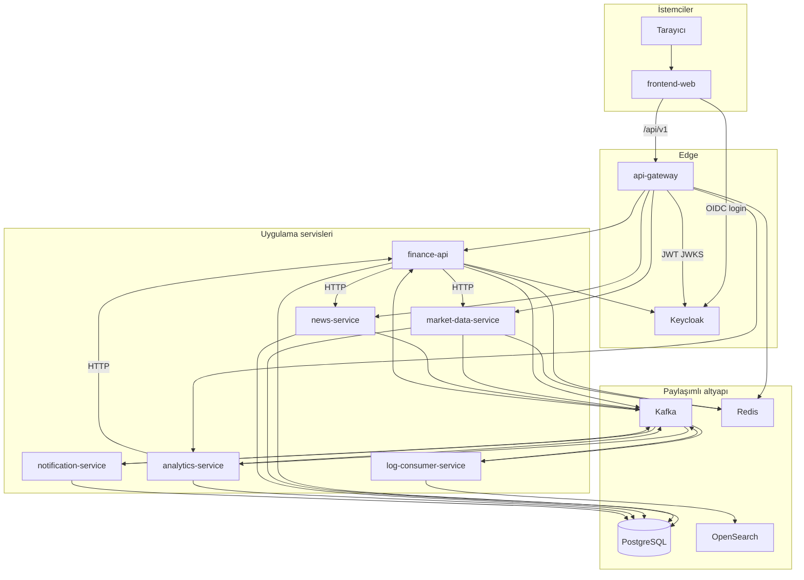
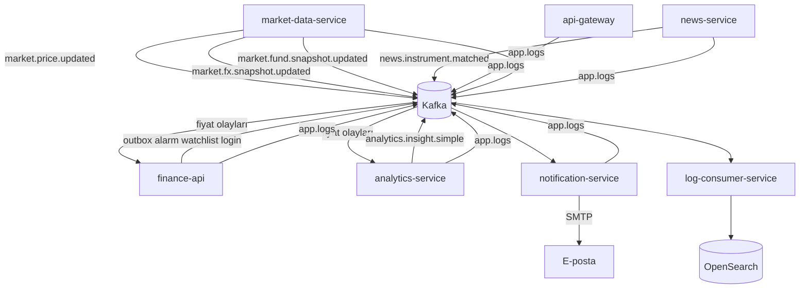
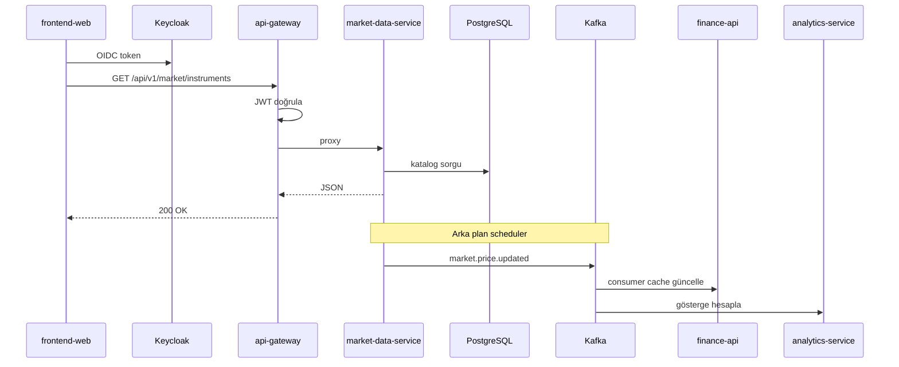
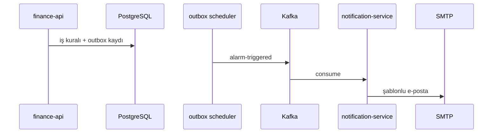
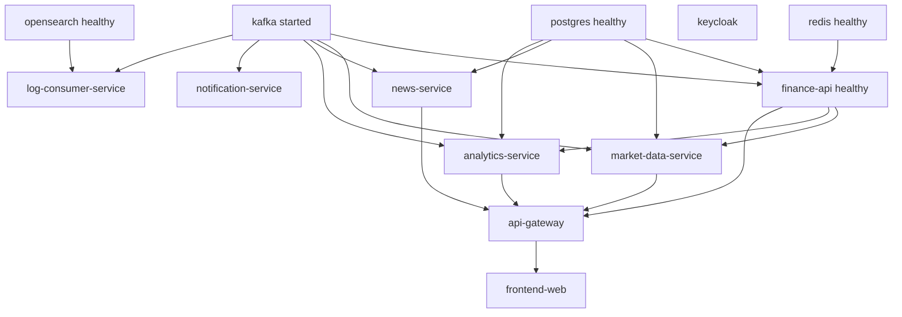

# Services

The **32 Bit Finance Platform** monorepo contains seven backend modules and one React SPA under Maven parent `com.company:finance-platform:1.0.0-SNAPSHOT` (`pom.xml`). Browser traffic is routed to the relevant service through **api-gateway** under the `/api/v1/**` contract.

| Context | Document |
|---------|----------|
| **Detailed service guides** | [services/README.md](services/README.md) |
| Gateway routes | [api.md](api.md) |
| Architecture and Kafka summary | [architecture.md](architecture.md) |
| Setup | [getting-started.md](getting-started.md) |
| Observability | [observability.md](observability.md) |

---

## Overall architecture — service interactions

The diagrams below summarize **synchronous (HTTP)** and **asynchronous (Kafka)** relationships on the platform. Full architectural context: [architecture.md](architecture.md).

### Platform context

The browser talks only to **frontend-web** (5173) and **api-gateway** (8080); backend services reach each other by hostname on the Docker network `finance-net`.



### Synchronous HTTP — gateway routing

`api-gateway` forwards a single request to the relevant service by path prefix. `finance-api` carries most portal business rules; market and news data live in specialized services.

```mermaid
flowchart LR
  FE[frontend-web]
  GW[api-gateway]

  subgraph routes [Gateway hedefleri]
    FA[finance-api]
    MDS[market-data-service]
    NS[news-service]
    AS[analytics-service]
  end

  FE --> GW
  GW -->|"/api/v1/public/**" portföy alarm profil admin| FA
  GW -->|"/api/v1/market/overview insights eurobond"| FA
  GW -->|"/api/v1/market/**" "/api/v1/rates/**"| MDS
  GW -->|"/api/v1/news/enriched favorites"| FA
  GW -->|"/api/v1/news/**"| NS
  GW -->|"/api/v1/analytics/**"| AS
  GW -->|"/api/v1/**" geri kalan| FA

  FA -.->|BFF HTTP| MDS
  FA -.->|BFF HTTP| NS
```

Route order and circuit breaker: [api.md](api.md).

### Asynchronous Kafka — event flow

Market updates and notifications propagate via Kafka outside the HTTP chain. `finance-api` publishes domain events through a **transactional outbox**.



### Typical user request (end to end)

Example: a signed-in user opens the market list; partly synchronous HTTP, while MDS scheduler Kafka publishing continues in the background.



### Notification chain (event-driven)

An alarm or news match triggers the email pipeline independently of the portal API.



### Compose startup order (dependencies)

`market-data-service` starts after `finance-api` is healthy (catalog sync). `log-consumer-service` writes logs after OpenSearch is healthy.



---

## Application services — summary

| Module | Container | Role | Docker port | Host port |
|--------|-----------|------|-------------|-----------|
| `api-gateway` | `api-gateway` | Single API entry, JWT, rate limit | 8080 | **8080** |
| `finance-api` | `finance-api` | Portal BFF | 8080 | internal |
| `market-data-service` | `market-data-service` | Market data, EVDS | 8080 | internal |
| `analytics-service` | `analytics-service` | Indicators, insight | 8080 | internal |
| `news-service` | `news-service` | News API & RSS | 8082 | internal |
| `notification-service` | `notification-service` | Email | 8086 | internal |
| `log-consumer-service` | `log-consumer-service` | Log indexing | 8087 | internal |
| `frontend-web` | `frontend-web` | React SPA | 5173 | **5173** |

Only **8080** (API) and **5173** (UI) are exposed to the outside world.

---

## Port matrix (local development)

| Service | Docker | Local dev |
|---------|--------|-----------|
| api-gateway | 8080 | `dev` → **9090** |
| finance-api | 8080 | 8080 + PostgreSQL |
| market-data-service | 8080 | `dev` → **8082** (H2) |
| analytics-service | 8080 | 8080 + PostgreSQL |
| news-service | 8082 | **8082** |
| notification-service | 8086 | **8086** |
| log-consumer-service | 8087 | **8087** |
| frontend-web | 5173 | **5173** |

**Warning:** `news-service` and `market-data-service` both use **8082** on the host — do not run them together. Gateway dev (9090) conflicts with Prometheus (9090) — [development.md](development.md).

---

## Infrastructure (Docker)

| Component | Host port |
|-----------|-----------|
| PostgreSQL | 5432 |
| Redis | 6379 |
| Kafka | 9092 |
| Keycloak | 8085 |
| OpenSearch | 9200 |
| OpenSearch Dashboards | 5601 |
| Jaeger | 16686 |
| Prometheus | 9090 |
| Grafana | 3000 |

---

## Detailed guides

Responsibilities, capabilities, data flows, and diagrams for each service:

| Service | Documentation |
|---------|---------------|
| api-gateway | [services/api-gateway.md](services/api-gateway.md) |
| finance-api | [services/finance-api.md](services/finance-api.md) |
| market-data-service | [services/market-data-service.md](services/market-data-service.md) |
| analytics-service | [services/analytics-service.md](services/analytics-service.md) |
| news-service | [services/news-service.md](services/news-service.md) |
| notification-service | [services/notification-service.md](services/notification-service.md) |
| log-consumer-service | [services/log-consumer-service.md](services/log-consumer-service.md) |
| frontend-web | [services/frontend-web.md](services/frontend-web.md) |

Template for new service documentation: [services/_template.md](services/_template.md).
