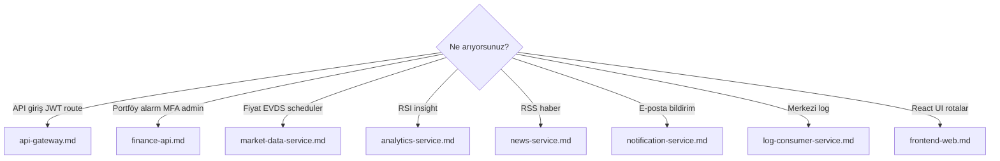

# Service guides

Detailed documentation for each application component: responsibilities, capabilities, HTTP/Kafka data flows, and mermaid diagrams.

Platform-wide diagrams: [../services.md](../services.md).

### Service selection guide

## Guides

| Service | Document | Summary |
|---------|----------|---------|
| API Gateway | [api-gateway.md](api-gateway.md) | Single `/api/v1` entry, JWT, rate limit, circuit breaker |
| Finance API | [finance-api.md](finance-api.md) | Portal BFF — portfolio, auth, admin, info cards |
| Market Data | [market-data-service.md](market-data-service.md) | Market catalog, EVDS, scheduler, price publishing |
| Analytics | [analytics-service.md](analytics-service.md) | Technical indicators, insight |
| News | [news-service.md](news-service.md) | RSS ingestion, news API |
| Notification | [notification-service.md](notification-service.md) | Kafka → email |
| Log Consumer | [log-consumer-service.md](log-consumer-service.md) | `app.logs` → OpenSearch |
| Frontend | [frontend-web.md](frontend-web.md) | React SPA, Keycloak, i18n |

## Platform documents

| Document | When? |
|----------|-------|
| [../services.md](../services.md) | Port table and quick summary |
| [../architecture.md](../architecture.md) | Platform architecture |
| [../api.md](../api.md) | Gateway route list |
| [../observability.md](../observability.md) | Metrics, traces, logs |

## Updating documentation

When adding a new service or changing behavior:

1. Update the relevant `docs/english/services/<module>.md` file (template: [_template.md](_template.md)).
2. If gateway routes changed, update [api.md](../api.md) and [api-gateway.md](api-gateway.md).
3. If there is a new Kafka topic, add a row to the table in [architecture.md](../architecture.md).
4. Note “docs/services updated” in the PR description.
