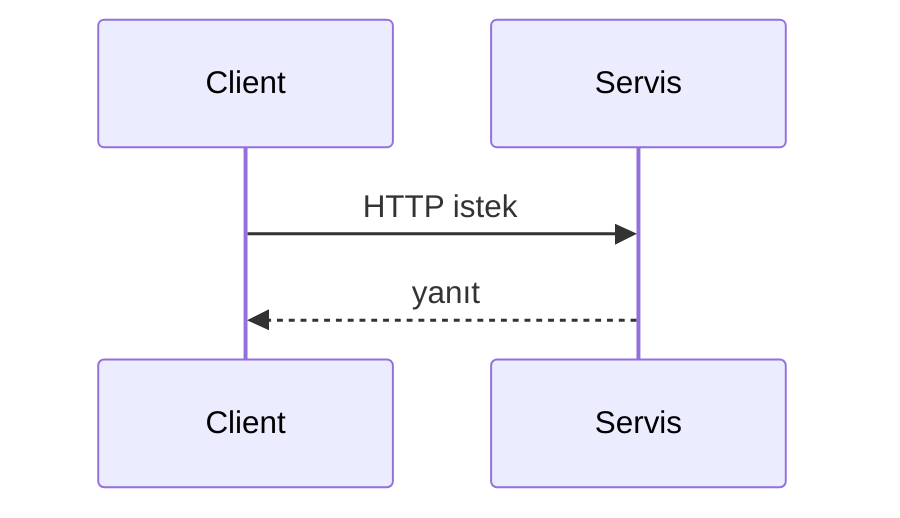
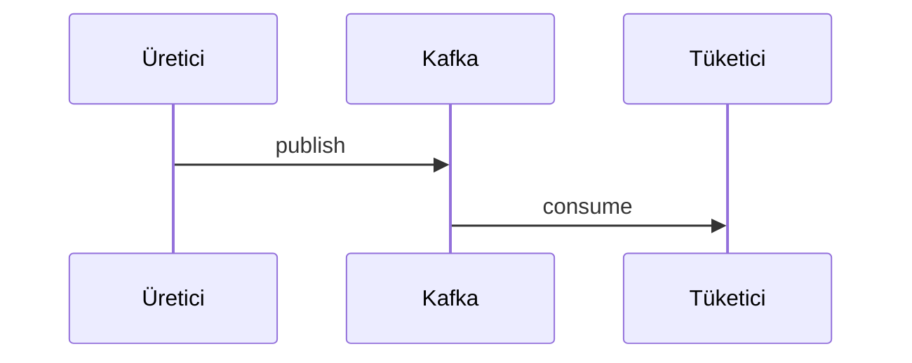

# {Service name}

> Template for new or updated service documentation. Copy this file and save it as `{module-name}.md`.

## Summary

{2–3 sentences: the service's role on the platform and primary responsibility.}

## Responsibilities

- {Does 1}
- {Does 2}

## Out of scope

- {Does not do — which service handles it}

## Capabilities

| Perspective | Capability |
|-------------|------------|
| Portal user | {…} |
| Admin | {…} |
| Operations | {…} |

## Runtime environment

| Property | Value |
|----------|-------|
| Maven module | `{module}` |
| Container name | `{container}` |
| HTTP port (Docker) | {port} |
| HTTP port (local dev) | {port} |
| Spring profiles | `{profiles}` |
| Healthcheck | `{endpoint}` |

## Dependencies

| Component | Usage |
|-----------|-------|
| PostgreSQL | {yes/no — schema} |
| Redis | {…} |
| Kafka | {produce/consume} |
| Keycloak | {…} |
| HTTP peer | {…} |

## Context diagram

```mermaid
flowchart LR
  SVC[{Servis}]
  %% dış sistemler ve oklar
```

## HTTP data flows

### Key path groups

| Path prefix | Description |
|-------------|-------------|
| `/api/v1/...` | {…} |

### Typical request flow



## Kafka / event flows

| Topic | Role | Description |
|-------|------|-------------|
| `{topic}` | Produces / Consumes | {…} |



## Schedulers / background jobs

| Component | Trigger | Task |
|-----------|---------|------|
| `{Scheduler}` | {cron / fixedDelay} | {…} |

## Data model

| Item | Value |
|------|-------|
| Flyway migration | `{module}/src/main/resources/db/migration/` |
| History table | `{table_name}` |
| Core concepts | {table/group list} |

## Package / code structure

```
{module}/src/main/java/...
```

## Configuration

| Variable | Description |
|----------|-------------|
| `{ENV}` | {…} |

Full list: [configuration.md](../configuration.md).

## Observability

| Channel | Detail |
|---------|--------|
| Logs | Kafka `app.logs`, fields: `service`, `traceId`, `correlationId` |
| Metrics | Prometheus job: `{job-name}` |
| Trace | OTLP → Jaeger |

Details: [observability.md](../observability.md).

## Local run

```bash
mvn -pl {module} -am spring-boot:run -Dspring-boot.run.profiles={profile}
```

Setup: [getting-started.md](../getting-started.md) · Development: [development.md](../development.md).

## Related documents

| Document | Content |
|----------|---------|
| [api.md](../api.md) | Gateway routes |
| [architecture.md](../architecture.md) | Platform overview |
| [services.md](../services.md) | Port summary |
