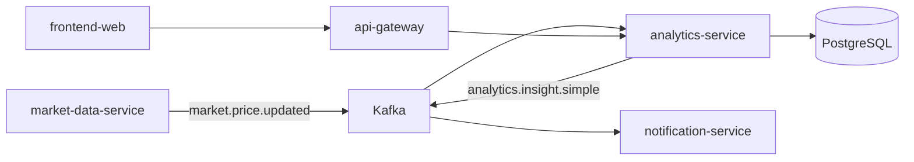
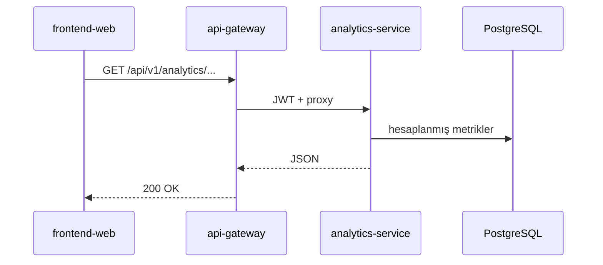
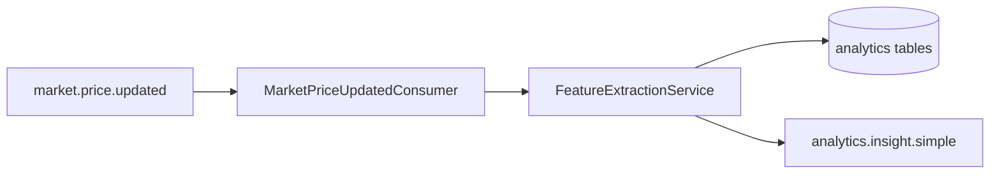
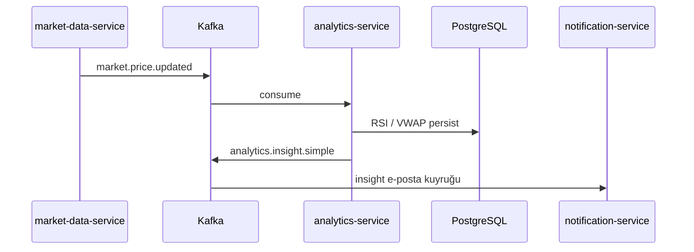

# analytics-service

## Summary

**analytics-service** consumes price events published by `market-data-service` to compute **technical analysis metrics** (RSI, VWAP, etc.) and stores results in PostgreSQL. It writes simple insight events to the `analytics.insight.simple` topic; portal `/api/v1/analytics/**` endpoints are served via the gateway.

## Responsibilities

- Consume `market.price.updated` and FX snapshot events from Kafka
- Indicator calculation and persistent storage (analytics Flyway schema)
- REST API: analysis queries (`AnalyticsController`)
- Produce `analytics.insight.simple` (for price movement / insight notifications)
- HTTP integration with `finance-api` (when needed)

## Out of scope

- Raw price fetching and EVDS — `market-data-service`
- Portal portfolio / alarm business rules — `finance-api`
- Email delivery — `notification-service` (consumes insight topic)
- News matching — `news-service`

## Capabilities

| Perspective | Capability |
|-------------|------------|
| Portal | Analysis page indicators, insight cards (via gateway) |
| Operations | Health, Prometheus metrics |
| Platform | Metrics derived from price stream |

## Runtime

| Property | Value |
|----------|-------|
| Maven module | `analytics-service` |
| Container name | `analytics-service` |
| HTTP port | **8080** (Spring Boot default) |
| Spring profiles | `docker` (compose) |
| Healthcheck | `/actuator/health` |

## Dependencies

| Component | Usage |
|-----------|-------|
| PostgreSQL | `finance` DB, `analytics_flyway_schema_history` |
| Kafka | Consume prices; produce insight |
| HTTP | `FINANCE_BASE_URL` → finance-api (internal) |
| Keycloak | JWT (resource server) |

## Context diagram



## HTTP data flows

### Key endpoints

| Path (gateway) | Controller | Description |
|----------------|------------|-------------|
| `/api/v1/analytics/**` | `AnalyticsController` | Indicator / insight queries |



## Processing pipeline



## Kafka / event flows

| Topic | Role | Description |
|-------|------|-------------|
| `market.price.updated` | Consumes | `MarketPriceUpdatedConsumer` |
| FX snapshot topic | Consumes | `FxSnapshotUpdatedConsumer` |
| `analytics.insight.simple` | Produces | `FeatureExtractionService` — notification pipeline |



Consumers have retry + DLQ (`topic.dlq`) configuration.

## Schedulers / background jobs

Mostly **Kafka-driven**; additional batch work is limited to migration/startup. Periodic calculation is triggered by price events.

## Data model

| Item | Value |
|------|-------|
| Flyway | `analytics-service/src/main/resources/db/migration/` |
| History table | `analytics_flyway_schema_history` |
| Main concepts | daily RSI, VWAP, insight / policy metric tables |

## Package / code structure

```
analytics-service/src/main/java/com/company/analytics/
├── processing/       # Kafka consumer'lar, FeatureExtractionService
├── query/            # AnalyticsController
└── bootstrap/        # config, health
```

## Configuration

| Variable | Description |
|----------|-------------|
| `SPRING_DATASOURCE_URL` | PostgreSQL |
| `KAFKA_BOOTSTRAP_SERVERS` | Kafka |
| `FINANCE_BASE_URL` | finance-api HTTP |
| `TRACING_SAMPLE_PROBABILITY` | Trace sampling |

Full list: [configuration.md](../configuration.md).

## Observability

| Channel | Detail |
|---------|--------|
| Logs | `app.logs` |
| Metrics | Prometheus job `analytics-service` |
| Trace | OTLP → Jaeger |

Details: [observability.md](../observability.md).

## Local development

```bash
export KAFKA_BOOTSTRAP_SERVERS=localhost:9092
export SPRING_DATASOURCE_URL=jdbc:postgresql://localhost:5432/finance

mvn -pl analytics-service -am spring-boot:run
```

Setup: [getting-started.md](../getting-started.md).

## Related documents

| Document | Content |
|----------|---------|
| [market-data-service.md](market-data-service.md) | Price event producer |
| [notification-service.md](notification-service.md) | Insight consumer |
| [api-gateway.md](api-gateway.md) | Analytics route |
| [architecture.md](../architecture.md) | Kafka summary |
