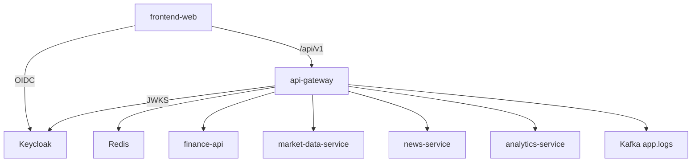
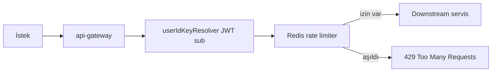
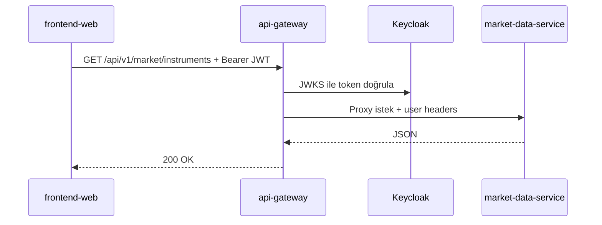
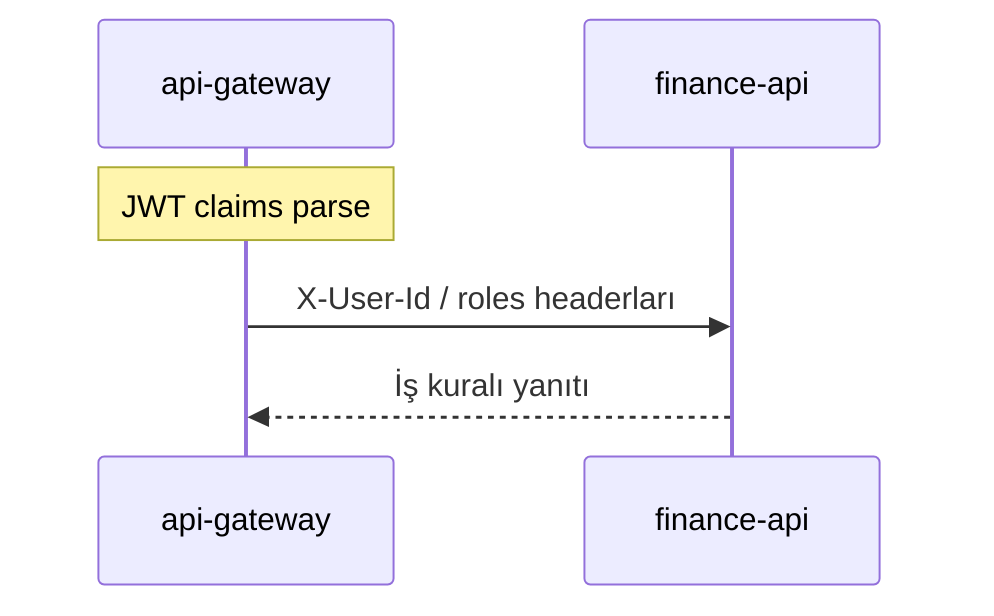

# api-gateway

## Summary

**api-gateway** is the **single HTTP entry point** through which browsers and external clients reach the platform backend. It performs JWT validation (Keycloak JWKS), CORS, Redis-based rate limiting, Resilience4j circuit breaking, and path-based routing to downstream microservices. It consolidates OpenAPI/Swagger documentation in one interface.

## Responsibilities

- Route `/api/v1/**` and `/health` requests to the correct downstream service
- Validate JWTs with OAuth2 Resource Server; propagate user identity to downstream headers
- Per-user API rate limiting (Redis)
- Circuit breakers and fallback endpoints for market, news, and analytics
- Unified Swagger UI (`/swagger-ui.html`) and service OpenAPI proxy routes
- Send structured logs to the Kafka `app.logs` topic (Log4j2)

## Out of scope

- **Business rules** such as portfolio, alarms, and market data — `finance-api` and specialist services
- User registration / MFA — `finance-api` + Keycloak
- Email delivery — `notification-service`
- Log indexing — `log-consumer-service`

## Capabilities

| Perspective | Capability |
|-------------|------------|
| Portal / SPA | Make all `/api/v1` calls through a single origin |
| Developer | Discover all service APIs via Swagger |
| Operations | Prometheus `/actuator/prometheus`, health, Jaeger trace |
| Fault tolerance | `/fallback/market`, `/fallback/news`, `/fallback/analytics` when CB is open |

## Runtime

| Property | Value |
|----------|-------|
| Maven module | `api-gateway` |
| Container name | `api-gateway` |
| HTTP port (Docker) | **8080** (host map) |
| HTTP port (local `dev`) | **9090** |
| Spring profiles | `docker` (compose), `dev` (IDE) |
| Healthcheck | `/actuator/health` |

## Dependencies

| Component | Usage |
|-----------|-------|
| PostgreSQL | No |
| Redis | Rate limiter state |
| Kafka | Log append (`app.logs`) |
| Keycloak | JWT issuer / JWKS |
| HTTP downstream | finance-api, market-data-service, news-service, analytics-service (+ notification/log URIs defined, mostly internal) |

Downstream URIs: `gateway.services.*` — [`application.yml`](../../../api-gateway/src/main/resources/application.yml).

## Context diagram



## HTTP data flows

### Rate limiting



### Route summary (lower order = matched first)

| Order | Path prefix | Target |
|-------|-------------|--------|
| -14 | `/api/v1/market/eurobonds/tr/**` | finance-api |
| -13 | `/api/v1/market/overview`, `.../insights` | finance-api |
| -12 | `/api/v1/rates/**` | market-data-service |
| -11 | `/api/v1/news/enriched/**`, `.../favorites/**` | finance-api |
| -10 | `/api/v1/news/**` | news-service |
| -8 | `/api/v1/market/**` | market-data-service |
| -6 | `/api/v1/analytics/**` | analytics-service |
| -3 | `/api/v1/**`, `/health` | finance-api (rate limit + CB) |
| -2 | `/api/v1/public/**` | finance-api |

Source: [`GatewayRoutesConfig.java`](../../../api-gateway/src/main/java/com/company/gateway/bootstrap/config/GatewayRoutesConfig.java). Full table: [api.md](../api.md).

### Market list request



### JWT and user context



The gateway maps `sub`, `preferred_username`, and `realm_access.roles` claims to headers via `gateway.user-context.*`.

## Kafka / event flows

| Topic | Role | Description |
|-------|------|-------------|
| `app.logs` | Produces | Log4j2 JSON; consumed by `log-consumer-service` |

The gateway does not produce business domain events.

## Schedulers / background jobs

None — fully request-driven (reactive gateway).

## Data model

Does not use a persistent database. Redis is only for rate limit buckets.

## Package / code structure

```
api-gateway/src/main/java/com/company/gateway/
├── bootstrap/config/     # GatewayRoutesConfig, security, rate limit
├── fallback/             # Circuit breaker fallback controller'lar
└── ...
```

## Configuration

| Variable | Description |
|----------|-------------|
| `JWT_ISSUER_URI` | Token issuer (e.g. `http://localhost:8085/realms/finance`) |
| `FINANCE_BASE_URI` | finance-api downstream |
| `MARKET_BASE_URI` | market-data-service |
| `NEWS_BASE_URI` | news-service |
| `ANALYTICS_BASE_URI` | analytics-service |
| `SPRING_DATA_REDIS_HOST` | Rate limiter Redis |
| `GATEWAY_CORS_ALLOWED_ORIGINS` | SPA origin (default `http://localhost:5173`) |
| `TRACING_SAMPLE_PROBABILITY` | Trace sampling (default 0.1) |

Full list: [configuration.md](../configuration.md).

## Observability

| Channel | Detail |
|---------|--------|
| Logs | `app.logs`; `correlationId` MDC |
| Metrics | Prometheus job `api-gateway` |
| Trace | OTLP → `http://jaeger:4318/v1/traces` |

Details: [observability.md](../observability.md).

## Local development

```bash
mvn -pl api-gateway -am spring-boot:run -Dspring-boot.run.profiles=dev
```

Port **9090**. Local downstream URIs: [`application-dev.yml`](../../../api-gateway/src/main/resources/application-dev.yml).

Setup: [getting-started.md](../getting-started.md) · Development: [development.md](../development.md).

## Related documents

| Document | Content |
|----------|---------|
| [api.md](../api.md) | Route list and Swagger |
| [finance-api.md](finance-api.md) | Default catch-all target |
| [architecture.md](../architecture.md) | Platform architecture |
| [services.md](../services.md) | Port summary |
