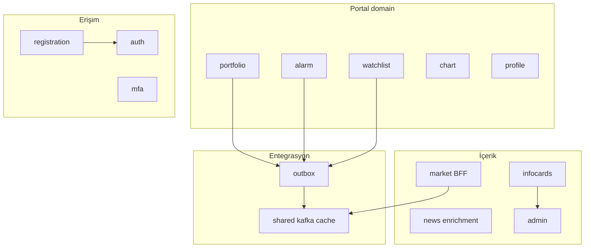
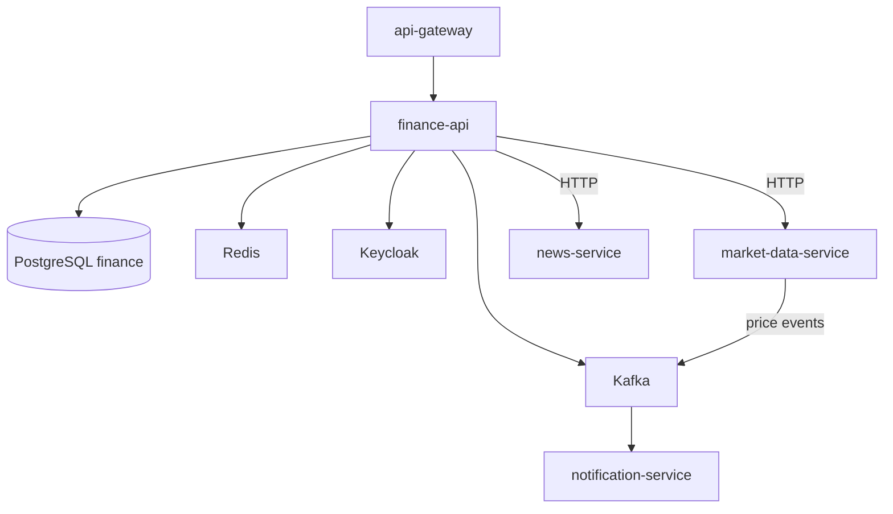
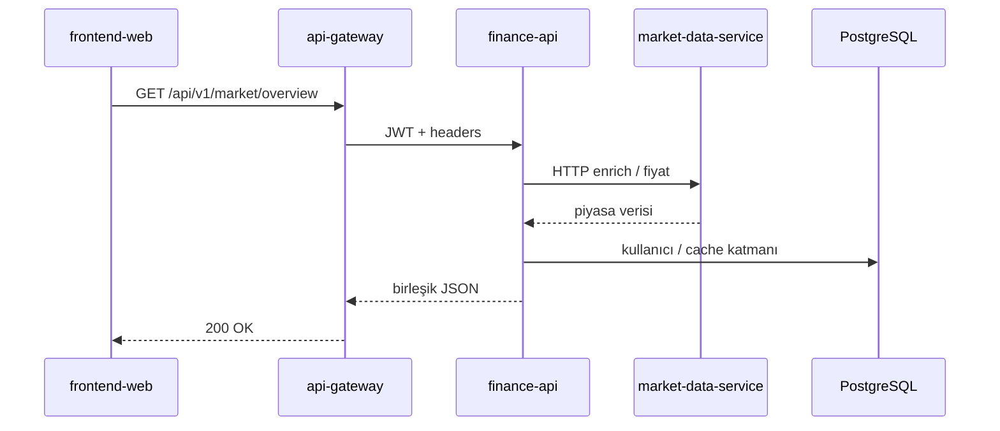
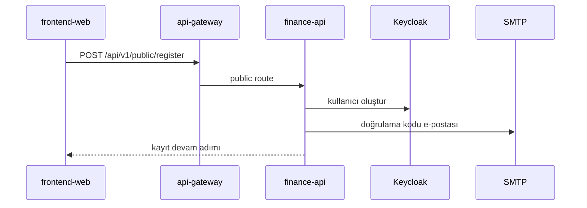
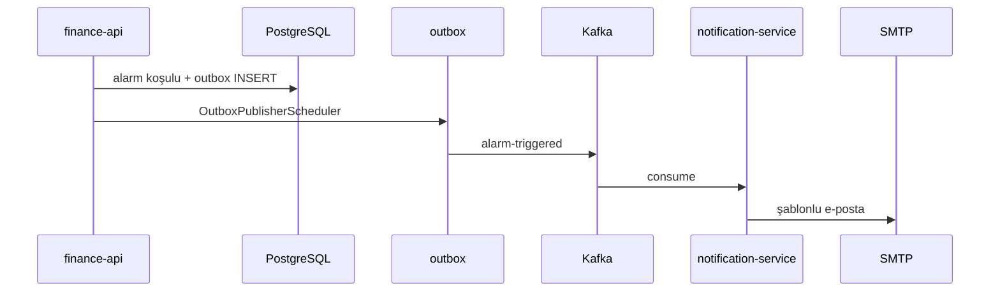

# finance-api

## Summary

**finance-api** is the **Backend-for-Frontend (BFF)** and business rule hub of the 32 Bit Finance Portal. User-specific data (portfolio, trades, alarms, watchlist, profile), registration/MFA, admin KPIs, info cards, and news enrichment live here. It connects to `market-data-service` via HTTP or Kafka for raw market data; it writes domain events to Kafka through a transactional outbox.

## Responsibilities

- Portfolio, transaction history, goals, external portfolio view
- Price alarms and alarm history
- Watchlist and chart drawing saves
- Registration, email verification, TOTP MFA, trusted devices
- Profile, avatar, notification preferences
- Admin portal metrics, info cards (CRUD + AI content)
- News favorites and enriched news APIs
- Market overview / insight BFF (`/api/v1/market/overview`, eurobond TR proxy)
- User/role management via Keycloak Admin API
- Kafka consumer: live price / FX / fund snapshot events
- Kafka producer (outbox): alarm, watchlist, login security, transaction events

## Out of scope

- Raw market catalog and EVDS scheduler — `market-data-service`
- RSS ingestion and raw news list — `news-service` (BFF enrichment here)
- RSI / technical indicator calculation — `analytics-service`
- SMTP email delivery — `notification-service`
- Centralized log indexing — `log-consumer-service`
- JWT edge validation — `api-gateway`

## Capabilities

| Perspective | Capability |
|-------------|------------|
| Portal user | Portfolio management, alarm setup, watchlist, profile/MFA |
| Admin | KPI dashboards, info card management, blocked emails |
| Public (anonymous) | Registration, login completion, public health |
| System | Price cache updates via Kafka; notification triggers via outbox |

## Runtime

| Property | Value |
|----------|-------|
| Maven module | `finance-api` |
| Container name | `finance-api` |
| HTTP port | **8080** (internal; external world via gateway) |
| Spring profiles (Docker) | `docker`, `kafka`, `cache-redis` |
| Spring profiles (local) | `dev`, `kafka` |
| Healthcheck | `/actuator/health` (start period ~120s) |

## Domain module interaction



## Dependencies

| Component | Usage |
|-----------|-------|
| PostgreSQL | `finance` DB, Flyway `finance_flyway_schema_history` |
| Redis | `cache-redis` profile — instrument price cache |
| Kafka | Outbox publish + market event consume |
| Keycloak | Admin API, JWT resource server |
| HTTP | `market-data-service`, `news-service` |
| File system | `photos/{userId}/` avatar storage |

## Context diagram



## HTTP data flows

### Key controller groups

| Area | Controller (example) | Path prefix |
|------|----------------------|-------------|
| Public auth | `PublicRegistrationController`, `PublicAuthenticationController` | `/api/v1/public/**` |
| Portfolio | `PortfolioController`, `TradeController`, `TransactionHistoryController` | `/api/v1/portfolio/**` |
| Alarm | `AlarmController`, `AlarmHistoryController` | `/api/v1/alarms/**` |
| Watchlist / chart | `WatchlistController`, `ChartController`, `ChartDrawingSaveController` | `/api/v1/watchlist/**`, chart |
| Market BFF | `MarketOverviewController`, `MarketDataProxyController`, `MarketTurkeyEurobondController` | `/api/v1/market/overview`, proxy |
| News | `NewsAggregationController`, `NewsFavoriteController` | `/api/v1/news/enriched/**`, favorites |
| Profile / MFA | `PortalProfileController`, `PortalMfaController`, `PortalTrustedDevicesController` | `/api/v1/profile/**`, mfa |
| Admin | `AdminPortalMetricsController`, `AdminInfoCardsController` | `/api/v1/admin/**` |
| Info cards (portal) | `PortalInfoCardsController` | `/api/v1/info-cards/**` |
| AI | `AdminInfoCardAiController` | admin AI content |

### Market overview (BFF + MDS)



### Registration and email verification



## Kafka / event flows

### Produced topics (transactional outbox)

Source: [`KafkaTopics.java`](../../../finance-api/src/main/java/com/company/finance_api/shared/kafka/KafkaTopics.java). `OutboxPublisherScheduler` publishes pending outbox rows.

| Topic | Trigger (example) | Consumer |
|-------|-------------------|----------|
| `alarm-triggered` | Price alarm condition | notification-service |
| `watchlist.item.added` | Watchlist add | notification-service |
| `watchlist.item.removed` | Watchlist remove | notification-service |
| `login-security.alert` | Suspicious login | notification-service |
| `transaction-executed` | Trade record | (domain / notification) |
| `internal.user.delete.requested` | User delete saga | internal |

### Consumed topics

Source: `shared/messaging/kafka/consumer/`, `MarketDataTopics` (names shared with MDS).

| Topic | Producer | Purpose |
|-------|----------|---------|
| `market.price.updated` | market-data-service | Price cache / portal update |
| `market.fx.snapshot.updated` | market-data-service | FX snapshot |
| `market.fund.snapshot.updated` | market-data-service | Fund NAV snapshot |

### Alarm → email



## Schedulers / background jobs

| Component | Task |
|-----------|------|
| `OutboxPublisherScheduler` | Outbox → Kafka |
| `market-price` scheduler (dev config) | Local price poll (profile-dependent) |
| Domain schedulers | Alarm evaluation, admin snapshot, etc. (package `infrastructure/scheduler`) |

## Data model

| Item | Value |
|------|-------|
| Flyway | `finance-api/src/main/resources/db/migration/V*.sql` |
| History table | `finance_flyway_schema_history` |
| Main concepts | `users`, portfolio/trades, `alarms`, `watchlist`, `chart_drawing_saves`, `info_cards`, admin metric tables, registration verification |

Single PostgreSQL instance with `finance` database; Keycloak uses separate `keycloak` DB — [architecture.md](../architecture.md).

## Package / code structure

Domain-driven packages (`com.company.finance_api`):

| Package | Responsibility |
|---------|----------------|
| `portfolio` | Portfolio, trades, goals, external portfolio, valuation |
| `alarm` | Price alarms |
| `watchlist` | Watchlist |
| `chart` | Chart drawing saves |
| `registration` / `auth` / `mfa` | Registration, login, TOTP |
| `profile` | Profile, avatar |
| `infocards` / `admin` | Info cards, KPI |
| `market` | Overview, MDS proxy, eurobond |
| `news` | News enrichment, favorites |
| `ai` | OpenAI admin content |
| `outbox` | Transactional outbox |
| `shared` | Security, cache, messaging, web |

Layer: `domain/` → `application/` → `infrastructure/http|persistence|scheduler/`.

## Configuration

| Variable | Description |
|----------|-------------|
| `SPRING_DATASOURCE_URL` | PostgreSQL (local: `localhost:5432`) |
| `KAFKA_BOOTSTRAP_SERVERS` | Kafka broker |
| `CLIENTS_MARKET_DATA_BASE_URL` | MDS HTTP (local: `http://localhost:8082`) |
| `CLIENTS_NEWS_BASE_URL` | news-service HTTP |
| `JWT_ISSUER_URI` / `JWT_JWK_SET_URI` | Keycloak |
| `APP_MFA_ENCRYPTION_SECRET` | TOTP encryption |
| `OPENAI_API_KEY` | Info card AI |
| `PROFILE_AVATAR_STORAGE_ROOT` | Avatar directory (`/photos` Docker) |
| `APP_SECURITY_ALLOW_HEADER_USER_FALLBACK` | Dev header auth (prod: false) |

Full list: [configuration.md](../configuration.md).

## Observability

| Channel | Detail |
|---------|--------|
| Logs | `app.logs`; `traceId`, `correlationId` |
| Metrics | Prometheus job `finance-api` |
| Trace | OTLP → Jaeger; Kafka listener observation |

Details: [observability.md](../observability.md).

## Local development

```bash
export SPRING_DATASOURCE_URL=jdbc:postgresql://localhost:5432/finance
export JWT_ISSUER_URI=http://localhost:8085/realms/finance
export KAFKA_BOOTSTRAP_SERVERS=localhost:9092
export CLIENTS_MARKET_DATA_BASE_URL=http://localhost:8082

mvn -pl finance-api -am spring-boot:run -Dspring-boot.run.profiles=dev,kafka
```

Setup: [getting-started.md](../getting-started.md) · Development: [development.md](../development.md).

## Related documents

| Document | Content |
|----------|---------|
| [api-gateway.md](api-gateway.md) | Entry point |
| [market-data-service.md](market-data-service.md) | Market data source |
| [notification-service.md](notification-service.md) | Outbox consumer |
| [api.md](../api.md) | Gateway route |
| [architecture.md](../architecture.md) | Platform Kafka summary |
