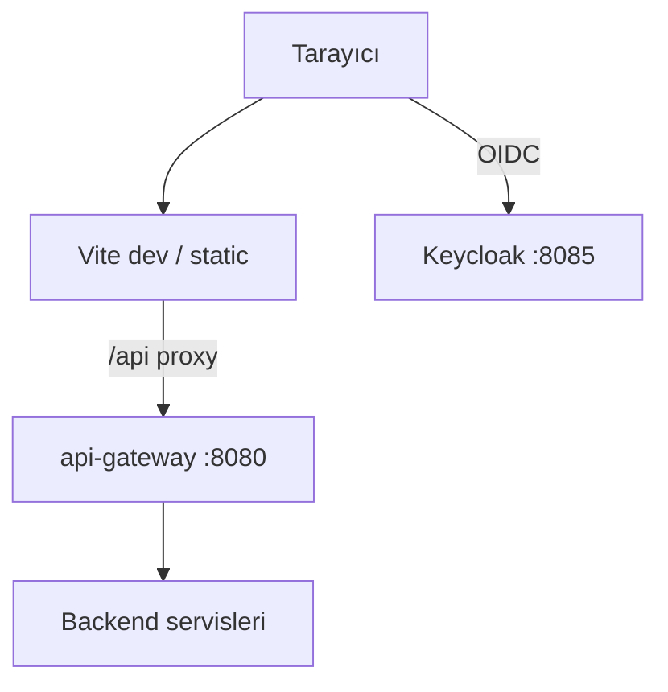
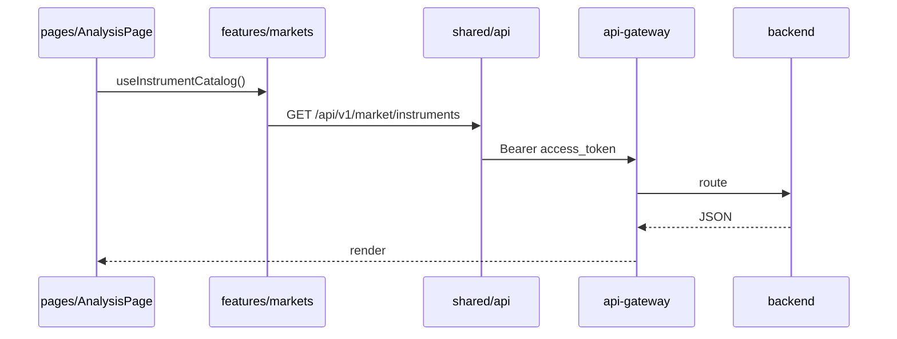
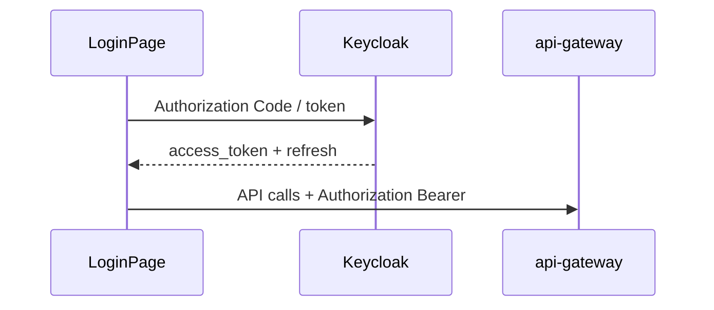
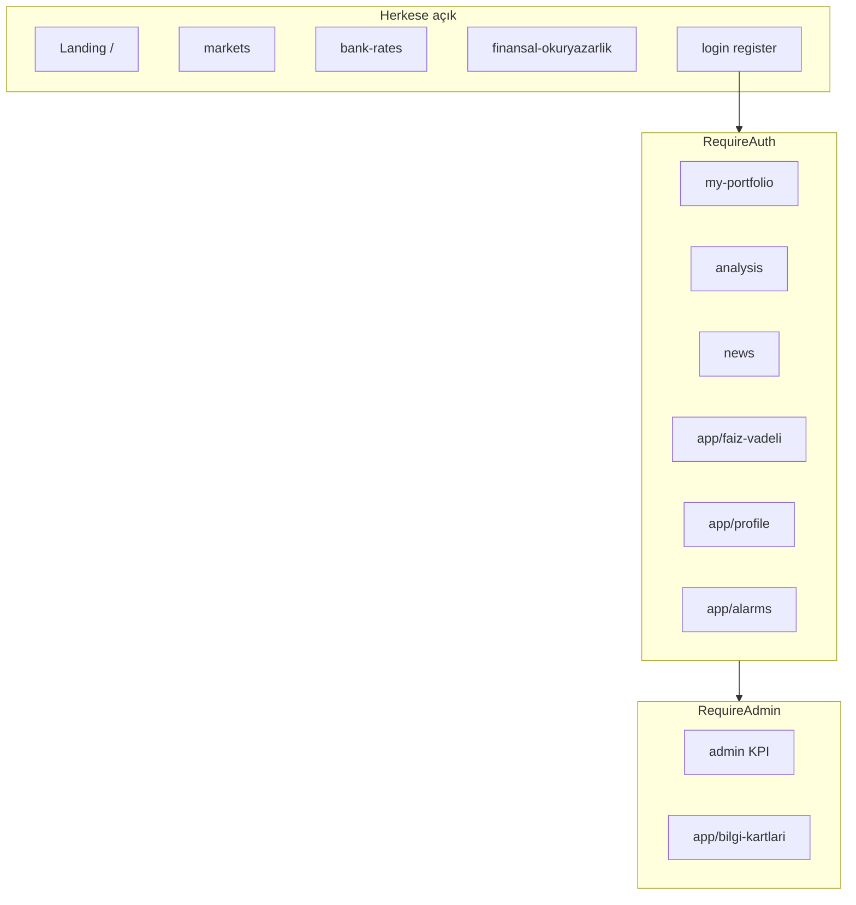

# frontend-web

## Summary

**frontend-web** is the **React 19** single-page application (Vite 8, TypeScript) of the 32 Bit Finance Portal. It provides the user interface, Keycloak OIDC authentication, TR/EN/DE i18n, and routes all backend calls through `api-gateway`. Persistent business data lives on the server; the browser manages session/portfolio state with Zustand.

## Responsibilities

- Landing, markets, analysis, news, bank rates, financial literacy pages
- Authenticated areas: portfolio, interest/deposits, dashboard, profile, alarms, notifications
- Admin KPI dashboards and info card management (ADMIN role)
- Login / register / token refresh with Keycloak
- API routing via Vite dev proxy or `VITE_API_BASE_URL`
- i18n (`i18next`) and theme preferences

## Out of scope

- Business rules and database — backend services
- JWT signing — Keycloak
- Market data fetching — `market-data-service`
- Email — `notification-service`

## Capabilities

| Perspective | Capability |
|-------------|------------|
| Visitor | Landing, markets, bank rates, financial literacy (unauthenticated) |
| User (`user1`) | Portfolio, analysis, news, alarms, profile, MFA |
| Admin (`admin1`) | `/admin/**` KPI, `/app/bilgi-kartlari` management |
| Developer | HMR (`npm run dev`), `tsc` + Vite build, proxy modes |

## Runtime

| Property | Value |
|----------|-------|
| Package | `frontend-web` |
| Container name | `frontend-web` |
| HTTP port | **5173** |
| Build | `npm run build` → `tsc` + Vite |
| API (Docker) | `VITE_PROXY_TARGET=http://api-gateway:8080`, `VITE_DEV_PROXY_GATEWAY=true` |

## Dependencies

| Component | Usage |
|-----------|-------|
| api-gateway | All `/api/v1` HTTP |
| Keycloak | OIDC (realm `finance`, port 8085) |
| PostgreSQL / Kafka | No (direct) |

## Context diagram



## HTTP data flows

### Vite proxy modes

| Mode | Environment | Behavior |
|------|-------------|----------|
| Gateway (Docker) | `VITE_DEV_PROXY_GATEWAY=true` | All `/api` → api-gateway |
| BFF (local) | default | `/api` → finance-api:8080 |
| Remote API | `VITE_API_BASE_URL` | Direct host |

Details: [api.md](../api.md) · [development.md](../development.md).

### Page → API



### Login flow



## Kafka / event flows

Not applicable — the frontend does not use Kafka or OpenSearch directly. Logs and events flow through the backend.

## Schedulers / background jobs

Periodic polls on the browser side live in page hooks (e.g. market pulse, news refresh); these are not server schedulers.

## Data model

Not applicable — UI state:

| Layer | Technology |
|-------|------------|
| Global store | Zustand (`app/store`, `features/`) |
| Server state | REST API responses (in-hook cache) |
| Preferences | `AppPreferencesContext`, localStorage |

## Route map

### Access levels



Source: [`app/router/index.tsx`](../../../frontend-web/src/app/router/index.tsx).

| Route | Guard | Page |
|-------|-------|------|
| `/` | PublicOnly | Landing |
| `/login`, `/register` | PublicOnly | Login / register |
| `/markets` | — | Markets |
| `/bank-rates` | — | Bank rates |
| `/finansal-okuryazarlik` | — | Financial literacy |
| `/my-portfolio`, `/news`, `/analysis` | RequireAuth (per page) | Portfolio, news, analysis |
| `/app/faiz-vadeli` | RequireAuth | Interest / deposits |
| `/app/dashboard` | RequireAuth | Dashboard |
| `/app/portfolio` | RequireAuth | External portfolio |
| `/app/profile` | RequireAuth | Profile |
| `/app/alarms`, `/app/notifications` | RequireAuth | Alarms, notifications |
| `/admin/**` | RequireAdmin | Admin KPI |
| `/app/bilgi-kartlari` | RequireAdmin | Info cards |

## Package / code structure

```
frontend-web/src/
├── app/router/       # Route tanımları, RouteGuards
├── app/store/        # Zustand (portföy vb.)
├── pages/            # Sayfa bileşenleri (feature UI)
├── features/         # API client, domain hook'lar
├── shared/           # Layout, i18n, theme, UI primitives
├── services/         # Paylaşılan HTTP yardımcıları
└── data/             # Sabit portal sayfa tanımları
```

**i18n:** `shared/i18n/locales/{tr,en,de}.json`

**Charts:** `lightweight-charts` — `pages/analysis/chart/`

## Configuration

| Variable | Description |
|----------|-------------|
| `VITE_PROXY_TARGET` | API proxy target |
| `VITE_DEV_PROXY_GATEWAY` | All `/api` → gateway |
| `VITE_API_BASE_URL` | Remote API (proxy bypass) |
| `VITE_DEV_MARKET_DIRECT_TO_MDS` | Debug: market → MDS |

Template: [`frontend-web/.env.example`](../../../frontend-web/.env.example).

## Observability

| Channel | Detail |
|---------|--------|
| Logs | Browser console; Jaeger for backend trace (API requests) |
| Metrics | None (server-side HTTP metrics on gateway) |

User actions can be traced in backend logs via `correlationId`.

Details: [observability.md](../observability.md).

## Local development

**Full Docker stack** (http://localhost:5173, nginx prod): no `frontend-web/.env.development`; API keys live in [`Docker/.env`](../../../Docker/.env.example).

**Local Vite** (`npm run dev`) or hybrid proxy:

```bash
cd frontend-web
cp .env.example .env.development   # optional proxy settings
npm install
npm run dev
```

http://localhost:5173 — [getting-started.md](../getting-started.md).

```bash
npm run build
```

## Related documents

| Document | Content |
|----------|---------|
| [api-gateway.md](api-gateway.md) | API entry point |
| [finance-api.md](finance-api.md) | BFF business rules |
| [api.md](../api.md) | Proxy modes |
| [development.md](../development.md) | Frontend structure |
