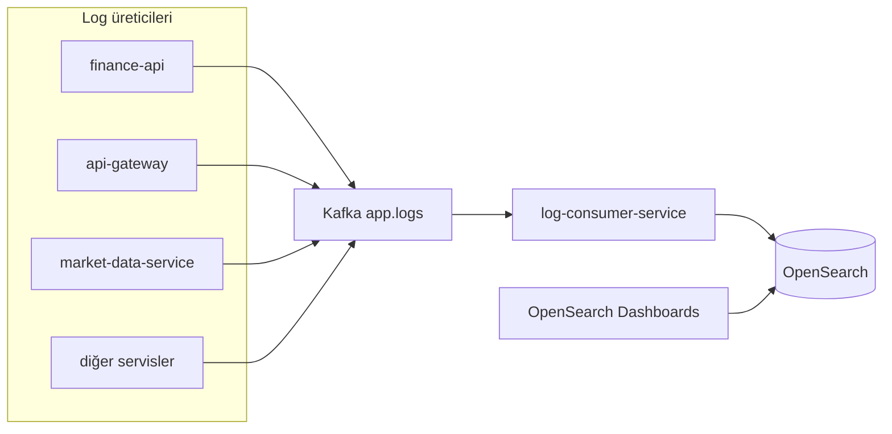
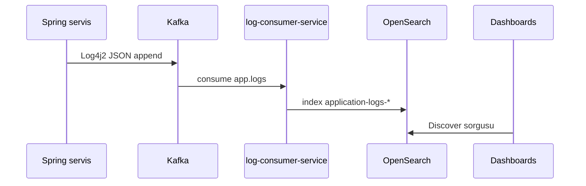

# log-consumer-service

## Summary

**log-consumer-service** consumes the **`app.logs`** topic that all Spring backend services write to Kafka via Log4j2, and writes events to **OpenSearch** `application-logs-*` indexes. It bootstraps index templates and ISM retention policies; it exposes an internal metrics API for operations.

## Responsibilities

- `app.logs` Kafka consumer (`AppLogsKafkaConsumer`)
- JSON log parse; `correlationId` header → MDC
- OpenSearch indexing and error metrics
- ISM retention (`OPENSEARCH_LOG_RETENTION_DAYS`, default 30 days)
- Malformed JSON skip; DLQ publish (`topic.dlq`)
- Internal summary: `GET /internal/system-intelligence`

## Out of scope

- Application log format production — each service's `log4j2-spring.xml`
- Log search UI — OpenSearch Dashboards ([observability.md](../observability.md))
- Business domain API — finance-api, etc.
- Metric scrape collection — Prometheus (separate pipeline)

## Capabilities

| Perspective | Capability |
|-------------|------------|
| Operations | Centralized log search (Dashboards), Kafka lag monitoring |
| Developer | Debug with `traceId` / `service` |
| SRE | Grafana log pipeline panels, DLQ rate |

## Runtime

| Property | Value |
|----------|-------|
| Maven module | `log-consumer-service` |
| Container name | `log-consumer-service` |
| HTTP port | **8087** |
| Compose dependency | `opensearch` **healthy** |

## Dependencies

| Component | Usage |
|-----------|-------|
| PostgreSQL | No |
| Kafka | Consumes `app.logs` |
| OpenSearch | HTTPS, `admin` / `123456789` (demo) |
| Keycloak | No |

## Context diagram



## HTTP data flows

| Path | Description |
|------|-------------|
| `/actuator/health` | Health |
| `/actuator/prometheus` | Metrics |
| `/internal/system-intelligence` | Kafka lag, failed/skipped/DLQ summary |

Portal traffic is **not** routed to this service.

## Kafka / event flows

| Topic | Role | Description |
|-------|------|-------------|
| `app.logs` | Consumes | JSON log lines |
| `{topic}.dlq` | Produces (error) | Unprocessable messages |

### Log pipeline



Log JSON fields (examples): `@timestamp`, `level`, `message`, `service`, `traceId`, `correlationId`, `stack_trace` — [`log4j2-kafka-template.json`](../../../finance-api/src/main/resources/log4j2-kafka-template.json).

## Schedulers / background jobs

| Component | Task |
|-----------|------|
| `OpenSearchLogInfrastructureBootstrap` | Index template + ISM policy at startup |
| Kafka listener | Continuous consume |

## Data model

OpenSearch indexes (no relational Flyway).

| Item | Value |
|------|-------|
| Index prefix | `application-logs` (`OPENSEARCH_INDEX_PREFIX`) |
| ISM policy | `application-logs-retention` |
| Volume | `docker_opensearch_data` |

## Package / code structure

```
log-consumer-service/src/main/java/com/company/logconsumer/
├── ingestion/kafka/       # AppLogsKafkaConsumer
├── ingestion/opensearch/  # Indexer, bootstrap
├── intelligence/http/     # SystemIntelligenceController
└── bootstrap/config/      # KafkaConsumerConfig
```

## Configuration

| Variable | Description |
|----------|-------------|
| `APP_LOGS_TOPIC` | Default `app.logs` |
| `LOG_CONSUMER_GROUP_ID` | Consumer group |
| `OPENSEARCH_HOST` / `PORT` / `SCHEME` | Cluster connection |
| `OPENSEARCH_USERNAME` / `PASSWORD` | Security |
| `OPENSEARCH_LOG_RETENTION_DAYS` | ISM delete duration |

Full list: [configuration.md](../configuration.md).

## Observability

| Channel | Detail |
|---------|--------|
| Metrics | `kafka_events_processed_total`, `kafka_events_opensearch_failed_total`, `kafka_events_dlq_published_total` |
| Prometheus job | `log-consumer-service` |
| Grafana | Finance Platform Overview — log pipeline panels |

Dashboards first setup: `application-logs-*` index pattern — [observability.md](../observability.md).

## Local development

```bash
cd Docker && docker compose up -d kafka opensearch
export KAFKA_BOOTSTRAP_SERVERS=localhost:9092

mvn -pl log-consumer-service -am spring-boot:run
```

Port **8087**. OpenSearch must be healthy.

Setup: [getting-started.md](../getting-started.md).

## Related documents

| Document | Content |
|----------|---------|
| [observability.md](../observability.md) | Dashboards, retention, troubleshooting |
| [architecture.md](../architecture.md) | Platform log flow |
| All service MD files | Produce `app.logs` as log producers |
