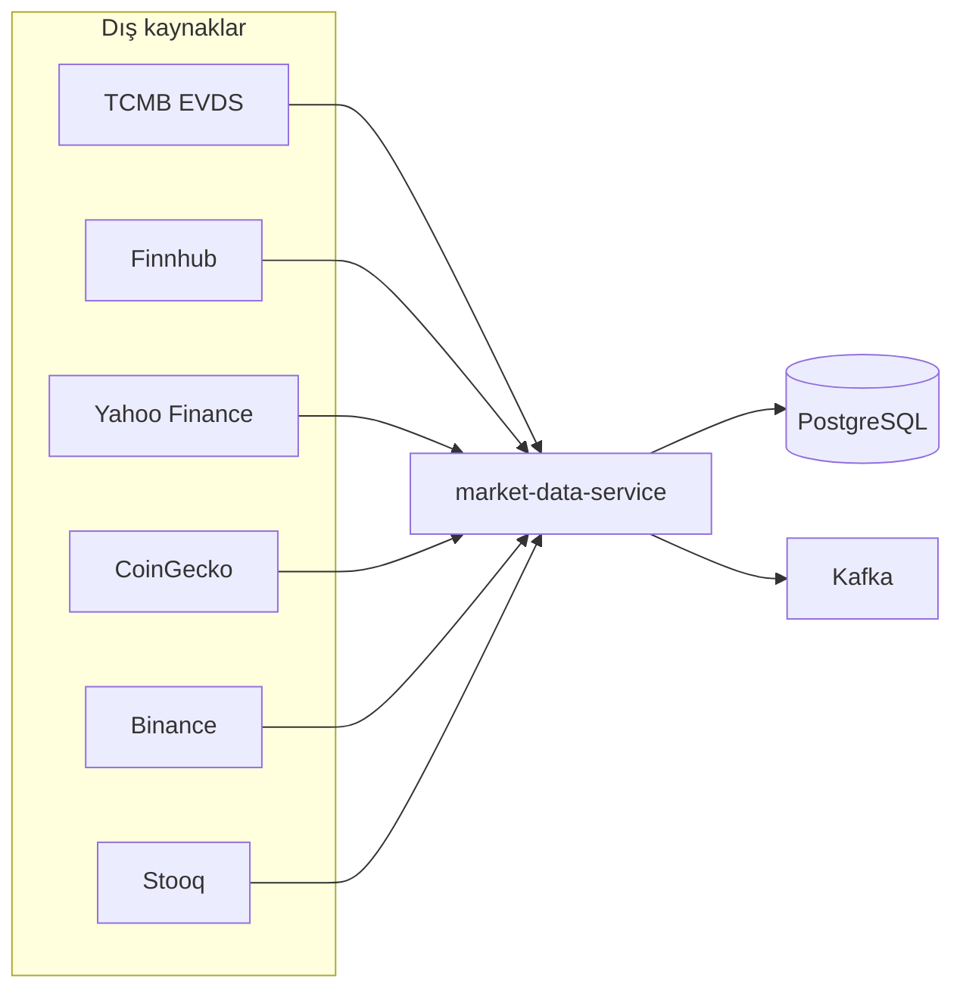
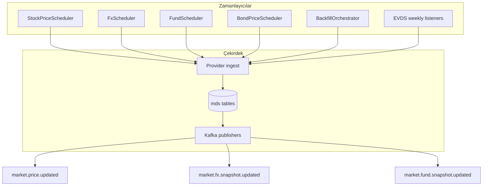
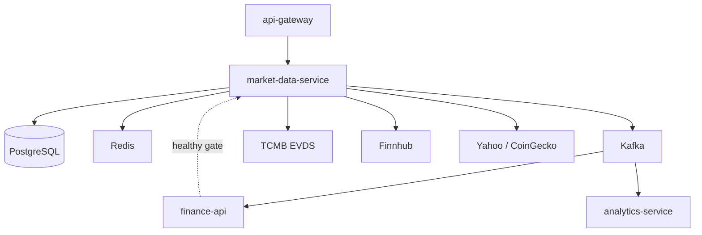
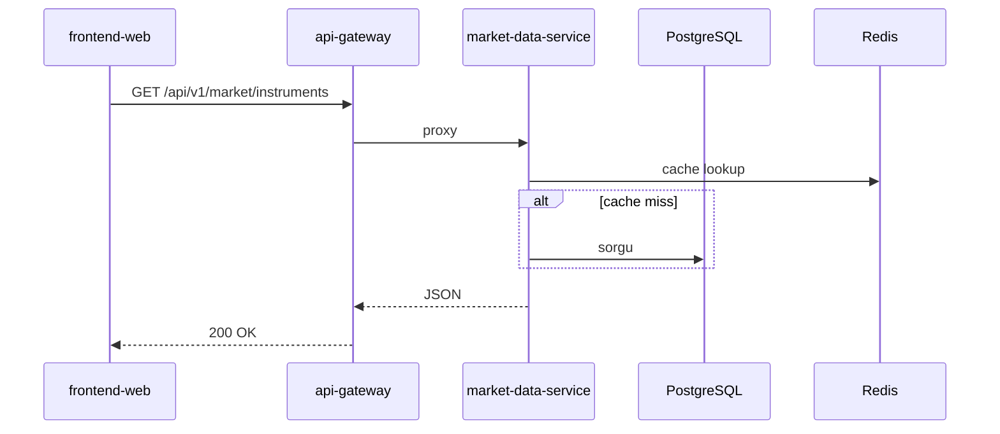
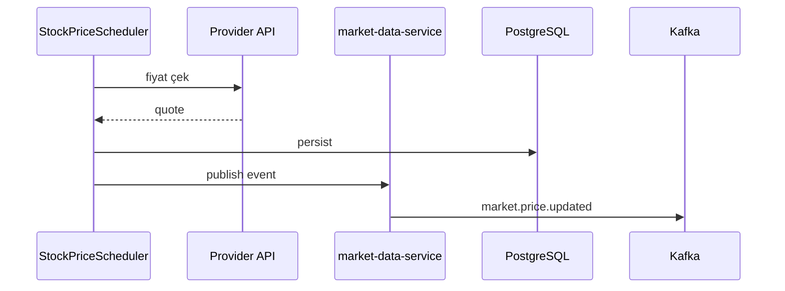

# market-data-service

## Summary

**market-data-service (MDS)** is the platform's **market data engine**. It manages the instrument catalog; pulls live and historical prices from external providers (TCMB EVDS, Finnhub, Yahoo, CoinGecko, Binance, etc.); and updates them periodically via schedulers. It publishes price changes to Kafka topics to feed `finance-api` and `analytics-service`.

## Responsibilities

- BIST, Nasdaq, crypto, fund, FX, bond, and eurobond instrument catalog
- Live price schedulers (equities, FX, bonds, fund NAV, crypto)
- Historical price backfill and gap repair
- TCMB EVDS: policy rate, repo, TL deposit, bond series, CPI
- REST API: `/api/v1/market/**`, `/api/v1/rates/**` (via gateway)
- Kafka: `market.price.updated`, FX and fund snapshot topics
- Redis / hybrid cache for frequently read endpoints

## Out of scope

- User portfolio and trades — `finance-api`
- Portal JWT / admin — `api-gateway` + `finance-api`
- Technical RSI / insight calculation — `analytics-service`
- News RSS — `news-service`
- Email — `notification-service`

## Capabilities

| Perspective | Capability |
|-------------|------------|
| Portal (indirect) | Market lists, chart data, bank rates, interest card data source |
| API consumer | Instrument listing, historical series, rates, fundamentals |
| Operations | Ingestion status, provider health, debug endpoints |
| Platform | Real-time price broadcast via Kafka |

## Runtime

| Property | Value |
|----------|-------|
| Maven module | `market-data-service` |
| Container name | `market-data-service` |
| HTTP port (Docker) | **8080** (internal) |
| HTTP port (local `dev`) | **8082** |
| Spring profiles | `dev` (H2), `docker` (PostgreSQL) |
| Compose dependency | Starts after `finance-api` is **healthy** |

## External provider map



## Scheduler pipeline (summary)



## Dependencies

| Component | Usage |
|-----------|-------|
| PostgreSQL | Docker: `finance` DB; dev: H2 in-memory |
| Redis | Price / catalog cache |
| Kafka | Price and snapshot publish |
| External HTTP | TCMB EVDS, Finnhub, Yahoo, CoinGecko, Binance, Stooq, etc. |
| Internal HTTP | `finance-api` (bootstrap / catalog sync) |

## Context diagram



## HTTP data flows

### Controllers

| Controller | Path (gateway) | Description |
|------------|----------------|-------------|
| `MarketDataController` | `/api/v1/market/**` | Instruments, spot price, catalog |
| `RatesController` | `/api/v1/rates/**` | Policy rate, repo, TL deposit |
| `MarketHistoryController` | `/api/v1/market/.../history` | Historical series |
| `MarketFundamentalsController` | fundamentals | Fundamentals |
| `IngestionStatusController` | internal/status | Backfill progress |
| `ProviderHealthController` | health | Provider status |

### Read request



## Kafka / event flows

Source: [`MarketDataTopics.java`](../../../market-data-service/src/main/java/com/company/marketdataservice/shared/kafka/MarketDataTopics.java).

| Topic | Producer | Consumer (example) | Content |
|-------|----------|-------------------|---------|
| `market.price.updated` | MDS | finance-api, analytics-service | Spot price update |
| `market.fx.snapshot.updated` | MDS | finance-api | FX snapshot |
| `market.fund.snapshot.updated` | MDS | finance-api | TEFAS NAV snapshot |

### Scheduler → Kafka



## Schedulers / background jobs

| Component | Trigger | Task |
|-----------|---------|------|
| `StockPriceScheduler` | `scheduler.stock.delay-ms` (~30s demo) | Equity prices |
| `FxScheduler` | `scheduler.fx.delay-ms` (~5 min) | FX |
| `FundScheduler` | fixed delay | TEFAS NAV |
| `BondPriceScheduler` | `scheduler.bond.delay-ms` | Bonds |
| `BondHistoryRefreshScheduler` | cron (Istanbul) | Bond history |
| `BackfillOrchestrator` | startup + scheduled | Historical price backfill |
| `MetalSpotHistoryBootstrapper` | delayed | Commodity history |
| `PolicyRateWeeklyBootstrapListener` | weekly cron | EVDS policy rate |
| `RepoRateBootstrapListener` | weekly cron | Repo rate |
| `TlDepositWeeklyBootstrapListener` | weekly cron | TL deposit |
| `CpiMonthlyBootstrapListener` | monthly cron | CPI |
| `TefasNavHistoryGapRepairScheduler` | daily | Fund NAV gap |
| `TrGovUsdEurobondHistoryRefreshScheduler` | cron | Eurobond history |
| `SharesOutstandingWeeklyScheduler` | weekly | Share count validation |

Initial stack startup backfill may take **~30 minutes** — [getting-started.md](../getting-started.md).

## Data model

| Item | Value |
|------|-------|
| Flyway | `market-data-service/src/main/resources/db/migration/` |
| History table | `mds_flyway_schema_history` |
| Main concepts | instrument mappings, `mds_market_price_history`, EVDS rate points, provider mapping |

**Dev profile:** H2 in-memory — no production data. Docker shares PostgreSQL `finance` DB.

## Package / code structure

```
market-data-service/src/main/java/com/company/marketdataservice/
├── spot/           # Canlı fiyat, MarketDataController
├── history/        # Backfill, geçmiş seri
├── rates/          # EVDS oranları, RatesController
├── fund/           # TEFAS NAV
├── fx/             # Döviz snapshot
├── bond/           # Tahvil
├── eurobond/       # TR USD eurobond
├── fundamentals/   # Temel veri
├── shared/kafka/   # MarketDataTopics, publisher'lar
└── bootstrap/      # Startup, health
```

## Configuration

| Variable | Description |
|----------|-------------|
| `TCMB_API_KEY` / `MARKET_EVDS_API_KEY` | EVDS (do not write empty `KEY=`) |
| `FINNHUB_API_KEY` | Nasdaq / equities |
| `MARKET_HISTORY_BACKFILL_*` | Backfill behavior |
| `scheduler.*.delay-ms` | Demo rate-limit-friendly intervals |
| `SPRING_DATASOURCE_URL` | Docker PostgreSQL |
| `KAFKA_BOOTSTRAP_SERVERS` | Kafka |

Full list: [configuration.md](../configuration.md).

## Observability

| Channel | Detail |
|---------|--------|
| Logs | `app.logs` |
| Metrics | Prometheus job `market-data-service` |
| Trace | OTLP → Jaeger |

Monitoring: `docker compose logs -f market-data-service`

Details: [observability.md](../observability.md).

## Local development

```bash
mvn -pl market-data-service -am spring-boot:run -Dspring-boot.run.profiles=dev
```

Port **8082**. Provide real EVDS/Finnhub keys via `application-dev.yml` or env.

Setup: [getting-started.md](../getting-started.md) · Development: [development.md](../development.md).

## Related documents

| Document | Content |
|----------|---------|
| [finance-api.md](finance-api.md) | BFF and Kafka consumer |
| [analytics-service.md](analytics-service.md) | Price event consumer |
| [api-gateway.md](api-gateway.md) | `/api/v1/market/**` route |
| [architecture.md](../architecture.md) | Platform flow |
