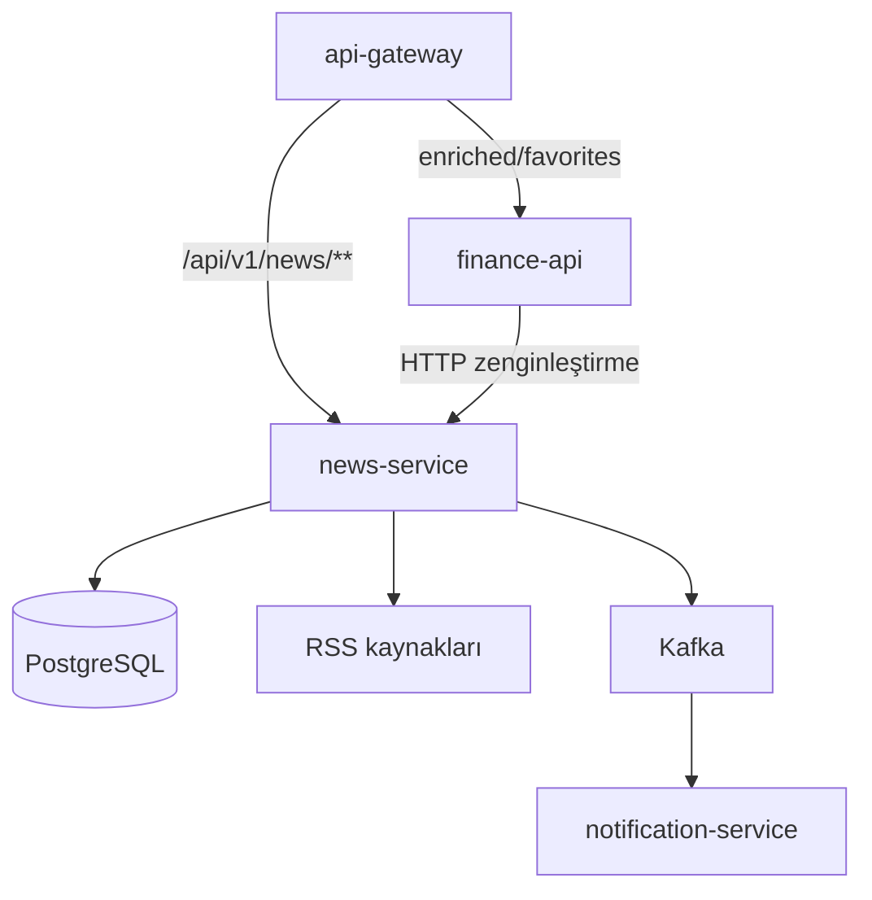
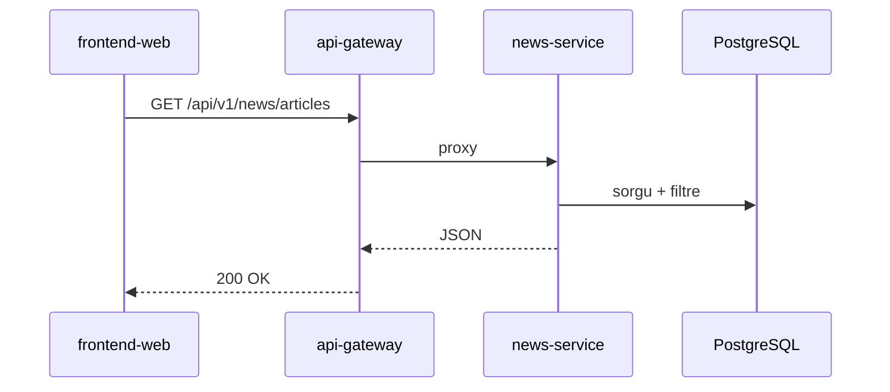
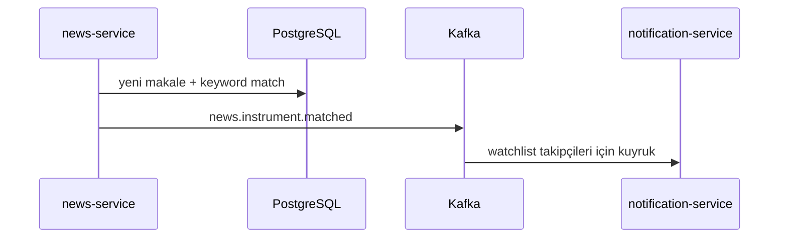
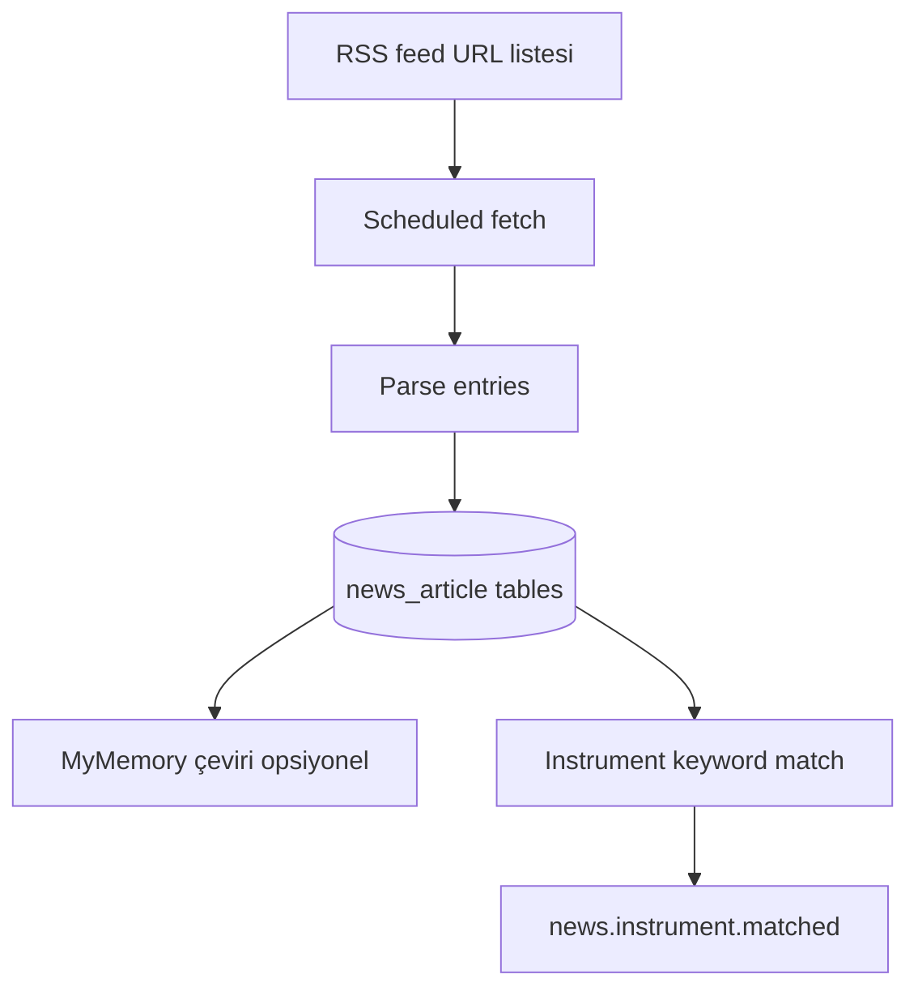

# news-service

## Summary

**news-service** manages the financial **news feed**: it periodically scans configured RSS sources, writes articles to PostgreSQL, optionally translates them via MyMemory, and exposes a raw news REST API. After instrument keyword matching, it publishes the `news.instrument.matched` event to Kafka.

## Responsibilities

- RSS ingestion (scheduled tasks)
- News storage, filtering, listing API (`NewsController`)
- Multilingual translation (MyMemory)
- Instrument–news matching and Kafka event production
- Admin news metrics (`AdminNewsMetricsController`)

## Out of scope

- News favorites and enriched portal view — `finance-api` (`/api/v1/news/enriched/**`)
- User portfolio — `finance-api`
- Email — `notification-service` (consumes `news.instrument.matched`)
- Market prices — `market-data-service`

## Capabilities

| Perspective | Capability |
|-------------|------------|
| Portal (indirect) | News list, filter, translation (gateway → news or finance BFF) |
| Admin | News source KPI |
| Platform | Trigger watchlist-related news notifications |

## Runtime

| Property | Value |
|----------|-------|
| Maven module | `news-service` |
| Container name | `news-service` |
| HTTP port | **8082** |
| Docker security | `read_only` root FS, `tmpfs` `/tmp`, `cap_drop: ALL` |
| Required env | `NEWS_DB_PASSWORD` (`Docker/.env`) |

## Dependencies

| Component | Usage |
|-----------|-------|
| PostgreSQL | `finance` DB (`DB_HOST`, `DB_*`) |
| Kafka | Produces `news.instrument.matched`; `app.logs` |
| External HTTP | RSS feed URLs |
| MyMemory | Translation API (optional email for quota) |

## Context diagram



## HTTP data flows

### Route split

| Path | Target service |
|------|----------------|
| `/api/v1/news/**` (raw) | news-service |
| `/api/v1/news/enriched/**`, `.../favorites/**` | finance-api |

### News list



## Kafka / event flows

| Topic | Role | Description |
|-------|------|-------------|
| `news.instrument.matched` | Produces | News ↔ instrument match |
| `app.logs` | Produces | Log4j2 |

Source: [`KafkaTopicNames.java`](../../../news-service/src/main/java/com/company/newsservice/bootstrap/config/kafka/KafkaTopicNames.java).



## RSS ingestion pipeline



## Schedulers / background jobs

| Component | Task |
|-----------|------|
| RSS ingestion scheduler | Periodic feed fetch |
| Translation / image backfill jobs | `NEWS_IMAGE_*`, translation config |

Timeouts: `NEWS_RSS_CONNECT_TIMEOUT_MS`, `NEWS_RSS_READ_TIMEOUT_MS`.

## Data model

| Item | Value |
|------|-------|
| Flyway | `news-service/src/main/resources/db/migration/` |
| Main concepts | `news_article`, translations, topic tags, related symbols |

## Package / code structure

```
news-service/src/main/java/com/company/newsservice/
├── query/            # NewsController
├── ingestion/        # RSS pipeline
├── admin/            # AdminNewsMetricsController
└── bootstrap/        # config, kafka, health
```

## Configuration

| Variable | Description |
|----------|-------------|
| `NEWS_DB_PASSWORD` | PostgreSQL (required in compose) |
| `NEWS_RSS_*` | Timeout, user-agent, max entries |
| `NEWS_TRANSLATION_MYMEMORY_EMAIL` | Translation quota |
| `news.instrument.keywords` | Symbol ↔ keyword mapping |

Full list: [configuration.md](../configuration.md).

## Observability

| Channel | Detail |
|---------|--------|
| Logs | `app.logs` |
| Metrics | Prometheus job `news-service` |

Details: [observability.md](../observability.md).

## Local development

```bash
# Postgres + Kafka (Docker) must be running
mvn -pl news-service -am spring-boot:run
```

Port **8082** — do **not** run alongside `market-data-service` dev on the same host port.

Setup: [getting-started.md](../getting-started.md).

## Related documents

| Document | Content |
|----------|---------|
| [finance-api.md](finance-api.md) | Enriched / favorites BFF |
| [notification-service.md](notification-service.md) | Matched news consumer |
| [api.md](../api.md) | Gateway news route |
