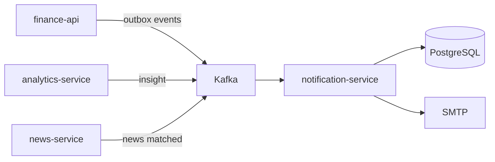
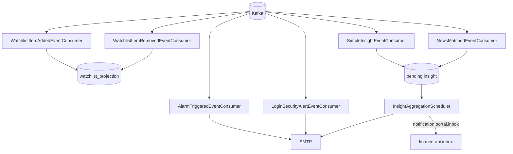
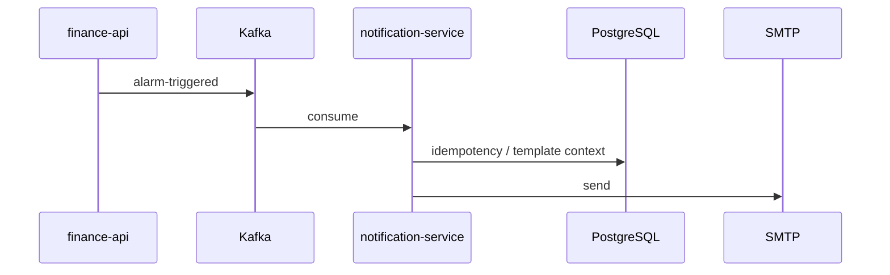

# notification-service

## Summary

**notification-service** is the platform's **asynchronous notification channel**. It listens to Kafka domain events and sends templated emails via SMTP. It has no main API surface for portal traffic; workflows are event-driven.

## Responsibilities

- Alarm triggered email (`alarm-triggered`)
- Login security alert (`login-security.alert`)
- Watchlist projection sync (`watchlist.item.added` / `watchlist.item.removed`)
- Watchlist digest delivery: branded email + `notification.portal.inbox` → finance-api inbox (`WATCHLIST_DIGEST`)
- Analytics simple insight (`analytics.insight.simple`) — queued for watchlist followers
- News–instrument match (`news.instrument.matched`) — queued for watchlist followers
- Kafka retry and DLQ (`{topic}.dlq`) handling
- Pending insight / dedup tables (PostgreSQL)

## Out of scope

- Alarm condition evaluation — `finance-api`
- Price data — `market-data-service`
- News ingestion — `news-service`
- JWT / gateway — `api-gateway`

## Capabilities

| Perspective | Capability |
|-------------|------------|
| Portal user | Receive alarm, watchlist, security, and insight emails |
| Operations | SMTP configuration, consumer lag, health |
| Developer | Test Kafka event contracts |

## Runtime

| Property | Value |
|----------|-------|
| Maven module | `notification-service` |
| Container name | `notification-service` |
| HTTP port | **8086** |
| Spring profiles | `docker` |
| Mail health | `MANAGEMENT_HEALTH_MAIL_ENABLED=false` (Docker) |

## Dependencies

| Component | Usage |
|-----------|-------|
| PostgreSQL | Pending insight, dedup state |
| Kafka | All inbound topics |
| SMTP | Gmail or custom `SMTP_*` |
| Keycloak | No (direct) |

## Context diagram



## HTTP data flows

No portal synchronous API. Gateway defines `notification-base-uri`; OpenAPI diagnostic paths under `/services/notification/...` — [api.md](../api.md).

Internal/diagnostic HTTP is minimal; the main surface is Kafka consumers.

## Kafka / event flows

### All consumers (visual)



Source: [`KafkaTopicNames.java`](../../../notification-service/src/main/java/com/company/notification/bootstrap/config/kafka/KafkaTopicNames.java).

| Topic | Producer | Consumer class |
|-------|----------|----------------|
| `alarm-triggered` | finance-api | `AlarmTriggeredEventConsumer` |
| `login-security.alert` | finance-api | `LoginSecurityAlertEventConsumer` |
| `watchlist.item.added` | finance-api | `WatchlistItemAddedEventConsumer` |
| `watchlist.item.removed` | finance-api | `WatchlistItemRemovedEventConsumer` |
| `analytics.insight.simple` | analytics-service | `SimpleInsightEventConsumer` |
| `news.instrument.matched` | news-service | `NewsMatchedEventConsumer` |
| `notification.portal.inbox` | notification-service | `PortalInboxDeliverConsumer` (finance-api) |

### Watchlist digest (price move + news)

1. `SimpleInsightEventConsumer` / `NewsMatchedEventConsumer` append rows to `pending_insight_events` for users following the instrument (`watchlist_projection`).
2. `InsightAggregationScheduler` (default every 6h, `notification.insight.aggregation-interval-ms`) groups by user, sends branded digest email via `SendWatchlistDigestEmailUseCase`, publishes one `notification.portal.inbox` message per user.
3. finance-api persists `alarm_history` with `notification_type=WATCHLIST_DIGEST` for `/api/v1/notifications`.

Price-move threshold is configured in **analytics-service** (`notification.insight.threshold`, default 8% 1h change). Users can opt out with `users.notify_watchlist_alerts` (portal profile).

### Alarm email



### DLQ

On processing errors, messages are routed to the `{originalTopic}.dlq` partition (`KafkaConsumerConfig`).

## Schedulers / background jobs

| Job | Module | Role |
|-----|--------|------|
| `InsightAggregationScheduler` | notification-service | Flush `pending_insight_events` → email + portal inbox Kafka |

All other work is Kafka-driven on ingest.

## Data model

| Item | Value |
|------|-------|
| Flyway | `notification-service/src/main/resources/db/migration/` |
| Main concepts | `pending_insight_events`, delivery dedup, alarm template state |

## Package / code structure

```
notification-service/src/main/java/com/company/notification/
├── alarm/            # AlarmTriggeredEventConsumer
├── watchlist/        # Watchlist consumers
├── security/         # LoginSecurityAlertEventConsumer
├── insight/          # Insight + NewsMatched consumers
└── bootstrap/config/kafka/
```

## Configuration

| Variable | Description |
|----------|-------------|
| `SMTP_USERNAME` / `SMTP_PASSWORD` | Sender account |
| `NOTIFICATION_MAIL_FROM` | From address |
| `APP_PORTAL_PUBLIC_URL` | Email links (`http://localhost:5173`) |
| `KAFKA_BOOTSTRAP_SERVERS` | Kafka |
| `SPRING_DATASOURCE_URL` | PostgreSQL |

Full list: [configuration.md](../configuration.md).

## Observability

| Channel | Detail |
|---------|--------|
| Logs | `app.logs` |
| Metrics | Prometheus job `notification-service` |
| Grafana | Log pipeline panels (indirect) |

Details: [observability.md](../observability.md).

## Local development

```bash
export KAFKA_BOOTSTRAP_SERVERS=localhost:9092
mvn -pl notification-service -am spring-boot:run
```

Port **8086**. For SMTP set `SMTP_*` in `Docker/.env`.

Setup: [getting-started.md](../getting-started.md).

## Related documents

| Document | Content |
|----------|---------|
| [finance-api.md](finance-api.md) | Outbox producer |
| [analytics-service.md](analytics-service.md) | Insight producer |
| [news-service.md](news-service.md) | News matched producer |
| [architecture.md](../architecture.md) | Kafka summary |
