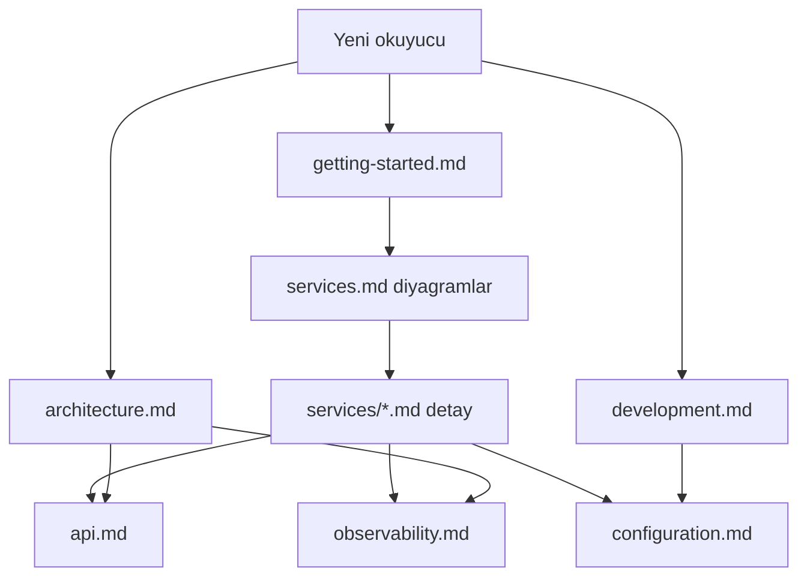

# Dokümantasyon

Finance Platform monoreposu için teknik rehberler. Güncel mimari ve yapılandırma kaynağı olarak bu klasörü kullanın. Kök özet (Türkçe): [../../README.tr.md](../../README.tr.md). İlk kurulum: [getting-started.md](getting-started.md).

### Dokümantasyon haritası

| Okuma yolu | Sıra |
|------------|------|
| İlk kurulum | getting-started → services.md → configuration |
| API entegrasyonu | api.md → services/api-gateway.md |
| Servis derinlemesi | services/README → ilgili servis MD |
| Operasyon | observability → configuration |

## Rehberler

| Belge | Ne zaman okunur? |
|-------|------------------|
| [architecture.md](architecture.md) | Sistem bileşenleri, Kafka, güvenlik ve veri akışını anlamak |
| [getting-started.md](getting-started.md) | İlk kurulum (Docker veya hibrit yerel) |
| [services.md](services.md) | Port özeti ve servis indeksi |
| [services/README.md](services/README.md) | Servis başına detaylı rehberler (akışlar, diyagramlar) |
| [api.md](api.md) | `/api/v1` yönlendirme, Swagger, kimlik doğrulama |
| [development.md](development.md) | Maven, profiller, test, frontend proxy |
| [configuration.md](configuration.md) | `Docker/.env` ve servis ortam değişkenleri |
| [observability.md](observability.md) | Prometheus, Grafana, Jaeger, OpenSearch |

## Hızlı bağlantılar

- Kök README (EN · TR · DE): [../../README.md](../../README.md) · [../../README.tr.md](../../README.tr.md) · [../../README.de.md](../../README.de.md)
- Docker Compose: [../Docker/docker-compose.yml](../../Docker/docker-compose.yml)
- Ortam şablonu: [../Docker/.env.example](../../Docker/.env.example)
- Keycloak realm: [../Docker/keycloak/realm-finance.json](../../Docker/keycloak/realm-finance.json)
- Frontend env: [../frontend-web/.env.example](../../frontend-web/.env.example)

## Dokümantasyonu güncelleme

Mimari veya port değişikliği yaptığınızda ilgili `docs/turkce/*.md` dosyasını aynı PR’da güncelleyin; İngilizce ve Almanca kopyaları (`docs/english/`, `docs/deutsch/`) mümkünse aynı PR’da senkron tutun. Gateway route sırası değiştiyse [api.md](api.md) ve [architecture.md](architecture.md) birlikte gözden geçirilmelidir.
