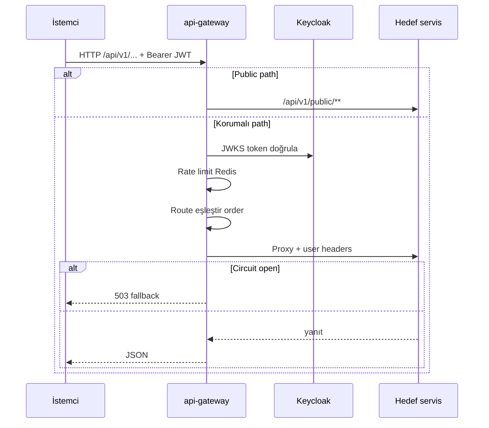
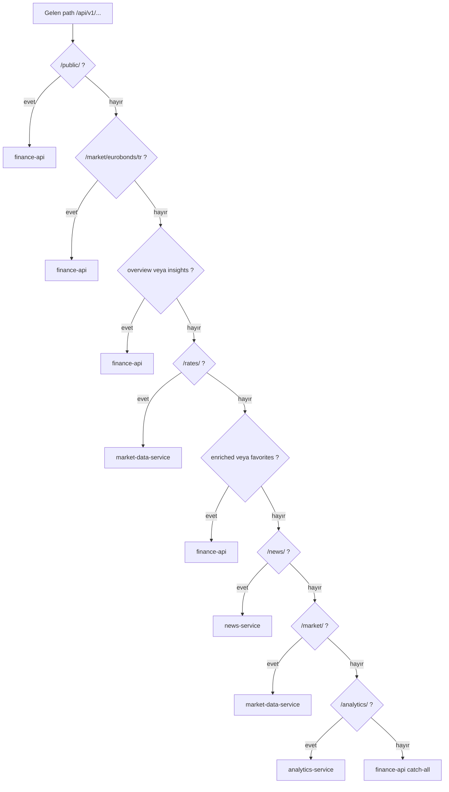
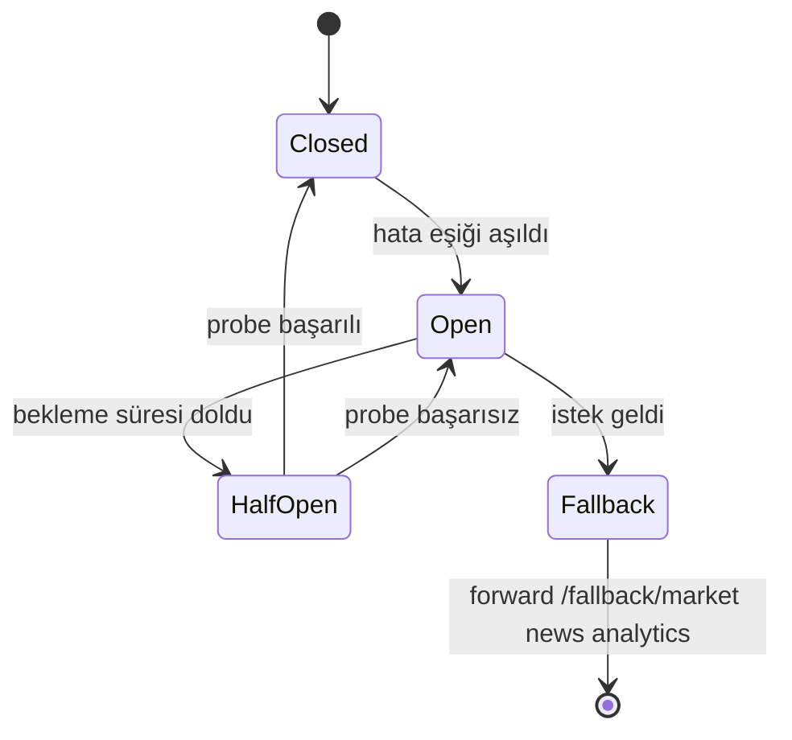
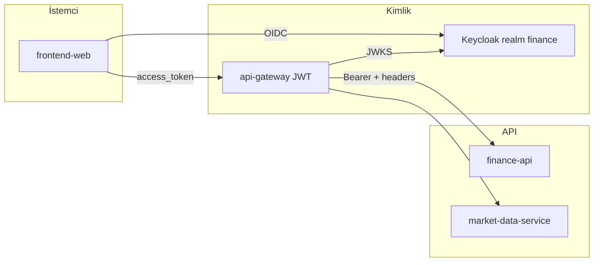
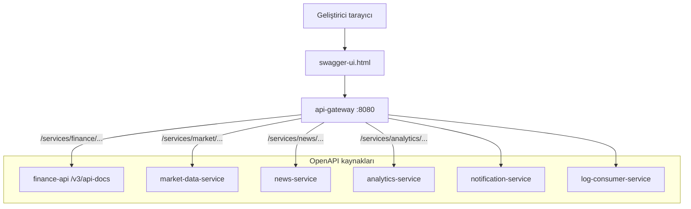
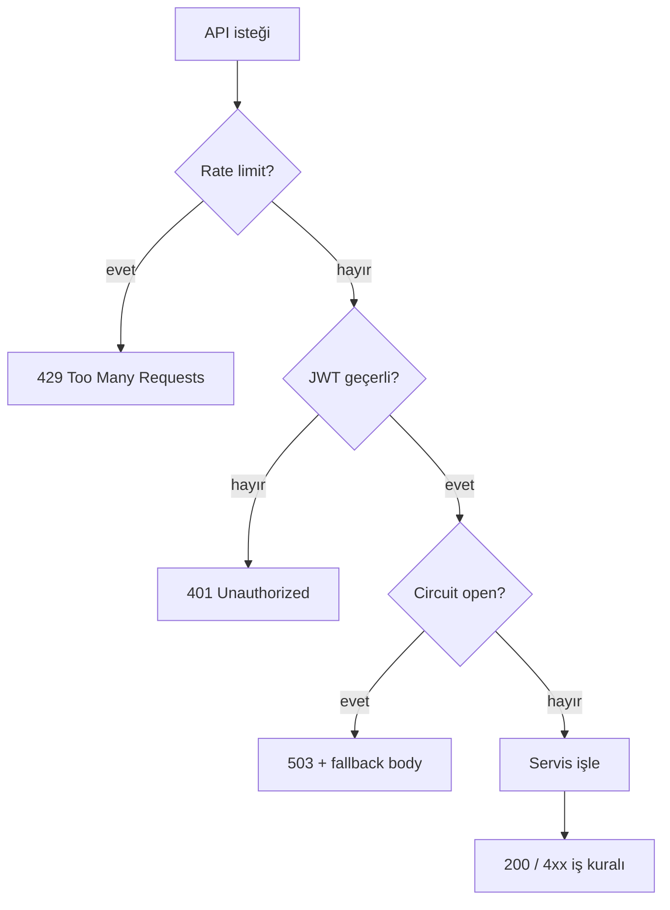

# API

Harici HTTP sözleşmesi **`/api/v1/**`** üzerinden **api-gateway** ile sunulur. Servis etkileşimleri: [services.md](services.md). Ortam: [configuration.md](configuration.md).

---

## İstek yaşam döngüsü



---

## Temel kurallar

- Harici sözleşme: **`/api/v1/**`**
- Kimlik: `Authorization: Bearer <access_token>` (Keycloak realm `finance`)
- Yerel Docker giriş noktası: **http://localhost:8080** (api-gateway)
- Public uçlar: `/api/v1/public/**` (kayıt, login tamamlama vb.)

## Gateway yönlendirme

Route **order** değeri düşük olan önce eşleşir (`GatewayRoutesConfig`).

### Route karar ağacı



### Route tablosu

| Path öneki | Hedef servis |
|------------|--------------|
| `/api/v1/public/**` | finance-api |
| `/api/v1/market/overview`, `/api/v1/market/insights` | finance-api |
| `/api/v1/market/eurobonds/tr/**` | finance-api |
| `/api/v1/market/**` | market-data-service |
| `/api/v1/rates/**` | market-data-service |
| `/api/v1/news/enriched/**`, `/api/v1/news/favorites/**` | finance-api |
| `/api/v1/news/**` | news-service |
| `/api/v1/analytics/**` | analytics-service |
| `/api/v1/**`, `/health` | finance-api (rate limit + circuit breaker) |

Circuit breaker fallback: `/fallback/market`, `/fallback/news`, `/fallback/analytics`.

### Circuit breaker akışı



| Circuit | Fallback path | Downstream |
|---------|---------------|------------|
| `marketCircuitBreaker` | `/fallback/market` | market-data-service |
| `newsCircuitBreaker` | `/fallback/news` | news-service |
| `analyticsCircuitBreaker` | `/fallback/analytics` | analytics-service |
| `financeCircuitBreaker` | — | finance-api (rate limit) |

## Kimlik doğrulama akışı



Public uçlar (`/api/v1/public/**`) gateway’de JWT zorunluluğu route’a göre değişebilir; kayıt/giriş uçları finance-api’dedir.

## Geliştirme proxy (frontend)

| Mod | Env | Davranış |
|-----|-----|----------|
| Tek proxy (Docker) | `VITE_DEV_PROXY_GATEWAY=true` | Tüm `/api` → gateway |
| Varsayılan yerel | — | `/api` → finance-api (8080); market BFF üzerinden |
| Doğrudan MDS | `VITE_DEV_MARKET_DIRECT_TO_MDS=true` | `/api/v1/market` → 8082 (debug) |

## OpenAPI / Swagger

### Swagger birleştirme



- UI (gateway üzerinden): http://localhost:8080/swagger-ui.html
- Birleşik dokümanlar: `/services/{finance|market|news|analytics|notification|logs}/v3/api-docs`
- Her servis kendi `application-openapi.yml` ile springdoc kullanır

Gateway test profilinde route’lar farklı olabilir (`TestGatewayRoutesConfig`).

## Örnek istekler

```http
GET /api/v1/market/instruments?assetClass=STOCK
Authorization: Bearer eyJ...
```

```http
GET /api/v1/public/health
```

Public kayıt/giriş uçları `finance-api` `PublicRegistrationController`, `PublicAuthenticationController` altındadır; tam liste için Swagger kullanın.

## Hata ve limit

- Gateway Redis rate limiter: kullanıcı başına (`userIdKeyResolver`)
- 429 / 503: rate limit veya circuit breaker açık
- `finance-api` dev profilde `app.expose-internal-errors: true` — üretimde kapatın

## log-consumer ve notification HTTP

Gateway yapılandırmasında `log-consumer` ve `notification` base URI tanımlıdır; birincil portal trafiği `/api/v1` altında finance / market / news / analytics üzerinden gider. Bu servislerin REST yüzeyi çoğunlukla iç/diagnostic amaçlıdır; OpenAPI path’leri gateway’de `/services/notification/...` ve `/services/logs/...` ile expose edilir.

## Versiyonlama

Şu an yalnızca `v1` yayımlıdır. Kırıcı değişikliklerde yeni prefix (`/api/v2`) ve gateway route eklenmesi beklenir.

---

## Hata kodları (özet)



---

## İlgili belgeler

| Belge | İçerik |
|-------|--------|
| [services/api-gateway.md](services/api-gateway.md) | Gateway detay |
| [configuration.md](configuration.md) | JWT, CORS env |
| [development.md](development.md) | Vite proxy |
