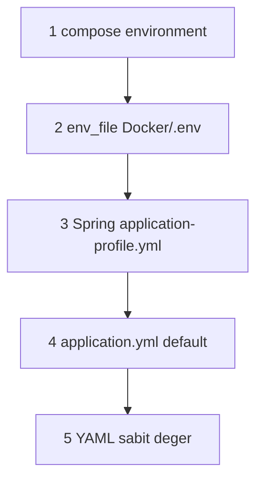

# Yapılandırma önceliği

Docker ve yerel geliştirmede aynı ayar birden fazla dosyada görünebilir. Bu belge **hangi kaynağın kazandığını** ve **ne zaman yeniden build gerekmediğini** özetler.

Genel yapılandırma listesi: [configuration.md](configuration.md). İlk kurulum: [getting-started.md](getting-started.md).

---

## Tek operasyonel dosya (Docker)

| Dosya | Rol |
|-------|-----|
| [`Docker/.env`](../../Docker/.env) | Gizliler ve ortama özel değerler (gitignore) — `cp .env.example .env` |
| [`Docker/.env.example`](../../Docker/.env.example) | Şablon (placeholder); gerçek anahtarlar yalnızca `Docker/.env` |
| [`Docker/docker-compose.yml`](../../Docker/docker-compose.yml) | Container wiring; `TCMB_API_KEY` için `${VAR:?}` — `.env` zorunlu |
| [`Docker/docker-compose.override.yml`](../../Docker/docker-compose.override.yml) | İsteğe bağlı kişisel override (gitignore); şablon: `docker-compose.override.yml.example` |

Uygulama servisleri (`finance-api`, `market-data-service`, `news-service`, `notification-service`, `api-gateway`) **`env_file: .env`** ile bu dosyayı okur.

---

## Öncelik sırası (aynı property)



| Sıra | Kaynak | Örnek |
|------|--------|--------|
| 1 | `docker-compose.yml` → `environment:` | `AI_ENABLED=${AI_ENABLED:-true}` |
| 2 | `env_file` → `.env` | `OPENAI_API_KEY`, `MARKET_EVDS_API_KEY` (yalnızca tanımlıysa) |
| 3 | `application-docker.yml` / `application-dev.yml` | Profil bazlı JDBC host |
| 4 | `application.yml` → `${ENV:default}` | `market.evds.base-url` |
| 5 | YAML içi sabit liste | `news.feeds[]` URL’leri |

**Spring kuralı:** Ortam değişkeni, YAML’daki `${MARKET_EVDS_BASE_URL:...}` placeholder’ını geçersiz kılar.

**Compose kuralı:** Aynı key hem `environment` hem `env_file`’da varsa **`environment` kazanır**.

---

## Boş ortam değişkeni tuzağı

`.env` içinde şunu **yazmayın**:

```env
MARKET_EVDS_API_KEY=
```

Docker boş string’i container’a geçirir; Spring `TCMB_API_KEY` yedeğine düşmez. Çözüm: satırı silin veya geçerli anahtar yazın. Ayrı EVDS anahtarı için `env_file` yeterlidir; compose’a `${MARKET_EVDS_API_KEY}` satırı **eklenmez** (unset → boş enjeksiyon riski).

---

## Ne zaman restart, ne zaman build?

| Değişiklik | Docker | Yerel `spring-boot:run` |
|------------|--------|---------------------------|
| `.env` / compose env (ilk `compose up` öncesi) | Normal `docker compose up -d --build` yeterli | Terminal env export, sonra başlat |
| `.env` değişti (stack zaten çalışıyor) | `docker compose up -d --force-recreate <service>` | Terminal env export + yeniden başlat |
| `application.yml` (JAR içi) | Image rebuild | Maven restart |
| RSS `news.feeds` listesi | Image rebuild | Restart (dev classpath) |
| Enstrüman registry / Flyway | Migration + servis restart | Aynı |
| `frontend-web/.env.development` | — | `npm run dev` yeniden başlat |
| Docker `frontend-web` (nginx prod) | `docker compose build frontend-web` + recreate | Statik bundle; runtime `VITE_*` yok, `/api` nginx → gateway |
| Docker `frontend-web-dev` (`--profile dev`) | Container recreate | `VITE_*` dev server proxy |

Backend API anahtarları için **Maven image rebuild gerekmez** (kod değişmediyse). Frontend **kaynak kodu** değişince prod için `docker compose build frontend-web` gerekir.

---

## Yerel hibrit

Altyapı Docker, uygulama host’ta:

```powershell
$env:SPRING_DATASOURCE_URL="jdbc:postgresql://localhost:5432/finance"
$env:JWT_ISSUER_URI="http://localhost:8085/realms/finance"
$env:KAFKA_BOOTSTRAP_SERVERS="localhost:9092"
$env:CLIENTS_MARKET_DATA_BASE_URL="http://localhost:8082"
$env:TCMB_API_KEY="..."
$env:FINNHUB_API_KEY="..."
```

Frontend: [`frontend-web/.env.development`](../../frontend-web/.env.example) — yerel `npm run dev`. Docker varsayılan: nginx same-origin `/api` (build arg `VITE_API_BASE_URL` boş). HMR: `docker compose --profile dev` → `frontend-web-dev` ve `VITE_*`.

---

## Kapsam dışı (bilinçli)

| Konu | Neden env değil |
|------|------------------|
| RSS feed URL listesi | `news-service` `application.yml` içinde sabit |
| Kripto/BIST/NASDAQ sembol listesi | Java registry + Flyway seed |
| Keycloak realm | `Docker/keycloak/realm-finance.json` import |

---

## İlgili belgeler

| Belge | İçerik |
|-------|--------|
| [configuration.md](configuration.md) | Değişken listesi ve servis dağılımı |
| [development.md](development.md) | Hibrit mod ve Maven komutları |
