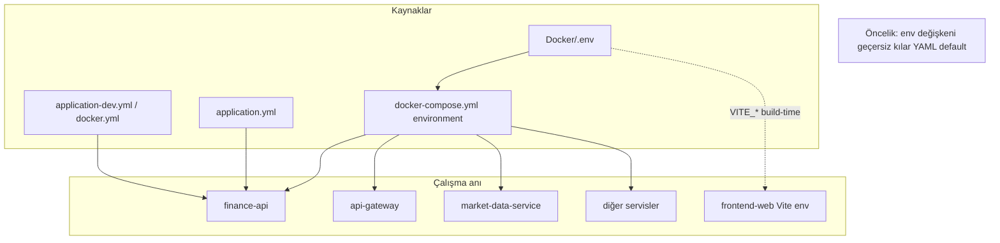
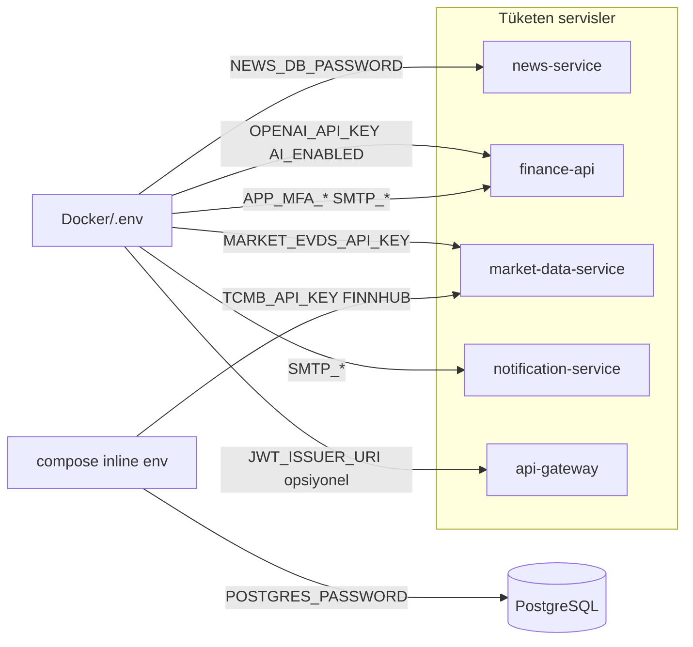
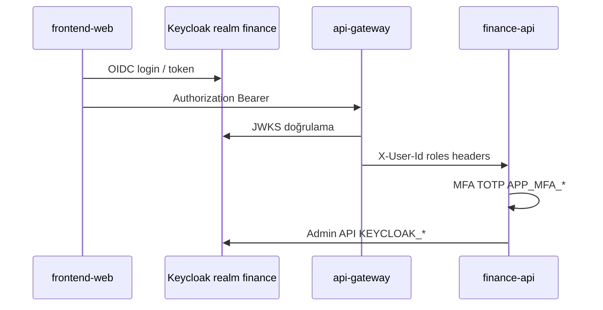
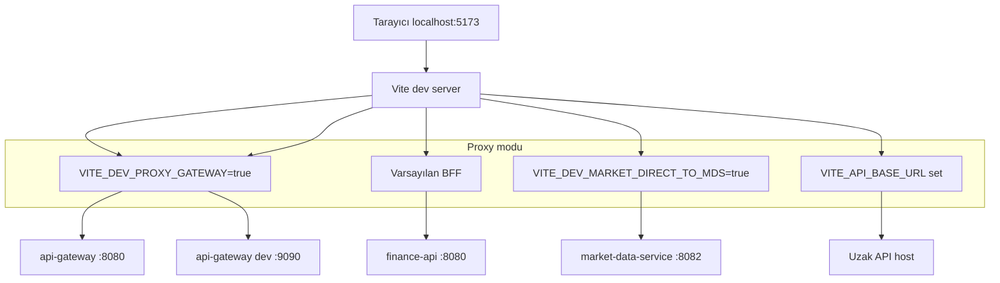
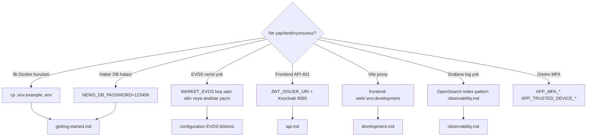

# Yapılandırma

Ortam değişkenleri, Spring `application*.yml` dosyaları ve Docker Compose birlikte platform davranışını belirler. Servis etkileşimleri: [services.md](services.md). Geliştirme modları: [development.md](development.md).

**Docker’da tek operasyonel dosya:** [`Docker/.env`](../../Docker/.env) (`cp .env.example .env`). Öncelik kuralları ve restart/build matrisi: [configuration-precedence.md](configuration-precedence.md). Kişisel override: [`docker-compose.override.yml.example`](../../Docker/docker-compose.override.yml.example).

---

## Yapılandırma katmanları



| Katman | Konum | Ne zaman değişir? |
|--------|-------|------------------|
| Compose `environment` | `Docker/docker-compose.yml` | Internal hostname, profil; API anahtarları `${VAR:?}` ile `.env` zorunlu |
| `.env` + `env_file` | `Docker/.env` | Gizli / ortama özel (TCMB, Finnhub, OpenAI, SMTP, EVDS) — tüm uygulama servisleri |
| Spring profil | `application-{profile}.yml` | dev / docker / kafka / cache-redis |
| Frontend | `frontend-web/.env.development` | Vite proxy hedefi |

---

## `.env` → servis dağılımı



---

## Docker ortam dosyası

Şablon: [`Docker/.env.example`](../../Docker/.env.example)

Kullanım:

```bash
cd Docker
cp .env.example .env
```

Compose `env_file: .env` ile `finance-api` ve diğer servislere aktarır.

## Zorunlu / kritik değişkenler

| Değişken | Servis | Açıklama |
|----------|--------|----------|
| `NEWS_DB_PASSWORD` | news-service | Compose’da zorunlu (`?` syntax). `.env.example` kopyasında `123456` hazır gelir; PostgreSQL `POSTGRES_PASSWORD` ile aynı olmalı |
| `JWT_ISSUER_URI` | api-gateway | Tarayıcı issuer: `http://localhost:8085/realms/finance` |
| `KAFKA_BOOTSTRAP_SERVERS` | Tüm Kafka kullananlar | Docker: `kafka:9092`, yerel: `localhost:9092` |

**Gizliler:** `TCMB_API_KEY` ve `FINNHUB_API_KEY` yalnızca `Docker/.env` içinde tutulur (`.env.example` placeholder). `docker compose up` öncesi `.env` doldurulmalıdır; repoda gerçek anahtar yoktur.

## Piyasa verisi (TCMB / EVDS)

| Değişken | Not |
|----------|-----|
| `TCMB_API_KEY` | Zorunlu — yalnızca `Docker/.env` (EVDS / tahvil / oranlar) |
| `MARKET_EVDS_API_KEY` | **Boş satır yazmayın** (`MARKET_EVDS_API_KEY=`) — Spring boş string görür, yedek anahtar devreye girmez |
| `MARKET_EVDS_BASE_URL` | Varsayılan EVDS3 dis API |
| `PROVIDERS_FINNHUB_ENABLED` / `FINNHUB_API_KEY` | NASDAQ ve Finnhub geçmişi |
| `MARKET_HISTORY_BACKFILL_*` | İlk açılışta geçmiş fiyat doldurma |

Ayrıntılı yorumlar: `.env.example` içindeki Türkçe satırlar.

## Güvenlik ve kimlik



| Değişken | Açıklama |
|----------|----------|
| `APP_MFA_ENCRYPTION_SECRET` | TOTP secret şifreleme |
| `APP_TRUSTED_DEVICE_SIGNING_SECRET` | Güvenilir cihaz çerezi imzası |
| `APP_SECURITY_ALLOW_HEADER_USER_FALLBACK` | Dev: `true`; prod: `false` |
| `KEYCLOAK_PORTAL_CLIENT_SECRET` | `finance-portal` client (`finance-portal-dev-secret` demo) |

Keycloak realm import: [`Docker/keycloak/realm-finance.json`](../../Docker/keycloak/realm-finance.json).

## AI (isteğe bağlı)

| Değişken | Açıklama |
|----------|----------|
| `AI_ENABLED` | Admin bilgi kartı AI |
| `OPENAI_API_KEY` | Repoya commit etmeyin |
| `OPENAI_MODEL_ADMIN_CONTENT` | Varsayılan `gpt-4.1-mini` |

## E-posta

| Değişken | Servis |
|----------|--------|
| `SPRING_MAIL_*` | finance-api kayıt doğrulama |
| `SMTP_USERNAME`, `SMTP_PASSWORD`, `NOTIFICATION_MAIL_FROM` | notification-service alarmları |

SMTP / Gmail uygulama şifresi yalnızca `Docker/.env` içinde tanımlanır — **repoya commit etmeyin**.

## Frontend

### Vite proxy modları (görsel)



[`frontend-web/.env.example`](../../frontend-web/.env.example):

| Değişken | Açıklama |
|----------|----------|
| `VITE_PROXY_TARGET` | API hedefi (gateway veya finance-api) |
| `VITE_DEV_PROXY_GATEWAY` | `true` → tüm `/api` tek hedef |
| `VITE_DEV_MARKET_DIRECT_TO_MDS` | Debug: market doğrudan MDS |
| `VITE_API_BASE_URL` | Proxy bypass (tam URL) |

## Profil avatarları

| Değişken | Varsayılan |
|----------|------------|
| `PROFILE_AVATAR_STORAGE_ROOT` | Yerel: `../../photos`, Docker: `/photos` volume |

Yapı: `photos/{userId}/avatar.jpg`.

## OpenSearch

| Değişken | Varsayılan (Compose) |
|----------|----------------------|
| `OPENSEARCH_USERNAME` / `PASSWORD` | `admin` / `123456789` |
| `OPENSEARCH_INDEX_PREFIX` | `application-logs` |

Dashboards ilk kurulum: index pattern `application-logs-*`, time field `@timestamp` ([observability.md](observability.md)).

## CORS

Gateway: `GATEWAY_CORS_ALLOWED_ORIGINS` (varsayılan `http://localhost:5173`).

Yeni frontend origin eklerken gateway + Keycloak `redirectUris` / `webOrigins` birlikte güncellenmelidir.

---

## Ortam değişkeni → dosya hızlı referans



---

## İlgili belgeler

| Belge | İçerik |
|-------|--------|
| [getting-started.md](getting-started.md) | `.env` kurulum adımları |
| [configuration-precedence.md](configuration-precedence.md) | Öncelik, restart vs build |
| [development.md](development.md) | Yerel profil override |
| [observability.md](observability.md) | OpenSearch, Prometheus env |
| [services.md](services.md) | Servis port ve etkileşim diyagramları |
