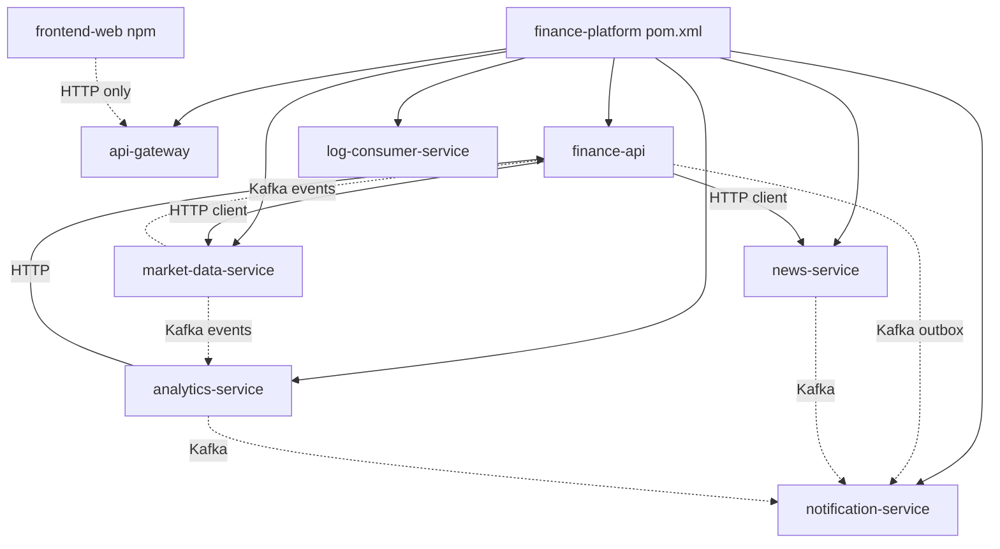
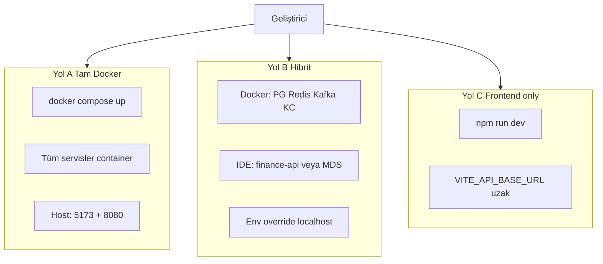
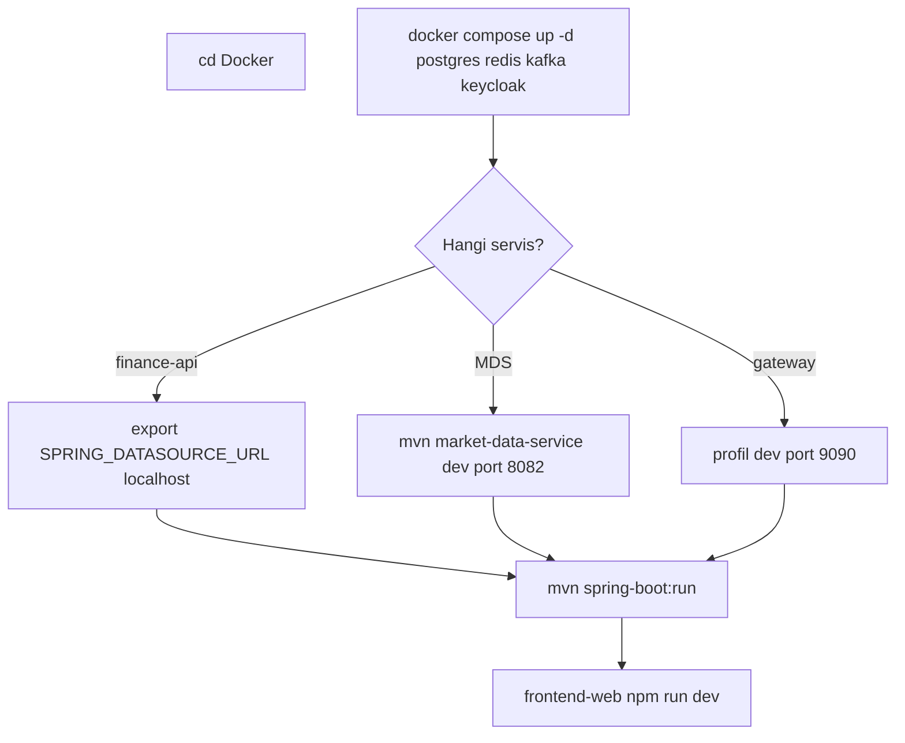
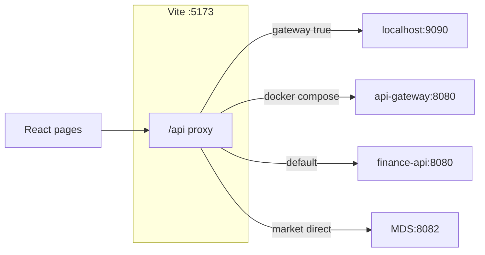
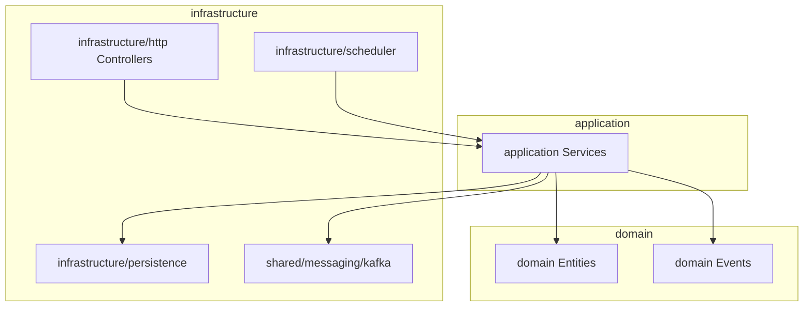
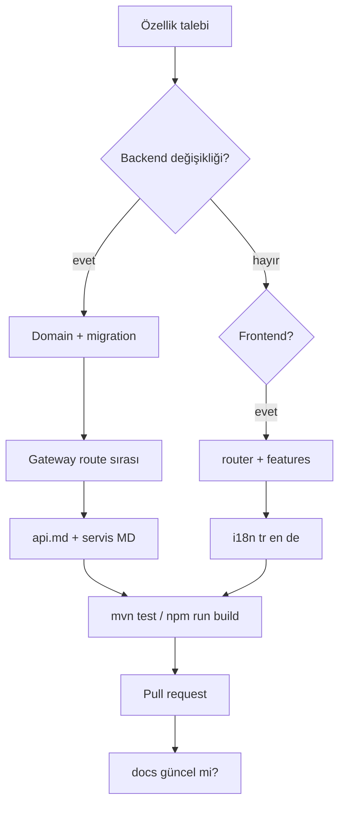

# Geliştirme

Günlük geliştirme akışı, build/test komutları ve kod organizasyonu için bu rehberi kullanın. İlk kurulum: [getting-started.md](getting-started.md). Mimari bağlam: [architecture.md](architecture.md).

---

## Monorepo özeti

Parent POM: `com.company:finance-platform:1.0.0-SNAPSHOT` — Java **21**, Spring Boot **3.2.x**, Spring Cloud Gateway.

| Modül | Rol |
|-------|-----|
| `finance-api` | Portal BFF — portföy, auth, MFA, admin, bilgi kartları, profil |
| `api-gateway` | Tek API girişi, JWT, rate limit, Swagger birleştirme |
| `market-data-service` | Piyasa kataloğu, EVDS, scheduler, fiyat yayını |
| `analytics-service` | Teknik göstergeler, insight |
| `news-service` | RSS ingestion, haber API |
| `notification-service` | Kafka → e-posta |
| `log-consumer-service` | `app.logs` → OpenSearch |
| `frontend-web` | React 19 + Vite + TypeScript SPA |

Port özeti: [services.md](services.md). Servis başına detaylı akış ve diyagramlar: [services/README.md](services/README.md) (yeni servis için şablon: [services/_template.md](services/_template.md)).

### Monorepo modül bağımlılıkları



---

## Yerel geliştirme modları

| Mod | Ne zaman? | Rehber |
|-----|-----------|--------|
| Tam Docker | Stack’i olduğu gibi çalıştırmak | [getting-started.md — Yol A](getting-started.md#yol-a--tam-stack-docker-compose) |
| Hibrit | IDE’den tek servis debug | [getting-started.md — Yol B](getting-started.md#yol-b--hibrit-altyapı-docker-uygulama-yerel) |
| Frontend only | Uzak / staging API | [getting-started.md — Yol C](getting-started.md#yol-c--sadece-frontend--uzak-api) |

### Mod karşılaştırması



### Hibrit kurulum akışı



**Hibrit ipucu:** `finance-api` `application-dev.yml` içinde JDBC host’u `postgres` olarak tanımlıdır (Docker ağı). Host makineden çalıştırırken override edin:

```bash
export SPRING_DATASOURCE_URL=jdbc:postgresql://localhost:5432/finance
export JWT_ISSUER_URI=http://localhost:8085/realms/finance
export JWT_JWK_SET_URI=http://localhost:8085/realms/finance/protocol/openid-connect/certs
export KAFKA_BOOTSTRAP_SERVERS=localhost:9092
export CLIENTS_MARKET_DATA_BASE_URL=http://localhost:8082
```

Windows (PowerShell): `$env:SPRING_DATASOURCE_URL="jdbc:postgresql://localhost:5432/finance"` vb.

---

## Maven

Repo kökünden:

```bash
# Tüm modüller — derleme + test
mvn clean verify

# Tek modül (bağımlılıklarla)
mvn -pl finance-api -am test
mvn -pl market-data-service -am package
mvn -pl api-gateway -am package
mvn -pl news-service -am test
mvn -pl analytics-service -am test
mvn -pl notification-service -am test
mvn -pl log-consumer-service -am test
```

Servisi doğrudan çalıştırma:

```bash
mvn -pl finance-api -am spring-boot:run -Dspring-boot.run.profiles=dev,kafka
mvn -pl market-data-service -am spring-boot:run -Dspring-boot.run.profiles=dev
mvn -pl api-gateway -am spring-boot:run -Dspring-boot.run.profiles=dev
```

IDE kullanıyorsanız main sınıfını aynı profillerle başlatın; ortam değişkenlerini Run Configuration’a ekleyin.

---

## Spring profilleri

| Servis | Yerel (IDE) | Docker Compose |
|--------|-------------|----------------|
| `finance-api` | `dev`, `kafka` | `docker`, `kafka`, `cache-redis` |
| `api-gateway` | `dev` → host **9090** | `docker` → **8080** |
| `market-data-service` | `dev` → H2 bellek, port **8082** | `docker` → PostgreSQL |
| `analytics-service` | varsayılan → PostgreSQL `localhost:5432` | `docker` |
| `news-service` | varsayılan → port **8082** | `docker` |
| `notification-service` | varsayılan → port **8086** | `docker` |
| `log-consumer-service` | varsayılan → port **8087** | `docker` |

**Notlar**

- `cache-redis`: `finance-api`’de Redis tabanlı instrument fiyat önbelleği; Docker’da aktif.
- `market-data-service` **dev** profili H2 kullanır; gerçek EVDS/Finnhub için `application-dev.yml` ve API anahtarlarını yapılandırın veya `docker` profili + PostgreSQL kullanın.
- **`news-service` ve `market-data-service` host’ta ikisi de 8082** kullanır — aynı makinede birlikte çalıştırmayın. Docker ağında hostname ile ayrılırlar.
- Yerel **api-gateway dev (9090)** ile Docker **Prometheus (9090)** portu çakışır; ikisini aynı anda host’ta açmayın.

Profil dosyaları: `{modül}/src/main/resources/application*.yml`. Ortam değişkenleri `${VAR:default}` ile geçersiz kılınır — tam liste: [configuration.md](configuration.md).

---

## Frontend geliştirme

```bash
cd frontend-web
npm install
npm run dev
```

Tam Docker stack’te portal (5173) için `.env.development` gerekmez. Yerel Vite proxy için: `cp .env.example .env.development` (Windows: `Copy-Item .env.example .env.development`). Backend anahtarları: [`Docker/.env`](../../Docker/.env.example) — [getting-started.md](getting-started.md).

| Komut | Açıklama |
|-------|----------|
| `npm run dev` | Vite dev server — http://localhost:5173 |
| `npm run build` | `tsc -b` + production bundle |
| `npm run preview` | Build sonrası önizleme |

### Vite proxy modları



| Mod | Ortam değişkeni | Davranış |
|-----|-----------------|----------|
| Docker (varsayılan compose) | `VITE_PROXY_TARGET=http://api-gateway:8080` | Tüm `/api` → gateway |
| Yerel gateway | `VITE_DEV_PROXY_GATEWAY=true`, `VITE_PROXY_TARGET=http://localhost:9090` | Tüm `/api` → gateway dev |
| Yerel BFF | (varsayılan) | `/api` → `finance-api:8080` |
| Doğrudan MDS (debug) | `VITE_DEV_MARKET_DIRECT_TO_MDS=true`, `VITE_MARKET_PROXY_TARGET=http://localhost:8082` | `/api/v1/market` → MDS |

Ayrıntı: [api.md — Geliştirme proxy](api.md#geliştirme-proxy-frontend).

### Dizin yapısı

```
frontend-web/src/
├── app/
│   ├── router/          # React Router, auth guard, route tanımları
│   └── store/           # Zustand (ör. portföy store)
├── pages/               # Sayfa bileşenleri (markets, analysis, admin, profil, …)
├── features/            # Domain hook’lar, API client’lar (admin, profile, markets, …)
├── shared/              # Layout, UI, i18n, theme, ortak hook’lar
├── services/            # Legacy / paylaşılan HTTP yardımcıları
└── data/                # Sabit portal sayfa tanımları
```

- **i18n:** `i18next` — `shared/i18n/locales/{tr,en,de}.json`
- **State:** `zustand` — `features/` ve `app/store/` altında
- **Grafikler:** `lightweight-charts`, analiz sayfası `pages/analysis/chart/`

**Oturum gerektiren sayfalar:** portföy, analiz, haber, faiz-vadeli, profil, alarmlar, dashboard. **Herkese açık:** landing, piyasalar, banka kurları, finansal okuryazarlık. **Admin:** `/admin`, bilgi kartları yönetimi.

---

## Backend kod organizasyonu

### finance-api — domain modülleri

Her bounded context kendi paketinde katmanlanır:

| Paket | Örnek sorumluluk |
|-------|------------------|
| `portfolio` | Portföy, işlem, hedef, harici portföy |
| `watchlist` | İzleme listesi |
| `alarm` | Fiyat alarmları |
| `chart` | Grafik çizim kayıtları |
| `registration` / `auth` / `mfa` | Kayıt, giriş, TOTP, güvenilir cihaz |
| `profile` | Profil, avatar |
| `infocards` / `admin` | Bilgi kartları, admin KPI |
| `market` | Overview, eurobond proxy |
| `news` | Haber zenginleştirme / favoriler |
| `outbox` | Transactional outbox → Kafka |
| `shared` | Güvenlik, cache, messaging, web |

Katman standardı:

| Katman | Konum |
|--------|-------|
| Domain | `{modül}/domain/` |
| Application | `{modül}/application/` |
| HTTP | `{modül}/infrastructure/http/` + `dto/` |
| Persistence | `{modül}/infrastructure/persistence/` |
| Scheduler | `{modül}/infrastructure/scheduler/` |
| Messaging | `shared/messaging/kafka/` |

Yeni REST uçları **api-gateway route sırasını** etkileyebilir; değişiklikte [api.md](api.md) ve `GatewayRoutesConfig` birlikte güncellenmelidir.

### finance-api katman diyagramı



### Diğer servisler

Daha düz paket yapısı; her servis kendi Flyway migration setine sahiptir. OpenAPI: `application-openapi.yml` + springdoc.

---

## Flyway migration

| Servis | Migration yolu | Flyway tablo adı |
|--------|------------------|------------------|
| finance-api | `finance-api/src/main/resources/db/migration/V*.sql` | `finance_flyway_schema_history` |
| market-data-service | `market-data-service/.../db/migration/` | `mds_flyway_schema_history` |
| analytics-service | `analytics-service/.../db/migration/` | `analytics_flyway_schema_history` |
| news-service | `news-service/.../db/migration/` | (servis yapılandırmasına göre) |
| notification-service | `notification-service/.../db/migration/` | — |

**Kurallar**

- Yeni migration dosya adı: `V{sıra}__açıklama.sql` — sıra numarası benzersiz ve artan olmalı.
- Geri alınamaz DDL’den (DROP COLUMN, destructive UPDATE) kaçının; production’da Flyway repair manuel müdahale gerektirir.
- Seed migration’lar demo verisi içerir; production’da ayrı değerlendirin.

### Flyway iş akışı

```mermaid
flowchart LR
  DEV[Geliştirici]
  SQL[V{n}__aciklama.sql]
  GIT[Git commit]
  RUN[Servis başlat]
  FW[Flyway migrate]
  PG[(PostgreSQL)]

  DEV --> SQL --> GIT --> RUN --> FW --> PG
```

| Servis | History tablosu |
|--------|-----------------|
| finance-api | `finance_flyway_schema_history` |
| market-data-service | `mds_flyway_schema_history` |
| analytics-service | `analytics_flyway_schema_history` |

---

## Kafka (yerel)

```bash
cd Docker
docker compose up -d kafka
```

```bash
export KAFKA_BOOTSTRAP_SERVERS=localhost:9092
```

Topic’ler çoğunlukla ilk publish’te oluşturulur (ortam ayarına bağlı). Platform topic’leri:

| Topic | Üreten (ör.) | Tüketen (ör.) |
|-------|----------------|----------------|
| `market.price.updated` | market-data-service | analytics-service, finance-api |
| `market.fx.snapshot.updated` | market-data-service | finance-api |
| `alarm-triggered` | finance-api (outbox) | notification-service |
| `watchlist.item.added` / `removed` | finance-api | notification-service |
| `login-security.alert` | finance-api | notification-service |
| `app.logs` | Tüm servisler (Log4j2) | log-consumer-service |

Outbox detayı: [architecture.md](architecture.md).

---

## Test

### Backend

```bash
mvn -pl finance-api test
mvn -pl market-data-service test
mvn -pl news-service test
mvn -pl analytics-service test
mvn -pl notification-service test
mvn -pl api-gateway test
```

Modül başına `application-test.yml` H2 veya Testcontainers kullanabilir; varsayımlarda bulunmayın — ilgili modülün test kaynaklarına bakın.

### Frontend

```bash
cd frontend-web
npm run build
```

Birim test dosyaları `src` altında co-located (ör. `pages/analysis/chart/measure/computeMeasureStats.test.ts`, `pages/bank-rates/lib/*.test.ts`). `package.json` içinde ayrı bir `npm test` script’i tanımlı değildir; test runner eklenene kadar `npm run build` (TypeScript) + manuel doğrulama kullanılır.

---

## Yeni özellik geliştirme akışı



## Yeni özellik kontrol listesi

Backend uç eklerken:

1. Domain + application + HTTP katmanını modül paketinde uygulayın.
2. Gerekirse Flyway migration ekleyin.
3. Gateway route sırasını kontrol edin (`api-gateway/.../GatewayRoutesConfig.java`).
4. [api.md](api.md) ve springdoc annotation’larını güncelleyin.
5. Kafka olayı gerekiyorsa outbox veya doğrudan producer pattern’ini mevcut modüllere uygun seçin.

Frontend sayfa eklerken:

1. Route’u `app/router/index.tsx` (ve gerekirse guard) içine ekleyin.
2. API çağrılarını `features/` altında toplayın; doğrudan axios dağınıklığından kaçının.
3. TR / EN / DE çeviri anahtarlarını `shared/i18n/locales/` dosyalarına ekleyin.

---

## Faydalı komutlar

```bash
# Tek servis log (Docker dizininden)
cd Docker
docker compose logs -f finance-api
docker compose logs -f market-data-service
docker compose logs -f api-gateway

# Container durumu
docker compose ps

# PostgreSQL shell
docker exec -it finance-postgres psql -U finance -d finance

# Belirli servisi yeniden build
docker compose up -d --build finance-api frontend-web
```

Profil fotoğrafları: repo kökünde `photos/{userId}/` — Docker volume ile mount edilir; içerik commitlenmemeli.

---

## Git ve güvenlik

- Commit mesajları: **neyi ve neden** değiştirdiğinizi kısa, tam cümleyle yazın.
- **Commitlenmemeli:** `.env`, gerçek API anahtarları, `photos/` kullanıcı içeriği, kişisel credential’lar.
- Docker Compose’daki demo SMTP / Keycloak şifreleri yalnızca local demo içindir; fork veya paylaşımlı ortamda rotate edin.
- Üretimde `APP_SECURITY_ALLOW_HEADER_USER_FALLBACK` kapalı olmalıdır ([architecture.md](architecture.md)).

---

## İlgili belgeler

| Konu | Belge |
|------|-------|
| İlk kurulum | [getting-started.md](getting-started.md) |
| API rotaları / Swagger | [api.md](api.md) |
| Ortam değişkenleri | [configuration.md](configuration.md) |
| Metrik, trace, log | [observability.md](observability.md) |
| Servis portları | [services.md](services.md) |
