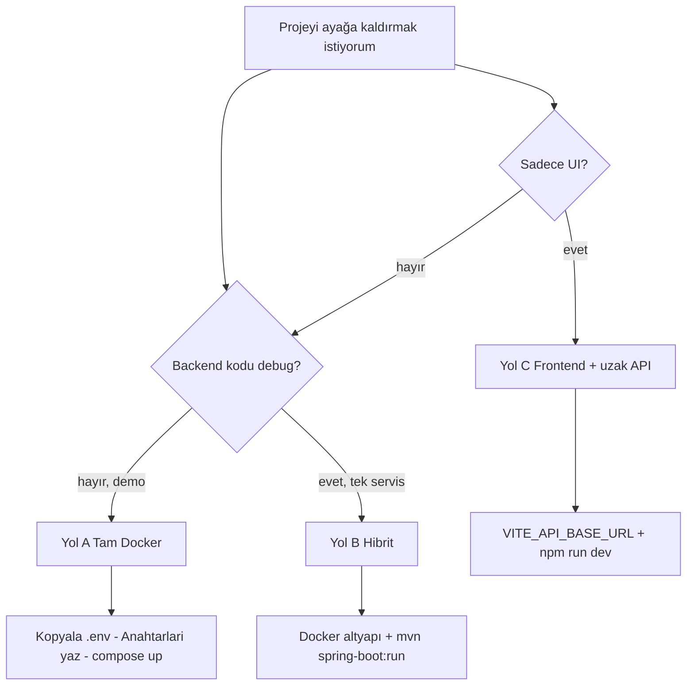
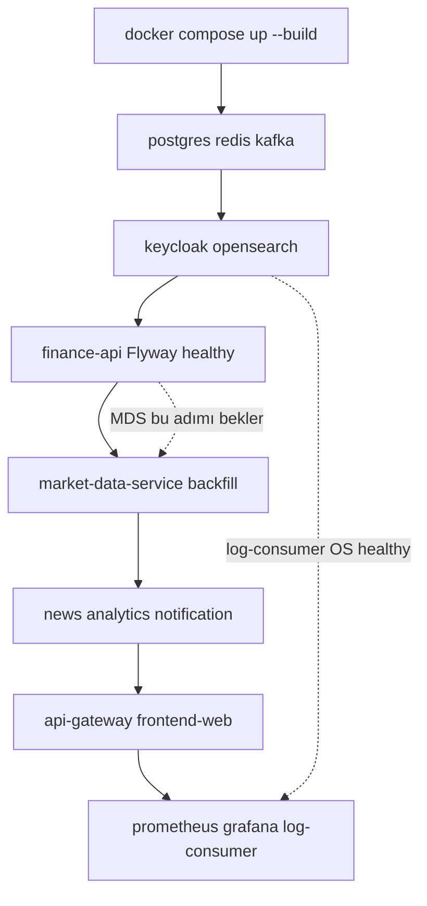
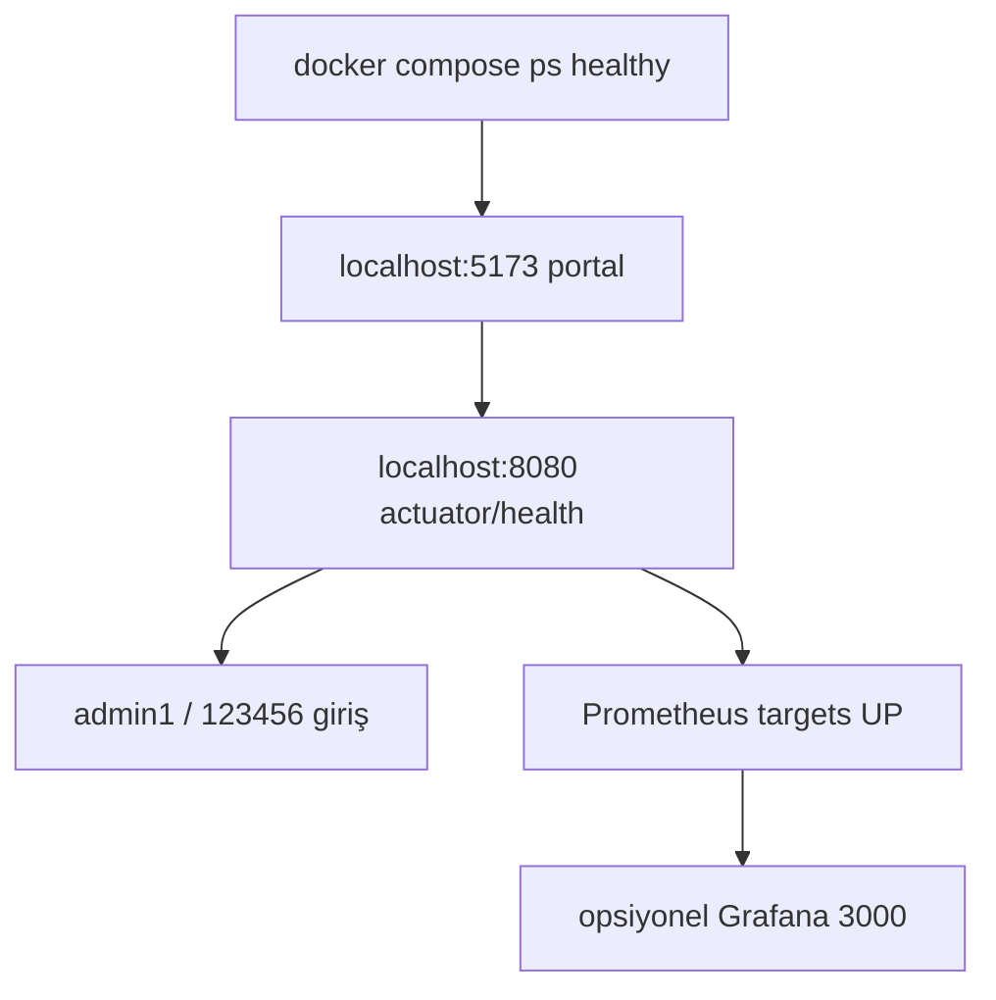

# Başlangıç

**32 Bit Finance Platform**'u ilk kez ayağa kaldırmak için bu rehberi kullanın. Monorepo; mikroservis backend (Spring Boot), React SPA, PostgreSQL, Redis, Kafka, Keycloak ve gözlemlenebilirlik stack'ini içerir.

| Hedef | Önerilen yol |
|-------|----------------|
| Demo / yeni geliştirici | [Yol A — Tam stack (Docker)](#yol-a--tam-stack-docker-compose) |
| IDE'den backend geliştirme | [Yol B — Hibrit](#yol-b--hibrit-altyapı-docker-uygulama-yerel) |
| Yalnızca UI, uzak API | [Yol C — Frontend + uzak API](#yol-c--sadece-frontend--uzak-api) |

Genel proje özeti: [../../README.tr.md](../../README.tr.md). Mimari ve port detayları: [architecture.md](architecture.md), [services.md](services.md).

### Hangi kurulum yolu?



---

## Önkoşullar

| Araç | Sürüm / not |
|------|-------------|
| [Docker Desktop](https://www.docker.com/products/docker-desktop/) | Compose v2; **tam stack için ~8 GB RAM** |
| JDK | 21 (hibrit / yerel backend) |
| Maven | 3.9+ |
| Node.js | 20+ (`frontend-web`) |

Depoyu klonlayın:

```bash
git clone https://github.com/TaridaG/Toyota-32Bit-Finance-Platform.git
cd Toyota-32Bit-Finance-Platform
```

---

## Yol A — Tam stack (Docker Compose)

Tüm altyapı ve uygulama servislerini tek komutla başlatır. **Yeni geliştiriciler ve demo için önerilen yoldur.**

> **Önemli:** `cp .env.example .env` yalnızca dosyayı oluşturur. Piyasa verisi ve e-posta için `.env` **içini** doldurmanız gerekir (repoda gerçek anahtar yoktur).

| Adım | Ne yaparsınız? |
|------|----------------|
| **1** | `Docker/.env` dosyasını oluşturun (şablondan kopya) |
| **2** | **Zorunlu:** `TCMB_API_KEY`, `FINNHUB_API_KEY` yazın |
| **3** | **İsteğe bağlı:** SMTP (kayıt / alarm maili), OpenAI (admin AI) |
| **4** | `docker compose up -d --build` |

### 1. Dosyayı oluştur

```bash
cd Docker
cp .env.example .env
```

Windows (PowerShell):

```powershell
cd Docker
Copy-Item .env.example .env
```

Şablon: [`Docker/.env.example`](../../Docker/.env.example). Kişisel override: `Copy-Item docker-compose.override.yml.example docker-compose.override.yml` — [configuration-precedence.md](configuration-precedence.md).

### 2. Dosyayı düzenle (zorunlu)

`Docker/.env` dosyasını bir metin editörüyle açın. **Boş bırakmayın:**

```env
# Zorunlu — piyasa verisi
TCMB_API_KEY=evds-anahtariniz
FINNHUB_API_KEY=finnhub-anahtariniz
```

`POSTGRES_PASSWORD` ve `NEWS_DB_PASSWORD` şablonda `123456` — yerel demo için aynı bırakın; üretimde değiştirin.

**Anahtar / ayar yoksa ne olur?**

| Özellik | Durum |
|---------|--------|
| Portal giriş (`admin1` / `123456`) | Çalışır |
| Piyasa listesi, grafikler, faiz kartları | Eksik veya boş (TCMB + Finnhub gerekli) |
| Yeni kullanıcı kayıt e-postası | Çalışmaz (SMTP gerekli) |
| Alarm e-postası | Çalışmaz (SMTP gerekli) |
| Admin bilgi kartı AI | Kapalı (`OPENAI_API_KEY` + `AI_ENABLED=true` gerekir) |

> Anahtarları yazdıktan **sonra** Adım 4’te `docker compose up` çalıştırın. İlk kurulumda `--force-recreate` gerekmez.

### 3. İsteğe bağlı özellikler

E-posta veya AI istiyorsanız `.env` içinde ilgili satırların başındaki `#` işaretini kaldırıp değerleri doldurun (örnek):

```env
# Kayıt doğrulama (finance-api) + alarm maili (notification-service)
# Gmail: normal şifre değil, "Uygulama şifresi" kullanın
SMTP_USERNAME=you@gmail.com
SMTP_PASSWORD=16-haneli-uygulama-sifresi
SPRING_MAIL_USERNAME=you@gmail.com
SPRING_MAIL_PASSWORD=16-haneli-uygulama-sifresi
APP_REGISTRATION_VERIFICATION_FROM=you@gmail.com
NOTIFICATION_MAIL_FROM=you@gmail.com

# Admin bilgi kartı AI (finance-api)
# AI_ENABLED=true
# OPENAI_API_KEY=sk-...
```

| Değişken | Ne için? | Not |
|----------|----------|-----|
| `MARKET_EVDS_API_KEY` | Ayrı TCMB EVDS anahtarı | Yoksa `TCMB_API_KEY` kullanılır. **Boş satır (`KEY=`) yazmayın** |
| `APP_MFA_ENCRYPTION_SECRET` / `APP_TRUSTED_DEVICE_SIGNING_SECRET` | Üretim MFA | Yerel demo’da compose varsayılanları yeterli |

Stack **zaten çalışıyorken** `.env` değiştirirseniz ilgili servisi yeniden oluşturun:

```bash
docker compose up -d --force-recreate market-data-service   # TCMB / Finnhub
docker compose up -d --force-recreate finance-api             # OpenAI / kayıt maili
docker compose up -d --force-recreate notification-service    # SMTP / alarmlar
```

Tüm değişkenler: [configuration.md](configuration.md).

### 4. Stack'i başlat

```bash
docker compose up -d --build
```

Portal varsayılan olarak **production build** (nginx + statik `dist`) ile http://localhost:5173 üzerinden sunulur; `/api` istekleri nginx üzerinden api-gateway'e proxy edilir. UI'da Vite HMR istiyorsanız: `docker compose --profile dev up -d` → http://localhost:5174 (`frontend-web-dev`).

### Docker ayağa kalkma sırası (özet)



İlk build Maven derlemeleri nedeniyle birkaç dakika sürebilir. Mevcut bir kurulumda veritabanını korumak için yalnızca `up --build` kullanın; **`docker compose down -v` volume'ları siler.**

### 5. Doğrulama



| Kontrol | Adres | Beklenen |
|---------|-------|----------|
| Portal (SPA, nginx prod) | http://localhost:5173 | Landing / giriş ekranı |
| Portal (Vite HMR, opsiyonel) | http://localhost:5174 | `docker compose --profile dev` |
| API Gateway | http://localhost:8080 | HTTP 200 veya yönlendirme |
| Gateway health | http://localhost:8080/actuator/health | `{"status":"UP"}` |
| Swagger UI | http://localhost:8080/swagger-ui.html | OpenAPI arayüzü |
| Keycloak (realm: `finance`) | http://localhost:8085 | OIDC sunucusu |
| Container durumu | `docker compose ps` | `finance-postgres`, `finance-api`, `finance-redis` **healthy** |

**Demo giriş (portal):**

| Kullanıcı | Şifre | Rol |
|-----------|-------|-----|
| `user1` | `123456` | USER |
| `admin1` | `123456` | ADMIN (admin paneli, bilgi kartları) |

Keycloak yönetim konsolu: http://localhost:8085/admin — `admin` / `admin` (compose varsayılanı).

### 6. Gözlemlenebilirlik ve altyapı

Stack ayaktayken erişilebilir uçlar:

| Bileşen | Adres | Kimlik bilgisi |
|---------|-------|----------------|
| Grafana | http://localhost:3000 | `admin` / `admin` |
| Prometheus | http://localhost:9090 | — |
| Jaeger | http://localhost:16686 | — |
| OpenSearch Dashboards | http://localhost:5601 | `admin` / `123456789` |
| OpenSearch REST | https://localhost:9200 | `admin` / `123456789` |
| PostgreSQL | `localhost:5432` | `finance` / `123456`, DB: `finance` |
| Redis | `localhost:6379` | — |
| Kafka | `localhost:9092` | — |

OpenSearch log indeksi için ilk kurulumda bir kez `application-logs-*` index pattern oluşturmanız gerekebilir — ayrıntı: [observability.md](observability.md).

### 7. İlk çalıştırma süreleri

- **Flyway migration:** `finance-api`, `market-data-service`, `analytics-service` ve `news-service` ilk açılışta şemalarını uygular; birkaç dakika normaldir.
- **Piyasa verisi backfill:** `market-data-service` katalog ve geçmiş fiyatları arka planda doldurur. Tamamlanması enstrüman sayısına bağlı olarak **yaklaşık 30 dakika** sürebilir; ilk dakikalarda boş liste veya eksik grafik görmek normaldir.
- **OpenSearch:** İlk boot ~1 dakika; `log-consumer-service` cluster healthy olduktan sonra log yazar.

İlerlemeyi izlemek:

```bash
docker compose logs -f market-data-service
docker compose logs -f finance-api
```

Demo zamanlayıcı aralıkları ücretsiz harici API kotasına göre ayarlanmıştır (TCMB EVDS, Yahoo, CoinGecko vb.). Sıklaştırma: [configuration.md](configuration.md).

### 8. Durdurma

```bash
cd Docker
docker compose down
```

Veritabanı ve OpenSearch volume'larını **silmek istemiyorsanız** `-v` bayrağını kullanmayın:

```bash
# DİKKAT: Tüm kalıcı veriyi siler (PostgreSQL, OpenSearch, Kafka)
docker compose down -v
```

---

## Yol B — Hibrit (altyapı Docker, uygulama yerel)

Altyapıyı container'da çalıştırıp backend veya frontend'i IDE / terminalden debug etmek için.

### 1. Altyapı servisleri

```bash
cd Docker
docker compose up -d postgres redis kafka keycloak opensearch
```

PostgreSQL: `localhost:5432`, veritabanı `finance`, kullanıcı / şifre `finance` / `123456`.

### 2. finance-api

```bash
# repo kökünden
mvn -pl finance-api -am spring-boot:run -Dspring-boot.run.profiles=dev,kafka
```

Örnek ortam değişkenleri (bash):

```bash
export JWT_ISSUER_URI=http://localhost:8085/realms/finance
export JWT_JWK_SET_URI=http://localhost:8085/realms/finance/protocol/openid-connect/certs
export KAFKA_BOOTSTRAP_SERVERS=localhost:9092
export CLIENTS_MARKET_DATA_BASE_URL=http://localhost:8082
```

Varsayılan HTTP portu: **8080**.

### 3. market-data-service

```bash
mvn -pl market-data-service -am spring-boot:run -Dspring-boot.run.profiles=dev
```

Dev profili: port **8082**, bellek içi H2. Gerçek EVDS / Finnhub verisi için `application-dev.yml` ve ortam anahtarlarını yapılandırın.

> `news-service` de host'ta **8082** kullanır; **market-data-service ile aynı makinede aynı anda 8082'de çalıştırmayın.** Docker ağında hostname ile ayrılırlar.

### 4. api-gateway (yerel)

```bash
mvn -pl api-gateway -am spring-boot:run -Dspring-boot.run.profiles=dev
```

Dev profili portu: **9090** (`application-dev.yml`).

Frontend'de gateway'e yönlendirmek için `frontend-web/.env.development`:

```env
VITE_PROXY_TARGET=http://localhost:9090
VITE_DEV_PROXY_GATEWAY=true
```

> Docker'daki Prometheus host portu da **9090**'dır. Gateway dev ile Prometheus'u aynı anda host'ta çalıştırmayın veya Prometheus portunu değiştirin.

Tam servis listesi ve portlar: [services.md](services.md).

### 5. frontend-web

```bash
cd frontend-web
npm install
npm run dev
```

Tam Docker stack’te portal http://localhost:5173 için `frontend-web/.env.development` **gerekmez** (nginx + gateway proxy). Yalnızca yerel `npm run dev` veya hibrit proxy için:

```bash
cp .env.example .env.development   # Windows: Copy-Item .env.example .env.development
```

http://localhost:5173 — varsayılan proxy `finance-api:8080` veya yukarıdaki gateway env ile.

Diğer backend modüllerini (`analytics-service`, `news-service`, `notification-service`) tam akış için Docker'da bırakabilir veya modül başına ayrı terminalde `spring-boot:run` çalıştırabilirsiniz.

---

## Yol C — Sadece frontend + uzak API

`frontend-web/.env.development`:

```env
VITE_API_BASE_URL=https://your-api-host
```

CORS, Keycloak redirect URI'leri ve gateway güvenlik ayarlarının bu origin'e izin vermesi gerekir. Ayrıntı: [api.md](api.md).

---

## Sık karşılaşılan sorunlar

| Belirti | Olası neden | Çözüm |
|---------|-------------|--------|
| 401 tüm API'lerde | Süresi dolmuş token veya issuer uyumsuzluğu | Keycloak `8085`; gateway `JWT_ISSUER_URI` = `http://localhost:8085/realms/finance` |
| Piyasa listesi / grafikler boş | MDS backfill devam ediyor | Birkaç dakika bekleyin; `docker compose logs -f market-data-service` |
| `news-service` sürekli restart | `NEWS_DB_PASSWORD` eksik veya yanlış | `Docker/.env` içinde `NEWS_DB_PASSWORD=123456` (PostgreSQL ile aynı) |
| EVDS / politika faizi verisi yok | Boş `MARKET_EVDS_API_KEY=` satırı | Satırı silin veya geçerli anahtar yazın — [configuration.md](configuration.md) |
| OpenSearch auth hatası | Eski volume, şifre uyumsuz | `.env.example` içindeki volume silme notlarına bakın |
| Port çakışması (9090) | Yerel gateway dev + Docker Prometheus | Birini durdurun veya portu değiştirin |
| Build çok uzun sürüyor | İlk Maven derlemesi | Normal; sonraki `up` çağrıları cache kullanır |

---

## Sonraki adımlar

| Konu | Belge |
|------|-------|
| Geliştirme, test, profiller | [development.md](development.md) |
| Gateway rotaları ve Swagger | [api.md](api.md) |
| Servis sorumlulukları | [services.md](services.md) |
| Ortam değişkenleri | [configuration.md](configuration.md) |
| Metrik, trace, log | [observability.md](observability.md) |
