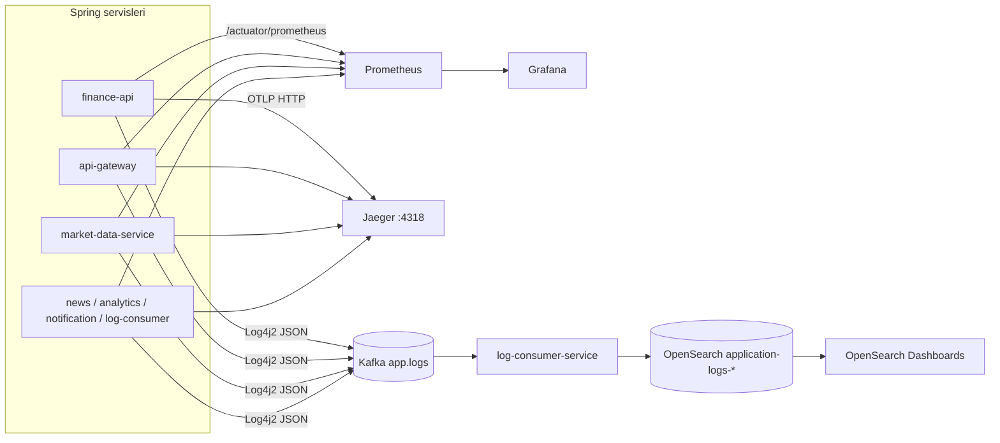
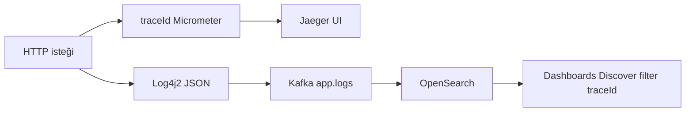
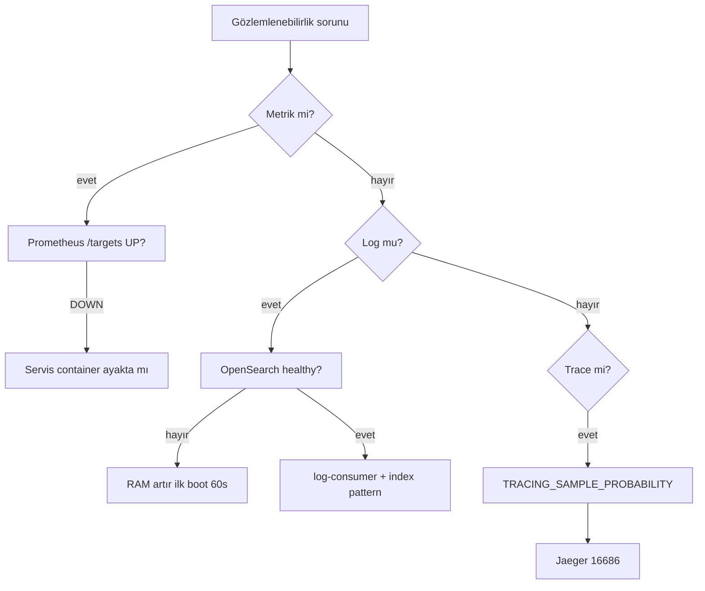

# Gözlemlenebilirlik

**32 Bit Finance Platform** Docker Compose stack'i ile birlikte metrik, dağıtık iz (trace) ve merkezi log pipeline'ı gelir. Bu rehber geliştirme ve demo ortamı içindir; üretim topolojisi repoda tanımlı değildir.

| Sütun | Araç | Ne sağlar? |
|-------|------|------------|
| **Metrikler** | Prometheus + Grafana | HTTP latency, hata oranı, servis `up`, log pipeline metrikleri |
| **Trace** | Jaeger (OTLP) | İstekler arası gecikme, span timeline |
| **Loglar** | Kafka → log-consumer → OpenSearch | JSON log arama, retention, operasyon sorguları |

Mimari bağlam: [architecture.md](architecture.md). Ortam değişkenleri: [configuration.md](configuration.md). İlk kurulum: [getting-started.md](getting-started.md).

### Üç sütun (metrics, traces, logs)

```mermaid
flowchart TB
  subgraph apps [Uygulama servisleri]
    SVC[Spring Boot servisleri]
  end

  subgraph metrics [Metrikler]
    ACT[/actuator/prometheus]
    PROM[Prometheus :9090]
    GRAF[Grafana :3000]
  end

  subgraph traces [İzler]
    OTLP[OTLP :4318]
    JAEG[Jaeger :16686]
  end

  subgraph logs [Loglar]
    KFK[app.logs]
    LCS[log-consumer]
    OS[OpenSearch]
    OSD[Dashboards :5601]
  end

  SVC --> ACT --> PROM --> GRAF
  SVC --> OTLP --> JAEG
  SVC --> KFK --> LCS --> OS --> OSD
```

---

## Bileşenler ve erişim

Stack ayaktayken (`cd Docker && docker compose up -d`):

| Bileşen | URL | Kimlik bilgisi | Rol |
|---------|-----|----------------|-----|
| **Grafana** | http://localhost:3000 | `admin` / `admin` | Ana dashboard; Prometheus datasource otomatik |
| **Prometheus** | http://localhost:9090 | — | Scrape + PromQL; `/targets` ile health |
| **Jaeger UI** | http://localhost:16686 | — | Trace arama ve timeline |
| **Jaeger OTLP (HTTP)** | http://localhost:4318 | — | Span alım ucu (`/v1/traces`) |
| **OpenSearch REST** | https://localhost:9200 | `admin` / `123456789` | Log indeksi API |
| **OpenSearch Dashboards** | http://localhost:5601 | `admin` / `123456789` | Log Discover / arama UI |

> **Port çakışması:** Host **9090** hem Prometheus hem yerel `api-gateway` **dev** profili ile çakışabilir. Tam Compose'ta gateway **8080**'dedir; hibrit geliştirmede ikisini aynı anda host'ta çalıştırmayın — [development.md](development.md).

Grafana'da anonim **Viewer** erişimi açıktır (`GF_AUTH_ANONYMOUS_ENABLED=true`); düzenleme için `admin` ile giriş yapın.

---

## Genel akış



---

## Metrikler

### Spring Actuator

Her backend servis şu uçları expose eder (`management.endpoints.web.exposure.include`):

```http
GET /actuator/health
GET /actuator/prometheus
```

Docker ağından gateway üzerinden örnek:

```bash
curl -s http://localhost:8080/actuator/health
```

### Prometheus scrape

Yapılandırma: [`Docker/prometheus/prometheus.yml`](../../Docker/prometheus/prometheus.yml)

| Job adı | Hedef (Docker ağı) | Metrik yolu |
|---------|-------------------|-------------|
| `finance-api` | `finance-api:8080` | `/actuator/prometheus` |
| `api-gateway` | `api-gateway:8080` | `/actuator/prometheus` |
| `market-data-service` | `market-data-service:8080` | `/actuator/prometheus` |
| `analytics-service` | `analytics-service:8080` | `/actuator/prometheus` |
| `news-service` | `news-service:8082` | `/actuator/prometheus` |
| `notification-service` | `notification-service:8086` | `/actuator/prometheus` |
| `log-consumer-service` | `log-consumer-service:8087` | `/actuator/prometheus` |

Global scrape aralığı: **10 saniye**.

### Prometheus scrape topolojisi

```mermaid
flowchart LR
  PROM[Prometheus :9090]

  PROM --> J1[finance-api:8080]
  PROM --> J2[api-gateway:8080]
  PROM --> J3[market-data-service:8080]
  PROM --> J4[news-service:8082]
  PROM --> J5[notification-service:8086]
  PROM --> J6[log-consumer-service:8087]
  PROM --> J7[analytics-service:8080]

  J1 --> M[/actuator/prometheus]
  J2 --> M
  J3 --> M
  J4 --> M
  J5 --> M
  J6 --> M
  J7 --> M
```

**Doğrulama:** http://localhost:9090/targets — tüm job'ların durumu **UP** olmalıdır.

### Grafana

Provisioning dizini: [`Docker/grafana/provisioning`](../../Docker/grafana/provisioning)

| Dosya | İçerik |
|-------|--------|
| `datasources/prometheus.yml` | Prometheus datasource (`http://prometheus:9090`) |
| `dashboards/dashboards.yml` | JSON dashboard provider |
| `dashboards/json/finance-platform-overview.json` | Varsayılan home dashboard |

Home dashboard (**Finance Platform — Overview**) öne çıkan paneller:

- HTTP istek hızı ve ortalama cevap süresi (servis seçici `$job`)
- Platform geneli 5xx hata oranı
- Servis `up` durumu
- Log pipeline: işlenen Kafka log olayları, OpenSearch index hataları, DLQ yayını
- Dashboard linkleri: Jaeger, OpenSearch Dashboards, Prometheus Targets

Varsayılan home path compose'da `GF_DASHBOARDS_DEFAULT_HOME_DASHBOARD_PATH` ile ayarlanır.

---

## Dağıtık iz (trace)

Tüm Spring servisler **Micrometer Tracing + OpenTelemetry OTLP** exporter kullanır.

| Ayar | Varsayılan | Açıklama |
|------|------------|----------|
| `management.otlp.tracing.endpoint` | `http://jaeger:4318/v1/traces` | Span gönderim adresi (container ağı) |
| `TRACING_SAMPLE_PROBABILITY` | `0.1` | %10 örnekleme; geliştirmede `1.0` yapılabilir |

Jaeger all-in-one: UI **16686**, OTLP HTTP **4318** (host'a map edilir).

**Kafka observation:** `spring.kafka.listener.observation-enabled=true` — consumer/producer span'leri trace zincirine eklenir.

**Log ↔ trace bağlantısı:** Log4j2 JSON şablonu `traceId` ve `correlationId` MDC alanlarını yazar (`log4j2-kafka-template.json`). Jaeger'da bir trace bulduktan sonra OpenSearch'te aynı `traceId` ile filtreleyebilirsiniz.

---

## Log pipeline

### 1. Üretim (uygulama servisleri)

Backend servisler **Log4j2** kullanır (Logback değil). Her serviste `log4j2-spring.xml`:

- **Console:** okunabilir pattern (`traceId`, `correlationId` dahil)
- **Kafka:** topic `app.logs`, async append, JSON template layout

Log4j2 yapılandırması olan modüller: `finance-api`, `api-gateway`, `market-data-service`, `news-service`, `analytics-service`, `notification-service`, `log-consumer-service`.

Örnek JSON alanları: `@timestamp`, `level`, `message`, `logger_name`, `service`, `traceId`, `correlationId`, `stack_trace`.

Kafka bootstrap: `KAFKA_BOOTSTRAP_SERVERS` (compose'da `kafka:9092`).

### 2. Tüketim (log-consumer-service)

`log-consumer-service`:

1. `app.logs` topic'ini dinler (`LOG_CONSUMER_GROUP_ID=log-consumer-service`)
2. Mesajları parse eder; `correlationId` header'ını MDC'ye taşır
3. OpenSearch'e **`application-logs-*`** önekiyle indeksler
4. Başlangıçta index template + **ISM retention policy** oluşturur (`OpenSearchLogInfrastructureBootstrap`)

| Ortam değişkeni | Varsayılan | Açıklama |
|-----------------|------------|----------|
| `APP_LOGS_TOPIC` | `app.logs` | Kafka topic |
| `OPENSEARCH_INDEX_PREFIX` | `application-logs` | İndeks adı öneki |
| `OPENSEARCH_LOG_RETENTION_DAYS` | `30` | ISM ile otomatik silme süresi |
| `OPENSEARCH_USERNAME` / `OPENSEARCH_PASSWORD` | compose'da `admin` / `123456789` | OpenSearch Security |

OpenSearch verisi kalıcı volume'da tutulur: `docker_opensearch_data` (proje adına göre `docker_opensearch_data`).

### 3. Arama (OpenSearch Dashboards)

Loglar Grafana'da değil; **OpenSearch Dashboards** üzerinden aranır. Grafana home dashboard'taki linkten geçilebilir.

**İlk kurulum (bir kez):**

1. http://localhost:5601 — `admin` / `123456789`
2. **Stack Management** → **Index patterns** → **Create index pattern**
3. Pattern: `application-logs-*`
4. Time field: `@timestamp`
5. **Discover** ile servis, level, `traceId` filtreleyin

> `kibanaserver` kullanıcısı Dashboards → OpenSearch arka uç bağlantısı içindir; tarayıcı girişi için `admin` kullanın.

**Örnek Discover sorguları:**

| Amaç | Filtre |
|------|--------|
| Tek servis | `service: "finance-api"` |
| Hatalar | `level: "ERROR"` |
| Trace takibi | `traceId: "abc123..."` |

---

## Operasyon API (log-consumer)

Internal metrik özeti (container ağı / debug):

```http
GET /internal/system-intelligence
```

Yanıt örneği: `kafkaLagMax`, `failedEventsTotal`, `skippedEventsTotal`, `dlqPublishedTotal`.

Prometheus'ta ilgili metrikler: `kafka_events_processed_total`, `kafka_events_opensearch_failed_total`, `kafka_events_dlq_published_total` — Grafana overview dashboard'ta görselleştirilir.

---

## Sağlık kontrolü

```bash
cd Docker

# Container durumu
docker compose ps

# Gateway
curl -s http://localhost:8080/actuator/health

# OpenSearch cluster (TLS, demo cert)
curl -ksu admin:123456789 https://localhost:9200/_cluster/health

# Log consumer (container içinden veya exec)
docker compose logs -f log-consumer-service
```

Beklenen durum:

| Kontrol | Beklenen |
|---------|----------|
| `finance-postgres`, `finance-redis` | healthy |
| `opensearch` | healthy (ilk boot 60s+ sürebilir) |
| Prometheus `/targets` | 7/7 UP |
| Kafka topic `app.logs` | Servisler ayakta olduktan sonra mesaj akışı |
| OpenSearch indeksleri | `application-logs-*` (ilk loglardan sonra) |

---

## Trace ve log korelasyonu



Örnek Discover sorgusu: `traceId: "abc123..."` ve `service: "finance-api"`.

## Sorun giderme

### Karar ağacı



| Belirti | Olası neden | Çözüm |
|---------|-------------|--------|
| OpenSearch **unhealthy** / restart | RAM yetersiz | Docker'a ≥8 GB ayırın; ilk boot 60–90s bekleyin |
| OpenSearch auth hatası | Eski volume, şifre uyumsuz | [`Docker/.env.example`](../../Docker/.env.example) volume silme notları; `docker compose stop opensearch opensearch-dashboards log-consumer-service` + `docker volume rm docker_opensearch_data` |
| Log indeksi yok | Kafka / log-consumer / OpenSearch sırası | `docker compose logs log-consumer-service`; OpenSearch healthy mi kontrol edin |
| Prometheus target **DOWN** | Servis henüz ayağa kalkmadı | İlgili container logları; Flyway migration süresi |
| Grafana boş paneller | Prometheus henüz veri toplamadı | Trafiği tetikleyin; `/targets` UP mi bakın |
| Jaeger'da span yok | Düşük örnekleme | `TRACING_SAMPLE_PROBABILITY=1.0` ile servisi yeniden başlatın |
| DLQ / skipped log artışı | Bozuk JSON, OpenSearch yazma hatası | Grafana "Log pipeline" panelleri; log-consumer logları |
| Port 9090 meşgul | Prometheus vs gateway dev | Birini durdurun veya port değiştirin |

---

## Yapılandırma dosyaları

| Dosya | İçerik |
|-------|--------|
| [`Docker/prometheus/prometheus.yml`](../../Docker/prometheus/prometheus.yml) | Scrape job'ları |
| [`Docker/grafana/provisioning/`](../../Docker/grafana/provisioning/) | Datasource + dashboard provisioning |
| [`Docker/opensearch-config/`](../../Docker/opensearch-config/) | OpenSearch Security, TLS demo sertifikaları |
| [`Docker/docker-compose.yml`](../../Docker/docker-compose.yml) | Observability servis tanımları |
| `{servis}/src/main/resources/log4j2-spring.xml` | Kafka log append |
| `{servis}/src/main/resources/application.yml` | OTLP, actuator, sampling |

---

## İlgili belgeler

| Konu | Belge |
|------|-------|
| Mimari ve Kafka topic'leri | [architecture.md](architecture.md) |
| Ortam değişkenleri | [configuration.md](configuration.md) |
| Geliştirme / port çakışmaları | [development.md](development.md) |
| Servis portları | [services.md](services.md) |
