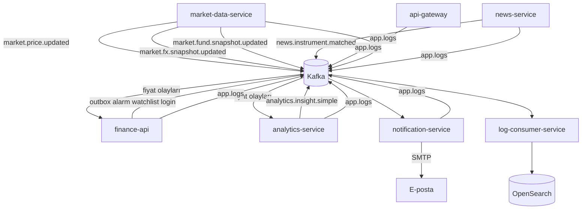
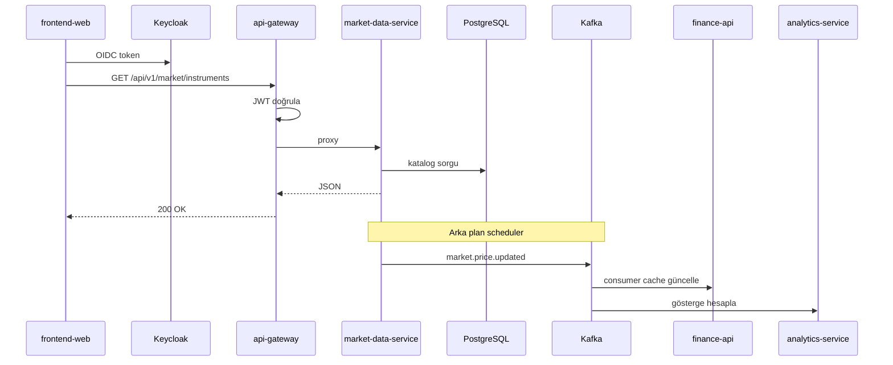
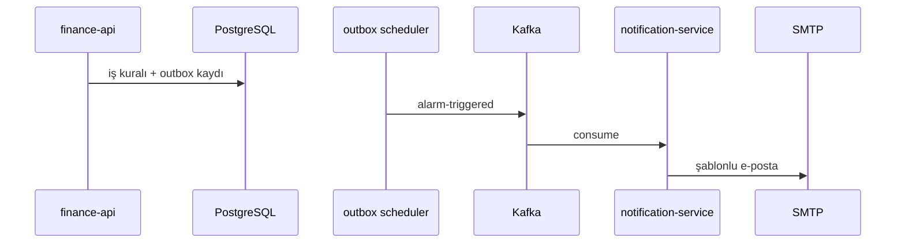
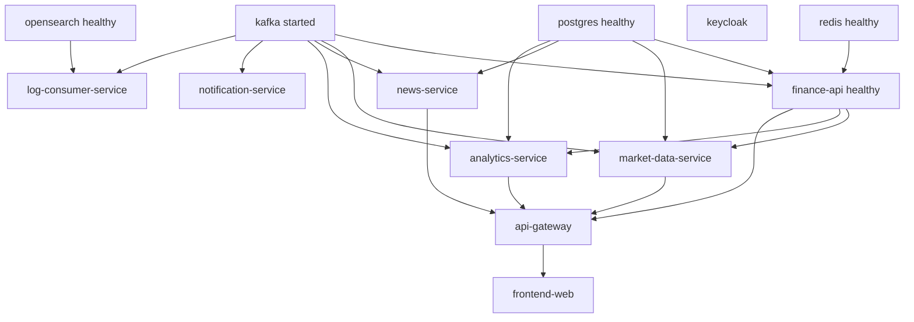

# Servisler

**32 Bit Finance Platform** monoreposu; Maven parent `com.company:finance-platform:1.0.0-SNAPSHOT` (`pom.xml`) altında yedi backend modülü ve bir React SPA içerir. Tarayıcı trafiği **api-gateway** üzerinden `/api/v1/**` sözleşmesiyle ilgili servise yönlendirilir.

| Bağlam | Belge |
|--------|-------|
| **Detaylı servis rehberleri** | [services/README.md](services/README.md) |
| Gateway rotaları | [api.md](api.md) |
| Mimari ve Kafka özeti | [architecture.md](architecture.md) |
| Kurulum | [getting-started.md](getting-started.md) |
| Gözlemlenebilirlik | [observability.md](observability.md) |

---

## Genel mimari — servis etkileşimleri

Aşağıdaki diyagramlar platformdaki **senkron (HTTP)** ve **asenkron (Kafka)** ilişkileri özetler. Tam mimari bağlam: [architecture.md](architecture.md).

### Platform bağlamı

Tarayıcı yalnızca **frontend-web** (5173) ve **api-gateway** (8080) ile konuşur; backend servisler Docker ağı `finance-net` üzerinde birbirine hostname ile erişir.

```mermaid
flowchart TB
  subgraph clients [İstemciler]
    Browser[Tarayıcı]
    FE[frontend-web]
  end

  subgraph edge [Edge]
    GW[api-gateway]
    KC[Keycloak]
  end

  subgraph apps [Uygulama servisleri]
    FA[finance-api]
    MDS[market-data-service]
    NS[news-service]
    AS[analytics-service]
    NOTIF[notification-service]
    LOG[log-consumer-service]
  end

  subgraph infra [Paylaşımlı altyapı]
    PG[(PostgreSQL)]
    KF[Kafka]
    RD[Redis]
    OS[OpenSearch]
  end

  Browser --> FE
  FE -->|"/api/v1"| GW
  FE -->|OIDC login| KC
  GW -->|JWT JWKS| KC
  GW --> FA
  GW --> MDS
  GW --> NS
  GW --> AS
  GW --> RD

  FA --> PG
  FA --> RD
  FA --> KF
  FA -->|HTTP| MDS
  FA -->|HTTP| NS
  FA --> KC

  MDS --> PG
  MDS --> RD
  MDS --> KF

  NS --> PG
  NS --> KF

  AS --> PG
  AS --> KF
  AS -->|HTTP| FA

  NOTIF --> PG
  NOTIF --> KF

  LOG --> KF
  LOG --> OS

  KF --> FA
  KF --> AS
  KF --> NOTIF
  KF --> LOG
```



### Senkron HTTP — gateway yönlendirme

`api-gateway` path önekine göre tek isteği ilgili servise iletir. `finance-api` çoğu portal iş kuralını taşır; piyasa ve haber verisi uzman servislerdedir.

```mermaid
flowchart LR
  FE[frontend-web]
  GW[api-gateway]

  subgraph routes [Gateway hedefleri]
    FA[finance-api]
    MDS[market-data-service]
    NS[news-service]
    AS[analytics-service]
  end

  FE --> GW
  GW -->|"/api/v1/public/**" portföy alarm profil admin| FA
  GW -->|"/api/v1/market/overview insights eurobond"| FA
  GW -->|"/api/v1/market/**" "/api/v1/rates/**"| MDS
  GW -->|"/api/v1/news/enriched favorites"| FA
  GW -->|"/api/v1/news/**"| NS
  GW -->|"/api/v1/analytics/**"| AS
  GW -->|"/api/v1/**" geri kalan| FA

  FA -.->|BFF HTTP| MDS
  FA -.->|BFF HTTP| NS
```

Route sırası ve circuit breaker: [api.md](api.md).

### Asenkron Kafka — olay akışı

Piyasa güncellemeleri ve bildirimler HTTP zinciri dışında Kafka ile yayılır. `finance-api` domain olaylarını **transactional outbox** ile publish eder.



### Tipik kullanıcı isteği (uçtan uca)

Örnek: oturum açmış kullanıcı piyasa listesini açar; kısmen senkron HTTP, arka planda MDS scheduler Kafka yayını devam eder.



### Bildirim zinciri (olay güdümlü)

Alarm veya haber eşleşmesi portal API’sinden bağımsız olarak e-posta pipeline’ını tetikler.



### Compose başlatma sırası (bağımlılık)

`market-data-service`, `finance-api` healthy olduktan sonra başlar (katalog senkron). `log-consumer-service`, OpenSearch healthy sonrası log yazar.



---

## Uygulama servisleri — özet

| Modül | Container | Rol | Docker port | Host port |
|-------|-----------|-----|-------------|-----------|
| `api-gateway` | `api-gateway` | Tek API girişi, JWT, rate limit | 8080 | **8080** |
| `finance-api` | `finance-api` | Portal BFF | 8080 | internal |
| `market-data-service` | `market-data-service` | Piyasa verisi, EVDS | 8080 | internal |
| `analytics-service` | `analytics-service` | Göstergeler, insight | 8080 | internal |
| `news-service` | `news-service` | Haber API & RSS | 8082 | internal |
| `notification-service` | `notification-service` | E-posta | 8086 | internal |
| `log-consumer-service` | `log-consumer-service` | Log indeksleme | 8087 | internal |
| `frontend-web` | `frontend-web` | React SPA | 5173 | **5173** |

Dış dünyadan yalnızca **8080** (API) ve **5173** (UI) expose edilir.

---

## Port matrisi (yerel geliştirme)

| Servis | Docker | Yerel dev |
|--------|--------|-----------|
| api-gateway | 8080 | `dev` → **9090** |
| finance-api | 8080 | 8080 + PostgreSQL |
| market-data-service | 8080 | `dev` → **8082** (H2) |
| analytics-service | 8080 | 8080 + PostgreSQL |
| news-service | 8082 | **8082** |
| notification-service | 8086 | **8086** |
| log-consumer-service | 8087 | **8087** |
| frontend-web | 5173 | **5173** |

**Uyarı:** `news-service` ve `market-data-service` host'ta ikisi de **8082** — birlikte çalıştırmayın. Gateway dev (9090) ile Prometheus (9090) çakışır — [development.md](development.md).

---

## Altyapı (Docker)

| Bileşen | Host port |
|---------|-----------|
| PostgreSQL | 5432 |
| Redis | 6379 |
| Kafka | 9092 |
| Keycloak | 8085 |
| OpenSearch | 9200 |
| OpenSearch Dashboards | 5601 |
| Jaeger | 16686 |
| Prometheus | 9090 |
| Grafana | 3000 |

---

## Detaylı rehberler

Her servis için sorumluluklar, yapılabilecekler, veri akışları ve diyagramlar:

| Servis | Dokümantasyon |
|--------|----------------|
| api-gateway | [services/api-gateway.md](services/api-gateway.md) |
| finance-api | [services/finance-api.md](services/finance-api.md) |
| market-data-service | [services/market-data-service.md](services/market-data-service.md) |
| analytics-service | [services/analytics-service.md](services/analytics-service.md) |
| news-service | [services/news-service.md](services/news-service.md) |
| notification-service | [services/notification-service.md](services/notification-service.md) |
| log-consumer-service | [services/log-consumer-service.md](services/log-consumer-service.md) |
| frontend-web | [services/frontend-web.md](services/frontend-web.md) |

Yeni servis dokümantasyonu şablonu: [services/_template.md](services/_template.md).
