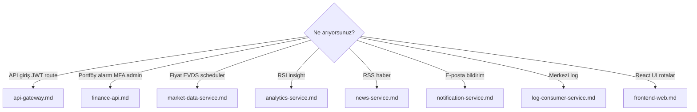

# Servis rehberleri

Her uygulama bileşeni için detaylı dokümantasyon: sorumluluklar, yapılabilecekler, HTTP/Kafka veri akışları ve mermaid diyagramları.

Platform genel diyagramları: [../services.md](../services.md).

### Servis seçim rehberi

## Rehberler

| Servis | Belge | Özet |
|--------|-------|------|
| API Gateway | [api-gateway.md](api-gateway.md) | Tek `/api/v1` girişi, JWT, rate limit, circuit breaker |
| Finance API | [finance-api.md](finance-api.md) | Portal BFF — portföy, auth, admin, bilgi kartları |
| Market Data | [market-data-service.md](market-data-service.md) | Piyasa kataloğu, EVDS, scheduler, fiyat yayını |
| Analytics | [analytics-service.md](analytics-service.md) | Teknik göstergeler, insight |
| News | [news-service.md](news-service.md) | RSS ingestion, haber API |
| Notification | [notification-service.md](notification-service.md) | Kafka → e-posta |
| Log Consumer | [log-consumer-service.md](log-consumer-service.md) | `app.logs` → OpenSearch |
| Frontend | [frontend-web.md](frontend-web.md) | React SPA, Keycloak, i18n |

## Platform belgeleri

| Belge | Ne zaman? |
|-------|-----------|
| [../services.md](../services.md) | Port tablosu ve hızlı özet |
| [../architecture.md](../architecture.md) | Platform mimarisi |
| [../api.md](../api.md) | Gateway route listesi |
| [../observability.md](../observability.md) | Metrik, trace, log |

## Dokümantasyonu güncelleme

Yeni servis veya davranış değişikliğinde:

1. İlgili `docs/turkce/services/<modül>.md` dosyasını güncelleyin (şablon: [_template.md](_template.md)).
2. Gateway route değiştiyse [api.md](../api.md) ve [api-gateway.md](api-gateway.md).
3. Yeni Kafka topic ise [architecture.md](../architecture.md) tablosuna satır ekleyin.
4. PR açıklamasında “docs/services güncellendi” belirtin.
