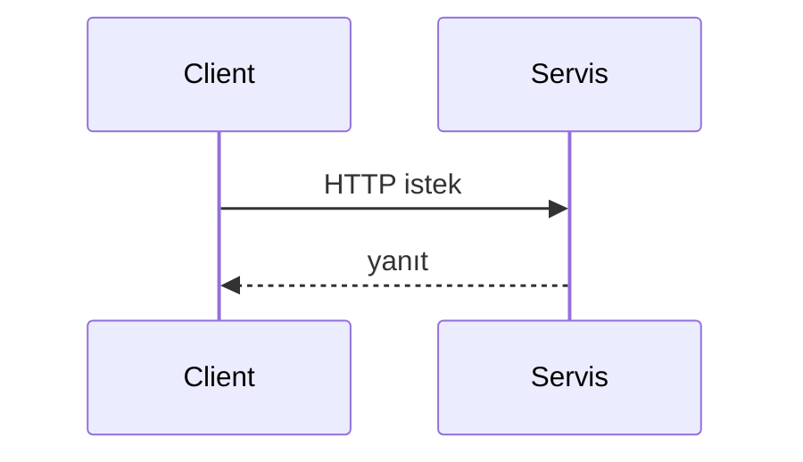
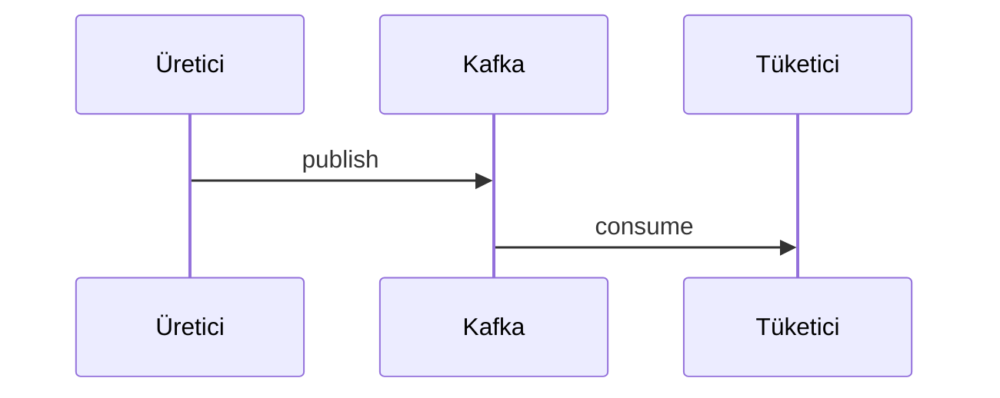

# {Servis adı}

> Yeni veya güncellenen servis dokümantasyonu için şablon. Bu dosyayı kopyalayıp `{modül-adı}.md` olarak kaydedin.

## Özet

{2–3 cümle: servisin platformdaki rolü ve ana sorumluluğu.}

## Sorumluluklar

- {Yapar 1}
- {Yapar 2}

## Sorumluluk dışı

- {Yapmaz — hangi servise gider}

## Yapılabilecekler

| Perspektif | Yetenek |
|------------|---------|
| Portal kullanıcısı | {…} |
| Admin | {…} |
| Operasyon | {…} |

## Çalışma ortamı

| Özellik | Değer |
|---------|-------|
| Maven modülü | `{modül}` |
| Container adı | `{container}` |
| HTTP port (Docker) | {port} |
| HTTP port (yerel dev) | {port} |
| Spring profilleri | `{profiller}` |
| Healthcheck | `{endpoint}` |

## Bağımlılıklar

| Bileşen | Kullanım |
|---------|----------|
| PostgreSQL | {evet/hayır — şema} |
| Redis | {…} |
| Kafka | {üret/tüket} |
| Keycloak | {…} |
| HTTP peer | {…} |

## Bağlam diyagramı

```mermaid
flowchart LR
  SVC[{Servis}]
  %% dış sistemler ve oklar
```

## HTTP veri akışları

### Önemli path grupları

| Path öneki | Açıklama |
|----------|----------|
| `/api/v1/...` | {…} |

### Tipik istek akışı



## Kafka / olay akışları

| Topic | Rol | Açıklama |
|-------|-----|----------|
| `{topic}` | Üretir / Tüketir | {…} |



## Zamanlayıcılar / arka plan işleri

| Bileşen | Tetikleme | Görev |
|---------|-----------|-------|
| `{Scheduler}` | {cron / fixedDelay} | {…} |

## Veri modeli

| Öğe | Değer |
|-----|-------|
| Flyway migration | `{modül}/src/main/resources/db/migration/` |
| History tablosu | `{tablo_adı}` |
| Ana kavramlar | {tablo/grup listesi} |

## Paket / kod yapısı

```
{modül}/src/main/java/...
```

## Yapılandırma

| Değişken | Açıklama |
|----------|----------|
| `{ENV}` | {…} |

Tam liste: [configuration.md](../configuration.md).

## Gözlemlenebilirlik

| Kanal | Detay |
|-------|-------|
| Loglar | Kafka `app.logs`, alanlar: `service`, `traceId`, `correlationId` |
| Metrikler | Prometheus job: `{job-name}` |
| Trace | OTLP → Jaeger |

Ayrıntı: [observability.md](../observability.md).

## Yerel çalıştırma

```bash
mvn -pl {modül} -am spring-boot:run -Dspring-boot.run.profiles={profil}
```

Kurulum: [getting-started.md](../getting-started.md) · Geliştirme: [development.md](../development.md).

## İlgili belgeler

| Belge | İçerik |
|-------|--------|
| [api.md](../api.md) | Gateway rotaları |
| [architecture.md](../architecture.md) | Platform geneli |
| [services.md](../services.md) | Port özeti |
