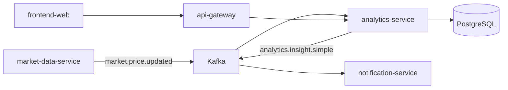
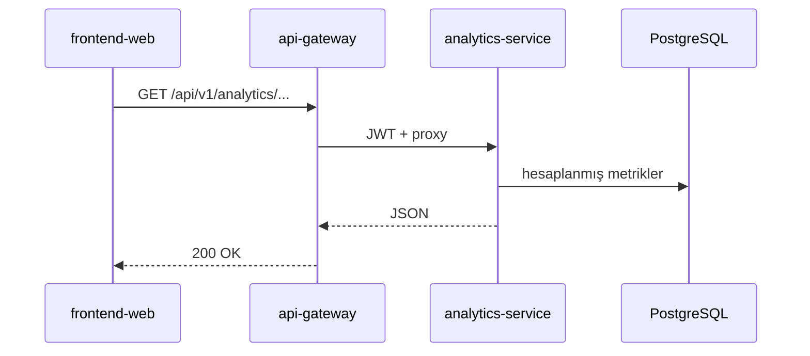
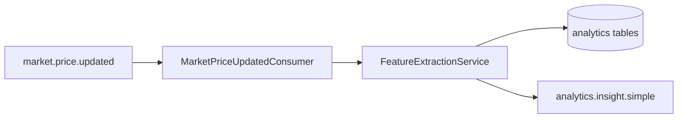
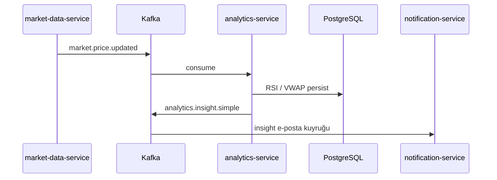

# analytics-service

## Özet

**analytics-service**, `market-data-service`’in yayınladığı fiyat olaylarını tüketerek **teknik analiz metrikleri** (RSI, VWAP vb.) hesaplar ve sonuçları PostgreSQL’de saklar. Basit insight olaylarını `analytics.insight.simple` topic’ine yazar; portal `/api/v1/analytics/**` uçları gateway üzerinden sunulur.

## Sorumluluklar

- `market.price.updated` ve FX snapshot olaylarını Kafka’dan tüketmek
- Gösterge hesaplama ve kalıcı saklama (analytics Flyway şeması)
- REST API: analiz sorguları (`AnalyticsController`)
- `analytics.insight.simple` üretimi (fiyat hareketi / insight bildirimleri için)
- `finance-api` ile HTTP entegrasyonu (gerekli durumlarda)

## Sorumluluk dışı

- Ham fiyat çekme ve EVDS — `market-data-service`
- Portal portföy / alarm iş kuralları — `finance-api`
- E-posta gönderimi — `notification-service` (insight topic’ini tüketir)
- Haber eşleştirme — `news-service`

## Yapılabilecekler

| Perspektif | Yetenek |
|------------|---------|
| Portal | Analiz sayfası göstergeleri, insight kartları (gateway üzerinden) |
| Operasyon | Health, Prometheus metrikleri |
| Platform | Fiyat akışından türetilmiş metrik üretimi |

## Çalışma ortamı

| Özellik | Değer |
|---------|-------|
| Maven modülü | `analytics-service` |
| Container adı | `analytics-service` |
| HTTP port | **8080** (Spring Boot varsayılan) |
| Spring profilleri | `docker` (compose) |
| Healthcheck | `/actuator/health` |

## Bağımlılıklar

| Bileşen | Kullanım |
|---------|----------|
| PostgreSQL | `finance` DB, `analytics_flyway_schema_history` |
| Kafka | Consume fiyat; produce insight |
| HTTP | `FINANCE_BASE_URL` → finance-api (iç) |
| Keycloak | JWT (resource server) |

## Bağlam diyagramı



## HTTP veri akışları

### Önemli uçlar

| Path (gateway) | Controller | Açıklama |
|----------------|------------|----------|
| `/api/v1/analytics/**` | `AnalyticsController` | Gösterge / insight sorguları |



## İşleme pipeline



## Kafka / olay akışları

| Topic | Rol | Açıklama |
|-------|-----|----------|
| `market.price.updated` | Tüketir | `MarketPriceUpdatedConsumer` |
| FX snapshot topic | Tüketir | `FxSnapshotUpdatedConsumer` |
| `analytics.insight.simple` | Üretir | `FeatureExtractionService` — bildirim pipeline |



Consumer’larda retry + DLQ (`topic.dlq`) yapılandırması mevcuttur.

## Zamanlayıcılar / arka plan işleri

Ağırlıklı olarak **Kafka-driven**; ek batch işler migration/startup ile sınırlıdır. Periyodik hesaplama tetikleyicisi fiyat olaylarıdır.

## Veri modeli

| Öğe | Değer |
|-----|-------|
| Flyway | `analytics-service/src/main/resources/db/migration/` |
| History tablosu | `analytics_flyway_schema_history` |
| Ana kavramlar | RSI günlük, VWAP, insight / politika metrik tabloları |

## Paket / kod yapısı

```
analytics-service/src/main/java/com/company/analytics/
├── processing/       # Kafka consumer'lar, FeatureExtractionService
├── query/            # AnalyticsController
└── bootstrap/        # config, health
```

## Yapılandırma

| Değişken | Açıklama |
|----------|----------|
| `SPRING_DATASOURCE_URL` | PostgreSQL |
| `KAFKA_BOOTSTRAP_SERVERS` | Kafka |
| `FINANCE_BASE_URL` | finance-api HTTP |
| `TRACING_SAMPLE_PROBABILITY` | Trace örnekleme |

Tam liste: [configuration.md](../configuration.md).

## Gözlemlenebilirlik

| Kanal | Detay |
|-------|-------|
| Loglar | `app.logs` |
| Metrikler | Prometheus job `analytics-service` |
| Trace | OTLP → Jaeger |

Ayrıntı: [observability.md](../observability.md).

## Yerel çalıştırma

```bash
export KAFKA_BOOTSTRAP_SERVERS=localhost:9092
export SPRING_DATASOURCE_URL=jdbc:postgresql://localhost:5432/finance

mvn -pl analytics-service -am spring-boot:run
```

Kurulum: [getting-started.md](../getting-started.md).

## İlgili belgeler

| Belge | İçerik |
|-------|--------|
| [market-data-service.md](market-data-service.md) | Fiyat olayı üretici |
| [notification-service.md](notification-service.md) | Insight tüketici |
| [api-gateway.md](api-gateway.md) | Analytics route |
| [architecture.md](../architecture.md) | Kafka özeti |
